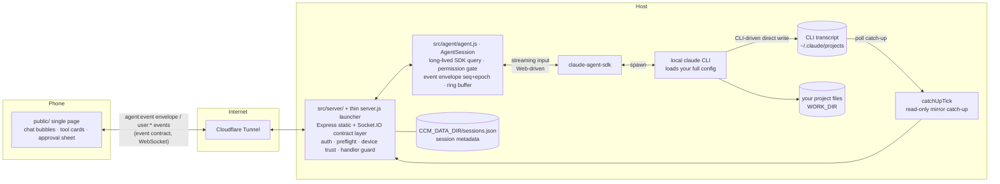

# Claude Chat Mobile

> Bridge your local `claude` CLI to your phone: same agent, same session log, same permissions and tools — not a remote desktop, and not a shared live TTY.

[中文](README.md) · **English** · [🌐 Website](https://ike-li.github.io/claude-chat-mobile/)

[](LICENSE)
[](package.json)
[](#quick-start)
[](https://github.com/Ike-li/claude-chat-mobile/actions/workflows/test.yml)

**Claude Code keeps running, but you're not always at your computer.** You ask claude to change code, then leave for a meeting — when it needs permission, a push arrives on your phone; open the app to see details and allow or deny. Back at your desk, `/resume` in the terminal picks up the same session you continued from your phone — same agent, same log, not a new one.

This project is for people who already use the `claude` CLI in a terminal. It does not bundle Claude, and it is not a reimplementation. It drives your logged-in local CLI through the [Claude Agent SDK](https://code.claude.com/docs/en/agent-sdk/overview). The phone sees the same agent, the same `CLAUDE.md`, the same MCP servers, skills, hooks, and session logs.

The goal is narrow: **edit code, run commands, approve dangerous actions, and resume earlier conversations from your phone**. Both sides read the same on-disk CLI session log, but this is **not** a screen mirror of your terminal, and **not** a shared TTY where both ends type into the same session at once — only one driver (Web or CLI) writes at a time; the other side is read-only catch-up. While the CLI is running, the Web UI defaults to a read-only mirror; takeover waits for the current turn to finish before writing.

## When it's worth it

> This is not a phone remote desktop. A remote desktop mirrors your computer screen; this gives your local `claude` session a phone entry point. The difference shows up in situations like these:
>
> - **A task is running and you have left the computer.** You ask claude to change code, then leave for a meeting. When it needs permission, a push arrives on your phone (type-level copy such as "needs your approval: Edit" — **not** the full command text; open the app to see details and allow/deny). No need to keep the computer screen awake or open a remote terminal.
> - **One session, picked up across devices.** Start something from your phone on the way out; resume it at your desk with `/resume` — both sides read the same CLI session log, not two separate conversations. The other way works too: while a session runs in the terminal, the phone can open it as a **read-only mirror** (catch-up from the on-disk transcript; short blank windows or delay are normal — it does not attach to the live process). To keep writing from the phone, take over after the current turn ends. On a flaky subway connection the Web page reconnects and replays buffered output.
> - **Several repos in parallel.** claude can run different tasks in two projects at once. Switch among them via the phone home hub / workspace drawer / session list (not a browser multi-tab mental model). A single remote-desktop screen is awkward for that on a phone.
> - **Phone-native input.** Type `/` for a tappable command list, send a photo from your library to claude, or long-press to copy a long output. These interactions fit a phone better than a tiny terminal.
>
> If you only need to glance at the machine now and then, a remote desktop is enough. This project is for using the phone often as a terminal companion.

## Prerequisites

- **Node.js ≥ 20** — check with `node --version`.
- **A working `claude` CLI on the host.** This project drives *your* local CLI; it ships nothing of its own. Confirm `claude` runs in your terminal first (`which claude`, then open a conversation to confirm you are logged in). The web UI inherits that CLI, your `CLAUDE.md`, MCP servers, skills, hooks, and shell environment.
- **Official subscription, or a third-party gateway / relay API — both work.** The web side inherits the provider / gateway / model from **the shell that starts the server**:
  - **Official subscription** (`claude` already logged in): no extra setup.
  - **Third-party gateway / relay**: `export` the `ANTHROPIC_*` your gateway needs (typically `ANTHROPIC_BASE_URL` / `ANTHROPIC_AUTH_TOKEN` / `ANTHROPIC_MODEL`, per your gateway's docs) in the shell that starts the server, then launch it.
  - ⚠️ Putting `ANTHROPIC_*` in `.env` has **no effect**. They are stripped at startup; only the server's shell environment is read.
- **macOS or Linux (first-class).** Some path/permission logic has Windows-oriented fixes, but Windows is **not** an officially supported platform. Treat native Windows as experimental; WSL2 is the more reliable path.

## Quick Start

```bash
git clone https://github.com/Ike-li/claude-chat-mobile.git
cd claude-chat-mobile

node --version           # need Node ≥ 20
which claude             # the CLI this project drives — must be installed & logged in

npm install --omit=dev   # runtime deps only — no Playwright/browser. Use a full install for UI tests.
npm run setup            # interactive wizard: generates AUTH_TOKEN (the #1 gotcha) + asks for WORK_DIR, writes .env (0600)
                         # prefer this over hand-editing; to use the raw template instead: cp .env.example .env

# Recommended: pre-flight your config (port in use, CLAUDE_BIN path, gateway env, file perms)
node scripts/doctor.js        # check config
node scripts/doctor.js --fix  # tighten perms (.env and CCM_DATA_DIR/*.json → 0600)

npm start                     # http://localhost:3000
```

**Faster: hand it to your coding agent** — in the repo directory (or have it clone first), give this to Claude Code / Codex CLI or similar:

```
Help me install and start claude-chat-mobile for the first time (a web UI that connects my local claude CLI to my phone). This is a fresh, first-time setup, not restarting an already-deployed daemon — the "production deployment: don't manually npm start" warning in CLAUDE.md doesn't apply here. Follow the "Quick Start" section in README.md: install deps, run npm run setup (an interactive wizard — it'll ask for WORK_DIR, check with me on which project directory to mount), run node scripts/doctor.js and fix what it flags, then npm start. Once it's running, tell me how to open it on my phone; if I later want fixed-domain public access, use docs/deployment.md to help me set that up.
```

Sessions started from the web work out of the box with the SDK status line — no Claude config changes needed. If you also want the web UI to mirror the CLI's model, thinking effort, context, cost, and quota while **read-only viewing a session that's actually running in the CLI**, you can explicitly install the transparent statusline bridge:

```bash
npm run statusline:status     # read-only check, does not modify ~/.claude
npm run statusline:install    # explicit opt-in; never run automatically by npm install / npm start
```

After installing, restart your Claude CLI and the background server; uninstall with `npm run statusline:uninstall`.

Then open it on your phone. The startup log prints usable URLs with the token pre-filled:

- **Same WiFi:** set `AUTH_TOKEN` in `.env` first (required even on your LAN; without it the phone cannot connect), then open the LAN address printed at startup (`http://<lan-ip>:3000/#token=…`). No tunnel needed.
- **Public internet / install as a PWA** (PWA needs https): run a tunnel in another terminal:

```bash
cloudflared tunnel --url http://localhost:3000
# On your phone open https://<random>.trycloudflare.com/#token=<YOUR_AUTH_TOKEN>
# The token is stored in localStorage on first load, then cleared from the address bar.
```

The first time a phone connects from a non-local path, **a valid token alone is not enough** — approve the device fingerprint once on the computer (TOFU):

```bash
node scripts/device.js list           # list pending devices
node scripts/device.js approve <ID>   # unlock that device immediately
```

> ⚠️ With no `AUTH_TOKEN` set, the server binds to `127.0.0.1` only. Neither your phone on the same LAN nor a tunnel can reach it. This is deliberate.
>
> 📌 The above is the minimal setup: a temporary random tunnel for testing. For a fixed domain, Cloudflare Access two-factor, and a background daemon, see [docs/deployment.md](docs/deployment.md). Connections that pass Cloudflare Access skip the device-fingerprint step; a temporary random `cloudflared` tunnel has **no** Access, so you still need `device.js approve`.
>
> ⚠️ This is a remotely reachable code-execution channel into your local shell. Read the [Security Model](#security-model) below before exposing it to the public internet.

## Three ways to run it

Pick one for your situation. Commands are in [Quick Start](#quick-start) above and [docs/deployment.md](docs/deployment.md):

| Mode | Good for | Cost |
|---|---|---|
| **LAN, same WiFi**: `http://<lan-ip>:3000/#token=` | At home, phone and computer on one network | Useless when out; no tunnel, least fuss |
| **Temporary public**: `cloudflared tunnel --url` (random domain) | Quick trial / demo | Address changes on every restart; testing-only per Cloudflare; device approval still required |
| **Fixed production**: fixed domain + Cloudflare Access 2FA + daemon | Long-term, anywhere access | One-time DevOps setup; see [docs/deployment.md](docs/deployment.md) |

## Security Model

> **Read this before exposing it to the public internet.** This is a remotely reachable code-execution channel into your local shell:

1. **Single-user per instance.** You run your own instance for yourself. There is no multi-user, account, or login system; any request that passes auth has the same power as you at the terminal. Do not treat it as a multi-tenant service.
2. **No token, no leaving the host.** With no `AUTH_TOKEN` set, the server binds to `127.0.0.1` only. There is no "empty = open to the world" path. Reaching the public internet *requires* a token.
3. **The auto-approve set inherits the CLI; no second allow-list is injected.** This project does not inject its own `allowedTools` / `disallowedTools`. Auto-approve is exactly the merged `permissions.allow` from your existing claude config: global `~/.claude/settings.json`, project `.claude/settings.json`, and local `.claude/settings.local.json` (loaded via `settingSources`, same source as your terminal). A match is auto-approved; anything else is suspended and pushed to the phone — the **full command and working directory are visible inside the app** before you confirm.
   - The Web UI also has runtime permission modes (including `dontAsk` / `auto` / `bypassPermissions`) and approval TTL behavior; that is **not** "phone UI matches interactive terminal step for step." What is shared is the settings allow-list source, not the full interaction surface.
   - ⚠️ **Before exposing publicly, audit your global `~/.claude/settings.json` allow-list**. Old `Bash(...)` / `Write` rules from terminal use will auto-approve here too, without a phone prompt. Tighten more than just the project-local config.
4. **Device trust (TOFU).** A connection that is neither local nor Cloudflare Access-verified must be authorized once on your computer before it can do anything. A valid token alone is not enough. On the computer:
   ```bash
   node scripts/device.js list
   node scripts/device.js approve <ID>
   ```
   Revoke with `deny <ID>`. Loopback connections and public connections that already passed a Cloudflare Access JWT skip this step.

## Cost Note

**Currently (as of 2026-07-20): Agent SDK / `claude -p` usage still draws from your subscription quota, in the same pool as interactive use**. On the official subscription path, this project does not incur separate billing.

Background: Anthropic once announced that, starting 2026-06-15, SDK *headless* usage would move to a separate credit pool (Max 5x $100/month at API rates), but **that change was paused on the day it shipped and never took effect** ([official Help Center](https://support.claude.com/en/articles/15036540-use-the-claude-agent-sdk-with-your-claude-plan)). Anthropic says it will rework the plan and give advance notice. This is a pause, not a cancellation.

- **Potential risk**: if the policy is revived, this project's SDK usage would move out of the subscription quota and could hit a separate credit cap. On the author's own path, a rough API-rate equivalent was about **~$716/month** — **personal measurement only, not a product SLA or typical-user figure**; budget from your own usage if the policy returns.
- **Via a third-party gateway** (`ANTHROPIC_*` exported in the shell): unaffected — you pay the gateway's own rates.

## Features

Beyond the core loop above:

- **Single-driver model**: Web and CLI take turns writing the same session; while the CLI drives, the Web is a read-only mirror (transcript catch-up). Takeover queues until the current turn finishes to avoid concurrent write forks.
- **Six permission modes** (default / plan / acceptEdits / dontAsk / auto / bypassPermissions), switchable at runtime; approvals carry TTL and integrity binding.
- **Per-message model switching** (gateway-suffixed names supported); resume can fall back to the last assistant model in the session.
- **Multi-repo and multi-session**: switch among allow-listed working directories; watch several sessions from the home hub / drawer; discover and resume git worktree sessions.
- **Visible message queue + withdraw** (aligned with CLI Queued/ESC); dual-state stop on the send button; CLI-style live status line and turn-done line.
- **Visible sub-agents / background tasks**, with stop for background tasks; Task-list tools rendered inline.
- **File and image upload** (including clipboard paste and pre-send preview), with path injection and traversal protection; historical attachments open on tap; **read-only project file browse** (never outside allow-listed workdirs).
- **Preview changes on tool cards**: diff for Edit / Write, snippet for Read; base64 redaction and JSON highlighting.
- **Thinking-effort control**, a **single-source-of-truth status line** (web-driven sessions read from the SDK; an optional bridge lets CLI-driven sessions mirror a CLI snapshot), and **`AskUserQuestion`** as a native picker.
- **Web Push / ntfy notifications**: type-level prompts for approvals, questions, and results (**no** command/question body); the notification deep-links back to the session (iOS 16.4+ requires Add to Home Screen first; optional ntfy runs self-hosted for more reliable lock-screen delivery). Result-class pushes are skipped while a socket is already online.
- **Two-level session delete** (remove from product / truly delete underlying files via SDK); cross-session "needs you" aggregation.
- **Installable PWA**: maskable icon + standalone display, "Add to Home Screen" to use it as an app.
- **Ops & security hardening**: log sanitization, `0600` atomic writes, a `doctor` startup self-check, **a one-tap UI security check-up (redacted, audits the dangerous allowlist)**, auth rate limiting, optional Cloudflare Access 2FA, `/metrics` and a service-status panel.

## How it works (read only if you want to read or fork the code)

Internally this is a default-locked relay: it connects your local claude CLI, including your CLAUDE.md / MCP / skills / login state, to a phone browser. Sessions stay continuous, the process is visible, and dangerous actions bounce back to the phone for approval. Two paths coexist: **Web-driven** traffic streams through the SDK; **CLI-driven** traffic writes the on-disk transcript and the Web catches up read-only.



### Message flow

**Web-driven (phone sends a message):**

1. Phone `user:message {text}` → server validates → routes to the target instance `agents.get(instanceId)` (lazy-respawned resume; after `session:new` a FRESH instance is lazily opened only on the first message).
2. If the disk grew outside the SDK process (the CLI wrote), dispose+resume first to absorb it — prevents context forks.
3. The text is pushed into the AgentSession's streaming input → SDK → claude CLI works in `WORK_DIR`.
4. The SDK message stream flows into `map()`: streaming text → `text_delta`, tool calls → `tool_use`/`tool_result`, off-allow-list actions → `permission_request` (suspended, awaiting allow/deny on the phone).
5. Each event is wrapped in a `{seq, epoch, sessionId, instanceId, cwd, ts, type, payload}` envelope → into a 2,000-entry ring buffer → `io.to('approved').emit` broadcast to approved devices only (the front-end demuxes by `viewingInstanceId`; high-frequency deltas from background sessions are not broadcast to save bandwidth).
6. Phone reconnects: `sync:since {sessionId, lastSeq, instanceId}` replays the buffer; an `epoch` change means the server swapped the instance, so the client resets its dedup baseline automatically.

**CLI-driven (terminal owns the session; Web is read-only):**

1. You type to `claude` in a computer terminal; that path does **not** go through this project's Agent SDK child process.
2. Output is written to the transcript under `~/.claude/projects/`.
3. The server's `catchUpTick` polls the disk and pushes newly settled messages as a read-only mirror to Web clients that have the session open.
4. While the mirror lock is held, Web input is restricted (send button becomes resume/explain state); after the terminal is quiet for a while the lock releases and the Web can take over.

Runtime dependencies: `@anthropic-ai/claude-agent-sdk`, `express`, `compression`, `socket.io`, `dotenv`, `web-push`, `jose`. Front-end third-party libraries are self-hosted locally in `public/vendor/` (Tailwind/marked/highlight.js/DOMPurify), with no CDN dependency; see [public/vendor/THIRD-PARTY-NOTICES.md](public/vendor/THIRD-PARTY-NOTICES.md).

## License

[GNU AGPL-3.0-only](LICENSE) © 2026 Ike-li, with additional terms under Section 7; see [NOTICE](NOTICE).

In short: you are free to use, study, modify, and self-host this software. But if you run a modified version as a network service, the AGPL requires you to release your source under the AGPL as well, and the additional terms require you to preserve the original author attribution and not misrepresent the project's origin. For any use that cannot meet these conditions, please open an issue to discuss.

## Friend Links

- [LINUX DO](https://linux.do/) — a Chinese-language developer community (site is in Chinese)
