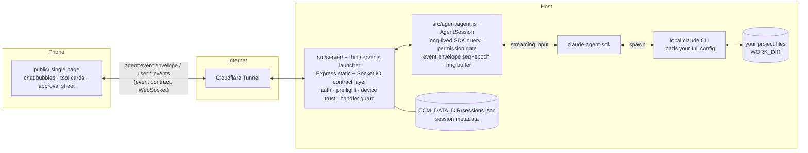

# Claude Chat Mobile

> Use your local `claude` CLI from your phone, with the same effect as typing at your terminal.

[中文](README.md) · **English**

[](LICENSE)
[](package.json)
[](#quick-start)
[](https://github.com/Ike-li/claude-chat-mobile/actions/workflows/test.yml)

This project is for people who already use the `claude` CLI in a terminal. It does not bundle Claude, and it is not a reimplementation. It drives your logged-in local CLI through the [Claude Agent SDK](https://code.claude.com/docs/en/agent-sdk/overview). The phone sees the same agent, the same `CLAUDE.md`, the same MCP servers, skills, hooks, and session logs. The goal is narrow: typing to claude on your phone should be equivalent to typing at your computer. You can edit code, run commands, and resume an earlier conversation.

## When it's worth it

> This is not a phone remote desktop. A remote desktop mirrors your computer screen; this gives your local `claude` session a phone entry point. The difference shows up in situations like these:
>
> - **A task is running and you have left the computer.** You ask claude to migrate a module from JS to TypeScript, then leave for a meeting. Twenty minutes later it asks whether it may add `strict: true` to `tsconfig.json`. The approval appears on your phone. Tap allow or deny. No need to keep the computer screen awake or open a remote terminal.
> - **One session, picked up across devices.** Start something from your phone on the way out; resume it at your desk with `/resume`. Both sides read the same CLI session log, not two separate conversations. On a flaky subway connection the page reconnects and replays missed output.
> - **Several repos in parallel.** claude can run different tasks in two projects at once. Switch tabs to check each one; a single remote-desktop screen is awkward for that on a phone.
> - **Phone-native input.** Type `/` for a tappable command list, send a photo from your library to claude, or long-press to copy a long output. These interactions fit a phone better than a tiny terminal.
>
> If you only need to glance at the machine now and then, a remote desktop is enough. This project is for using the phone often as a terminal companion.

## Prerequisites

- **Node.js ≥ 20** — check with `node --version`.
- **A working `claude` CLI on the host.** This project drives *your* local CLI; it ships nothing of its own. Confirm `claude` runs in your terminal first (`which claude`, then open a conversation to confirm you are logged in). The web UI inherits that CLI, your `CLAUDE.md`, MCP servers, skills, hooks, and shell environment.
- **Official subscription, or a third-party gateway / relay API — both work.** The web side inherits the provider / gateway / model from **the shell that starts the server**:
  - **Official subscription** (`claude` already logged in): no extra setup.
  - **Third-party gateway / relay**: `export` the `ANTHROPIC_*` your gateway needs (typically `ANTHROPIC_BASE_URL` / `ANTHROPIC_AUTH_TOKEN` / `ANTHROPIC_MODEL`, per your gateway's docs) in the shell that starts the server, then launch it.
  - ⚠️ Putting `ANTHROPIC_*` in `.env` has **no effect**. They are stripped at startup; only the server's shell environment is read.
- **macOS or Linux.**

## Quick Start

```bash
git clone https://github.com/Ike-li/claude-chat-mobile.git
cd claude-chat-mobile

node --version           # need Node ≥ 20
which claude             # the CLI this project drives — must be installed & logged in

npm install --omit=dev   # runtime deps only — no Playwright/browser. Use a full install for UI tests.
npm run setup            # interactive wizard: generates AUTH_TOKEN (the #1 gotcha) + asks for WORK_DIR, writes .env (0600)
                         # prefer this over hand-editing; to use the raw template instead: cp .env.example .env

# Recommended: pre-flight your config (port in use, CLAUDE_BIN path, gateway env, file perms)
node scripts/doctor.js        # check config
node scripts/doctor.js --fix  # tighten perms (.env and CCM_DATA_DIR/*.json → 0600)

npm start                     # http://localhost:3000
```

Then open it on your phone. The startup log prints usable URLs with the token pre-filled:

- **Same WiFi:** set `AUTH_TOKEN` in `.env` first (required even on your LAN; without it the phone cannot connect), then open the LAN address printed at startup (`http://<lan-ip>:3000/#token=…`). No tunnel needed.
- **Public internet / install as a PWA** (PWA needs https): run a tunnel in another terminal:

```bash
cloudflared tunnel --url http://localhost:3000
# On your phone open https://<random>.trycloudflare.com/#token=<YOUR_AUTH_TOKEN>
# The token is stored in localStorage on first load, then cleared from the address bar.
```

> ⚠️ With no `AUTH_TOKEN` set, the server binds to `127.0.0.1` only. Neither your phone on the same LAN nor a tunnel can reach it. This is deliberate.
>
> 📌 The above is the minimal setup: a temporary random tunnel for testing. For a fixed domain, Cloudflare Access two-factor, and a background daemon, see [docs/deployment.md](docs/deployment.md).
>
> ⚠️ This is a remotely reachable code-execution channel into your local shell. Read the [Security Model](#security-model) below before exposing it to the public internet.

## Three ways to run it

Pick one for your situation. Commands are in [Quick Start](#quick-start) above and [docs/deployment.md](docs/deployment.md):

| Mode | Good for | Cost |
|---|---|---|
| **LAN, same WiFi**: `http://<lan-ip>:3000/#token=` | At home, phone and computer on one network | Useless when out; no tunnel, least fuss |
| **Temporary public**: `cloudflared tunnel --url` (random domain) | Quick trial / demo | Address changes on every restart; testing-only per Cloudflare |
| **Fixed production**: fixed domain + Cloudflare Access 2FA + daemon | Long-term, anywhere access | One-time DevOps setup; see [docs/deployment.md](docs/deployment.md) |

## Security Model

> **Read this before exposing it to the public internet.** This is a remotely reachable code-execution channel into your local shell:

1. **Single-user per instance.** You run your own instance for yourself. There is no multi-user, account, or login system; any request that passes auth has the same power as you at the terminal. Do not treat it as a multi-tenant service.
2. **No token, no leaving the host.** With no `AUTH_TOKEN` set, the server binds to `127.0.0.1` only. There is no "empty = open to the world" path. Reaching the public internet *requires* a token.
3. **Permissions inherit the CLI; nothing is injected.** This project adds no allow/deny list of its own (no `allowedTools` / `disallowedTools` in the code). The auto-approve set is exactly the merged `permissions.allow` from your existing claude config: global `~/.claude/settings.json`, project `.claude/settings.json`, and local `.claude/settings.local.json` (loaded via `settingSources`, same source as your terminal). A match is auto-approved; anything else is suspended and pushed to your phone as an approval request with the full command and working directory.
   - ⚠️ **Before exposing publicly, audit your global `~/.claude/settings.json` allow-list**. Old `Bash(...)` / `Write` rules from terminal use will auto-approve here too, without a phone prompt. Tighten more than just the project-local config.
4. **Device trust (TOFU).** A connection that is neither local nor Cloudflare Access-verified must be authorized once on your computer before it can do anything. A valid token alone is not enough.

## Cost Note

**Currently (as of 2026-06-26): Agent SDK / `claude -p` usage still draws from your subscription quota, in the same pool as interactive use**. On the official subscription path, this project does not incur separate billing.

Background: Anthropic once announced that, starting 2026-06-15, SDK *headless* usage would move to a separate credit pool (Max 5x $100/month at API rates), but **that change was paused on the day it shipped and never took effect** ([official Help Center](https://support.claude.com/en/articles/15036540-use-the-claude-agent-sdk-with-your-claude-plan)). Anthropic says it will rework the plan and give advance notice. This is a pause, not a cancellation.

- **Potential risk**: if the policy is revived, this project's SDK usage (personally measured at roughly **~$716/month** equivalent at API rates) would move out of the subscription quota and could hit a separate credit cap. Budget for it then.
- **Via a third-party gateway** (`ANTHROPIC_*` exported in the shell): unaffected — you pay the gateway's own rates.

## Features

Beyond the core loop above:

- **Five permission modes** (default / plan / acceptEdits / bypassPermissions / dontAsk), switchable at runtime.
- **Per-message model switching** (gateway-suffixed names supported).
- **Multi-repo and multi-session**: switch among allow-listed working directories, run several sessions concurrently in tabs.
- **File and image upload**, with path injection and traversal protection.
- **Preview changes on tool cards**: see the diff for Edit / Write or a snippet for Read, confined to allow-listed working directories (three-layer path gate, read-only, never out of bounds).
- **Thinking-effort control**, a **web-native status line**, and **`AskUserQuestion`** as a native picker.
- **Web Push / ntfy notifications**: push approvals, questions, and results, with the notification deep-linking back to the session that triggered it (iOS 16.4+ requires Add to Home Screen first; optional ntfy runs self-hosted for more reliable lock-screen delivery).
- **Installable PWA**: maskable icon + standalone display, "Add to Home Screen" to use it as an app.
- **Ops & security hardening**: log sanitization, `0600` atomic writes, a `doctor` startup self-check, **a one-tap UI security check-up (redacted, audits the dangerous allowlist)**, optional Cloudflare Access 2FA.

## How it works (read only if you want to read or fork the code)

Internally this is a default-locked relay: it connects your local claude CLI, including your CLAUDE.md / MCP / skills / login state, to a phone browser. Sessions stay continuous, the process is visible, and dangerous actions bounce back to the phone for approval.



### Message flow

1. Phone `user:message {text}` → server validates → routes to the target instance `agents.get(instanceId)` (lazy-respawned resume; after `session:new` a FRESH instance is lazily opened only on the first message — stage 3).
2. The text is pushed into the AgentSession's streaming input → SDK → claude CLI works in `WORK_DIR`.
3. The SDK message stream flows into `map()`: streaming text → `text_delta`, tool calls → `tool_use`/`tool_result`, off-allow-list actions → `permission_request` (suspended, awaiting allow/deny on the phone).
4. Each event is wrapped in a `{seq, epoch, sessionId, instanceId, cwd, ts, type, payload}` envelope → into a 2,000-entry ring buffer → `io.emit` broadcast (the front-end demuxes by `viewingInstanceId`; high-frequency deltas from background tabs are not broadcast to save bandwidth).
5. Phone reconnects: `sync:since {lastSeq}` replays the buffer; an `epoch` change means the server swapped the instance, so the client resets its dedup baseline automatically.

Runtime dependencies: `@anthropic-ai/claude-agent-sdk`, `express`, `compression`, `socket.io`, `dotenv`, `web-push`, `jose`. Front-end third-party libraries are self-hosted locally in `public/vendor/` (Tailwind/marked/highlight.js/DOMPurify), with no CDN dependency; see [public/vendor/THIRD-PARTY-NOTICES.md](public/vendor/THIRD-PARTY-NOTICES.md).

## License

[GNU AGPL-3.0-only](LICENSE) © 2026 Ike-li, with additional terms under Section 7; see [NOTICE](NOTICE).

In short: you are free to use, study, modify, and self-host this software. But if you run a modified version as a network service, the AGPL requires you to release your source under the AGPL as well, and the additional terms require you to preserve the original author attribution and not misrepresent the project's origin. For any use that cannot meet these conditions, please open an issue to discuss.

## Friend Links

- [LINUX DO](https://linux.do/)
