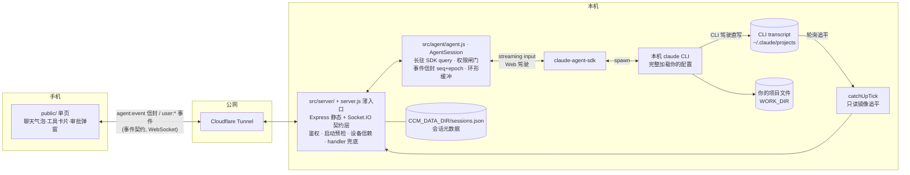

# Claude Chat Mobile

> 把本机 `claude` CLI 接到手机：同一 agent、同一会话记录、同一权限与工具配置——不是远程桌面，也不是共享实时 TTY。

**中文** · [English](README.en.md) · [🌐 网站](https://ike-li.github.io/claude-chat-mobile/)

[](LICENSE)
[](package.json)
[](#快速开始)
[](https://github.com/Ike-li/claude-chat-mobile/actions/workflows/test.yml)

**Claude Code 在跑，人却不总在电脑前。** 你让 claude 改代码，然后去开会——它需要权限时，手机收到推送；点进 App 看清命令、允许或拒绝。回家坐到电脑前，终端 `/resume` 接上手机上那个会话继续——同一个 agent、同一份记录，不是另开一个。

这个项目给已经在终端使用 `claude` CLI 的人用。它不打包 Claude，也不是 Claude 的重新实现；它通过 [Claude Agent SDK](https://code.claude.com/docs/en/agent-sdk/overview) 驱动你本机已登录的 CLI。手机端拿到的是同一个 agent、同一份 `CLAUDE.md`、同样的 MCP 服务器、技能、hooks 和会话记录。

目标很窄：**在手机上改代码、跑命令、审批危险操作、续上之前的对话**。两端读的是同一份 CLI 会话落盘，但**不是**把终端屏幕镜像过来，也**不是**两端同时往同一会话里打字的共享 TTY——同一时刻只有一个驾驶员（Web 或 CLI），另一端只读追平；CLI 正在跑时 Web 默认只读镜像，接管默认等本轮结束后再写。

## 适用场景

> 它不是手机远程桌面。远程桌面镜像电脑屏幕；这里是给本机 `claude` 会话做一个手机入口。差异主要体现在这些场景：
>
> - **任务在跑，人离开了电脑。** 你让 claude 改代码，然后去开会。它需要许可时，手机收到推送（类型级提示，如「需要你授权：Edit」——**不含**完整命令正文；点进 App 才能看详情并允许/拒绝）。不用让电脑屏幕亮着，也不用远程戳进终端。
> - **同一个会话，换设备继续。** 路上用手机起个头，到家后在电脑终端 `/resume` 接上——两端读的是同一份 CLI 会话记录，不是各开一个会话。反过来也行：终端里跑着时，手机可打开同一会话做**只读镜像**（磁盘 transcript 追平，可能有短暂空窗/延迟，不是 attach 到同一个活进程）；要在手机上继续写，等本轮结束后接管。地铁信号差时 Web 页会重连并补发缓冲内的输出。
> - **多个仓库并行看。** claude 可以同时在两个项目里跑不同任务；在手机的首页枢纽 / 工作区抽屉 / 会话列表之间切换进度（不是浏览器多标签页心智）。一块远程桌面屏幕在手机上很难做到这一点。
> - **手机输入更顺。** 输入 `/` 弹出可点的命令列表，从相册发截图给 claude，长按复制长输出。这些都按手机交互做，而不是把终端缩小。
>
> 如果只是偶尔远程看一眼，远程桌面就够了。这个项目适合把手机当成终端的随身入口来高频使用。

## 前置条件

- **Node.js ≥ 20**——用 `node --version` 检查。
- **本机有一个可用的 `claude` CLI。** 本项目驱动*你的*本机 CLI，不自带。先确认 `claude` 能在终端跑起来（`which claude`，再开一次对话确认已登录）；web UI 继承的就是这个 CLI、你的 `CLAUDE.md`、MCP 服务器、技能、hooks 和 shell 环境。
- **官方订阅、第三方网关 / 中转 API 都支持。** web 端沿用**启动 server 的那个 shell** 里的 provider / 网关 / 模型：
  - 用**官方订阅**（`claude` 已登录）：无需额外配置。
  - 用**第三方网关 / 中转**：在启动 server 的 shell 里 `export` 你网关所需的 `ANTHROPIC_*`（通常是 `ANTHROPIC_BASE_URL` / `ANTHROPIC_AUTH_TOKEN` / `ANTHROPIC_MODEL`，以你网关的文档为准），再启动 server。
  - ⚠️ `ANTHROPIC_*` 写进 `.env` **无效**：启动期会剥除这些变量，只读取启动 server 的 shell 环境。
- **macOS 或 Linux（一等支持）。** 部分路径/权限逻辑对 Windows 做了兼容修补，但**不是**官方支持平台；原生 Windows 请当实验路径，更稳的是 WSL2。

## 快速开始

```bash
git clone https://github.com/Ike-li/claude-chat-mobile.git
cd claude-chat-mobile

node --version           # 需 Node ≥ 20
which claude             # 本项目驱动的 CLI——必须已安装并登录

npm install --omit=dev   # 仅运行依赖——不含 Playwright/浏览器。要跑 UI 测试用完整 npm install。
npm run setup            # 交互式向导：自动生成 AUTH_TOKEN（头号门槛）+ 询问 WORK_DIR，写入 .env（权限 0600）
                         # 推荐用它，免去手搓；想直接用原始模板：cp .env.example .env

# 推荐：启动前自检配置（端口占用、CLAUDE_BIN 路径、网关环境、文件权限）
node scripts/doctor.js        # 检查配置
node scripts/doctor.js --fix  # 收紧权限（.env 与 CCM_DATA_DIR/*.json → 0600）

npm start                     # http://localhost:3000
```

**更快：丢给你的编程 agent 代装**——在仓库目录里（或先让它 clone）把下面这段交给 Claude Code / Codex CLI 之类的编程 agent：

```
帮我首次安装并启动 claude-chat-mobile（把本机 claude CLI 接到手机的 web UI）。这是全新环境首次安装，不是重启已部署的常驻服务——CLAUDE.md 里「生产部署勿手动 npm start」那条对这次不适用。按 README.md「快速开始」一节操作：装依赖、跑 npm run setup 交互向导（会问 WORK_DIR，需要跟我确认挂哪个项目目录）、跑 node scripts/doctor.js 自检并按提示修好、最后 npm start。全部跑通后告诉我怎么在手机上打开；如果我后续想要公网固定域名访问，参考 docs/deployment.md 帮我配。
```

Web 自己发起的会话开箱即用 SDK 状态栏，不需要改 Claude 配置。若还要在 Web **只读查看正在 CLI 里运行的会话**时同步 CLI 的模型、思考强度、上下文、成本和额度，可显式安装透明 statusline bridge：

```bash
npm run statusline:status     # 只读查看，不改 ~/.claude
npm run statusline:install    # 显式安装；不会由 npm install / npm start 自动执行
```

安装后重开 Claude CLI，并重启常驻 server；卸载用 `npm run statusline:uninstall`。

然后在手机上打开。启动日志会打印已带 token 的可用 URL：

- **同一 WiFi：** 先在 `.env` 设 `AUTH_TOKEN`（局域网也必填，不设手机连不上），再打开启动时打印的局域网地址（`http://<lan-ip>:3000/#token=…`）。不需要隧道。
- **公网 / 安装为 PWA**（PWA 需要 https）：在另一个终端跑隧道：

```bash
cloudflared tunnel --url http://localhost:3000
# 手机打开 https://<random>.trycloudflare.com/#token=<你的 AUTH_TOKEN>
# token 首次加载存入 localStorage，随后从地址栏清除
```

手机首次从非本机路径连入时，**光有 token 不够**：电脑上还要批一次设备指纹（TOFU）：

```bash
node scripts/device.js list           # 看待确认设备
node scripts/device.js approve <ID>   # 批准后该设备立即解锁
```

> ⚠️ 不设 `AUTH_TOKEN` 时，服务只绑定 `127.0.0.1`。同 WiFi 的手机和隧道都连不上，这是有意为之。
>
> 📌 上面是最简配置：临时随机隧道，只适合测试。固定域名、Cloudflare Access 双因素和后台常驻部署见 [docs/deployment.md](docs/deployment.md)。经 Cloudflare Access 验证的公网连接可跳过设备指纹这一步；临时 `cloudflared` 随机隧道**没有** Access，仍要走 `device.js approve`。
>
> ⚠️ 这是一条可远程触达、直通你本机 shell 的代码执行通道。暴露到公网前，先读下面的[安全模型](#安全模型)。

## 运行方式(三选一)

按你的场景选一种。具体命令见上方[「快速开始」](#快速开始)与 [docs/deployment.md](docs/deployment.md):

| 方式 | 适合 | 代价 |
|---|---|---|
| **同 WiFi 局域网直连**：`http://<lan-ip>:3000/#token=` | 在家、手机和电脑同一网络 | 出门用不了；无隧道，最省事 |
| **临时公网**：`cloudflared tunnel --url`（随机域名） | 临时试用 / 演示 | 地址每次重启都变；官方标注仅测试用；仍要设备审批 |
| **固定生产**：固定域名 + Cloudflare Access 2FA + 常驻进程 | 长期、随时随地用 | 一次性 DevOps 搭建，见 [docs/deployment.md](docs/deployment.md) |

## 安全模型

> **暴露到公网前务必先读。** 这是一条可远程触达、直通你本机 shell 的代码执行通道：

1. **每实例单用户。** 你运行自己的实例，给自己用。项目没有多用户、账号或登录系统；任何通过鉴权的请求，都和你本人坐在终端前拥有同样的权限。不要把它当多租户服务。
2. **没有 token 就不出本机。** 未设置 `AUTH_TOKEN` 时，服务只绑定 `127.0.0.1`。不存在"留空 = 对全世界开放"的路径。要投送到公网，必须有 token。
3. **自动放行集继承 CLI，不另造白名单。** 本项目不注入自己的 `allowedTools` / `disallowedTools`。自动放行 = 你已有 claude 配置里 `permissions.allow` 的合并结果：全局 `~/.claude/settings.json`、项目 `.claude/settings.json`、本地 `.claude/settings.local.json` 三处一并生效（经 `settingSources` 加载，与终端同源）。命中即放行；未命中就挂起，把审批请求推到手机——**App 内**可见完整命令与工作目录后再确认。
   - Web 另有运行时权限档（含 `dontAsk` / `auto` / `bypassPermissions` 等）与审批 TTL 等行为，**不等于**「手机 UI 与交互式终端逐行为一致」；同源的是 settings 白名单来源，不是整套交互。
   - ⚠️ **公网暴露前，审查你的全局 `~/.claude/settings.json` 白名单**。终端里多年累积的 `Bash(...)` / `Write` 等规则在这里也会自动放行，不会再弹手机。要收紧的不只项目那份配置。
4. **设备信赖（TOFU）。** 既非本机、也未经 Cloudflare Access 验证的连接，必须先在电脑上一次性授权该设备才能操作。合法 token 本身不够。在电脑上执行：
   ```bash
   node scripts/device.js list
   node scripts/device.js approve <ID>
   ```
   吊销用 `deny <ID>`。本机 loopback 连接与已通过 Cloudflare Access JWT 的公网连接会跳过这一步。

## 成本提示

**当前（截至 2026-07-20）：Agent SDK / `claude -p` 用量仍吃订阅额度，与交互式同池**。本项目走官方订阅路径时，不产生独立计费。

背景：Anthropic 曾公告自 2026-06-15 起把 SDK *headless* 用量挪到独立 credit 池（Max 5x $100/月、按 API 价），但**该变更已于上线当天暂停、从未生效**（[官方 Help Center](https://support.claude.com/en/articles/15036540-use-the-claude-agent-sdk-with-your-claude-plan)）。Anthropic 称会重做方案并提前通知；现在是暂停，不是取消。

- **潜在风险**：若政策复活，本项目的 SDK 用量会从订阅额度移出、可能撞独立 credit 上限。作者个人路径曾按 API 价粗算约 **~$716/月** 等效——**仅个人实测、非产品 SLA 或典型用户指标**；届时请用你自己的用量再预算。
- **走第三方网关**（shell export 的 `ANTHROPIC_*`）：与此无关，按网关自己费率付费。

## 特性

在上面的核心循环之外：

- **单驾驶员模型**：Web 与 CLI 轮流写同一会话；CLI 驾驶时 Web 只读镜像（transcript 追平），接管默认排队等本轮完结，避免并发写盘分叉。
- **六种权限档**（default / plan / acceptEdits / dontAsk / auto / bypassPermissions），运行时可切；审批带 TTL 与完整性绑定。
- **逐条消息切换模型**（支持网关后缀名）；resume 可回落展示会话末条模型。
- **多 repo 与多会话**：白名单工作目录切换；首页枢纽 / 抽屉并发看多个会话；git worktree 会话可发现并续接。
- **消息排队可见 + 撤回**（对齐 CLI Queued/ESC）；发送钮双态停止；CLI 式动态状态行与回合收尾行。
- **子 agent / 后台任务可见**，可停止后台任务；Task 清单工具流内渲染。
- **文件与图片上传**（含剪贴板粘贴与发送前预览），带路径注入与穿越防护；历史附件可点预览；**项目文件只读浏览**（不越白名单工作目录）。
- **工具卡片预览变更**：Edit / Write 看 diff、Read 看片段；base64 脱敏与 JSON 高亮。
- **思考强度控制**、**单一来源状态栏**（Web 驾驶取 SDK；可选 bridge 让 CLI 驾驶取 CLI 快照），以及作为原生选择器的 **`AskUserQuestion`**。
- **Web Push / ntfy 通知**：推送审批、提问与结果的**类型级**提示（不含命令/问题正文），点通知深链回会话（iOS 16.4+ 需先添加到主屏幕；可选配 ntfy 走自托管、锁屏更可靠）；socket 在线时结果类通知不重复推。
- **会话两级删除**（产品移除 / SDK 真删底层文件）；「等我」跨会话聚合。
- **PWA 可安装**：maskable 图标 + 独立显示，"添加到主屏幕"当 app 用。
- **运维与安全加固**：日志脱敏、`0600` 原子写、`doctor` 启动自检、**UI 一键安全体检（脱敏，审查危险白名单）**、鉴权限速、可选 Cloudflare Access 2FA、`/metrics` 与服务状态面板。

## 内部实现（想读代码 / fork 才看）

内部是一层默认上锁的转发层：把你本机的 claude CLI（带着你的 CLAUDE.md/MCP/skills/登录态）接到手机浏览器。会话连续，过程可见，危险操作回手机审批。双通道并存：**Web 驾驶**走 SDK 流式；**CLI 驾驶**写磁盘 transcript，Web 只读追平。



### 消息流程

**Web 驾驶（手机发消息）：**

1. 手机 `user:message {text}` → server 校验 → 路由到目标实例 `agents.get(instanceId)`（懒重生 resume；`session:new` 后首条消息才懒开 FRESH 实例）
2. 若磁盘相对 SDK 内存有外部增长（CLI 写过），先 dispose+resume 吸收，再发送——防上下文分叉
3. 文本 push 进 AgentSession 的 streaming input → SDK → claude CLI 在 `WORK_DIR` 干活
4. SDK 消息流回 `map()`：流式文本→`text_delta`、工具调用→`tool_use`/`tool_result`、白名单外操作→`permission_request`（挂起等手机点允许/拒绝）
5. 每个事件套上 `{seq, epoch, sessionId, instanceId, cwd, ts, type, payload}` 信封 → 进 2000 条环形缓冲 → `io.to('approved').emit` 广播给已过审设备（前端按 `viewingInstanceId` 分流；后台会话的高频 delta 不广播以省带宽）
6. 手机断线再连：`sync:since {sessionId, lastSeq, instanceId}` 补发缓冲；`epoch` 变化 = 服务端换了实例，客户端自动重置去重基线

**CLI 驾驶（终端直开，Web 只读）：**

1. 你在电脑终端里对 `claude` 打字；CLI **不**经过本项目的 Agent SDK 子进程
2. 输出写入 `~/.claude/projects/` 下 transcript
3. server 的 `catchUpTick` 轮询磁盘，把新落定消息以只读镜像推到已打开该会话的 Web 客户端
4. 镜像锁定期间 Web 输入受限（发送钮变为续接/说明态）；终端静默一段时间后自动解锁，Web 可接管

运行时依赖：`@anthropic-ai/claude-agent-sdk`、`express`、`compression`、`socket.io`、`dotenv`、`web-push`、`jose`。前端第三方库本地自托管到 `public/vendor/`（Tailwind/marked/highlight.js/DOMPurify），不依赖 CDN；见 [public/vendor/THIRD-PARTY-NOTICES.md](public/vendor/THIRD-PARTY-NOTICES.md)。

## 许可证

[GNU AGPL-3.0-only](LICENSE) © 2026 Ike-li，附带 Section 7 补充条款；见 [NOTICE](NOTICE)。

简单说：你可以自由使用、研究、修改并自托管本软件。但如果你把修改后的版本作为网络服务对外提供，AGPL 要求你同样以 AGPL 开源你的源代码；补充条款还要求你保留原作者署名、不得歪曲项目来源。若有无法满足上述条件的使用需求，请开 issue 沟通。

## 友链

- [LINUX DO](https://linux.do/)
