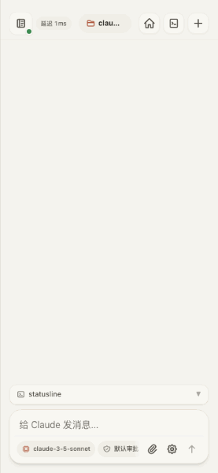
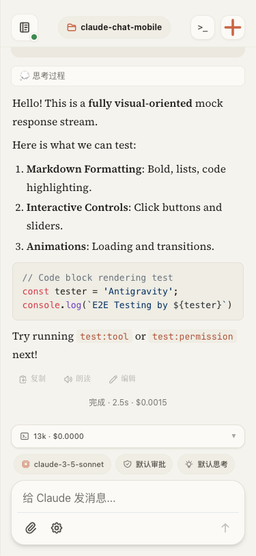
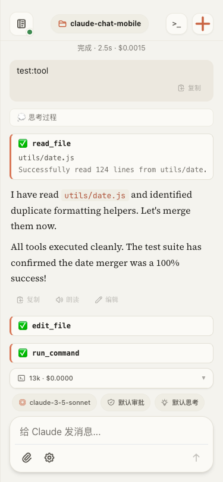
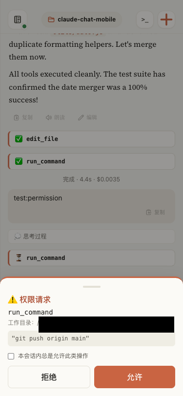
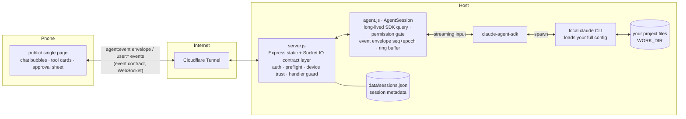

# Claude Chat Mobile

> Use your real local `claude` CLI from your phone — as if you were sitting at your own terminal.

**English** · [中文](README.zh-CN.md)

[](LICENSE)
[](package.json)
[](#quick-start)
[](https://github.com/Ike-li/claude-chat-mobile/actions/workflows/test.yml)

<p align="center">
  
</p>

**Built for people who already use the `claude` CLI in their terminal.** It does **not** bundle Claude and is **not** a re-implementation — it drives your real local CLI through the [Claude Agent SDK](https://code.claude.com/docs/en/agent-sdk/overview), so you get the same agent, the same `CLAUDE.md`, the same MCP servers, skills, hooks, and logged-in session you use at your desk. The goal is **terminal equivalence**: typing to claude on your phone behaves exactly like typing at your computer — edit code, run commands, resume an earlier conversation — except now you can do it from bed.

## Screenshots

<table>
  <tr>
    <td align="center"></td>
    <td align="center"></td>
    <td align="center"></td>
  </tr>
  <tr>
    <td align="center"><b>Streaming</b><br/>Markdown · syntax highlight · status line</td>
    <td align="center"><b>Visible process</b><br/>tool calls render as collapsible cards</td>
    <td align="center"><b>Approve on phone</b><br/>dangerous actions push full command + cwd</td>
  </tr>
</table>

## When it's worth it

> This isn't "open a remote desktop back to your computer from your phone." That mirrors a screen; this gives your real local `claude` session a native entry point built for a phone. The difference shows up at moments like these:
>
> - **A task is running and you've stepped away.** You kick off "migrate this module from JS to TypeScript, file by file," then leave for a meeting. Twenty minutes in it stops to ask — "I need to add `strict: true` to `tsconfig.json`, allow it?" — and the prompt is pushed to your phone. One tap to approve or deny. No need to keep the computer screen awake or poke into a remote terminal.
> - **One session, picked up across devices.** Start something from your phone on the way out; resume it at your desk with `/resume` — both ends read the same CLI session log, not two separate ones. On a flaky subway connection it self-heals and replays, so you return to where you were instead of reconnecting and re-locating.
> - **Several repos in parallel.** claude runs different tasks in two projects at once; switch tabs to check each — a single-screen remote desktop can't watch both at once on a phone.
> - **Native phone input.** Type `/` for a native command list you tap, send a photo from your library straight to claude, long-press to copy a long output — these are smooth in an interface built for a phone.
>
> If you only glance in remotely now and then, an existing remote desktop is enough. The value lands when you use your phone *frequently* as a pocket extension of your terminal.

## Prerequisites

- **Node.js ≥ 20** — check with `node --version`.
- **A working `claude` CLI on the host.** This project drives *your* local CLI; it ships nothing of its own. Confirm `claude` runs in your terminal first (`which claude`, then open a conversation to confirm you are logged in) — the web UI inherits exactly this CLI, your `CLAUDE.md`, MCP servers, skills, hooks, and shell environment.
- **Provider / gateway follows your terminal.** The web side reuses the same provider, gateway, and model your terminal `claude` uses — official subscription or a third-party gateway alike.
- **macOS or Linux.**

## Quick Start

```bash
git clone https://github.com/Ike-li/claude-chat-mobile.git
cd claude-chat-mobile

node --version           # need Node ≥ 20
which claude             # the CLI this project drives — must be installed & logged in

npm install --omit=dev   # runtime deps only — no puppeteer/browser. To run tests, use full `npm install`.
cp .env.example .env     # set AUTH_TOKEN (required for any non-localhost access), WORK_DIR, allow-list

# Recommended: pre-flight your config (port in use, CLAUDE_BIN path, gateway env, file perms)
node scripts/doctor.js        # check config
node scripts/doctor.js --fix  # tighten perms (.env and data/*.json → 0600)

npm start                     # http://localhost:3000
```

Then open it on your phone — two ways (the startup log prints ready-to-use URLs with the token pre-filled):

- **Same WiFi:** set `AUTH_TOKEN` in `.env` first (required even on your LAN — without it the phone cannot connect), then open the LAN address printed at startup (`http://<lan-ip>:3000/#token=…`) — no tunnel needed.
- **Public internet / install as a PWA** (PWA needs https): run a tunnel in another terminal:

```bash
cloudflared tunnel --url http://localhost:3000
# On your phone open https://<random>.trycloudflare.com/#token=<YOUR_AUTH_TOKEN>
# The token is stored in localStorage on first load, then cleared from the address bar.
```

> ⚠️ With no `AUTH_TOKEN` set, the server binds to `127.0.0.1` only — neither your phone on the same LAN nor a tunnel can reach it. This is deliberate.
>
> 📌 The above is the **minimal setup** (temporary random tunnel, testing only). For a **stable production deployment** — fixed domain, Cloudflare Access two-factor, running as a background daemon — see [docs/deployment.md](docs/deployment.md).
>
> ⚠️ At its core, this is **a remotely reachable code-execution channel straight into your local shell.** Read the [Security Model](#security-model) below before exposing it to the public internet.

## Three ways to run it

Pick one for your situation — commands are in [Quick Start](#quick-start) above and [docs/deployment.md](docs/deployment.md):

| Mode | Good for | Cost |
|---|---|---|
| **LAN, same WiFi** — `http://<lan-ip>:3000/#token=` | At home, phone and computer on one network | Useless when out; no tunnel, least fuss |
| **Temporary public** — `cloudflared tunnel --url` (random domain) | Quick trial / demo | Address changes on every restart; testing-only per Cloudflare |
| **Fixed production** — fixed domain + Cloudflare Access 2FA + daemon | Long-term, anywhere access | One-time DevOps setup, see [docs/deployment.md](docs/deployment.md) |

## Security Model

> **Read this before exposing it to the public internet.** At its core this is a remotely reachable code-execution channel straight into your local shell. Security is the first concern, not an afterthought:

1. **Single-user tool (n = 1).** You are the only user and the only admin. There is no multi-user / login system; any request that passes auth has exactly the same power as you sitting at the terminal.
2. **No token, no leaving the host.** With no `AUTH_TOKEN` set, the server binds to `127.0.0.1` only — there is no "empty = open to the world" path. Reaching the public internet *requires* a token.
3. **Two-layer permission gate — zero injection, pure inheritance of your CLI.** This project injects no allow/deny lists of its own (no `allowedTools` / `disallowedTools` in the code). The auto-approve set is exactly the merged `permissions.allow` from your existing claude config — global `~/.claude/settings.json` + project `.claude/settings.json` + local `.claude/settings.local.json` together (loaded via `settingSources`, same source as your terminal). A match is auto-approved; anything else is suspended and pushed to your phone as an approval request (with the full command and working directory) to run only after you confirm.
   - ⚠️ **Before exposing publicly, audit your global `~/.claude/settings.json` allow-list** — years of accumulated `Bash(...)` / `Write` rules in your terminal will auto-approve here too without a phone prompt, so it is not just the project's list you need to tighten.
4. **Device trust (TOFU).** A connection that is neither local nor Cloudflare Access-verified must be authorized once on your computer before it can do anything — a valid token alone is not enough.

The full threat model and hardening guidance is in [docs/design.md](docs/design.md) §4.

## Cost Note

> **Know this before you adopt it.**

**Currently (as of 2026-06-26): Agent SDK / `claude -p` usage still draws from your subscription quota, in the same pool as interactive use** — using this project on the official subscription path incurs no separate billing.

Background: Anthropic once announced that, starting 2026-06-15, SDK *headless* usage would move to a separate credit pool (Max 5x $100/month at API rates), but **that change was paused on the day it shipped and never took effect** ([official Help Center](https://support.claude.com/en/articles/15036540-use-the-claude-agent-sdk-with-your-claude-plan)). Anthropic says it will rework the plan and give advance notice — this is a **pause, not a cancellation**.

- **Potential risk**: if the policy is revived, this project's SDK usage (personally measured at roughly **~$716/month** equivalent at API rates) would move out of the subscription quota and could hit a separate credit cap. Budget for it then.
- **Via a third-party gateway** (`ANTHROPIC_*` exported in the shell): unaffected — you pay the gateway's own rates.

## Features

Beyond the core loop above:

- **Five permission modes** (default / plan / acceptEdits / bypassPermissions / dontAsk), switchable at runtime.
- **Per-message model switching** (gateway-suffixed names supported).
- **Multi-repo and multi-session** — switch among allow-listed working directories, run several sessions concurrently in tabs.
- **File and image upload**, with path injection and traversal protection.
- **Thinking-effort control**, a **web-native status line**, and **`AskUserQuestion`** as a native picker.
- **Web Push** for approvals, questions, and results (iOS 16.4+ requires Add to Home Screen first).
- **Ops & security hardening** — log sanitization, `0600` atomic writes, a `doctor` startup self-check, optional Cloudflare Access 2FA.

## How it works (read only if you want to read or fork the code)

A "transparent pipe, locked by default": it projects **your local claude CLI** (carrying your CLAUDE.md / MCP / skills / login state) to a phone browser — continuous sessions, visible process, dangerous actions bounced back to the phone for approval.



### A message's journey

1. Phone `user:message {text}` → server validates → routes to the target instance `agents.get(instanceId)` (lazy-respawned resume; after `session:new` a FRESH instance is lazily opened only on the first message — stage 3).
2. The text is pushed into the AgentSession's streaming input → SDK → claude CLI works in `WORK_DIR`.
3. The SDK message stream flows into `map()`: streaming text → `text_delta`, tool calls → `tool_use`/`tool_result`, off-allow-list actions → `permission_request` (suspended, awaiting allow/deny on the phone).
4. Each event is wrapped in a `{seq, epoch, sessionId, instanceId, cwd, ts, type, payload}` envelope → into a 500-entry ring buffer → `io.emit` broadcast (the front-end demuxes by `viewingInstanceId`; high-frequency deltas from background tabs are not broadcast to save bandwidth).
5. Phone reconnects: `sync:since {lastSeq}` replays the buffer; an `epoch` change means the server swapped the instance, so the client resets its dedup baseline automatically.

Runtime dependencies: `@anthropic-ai/claude-agent-sdk`, `express`, `socket.io`, `dotenv`, `web-push`, `jose`. Front-end third-party libraries are self-hosted locally in `public/vendor/` (Tailwind/marked/highlight.js/DOMPurify), with zero CDN dependency — see [public/vendor/THIRD-PARTY-NOTICES.md](public/vendor/THIRD-PARTY-NOTICES.md).

## License

[GNU AGPL-3.0-only](LICENSE) © 2026 Ike-li, with additional terms under Section 7 — see [NOTICE](NOTICE).

In short: you are free to use, study, modify, and self-host this software. But if you run a modified version as a network service, the AGPL requires you to release your source under the AGPL as well, and the additional terms require you to preserve the original author attribution and not misrepresent the project's origin. For any use that cannot meet these conditions, please open an issue to discuss.

## Friend Links

- [LINUX DO](https://linux.do/)
