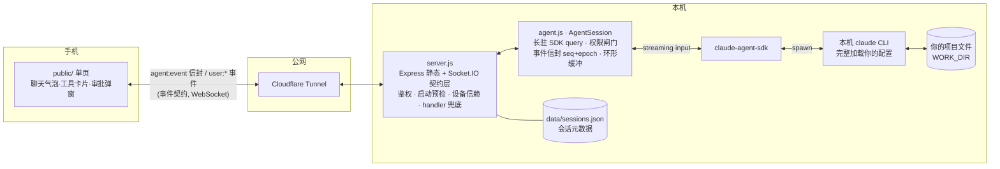

# Claude Chat Mobile

> 从手机使用真正的 `claude` CLI——就像你正坐在自己的终端前。

[English](README.md) · **中文**

[](LICENSE)
[](package.json)
[](#快速开始)

**这是给已经在终端用 `claude` CLI 的人做的。** 它**不自带** Claude、也**不是** Claude 的重新实现——而是通过 [Claude Agent SDK](https://code.claude.com/docs/en/agent-sdk/overview) 驱动你本机真实的 CLI，于是你得到的是同一个 agent、同一份 `CLAUDE.md`、同样的 MCP 服务器、技能、hooks 和已登录会话，与你在电脑前用的完全一致。设计目标是**终端等价性**：在手机上对 claude 打字，效果和坐在电脑前打字完全相同——改代码、跑命令、接着之前的对话——只是现在可以躺在床上做。

<p align="center">
  
</p>

## 界面

<table>
  <tr>
    <td align="center"></td>
    <td align="center"></td>
    <td align="center"></td>
  </tr>
  <tr>
    <td align="center"><b>流式输出</b><br/>Markdown · 代码高亮 · 状态栏</td>
    <td align="center"><b>过程可见</b><br/>工具调用渲染为折叠卡片</td>
    <td align="center"><b>回手机审批</b><br/>危险操作推送完整命令 + cwd</td>
  </tr>
</table>

## 前置条件

- **Node.js ≥ 20**——用 `node --version` 检查。
- **本机有一个可用的 `claude` CLI。** 本项目驱动*你的*本机 CLI，不自带。先确认 `claude` 能在你终端跑起来（`which claude`，再开一次对话确认已登录）——web UI 继承的正是这个 CLI、你的 `CLAUDE.md`、MCP 服务器、技能、hooks 和 shell 环境。
- **Provider / 网关跟随你的终端。** web 端原样沿用你终端 `claude` 用的 provider、网关与模型——官方订阅或第三方网关皆可。
- **macOS 或 Linux。**

## 快速开始

```bash
npm install
cp .env.example .env   # 设置 AUTH_TOKEN（任何非 localhost 访问都必填）、WORK_DIR、白名单

# 推荐：启动前自检配置（端口占用、CLAUDE_BIN 路径、网关环境、文件权限）
node scripts/doctor.js        # 检查配置
node scripts/doctor.js --fix  # 收紧权限（.env 与 data/*.json → 0600）

npm start                     # http://localhost:3000
```

然后在手机上打开——两种方式（启动时会打印已填好 token 的可用 URL）：

- **同一 WiFi：** 打开启动时打印的局域网地址（`http://<lan-ip>:3000/#token=…`）——无需隧道。
- **公网 / 安装为 PWA**（PWA 需要 https）：在另一个终端跑隧道：

```bash
cloudflared tunnel --url http://localhost:3000
# 手机打开 https://<random>.trycloudflare.com/#token=<你的 AUTH_TOKEN>
# token 首次加载存入 localStorage，随后从地址栏清除
```

> ⚠️ 不设 `AUTH_TOKEN` 时服务只绑定 `127.0.0.1`、无法被隧道穿透——这是有意为之。
>
> 📌 以上是**最简配置**（临时随机隧道，仅供测试）。**稳定的生产部署**——固定域名、Cloudflare Access 双因素、作为后台守护进程运行——见 [docs/deployment.md](docs/deployment.md)。
>
> ⚠️ 本质上，这是**一条可远程触达、直通你本机 shell 的代码执行通道**。把它暴露到公网前。

## 运行方式(三选一)

按你的场景挑一种——具体命令见上方「快速开始」与 [docs/deployment.md](docs/deployment.md):

| 方式 | 适合 | 代价 |
|---|---|---|
| **同 WiFi 局域网直连** —— `http://<lan-ip>:3000/#token=` | 在家、手机和电脑同一网络 | 出门用不了;无隧道、最省事 |
| **临时公网** —— `cloudflared tunnel --url`(随机域名) | 临时试用 / 演示 | 地址每次重启都变;官方标注仅测试用 |
| **固定生产** —— 固定域名 + Cloudflare Access 2FA + 常驻进程 | 长期、随时随地用 | 一次性 DevOps 搭建,见 [docs/deployment.md](docs/deployment.md) |

## 安全模型

> **把它暴露到公网前务必先读。** 本质上，这是一条可远程触达、直通你本机 shell 的代码执行通道。安全是第一考量，不是事后补丁：

1. **单用户工具（n = 1）。** 你是唯一的用户兼管理员。没有多用户/登录系统；任何通过鉴权的请求，权力都和你本人坐在终端前完全相同。
2. **没有 token 就不出本机。** 未设置 `AUTH_TOKEN` 时，服务只绑定 `127.0.0.1`——不存在"留空 = 对全世界开放"的路径。要投送到公网*必须*有 token。
3. **两层权限闸门——白名单零注入、纯继承你的 CLI。** 本项目不注入任何自家放行 / 禁用清单（代码里无 `allowedTools` / `disallowedTools`）；自动放行集 = 你已有 claude 配置里 `permissions.allow` 的合并结果——全局 `~/.claude/settings.json` + 项目 `.claude/settings.json` + 本地 `.claude/settings.local.json` 三处一并生效（经 `settingSources` 加载，与终端同源）。命中即放行；未命中一律挂起，把审批请求（含完整命令与工作目录）推送到你手机，确认后才执行。
   - ⚠️ **公网暴露前，审查你的全局 `~/.claude/settings.json` 白名单**——终端里多年累积的 `Bash(...)` / `Write` 等会照样自动放行、不弹手机，要收紧的不只项目那份。
4. **设备信赖（TOFU）。** 既非本机、也未经 Cloudflare Access 验证的连接，必须先在你电脑上一次性授权该设备才能做任何事——光有合法 token 不够。

完整威胁模型与加固指引见 [docs/design.md](docs/design.md) §4。

## 成本提示

> **采用前了解。**

**当前（截至 2026-06-26）：Agent SDK / `claude -p` 用量仍吃订阅额度，与交互式同池**——本项目走官方订阅路径不产生独立计费。

背景：Anthropic 曾公告自 2026-06-15 起把 SDK *headless* 用量挪到独立 credit 池（Max 5x $100/月、按 API 价），但**该变更已于上线当天暂停、从未生效**（[官方 Help Center](https://support.claude.com/en/articles/15036540-use-the-claude-agent-sdk-with-your-claude-plan)）。Anthropic 称会重做方案并提前通知——是**暂停非取消**。

- **潜在风险**：若政策复活，本项目 SDK 用量（个人实测约 **~$716/月**等效 API 价）会从订阅额度移出、可能撞独立 credit 上限。届时再据此预算。
- **走第三方网关**（shell export 的 `ANTHROPIC_*`）：与此无关，按网关自己费率付费。

## 特性

在上面的核心循环之外：

- **五种权限档**（default / plan / acceptEdits / bypassPermissions / dontAsk），运行时可切。
- **逐条消息切换模型**（支持网关后缀名）。
- **多 repo 与多会话**——切换白名单内的工作目录，在标签页里并发跑多个会话。
- **文件与图片上传**，带路径注入与穿越防护。
- **思考强度控制**、**Web 自有状态栏**，以及作为原生选择器的 **`AskUserQuestion`**。
- **Web Push** 推送审批、提问与结果（iOS 16.4+ 需先添加到主屏幕）。
- **运维与安全加固**——日志脱敏、`0600` 原子写、`doctor` 启动自检、可选 Cloudflare Access 2FA。


## 内部实现（想读代码 / fork 才看）

一根"默认上锁的透明管子"：把**你本机的 claude CLI**（带着你的 CLAUDE.md/MCP/skills/登录态）投送到手机浏览器，会话连续、过程可见、危险操作回手机审批。



### 一条消息的旅程

1. 手机 `user:message {text}` → server 校验 → 路由到目标实例 `agents.get(instanceId)`（懒重生 resume；`session:new` 后首条消息才懒开 FRESH 实例，台阶3）
2. 文本 push 进 AgentSession 的 streaming input → SDK → claude CLI 在 `WORK_DIR` 干活
3. SDK 消息流回 `map()`：流式文本→`text_delta`、工具调用→`tool_use`/`tool_result`、白名单外操作→`permission_request`（挂起等手机点允许/拒绝）
4. 每个事件套上 `{seq, epoch, sessionId, instanceId, cwd, ts, type, payload}` 信封 → 进 500 条环形缓冲 → `io.emit` 广播（前端按 `viewingInstanceId` 分流；后台 tab 的高频 delta 不广播以省带宽）
5. 手机断线再连：`sync:since {lastSeq}` 补发缓冲；`epoch` 变化 = 服务端换了实例，客户端自动重置去重基线


运行时依赖：`@anthropic-ai/claude-agent-sdk`、`express`、`socket.io`、`dotenv`、`web-push`、`jose`。前端第三方库本地自托管到 `public/vendor/`（Tailwind/marked/highlight.js/DOMPurify），零 CDN 依赖——见 [public/vendor/THIRD-PARTY-NOTICES.md](public/vendor/THIRD-PARTY-NOTICES.md)。

## 许可证

[MIT](LICENSE) © 2026 Ike-li
