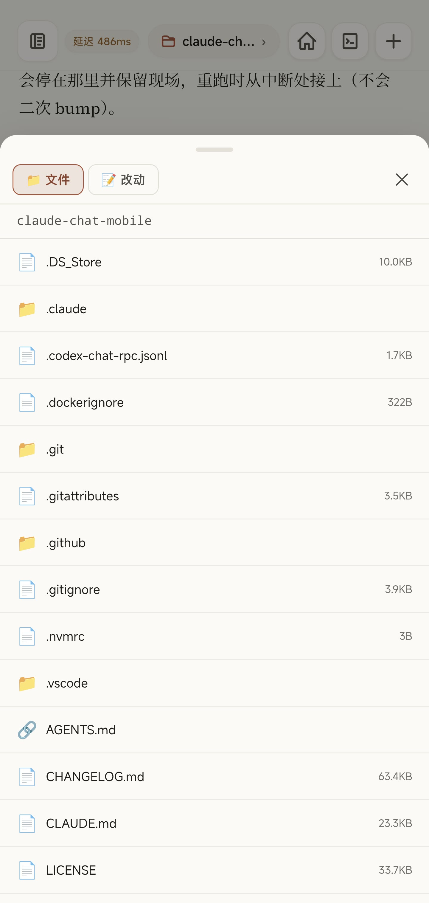

# 电脑上的 Claude Code，手机也能接着用

> 微信公众号 · 2026-09-13 · 事实基线：主仓 `dev` @ `9e01187`（v1.9.1）
> 封面：`img/00-cover.png`（1921×819 ≈ 2.35:1）


---

Claude Chat Mobile（以下简称 CCM）是一个自托管的移动端 Web UI，把本机已经配置好的 `claude` CLI 接到手机上。它的目标是终端等价：在电脑前对 Claude Code 能做的事，在手机上应当同样能做，而不是只能查看进度。

本文按能力域逐项说明当前版本（v1.9.1）提供了什么、判据是什么、边界在哪里。

## 一、它是什么


链路结构：

```
手机 PWA / 浏览器 ↕ Socket.io ↕ CCM Server（本机） ↕ Claude Agent SDK ↕ 本机 claude CLI
```

手机端是远程控制面。执行代码、读取项目、调用工具、维护会话的仍然是本机的 Claude Code 进程。项目不引入数据库，不做多租户，没有服务端后台；会话内容的真相源始终是 `~/.claude/projects/` 下的 jsonl 文件，CCM 自身不另存一份。

### 与官方 Remote Control 的差异

Anthropic 官方提供 Remote Control。在能够使用官方方案、且接受其账号与数据路径的前提下，官方方案零部署，是默认推荐。CCM 面向的是官方路径不可用、或不接受其控制面的场景。

| | 官方 Remote Control | Claude Chat Mobile |
| --- | --- | --- |
| 模型通路 | 需 claude.ai 订阅 + 直连 `api.anthropic.com` | 本机 `claude` CLI 的既有配置——第三方网关 / API key / Bedrock / Vertex 均可 |
| 控制面数据 | 会话 transcript 存至 Anthropic 服务器以做跨设备同步 | 服务、transcript、设备信任、审计均在本机，局域网内可完全闭环 |
| 会话可见范围 | 按会话逐个开启远程 | 放行工作区内的全部会话，含终端侧开启的会话 |
| 部署成本 | 零 | 需自行运行一个 server |

需要明确的措辞边界：这不等同于"数据绝不离开本机"。模型请求本来就由本机 `claude` CLI 按既有配置发出，CCM 承诺的是在此之外不增加数据出口。

## 二、会话驾驶

### 2.1 新建会话


新建会话时可指定：工作区、Git 分支、是否在新的 worktree 中开启（用于并行任务隔离）、模型、思考强度、权限档。等价于在终端中 `cd` 到项目目录后启动 `claude`。


- **模型**：Opus、Fable、Sonnet、Haiku，含 1M 上下文变体。
- **思考强度**：low / medium / high / xhigh / max 五档，另有 ultracode（xhigh + 多 agent 编排）。
- **权限档**：Manual（危险操作询问）、Plan（只规划不执行）、Accept edits（自动接受文件编辑）、Don't ask（未预先批准即拒绝）、Auto（由模型分类器判定）、Bypass（跳过全部权限检查）。

以上三项均在下一条消息生效，无需重建会话。

### 2.2 流式输出与工具调用


模型输出流式呈现，每次工具调用单独成条，可展开查看完整的输入参数与返回结果。回合结束时给出文件变更汇总，包含增删行数。

底部状态区显示当前回合是否仍在运行；其它会话有新消息时以未读计数提示。

### 2.3 审批与提问


两类需要人介入的场景在手机端均有对应交互：

- **工具审批**：弹出审批卡，可选允许、拒绝、中止本轮（对齐终端的 `Esc`）。可勾选"总是允许"，并选择仅本会话生效或永久生效。
- **模型提问**（`AskUserQuestion`）：选项直接点选，支持多选、自填"其他"、以及"跳过并中止本轮"。

上图是一次方案确认：模型将需要人决定的三项单独列出，其中第三项为安全边界变更——`routeCwd` 的匹配规则从精确白名单放宽至子树派生，模型判断既有不变量 `SCOPE-01` 不被破坏，但该变更确实使"不在显式配置中的路径"首次可被打开与驾驶，因此暂停并等待确认。

图中底部的"猜你接下来想发"为下一步建议：模型预测使用者可能发出的下一条消息，点击后填入输入框。该功能会产生少量额外计费，可在配置面板关闭。

### 2.4 输入与命令


- 输入 `/` 列出斜杠命令候选，包含本机已安装的 skills。
- 输入 `@` 搜索工作区文件，点选插入路径。
- 支持上传图片与粘贴截图。
- 底栏停止键对应终端的 `Esc` 打断。

### 2.5 回退与分叉

长按消息可执行两种操作：

- **回退**：将工作区文件一并恢复到该条消息发出之前的状态，并分叉出一个回到该时刻的新会话。
- **分叉**：仅复制对话内容，不改动文件。

两种操作均保留原会话。

## 三、查看与验证

### 3.1 阅读模型的分析结论


模型给出的结论在手机端完整可读，包含文件路径与行号。上图为一次代码审查的输出：`logic/panel-state.js:343` 的判据需从"有 session"改为"有 cwd"；`app.js:7242` 的显式调用需移除，否则判据变更会被覆盖；`tests/unit/logic-session.test.mjs:331-334` 三条断言中有两条会翻转，需连同新判据一并重写。

### 3.2 文件与变更




工作区文件可浏览与预览；"改动"页对应终端的 `git diff`。内置编辑器支持写入，但**该路径不经过 Agent 的工具审批链**，仅有范围校验、大小限制、哈希冲突检测与审计记录；可通过 `FILE_EDIT=off` 关闭，长期公网暴露时建议关闭。

### 3.3 测试执行


测试可在手机端触发并读取完整输出。上图为一次不变量测试的执行结果（551 个用例全部通过）。

同一轮对话中，模型执行的是变异测试——将源码人为改坏，检验测试是否会失败。首次注入后模型判定结果异常：正对照用例失败，而 symlink 用例未失败。原因是测试构造缺陷——macOS 的 `/var` 为 `/private/var` 的符号链接，候选路径未经 realpath 规范化，注入后全部用例返回 null，而 symlink 用例期望值恰为 null，该断言因此恒绿。模型修正测试构造、确认全绿后重新注入缺陷，验证失败落在预期行上。

这一流程对应项目的一条测试原则：不会失败的测试比没有测试更有害，因为它占据了"此处已被覆盖"的位置。

### 3.4 后台任务


长时间运行的任务以横幅呈现，可单独终止其中任意一个。上图为一次版本发布流程：bump 版本号 → 推送 dev → 等待 CI 通过 → 创建发版 PR → 等待 PR 检查 → 合并 → 在合并后的 HEAD 打 tag → 创建 Release。任一步骤失败时脚本停止并保留现场，重跑时从断点继续。

## 四、状态与用量


底栏常驻状态摘要，展开后包含：

```
claude-opus-5[1m] | effort max | claude-chat-mobile | dev | ctx 65% · left 345k/1.0m
5h 34% reset 1h45m | 7d 36% reset 4d16h25m
est $104.72 | total 2h07m | api 10h51m | lines +824/-173
```

即模型与思考强度、工作区与分支、上下文占用与剩余、5 小时与 7 天两档额度的用量及重置倒计时、预估花费、本轮耗时与增删行数。内容可一键复制。

该信息在移动场景中并非附加项：额度余量与上下文占用不可见时，使用者无法判断当前是否适合发起长任务。

## 五、跨端一致性


CCM 与终端共享同一份会话记录。手机端创建的会话，在电脑上通过 `claude --resume` 可以续接；终端中创建的会话，手机端可见并可接管驾驶。

终端侧会话默认不产生任何通知。开启"终端会话推送"后，这类会话在完成或需要介入时同样推送到手机。另有"终端状态栏"开关，将终端会话的模型、额度、上下文用量同步至手机端。

**单驾驶员模型**：同一时刻只允许一个驾驶端向同一个 Claude 进程写入。终端正在驾驶时，Web 端默认为只读；可以显式接管，接管前会给出提示。此约束用于避免上下文分叉与文件竞争。

## 六、通知


推送的抑制策略按"使用者是否可能看不到"分档，而非按事件重要性分档：

- **审批、提问、后台任务完成：无条件推送。** 这三类均意味着有人在等待一个动作，而使用者此时可能处于锁屏状态或在其它应用中。
- **回合完成、模型静默告警：** 仅当已授权房间存在前台可见连接、且该连接正在查看此会话时才抑制。

前台判据取自客户端主动上报的 `client:presence`，而非 socket 连接状态——手机切换至后台时 socket 通常仍然存活，以连接状态为判据会导致应推送的完成通知被错误抑制。

其它细节：

- 推送正文默认最小化，不含消息内容；可按设备开启内容预览。设备审批一类不提供该开关，因为 `deviceId` / `ip` / `userAgent` 正是审批时需要核对的信息，而 ntfy 通道为明文经第三方。
- 节流分两层：审批与提问置为 pending，须待实际处理后解除；同类事件最小间隔默认 60 秒。
- 支持 Web Push 与 ntfy 两类通道，均需显式配置。

## 七、模型通路


上面两张图中，模型列表分别映射至 grok 与 gemini，因为对应机器上的 `claude` CLI 即为此配置。项目对此有一条硬性规则：

> 不关心 claude CLI 接的是哪个上游——官方订阅 / API key / Bedrock / Vertex / 第三方网关，一视同仁。禁止任何 `ANTHROPIC_BASE_URL` 匹配、厂商白名单或上游探测；唯一允许据以调整行为的信号是 CLI 自报的能力位，因为那是 CLI 说的、不是我们猜的。

官方 Remote Control 在网关或 API key 配置下整体不可用，而 CCM 在这些配置下功能完整。这是该项目存在的主要理由之一。

## 八、多工作区


工作区列表显示各仓库的运行状态与未读计数，可展开查看该工作区下的全部会话（含终端侧创建的），支持按标题搜索。工作区列表支持热加载：修改 `ccm.config.json` 的 `WORKDIRS` 后即时生效，无需重启；被移除目录上已开启的会话继续运行，仅拒绝新开。

## 九、安全边界

需要首先明确：

> 这是一个可以远程触达本机 Claude Code、并间接获得本机代码执行能力的入口。请将其视为开发机远程控制工具，而非普通网页。

防线自外向内为六层：`AUTH_TOKEN` → 可选的公网身份层 → 设备信任 → 工作区范围门 → CLI 自身的 `permissions.allow` 与 Web 权限档 → Agent 审批。

### 9.1 令牌与工作区

- **无令牌不启动。** `AUTH_TOKEN` 是启动前提，任何绑定模式相同——本机浏览器访问同样需要令牌，不存在"本地免鉴权"。
- **工作区显式放行。** 文件、会话及相关操作仅能进入配置的 `WORKDIRS`。装机向导在非交互模式下，若检测到会回落至整个家目录，直接拒绝而非自行选择。
- **继承 Claude Code 权限。** `permissions.allow` 等既有规则继续生效；公网使用前应检查 Bash、Write 的自动放行规则。

### 9.2 设备审批


除本机直连、以及已通过公网身份层的路径外，持有正确令牌的新设备仍需一次审批。审批入口有四个：已受信任设备的 Web 端、macOS 菜单栏、终端回车确认、`node scripts/device.js approve <ID>`。事实源为 `trusted-devices.json`，任一入口批准后即时生效。

信任列表支持吊销，吊销后该设备立即失去访问权，正在使用的连接会被断开。

### 9.3 自检与配置


`node scripts/doctor.js` 提供启动自检，覆盖鉴权、CLI 路径、工作区、端口、两个桥接、配置与公网暴露面自洽性。配置面板中每项均标注其影响，包括那些"开启即等于关闭某道防线"的选项。

### 9.4 Cloudflare Access 及其边界


Cloudflare Access 是可选的公网身份层。此处有一项需要明确的行为（2026-09-10 实测确认）：

> "替代"是字面意义上的：经 Access 进入的连接完全不查 `trusted-devices.json`，因此"已受信任的设备"列表管不到它们——吊销一台经隧道进入的手机，既不会断开连接也不会被拦截。

即 Access 开启时，它替代了设备审批这一第二因子，而非与之叠加。默认不翻转该行为的原因是：翻转后既有安装在升级重启时会将全部在用设备打回待审状态，而此时信任列表中没有任何一台设备可用于批准操作。需要设备审批对所有路径生效的部署，应显式设置 `DEVICE_APPROVAL_SCOPE=all`。

## 十、已知边界

以下均为设计取舍，不是待修复项：

- **非共享 TTY。** Web 端读取的是已落盘的会话记录，不是终端中正在刷新的画面，也无法附着到正在运行的终端进程。默认只读追平，需要时再接管。尚未落盘的 thinking、子 agent 中间过程或工具输出可能暂时不可见。
- **同一时刻仅一个驾驶端。** 两端不会同时向同一个 Claude 进程输入。
- **不支持脱机使用。** 断线会自动重连并补齐期间事件，Service Worker 仅用于推送，不做离线缓存。
- **每实例单用户。** 无多用户或租户隔离，鉴权通过后的权限即运行 `claude` 的本机账号权限。
- **起服不等于能聊天。** 令牌与设备审批只决定手机能否进入主壳；主机终端中的 `claude` 能否正常完成一轮会话，才决定手机端能否真正对话。两类故障收敛到同一动作：先在主机终端将 `claude` 跑通一轮，再从手机重试。

## 十一、安装

前置条件：Node ≥ 20，以及本机已经可用的 `claude` CLI。项目不负责安装或登录 Claude。

```bash
curl -fsSL https://github.com/Ike-li/claude-chat-mobile/archive/refs/heads/master.tar.gz | tar xz
cd claude-chat-mobile-master
npm ci --omit=dev && npm run setup && npm start
```

手机访问终端输出的地址即可。首次从新设备接入需批准一次；`node scripts/qr.js` 可将地址与令牌打成二维码，避免手动输入 64 位令牌。

---

项目自 2026 年 6 月 27 日起，至今 78 天、1076 个 commit，当前版本 v1.9.1。本文全部截图取自使用该工具开发其自身的过程。

开源，AGPL-3.0：**https://github.com/Ike-li/claude-chat-mobile**

交流 QQ 群：881200369。

> 请勿在群内张贴 `AUTH_TOKEN`、公网域名、完整的 `ccm.config.json` 或原始 `doctor` 输出——这些信息足以让他人接管你的机器，且群聊历史对全体成员可见。

---
---

## 附一：图文对应表

| 位置 | 文件 | 源图 | 处理 |
| --- | --- | --- | --- |
| 封面 | `00-cover.png` | 用户提供首图 | 原样（1921×819） |
| 一 · 它是什么 | `01-home.jpg` | 1000033477 | 裁状态栏 |
| 2.1 新建会话 | `02-new-session.jpg` | 1000033500 | 裁状态栏 |
| 2.1 新建会话 | `03-session-settings.jpg` | 1000033501 | 裁状态栏 |
| 2.2 流式与工具调用 | `04-tool-stream.jpg` | 1000033465 | 遮两行 Edit 的家目录路径 |
| 2.3 审批与提问 | `05-decide-three.jpg` | 1000033464 | 裁状态栏 |
| 2.4 输入与命令 | `06-slash.jpg` | 1000033521 | 裁状态栏 |
| 3.1 分析结论 | `07-review-table.jpg` | 1000033529 | 裁状态栏 |
| 3.2 文件与变更 | `08-files.jpg` | 1000033492 | 裁状态栏 |
| 3.2 文件与变更 | `09-changes.jpg` | 1000033493 | 裁状态栏 |
| 3.3 测试执行 | `10-tests-pass.jpg` | 1000033466 | 裁状态栏 |
| 3.4 后台任务 | `11-release-live.jpg` | 1000033487 | 裁状态栏 |
| 四 · 状态与用量 | `12-statusline.jpg` | 1000033522 | 裁状态栏（花费数字保留） |
| 五 · 跨端一致性 | `13-this-computer.jpg` | 1000033509 | 裁状态栏 |
| 六 · 通知 | `14-lockscreen-done.jpg` | 1000033518 | 遮推送来源域名 |
| 七 · 模型通路 | `15-gateway-grok.jpg` | 1000033504 | 裁状态栏 |
| 七 · 模型通路 | `16-gateway-gemini.jpg` | 1000033503 | 裁状态栏 |
| 八 · 多工作区 | `17-workspaces.jpg` | 1000033491 | 裁状态栏 |
| 9.2 设备审批 | `18-device-request.jpg` | 1000033482 | 遮设备 ID / IP |
| 9.3 自检与配置 | `19-security-check.jpg` | 1000033517 | 遮家目录用户名 |
| 9.3 自检与配置 | `20-config.jpg` | 1000033515 | 裁状态栏 |
| 9.4 Cloudflare Access | `21-cfaccess.jpg` | 1000033479 | 遮完整域名 |

**本篇未用**：锁屏失败通知、通知设置面板、等待授权页、设备信任列表、连接帮助页、旧版会话设置、服务状态面板。原图仍在 `~/Downloads/ccm/`。

## 附二：能力主张核查表（主张 → 证据）

> 锚点：主仓 `dev` @ `9e01187`（v1.9.1，2026-09-13）。
> 上一版核查表（`copy/moments-full.md`，锚 v1.4.0 / 2026-07-31）已整体失效：证据路径均为重构前的 `src/…`（现为 `app/src/…`），引用的 README 章节名亦已不存在。

| 文中主张 | 证据 |
| --- | --- |
| 定位、链路图、"手机是远程控制面" | `README.md` 开篇与「它是怎么工作的」 |
| 会话真相源是 `~/.claude/projects/` 的 jsonl，CCM 不另存 | `docs/hard-rules.md` §1「不新增持久化层」 |
| 与官方 Remote Control 的四行差异 + 措辞边界 | `README.md`「和官方 Remote Control 差在哪」整节 |
| 新建会话可选工作区 / 分支 / 新 worktree / 模型 / 强度 / 权限档 | `README.md` 能力表相应行；截图 `02`/`03` |
| 三项均下一条消息生效 | `README.md` 能力表「`/model`、权限档、思考强度」行 |
| 思考强度五档 + ultracode；权限六档 | 截图 `03` 面板枚举 |
| 工具调用逐条可展开；回合末变更汇总含 ± 行数 | `README.md` 能力表「看它到底改了什么」行；截图 `04` |
| 审批可允许 / 拒绝 / 中止本轮，可勾「总是允许」并选生效范围 | `README.md` 能力表「工具审批」行 |
| `AskUserQuestion` 支持多选 / 其他 / 跳过并中止本轮 | `README.md` 能力表「它问你问题」行 |
| 下一步建议会产生额外计费、可关闭 | 配置面板「下一步建议」条目说明（截图 `20` 同类面板） |
| `/` 命令含已装 skills；`@` 引用文件；图片上传；停止键对应 Esc | `README.md` 能力表相应四行；截图 `06` |
| 回退连文件恢复并分叉；分叉只复制对话；原会话均保留 | `README.md` 能力表「回退重来 / 另开一支」行 |
| 文件浏览与 git 改动页 | `README.md` 能力表「`git diff` 扫一眼」行；截图 `08`/`09` |
| 内置编辑器不经 Agent 审批链，有范围/大小/哈希/审计，可 `FILE_EDIT=off` | `README.md` 安全边界 6 |
| 551 用例全绿；变异测试发现 symlink 断言恒绿并修正 | 截图 `04`/`10`（`npm run test:invariants` 实跑输出与模型自述） |
| 「不会失败的测试比没有测试更有害」 | `CLAUDE.md` 测试章；`docs/testing.md` |
| 后台任务可单独终止 | `README.md` 能力表「盯后台任务」行；截图 `11` |
| 发版流程七步、失败保留现场、断点续跑 | `CLAUDE.md`「分支纪律」；`scripts/release.sh` |
| statusline 含模型 / ctx / 5h 与 7d 额度 / 预估花费 / 可复制 | `README.md` 能力表「瞄一眼 statusline」行；截图 `12` |
| 手机建的会话可 `--resume`；终端会话手机可见可接管 | `README.md` 对比表第三行；`docs/architecture.md` §双通道 |
| 终端会话推送与终端状态栏需显式开启 | 截图 `13` 面板说明 |
| 单驾驶员模型；接管时提示 | `README.md`「它是怎么工作的」末段；`docs/architecture.md` §单驾驶员 |
| 推送按「是否可能看不到」分档；三类无条件推 | `docs/architecture.md` L208–211 |
| 前台判据为 `client:presence` 而非 socket 连接状态 | `docs/architecture.md` L211 |
| 推送正文最小化；设备审批不提供预览开关及其理由 | `docs/architecture.md` L232 |
| 节流两层：pending 与 60s 最小间隔 | `docs/architecture.md` L230 |
| Web Push 与 ntfy 两通道，需显式配置 | `app/src/ops/notify-channels.js`；`README.md` |
| 对模型通路零假设，禁 BASE_URL 匹配与厂商白名单 | `docs/hard-rules.md` §1「对模型通路零假设」 |
| 官方 RC 在网关 / API key 下整体不可用，CCM 功能完整 | 同上行末句 |
| 工作区列表热加载，被移除目录已开会话继续运行 | `CLAUDE.md`「常用命令」；schema `reload` 标记 |
| 六层安全分层 | `docs/hard-rules.md` §6 |
| 无令牌不启动，任何绑定模式相同 | `README.md` 安全边界 2；`docs/hard-rules.md` §1「鉴权是启动前提」 |
| 非交互装机回落家目录直接拒绝 | `docs/hard-rules.md` §1「可选功能由用户开关，不猜」 |
| 设备审批四入口；事实源 `trusted-devices.json`；吊销即时断连 | `docs/architecture.md` L166–173；截图 `18` 面板说明 |
| doctor 自检覆盖面 | `CLAUDE.md`「常用命令」；`scripts/doctor.js` |
| CF Access 替代设备审批；吊销对隧道流量无效（2026-09-10 实测） | `docs/architecture.md` L158–160；`README.md` 安全边界 4 |
| 不翻转默认值的理由 | `docs/architecture.md` L160 |
| 非共享 TTY、不能 attach、未落盘内容可能不可见 | `docs/architecture.md` L12–16、L71–77 |
| Service Worker 仅用于推送，不做离线缓存 | `app/public/js/sw.js` |
| 每实例单用户，权限等同本机账号 | `README.md` 安全边界 1 |
| 「起服 ≠ 能聊天」及收敛动作 | `README.md`「三步跑起来」块引用 |
| 安装三条命令与前置条件；qr.js | `README.md`「三步跑起来」 |
| 78 天 1076 commit、v1.9.1 | `git rev-list --count dev`、`git log --reverse`、`git tag` 实跑（2026-09-13） |
| AGPL-3.0 | `LICENSE`；`package.json` |

**有意不写**（禁写清单，发布前逐条复核）：

- 实时镜像正在终端跑的活会话画面（本文写的是「读已落盘记录 / 只读追平 / 不能 attach」，并列入「已知边界」第一条）
- 宣称可脱机使用（本文写的是「不支持脱机使用，SW 仅用于推送」）
- 语音输入
- 拍照直传
- 多租户 / SaaS / 账号体系（仅以否定式出现）
- 防封号 / 藏时区 / 对抗官方 App
- 「CLI 有什么 Web 就有什么」绝对句
- 「中间层完全不改任何数据」绝对句

## 附三：排版建议（公众号编辑器）

1. **代码块**：链路图、statusline 那段、安装命令建议截图化或用等宽字体加浅灰底，手机上会折行。
2. **表格**：与官方 Remote Control 的对比表为四行两列，公众号表格渲染较差，可改排为两段对照或转为图片。
3. **引用块**：文中有 5 处 `>` 引用（措辞边界、模型通路硬规则、安全入口警告、CF Access 实测行为、群规提醒），建议统一样式。
4. **封面**：`00-cover.png` 已为 2.35:1，可直接用作首图。
