# 电脑上的 Claude Code，手机也能接着用

> 微信公众号 · 2026-09-13 · 事实基线：主仓 `dev` @ `9e01187`（v1.9.1）
> 封面：`img/00-cover.png`（1921×819 ≈ 2.35:1）


---

深夜，我在手机上读到这么一段：

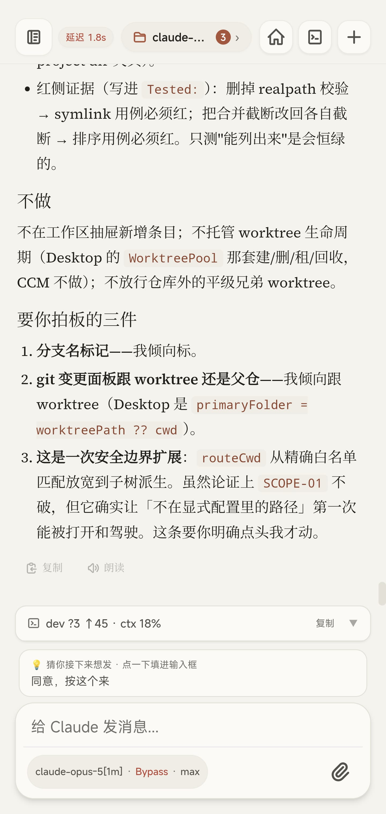

> **要你拍板的三件**
> 1. 分支名标记——我倾向标。
> 2. git 变更面板跟 worktree 还是父仓——我倾向跟 worktree。
> 3. **这是一次安全边界扩展**：`routeCwd` 从精确白名单匹配放宽到子树派生。虽然论证上 `SCOPE-01` 不破，但它确实让「不在显式配置里的路径」第一次能被打开和驾驶。这条要你明确点头我才动。

第三条是个真问题。它在说：这个改动会让一类原本进不来的路径变得可以被打开、被驾驶；虽然不违反既有的安全不变量，但攻击面确实变了，所以它停在这儿等我。上面还跟着一份「不做」清单——不在工作区抽屉新增条目，不托管 worktree 生命周期，不放行仓库外的平级兄弟 worktree。

我在手机上读完，点头，然后看它动手、跑测试、**发现自己的测试写错了**、修正、重跑。全程没开电脑。

这篇文章想说的就是这件事。**不是「在手机上看 Claude Code 干活」，是坐在电脑前跟它来回 vibe coding 的那一整套，原样搬到了手机上。**

## 它是什么

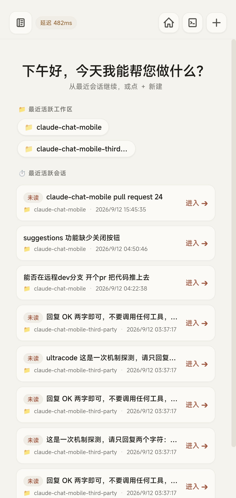

一句话：电脑上的 Claude Code，出门用手机接着干。链路很短：

```
手机 PWA / 浏览器 ↕ Socket.io ↕ CCM Server（本机） ↕ Claude Agent SDK ↕ 本机 claude CLI
```

手机只是**远程控制面**。真正执行代码、读项目、调工具、维护会话的，仍然是你电脑上那个 Claude Code——没有数据库，没有多租户，没有 SaaS 后端。

## 为什么「接着用」这三个字不好做

把输出显示到手机上，那叫日志查看器，两天就能写完。难的是 Claude Code 的交互形态本身：

它是**有状态的多轮对话**——上下文一断，后面全废。它中途会**停下来要审批**——那条 `rm` 执行不执行，你不点它就不动。它会**反问你**——两个方案选哪个，这里的判据你认不认。它可以被**打断、回退、分叉**。它还会在一轮里跑几十次工具调用，你得看得见它到底动了什么。

这些事情，随便哪一件在手机上做不利索，「接着用」就变成了「看一眼」。

远程桌面解决不了——在手机上操作终端是酷刑。官方的 Remote Control 是另一条路，能用、也接受它的账号与数据路径的话，用官方，零部署；但它按会话逐个开启远程，而且**要求 claude.ai 订阅 + 直连 `api.anthropic.com`**。你的 CLI 要是配了第三方网关、API key、Bedrock、Vertex，那条路整个不通。

## 一次完整的循环

下面这一轮是真的，截图按时间顺序。

### 坐下来

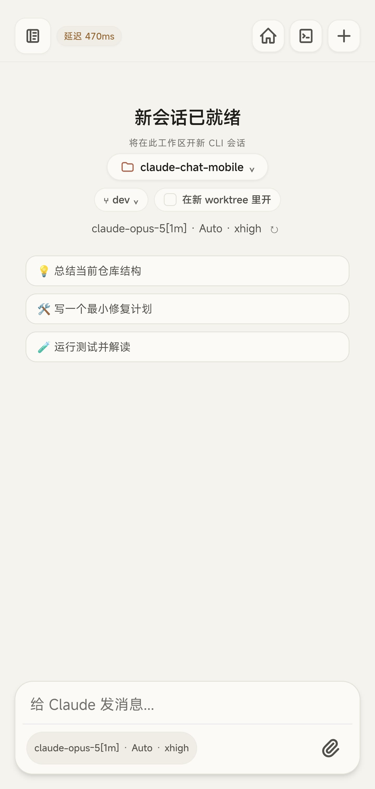

这一步等价于「打开终端、`cd` 到项目、敲 `claude`」：选工作区、选分支、要不要**开在一个新 worktree 里**（并行任务不互相踩），再定模型、思考强度、权限档。

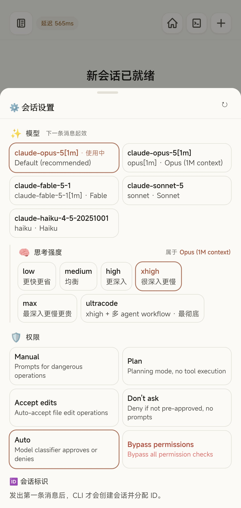

模型从 Opus、Fable、Sonnet 到 Haiku；思考强度 low 到 max，最高那档 ultracode 是 xhigh 加多 agent 编排；权限六档，从 Plan（只想不动手）到 Bypass。**下一条消息就起效**，不用重开会话——这点很重要，你经常是聊到一半才发现这活儿得换个档位。

### 让它想，然后读它怎么想


这是它给出的结论，带文件和行号：`logic/panel-state.js:343` 的判据要从「有 session」改成「有 cwd」；`app.js:7242` 那行显式调用得去掉，否则判据改了也会被压住；`tests/unit/logic-session.test.mjs:331-334` 三条断言里有两条会翻，得连同新判据一起重写。

最后一句是：「要我动手吗？改完我会跑 `npm run check` + `npm run test:unit`。」

**在手机上能完整读懂这个，和在电脑上没有区别。**这不是进度条，是它的推理过程——你要么认，要么在这儿掰扯。

### 拍板

然后就是开头那张「要你拍板的三件」。注意它下面那一条：

> 💡 猜你接下来想发 · 点一下填进输入框
> **同意，按这个来**

它预测了你大概率要说的下一句，点一下填进输入框。手机打字慢，这个功能在手机上的价值比在电脑上大得多。


斜杠命令也都在，包括你自己装的 skills——`/code-review`、`/simplify`、`/doctor`、`/loop`。

### 看它动手

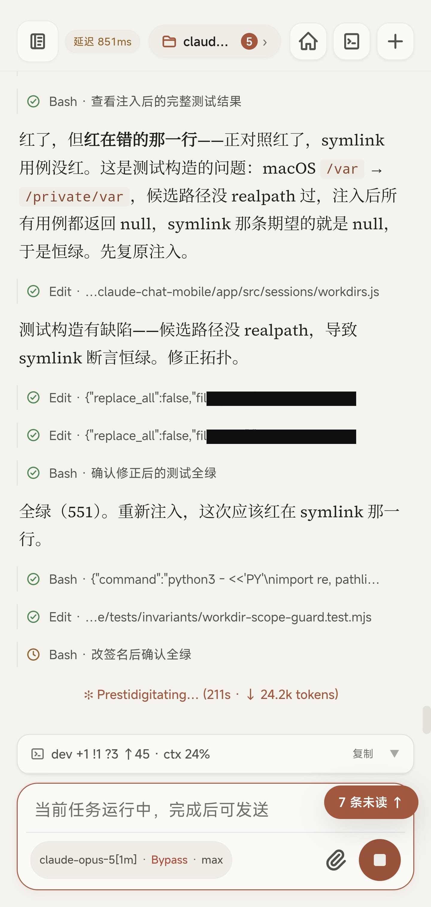

每次工具调用逐条可读：`Bash` 跑了什么、`Edit` 改了哪个文件。底下那行「当前任务运行中，完成后可发送」是在说它还在跑；右边「7 条未读」是别的会话有动静了。

### 它发现自己的测试是假绿

这段是我最想让你看的。

上面那张图里，它在做的事情是**变异测试**——故意把源码改坏，看测试会不会红。结果：

> 红了，但**红在错的那一行**——正对照红了，symlink 用例没红。这是测试构造的问题：macOS `/var` → `/private/var`，候选路径没 realpath 过，注入后所有用例都返回 null，symlink 那条期望的就是 null，于是恒绿。先复原注入。

然后它修测试构造、重跑确认全绿、**再把缺陷注入回去**，验证这次红的是对的那一行：


```
tests 551
pass  551
fail  0
```

> 全绿（551）。重新注入，这次应该红在 symlink 那一行。

一个**看着漂亮却永远不会变红**的测试，比没有测试更坏——它占着「这块有人守」的位置。它自己把这件事查出来了，而我当时在手机上。

### 看它到底改了什么


工作区文件能翻，`git diff` 能扫。回合结束还有一份文件变更汇总，带 ± 行数。长按消息可以**回退**——连工作区文件一起恢复到发出那条之前，并分叉出一个回到那一刻的新会话；也可以只**分叉**对话、不动文件。原会话两种都保留。

### 收尾：把版本发出去

循环的终点不是「改完了」，是「合并了、发出去了」。


这一轮跑的是完整发版流程：bump 版本号 → 推 dev → **等真的 CI 变绿** → 开发版 PR → 等 PR 检查 → 合并 → 在合并后的 HEAD 上打 tag → 建 Release。中间任何一步红了，脚本停在那儿保留现场，重跑时从断点接上。

底下「后台命令 N 个运行中」的每一条都能单独停掉。

## 这个循环能闭合，靠的是这几件事

### 同一份会话，不是两个会话

手机上开的会话，回电脑 `claude --resume` 能翻到；**终端里开的会话，手机上能看见、能接着驾驶**。会话记录的真相源始终是 `~/.claude/projects/` 下那些 jsonl，这个项目一条都不另存。

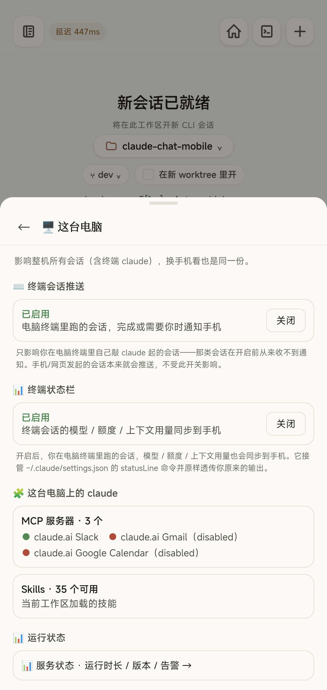

顺带，你在终端里自己敲 `claude` 起的会话，原本什么通知都收不到；这个开关打开之后，它们完成或需要你时也会推到手机上。

### 看得见余量，才敢在外面派长任务


底栏状态行展开是这样的：

```
claude-opus-5[1m] | effort max | claude-chat-mobile | dev | ctx 65% · left 345k/1.0m
5h 34% reset 1h45m | 7d 36% reset 4d16h25m
est $104.72 | total 2h07m | api 10h51m | lines +824/-173
```

**这一轮跑了两个多小时，改了 824 行，烧掉一百来美元。**这不是演示对话的量级。也正因为是这个量级，5 小时和 7 天的额度余量、上下文占用、预估花费必须在手机上看得见——看不见，你就不敢在外面开长任务，那这个循环就闭不上。

### 它卡住的时候你会知道

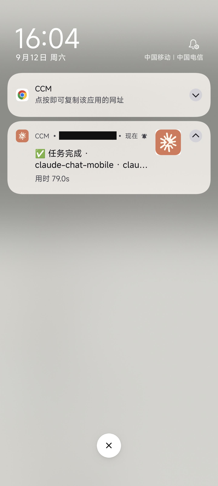

推送的分档判据不是「这条事件重不重要」，而是**「你此刻会不会看不到」**：审批、提问、后台任务完成**无条件推**，因为这三类都意味着有人在等一个动作；回合完成这类，只有当你确实开着这个会话看着，才不推。

判断「你在不在前台」不能拿 socket 连没连着当判据——手机切后台时 socket 常常还活着，那样判会让你收不到本该收到的通知。

### 你的模型配置照用


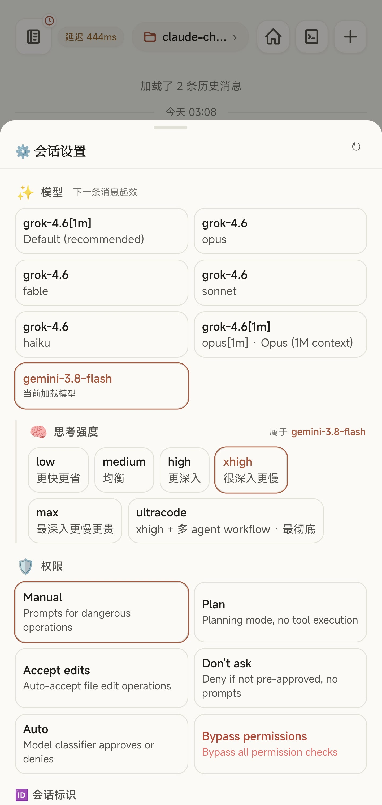

这两张里模型列表分别映射到了 grok 和 gemini，因为那台机器上的 `claude` CLI 就是这么配的。项目里有一条硬规则：

> 不关心 claude CLI 接的是哪个上游——官方订阅 / API key / Bedrock / Vertex / 第三方网关，一视同仁。**禁止任何 `ANTHROPIC_BASE_URL` 匹配、厂商白名单或上游探测**；唯一允许据以调整行为的信号是 CLI 自报的能力位，因为那是 CLI 说的、不是我们猜的。

### 几个仓库并行


哪个在跑、哪个有未读，一眼看见，标签一切就换。

## 安全边界

这一段必须说清楚，因为：

> **这是一个可以远程触达本机 Claude Code、并间接获得本机代码执行能力的入口。** 请把它当开发机远程控制工具，不是普通网页。

防线从外到内：令牌 → 可选的公网身份层 → 设备信任 → 工作区范围 → CLI 自己的权限规则 → Agent 审批。

**没有令牌就不启动**——不是降级为只读，是 server 直接拒绝启动，本机浏览器打开也一样，不存在「本地免鉴权」。**工作区显式放行**，文件和会话只能进配置好的目录。**新设备要批一次**：


已登录的设备上点「准入」就行，不用回电脑敲命令。

公网暴露前有自检：

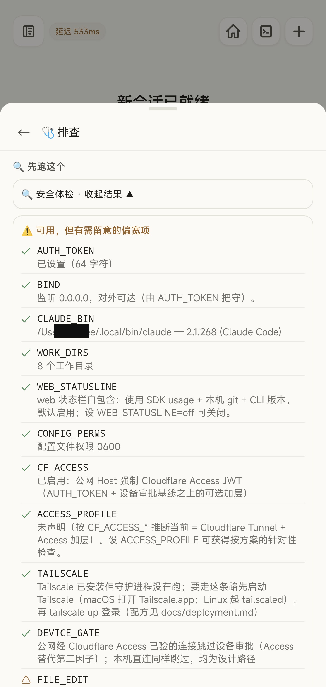

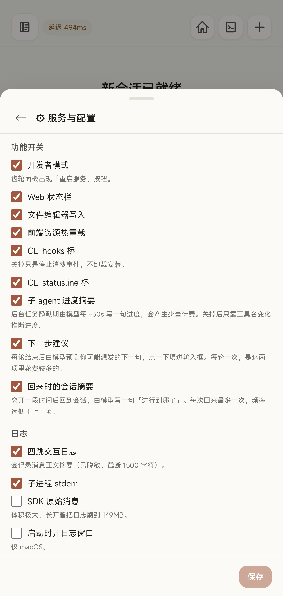

公网身份层我用的是 Cloudflare Access：

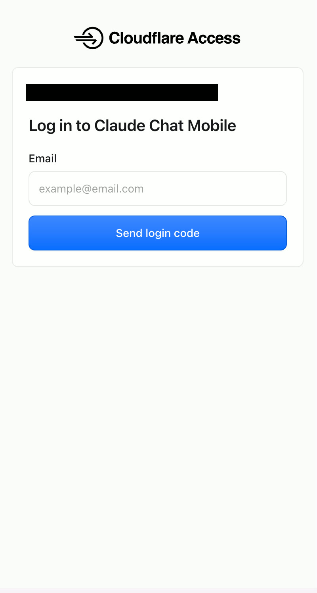

这里有个反直觉的行为，写文档时标了实测日期（2026-09-10）：

> ⚠ 「替代」是字面意义上的：经 Access 进来的连接**完全不查** `trusted-devices.json`，于是「已受信任的设备」那张表**管不到它们**——吊销一台经隧道进来的手机既不会断线也不会被拦。

Access 开着时它**替代**了设备审批这个第二因子，不是叠加。那为什么不把默认翻过来？因为翻过来更糟：已装好的用户升级后一重启，所有在用设备全被打回待审，而那时信任表里一台能用来批准的都没有，人被自己锁在门外。所以默认保持现状，要全路径生效的人显式设 `DEVICE_APPROVAL_SCOPE=all`。

## 它不能做什么

- **不是共享 TTY。**Web 端读的是已经落盘的会话记录，不是终端里正在刷的那块画面，也不能附着到正在跑的终端进程上。默认只读追平，要接管时再接管。
- **同一时刻只有一个驾驶端。**两端不会同时向同一个 Claude 进程输入，接管时会提示。
- **没网就是没网。**断线会自动重连并补齐期间的事件，但它不是一个能脱机用的工具。
- **不是多租户 SaaS。**每个实例就是单用户，鉴权通过后的权限，就是你本机跑 `claude` 那个账号的权限。

还有一句得写在前面，因为踩的人最多：

> **起服 ≠ 能聊天。** 令牌和设备审批只决定手机能不能进主壳；**主机终端里的 `claude` 能不能正常跑完一轮会话**，才决定手机上能不能真对话。

## 怎么装

需要 Node ≥ 20 和一个**本机已经能用的** `claude` CLI。项目不会替你安装或登录 Claude。

```bash
curl -fsSL https://github.com/Ike-li/claude-chat-mobile/archive/refs/heads/master.tar.gz | tar xz
cd claude-chat-mobile-master
npm ci --omit=dev && npm run setup && npm start
```

手机打开终端里打印的地址即可。首次从新设备进来要批一次，`node scripts/qr.js` 能把地址打成二维码，省得手输 64 位令牌。

---

第一个 commit 是 2026 年 6 月 27 日，到今天 **78 天、1076 个 commit**，日均 13.8，版本走到 v1.9.1。

这些数字本身不重要。重要的是这篇文章里每一张截图——那次拍板、那次变异测试、那次发版——**都是在手机上开发这个项目本身时截的**。工具造出来之后被用来造自己，这是我能给出的最好的验收。

开源，AGPL-3.0：**https://github.com/Ike-li/claude-chat-mobile**

有问题可以来 QQ 群 881200369。

> ⚠️ 群里千万别贴你的 `AUTH_TOKEN`、公网域名、完整的 `ccm.config.json` 或原始 `doctor` 输出——这些足以让人接管你的机器，而群聊历史对所有成员可见。

---
---

## 附一：图文对应表

| 位置 | 文件 | 源图 | 处理 |
| --- | --- | --- | --- |
| 封面 | `00-cover.png` | 用户提供首图 | 原样（1921×819） |
| 开场 · 要你拍板的三件 | `01-decide-three.jpg` | 1000033464 | 裁状态栏 |
| 它是什么 | `02-home.jpg` | 1000033477 | 裁状态栏 |
| 循环 · 坐下来 | `03-new-session.jpg` | 1000033500 | 裁状态栏 |
| 循环 · 坐下来 | `04-session-settings.jpg` | 1000033501 | 裁状态栏 |
| 循环 · 读它怎么想 | `05-review-table.jpg` | 1000033529 | 裁状态栏 |
| 循环 · 拍板 | `06-slash.jpg` | 1000033521 | 裁状态栏 |
| 循环 · 看它动手 | `07-tool-stream.jpg` | 1000033465 | 遮两行 Edit 的家目录路径 |
| 循环 · 测试假绿 | `08-tests-pass.jpg` | 1000033466 | 裁状态栏 |
| 循环 · 改了什么 | `09-files.jpg` | 1000033492 | 裁状态栏 |
| 循环 · 改了什么 | `10-changes.jpg` | 1000033493 | 裁状态栏 |
| 循环 · 发版 | `11-release-live.jpg` | 1000033487 | 裁状态栏 |
| 前提 · 同一份会话 | `12-this-computer.jpg` | 1000033509 | 裁状态栏 |
| 前提 · 看得见余量 | `13-statusline.jpg` | 1000033522 | 裁状态栏（花费数字保留） |
| 前提 · 卡住会知道 | `14-lockscreen-done.jpg` | 1000033518 | 遮推送来源域名 |
| 前提 · 网关照用 | `15-gateway-grok.jpg` | 1000033504 | 裁状态栏 |
| 前提 · 网关照用 | `16-gateway-gemini.jpg` | 1000033503 | 裁状态栏 |
| 前提 · 多仓并行 | `17-workspaces.jpg` | 1000033491 | 裁状态栏 |
| 安全 · 设备审批 | `18-device-request.jpg` | 1000033482 | 遮设备 ID / IP |
| 安全 · 自检 | `19-security-check.jpg` | 1000033517 | 遮家目录用户名 |
| 安全 · 配置 | `20-config.jpg` | 1000033515 | 裁状态栏 |
| 安全 · CF Access | `21-cfaccess.jpg` | 1000033479 | 遮完整域名 |

**本篇未用**（前一版用过、因主线改写移出）：锁屏失败通知、通知设置面板、等待授权页、设备信任列表、连接帮助页、旧版会话设置、服务状态面板。原图仍在 `~/Downloads/ccm/`。

## 附二：能力主张核查表（主张 → 证据）

> 锚点：主仓 `dev` @ `9e01187`（v1.9.1，2026-09-13）。
> 上一版核查表（`copy/moments-full.md`，锚 v1.4.0 / 2026-07-31）已整体失效：证据路径全是重构前的 `src/…`（现为 `app/src/…`），引用的 README 章节名亦已不存在。

| 文中主张 | 证据 |
| --- | --- |
| 定位、链路图、「手机只是远程控制面」 | `README.md` 开篇与「它是怎么工作的」 |
| 新会话可选工作区 / 分支 / 新 worktree / 模型 / 强度 / 权限档 | `README.md` 能力表「`claude` 起新会话」「`/model`、权限档、思考强度」两行；截图 `03`/`04` |
| 模型与强度下一条消息起效 | `README.md` 能力表同上行；截图 `04` 面板标注「下一条消息起效」 |
| 思考强度六档、权限六档 | 截图 `04` 面板枚举 |
| 工具调用逐条可读、回合末有变更汇总（± 行数） | `README.md` 能力表「看它到底改了什么」行；截图 `06` |
| 「下一步建议」点一下填进输入框 | 截图 `01` 底部；配置面板「下一步建议」开关（截图 `21` 同类面板） |
| 斜杠命令含已装 skills | `README.md` 能力表「`/` 斜杠命令」行；截图 `10` |
| 长按消息可回退（连文件）/ 分叉（只复制对话） | `README.md` 能力表「回退重来 / 另开一支」行 |
| 工作区文件浏览与 git 改动页 | `README.md` 能力表「`git diff` 扫一眼」行；截图 `08`/`09` |
| 发版流程 bump → 推 dev → 等真 CI → PR → 合并 → tag → Release，失败保留现场 | `CLAUDE.md`「分支纪律」；`scripts/release.sh` |
| 后台任务可单独停掉 | `README.md` 能力表「盯后台任务」行；截图 `11` |
| 会话真相源是 `~/.claude/projects/` 的 jsonl，CCM 一条不另存 | `docs/hard-rules.md` §1「不新增持久化层」 |
| 终端会话推送需显式开启 | 截图 `13` 面板说明 |
| statusline 含模型 / ctx / 5h 与 7d 额度 / 预估花费 | `README.md` 能力表「瞄一眼 statusline」行；截图 `12` |
| 推送按「会不会看不到」分档；审批/提问/后台任务完成无条件推 | `docs/architecture.md` L208–211 |
| 前台判据是 `client:presence` 而非 socket 连接状态 | `docs/architecture.md` L211 |
| 对模型通路零假设，禁止 BASE_URL 匹配与厂商白名单 | `docs/hard-rules.md` §1「对模型通路零假设」 |
| 官方 RC 需订阅 + 直连、按会话开启远程 | `README.md`「和官方 Remote Control 差在哪」对比表 |
| 多工作区、运行中与未读标记 | `README.md` 能力表侧栏行；截图 `17` |
| 六层安全分层 | `docs/hard-rules.md` §6 |
| 没有令牌不启动，任何绑定模式一律如此 | `README.md` 安全边界 2；`docs/hard-rules.md` §1「鉴权是启动前提」 |
| 工作区显式放行 | `README.md` 安全边界 3 |
| 新设备需批准，已登录设备可远程准入 | `README.md` 安全边界 4；`docs/architecture.md` 设备审批四入口 |
| CF Access 替代设备审批、吊销对隧道流量无效（2026-09-10 实测） | `docs/architecture.md` L158–160；`README.md` 安全边界 4 |
| 不翻默认的理由 | `docs/architecture.md` L160 |
| 非共享 TTY、不能 attach 活进程、只读追平 | `docs/architecture.md` L12–16、L71–77 |
| 同一时刻只有一个驾驶端 | `README.md`「它是怎么工作的」末段 |
| 断线重连补齐事件 | `README.md`「终端里的哪些事」节末 |
| 「起服 ≠ 能聊天」 | `README.md`「三步跑起来」块引用 |
| 每实例单用户、权限等同本机账号 | `README.md` 安全边界 1 |
| 78 天 1076 commit、日均 13.8、v1.9.1 | `git rev-list --count dev`、`git log --reverse`、`git tag` 实跑（2026-09-13） |
| 551 用例全绿、变异测试发现 symlink 断言恒绿 | 截图 `06`/`07`（`npm run test:invariants` 实跑输出与模型自述） |
| 「永不变红的测试比没有更坏」 | `CLAUDE.md` 测试章；`docs/testing.md` |
| 安装三条命令与前置条件 | `README.md`「三步跑起来」 |
| AGPL-3.0 | `LICENSE`；`package.json` |

**有意不写**（禁写清单，发布前逐条复核）：

- 实时镜像正在终端跑的活会话画面（本文写的是「读已落盘记录 / 只读追平 / 不能 attach」，并单列成「它不能做什么」第一条）
- 宣称可脱机使用（本文写的是「断线重连补齐事件，但没网就是没网」，并列入「它不能做什么」）
- 语音输入
- 拍照直传
- 多租户 / SaaS / 账号体系（只出现否定式）
- 防封号 / 藏时区 / 对抗官方 App
- 「CLI 有什么 Web 就有什么」绝对句
- 「中间层完全不改任何数据」绝对句

## 附三：排版建议（公众号编辑器）

1. **代码块**：statusline 那段、测试结果那段、安装命令建议截图化或用等宽字体加浅灰底，手机上会折行。
2. **长图**：配图已裁到 1440×3030，建议再手工裁掉与该段无关的部分。
3. **引用块**：文中有 6 处 `>` 引用（拍板三件、变异测试自述、模型通路硬规则、安全边界警告、CF Access 警告、起服≠能聊天），公众号里建议统一成同一种样式，它们是全文的骨架。
4. **封面**：`00-cover.png` 已是 2.35:1，可直接用作首图。
