# 电脑上的 Claude Code，手机也能接着用

> 微信公众号 · 2026-09-13 · 事实基线：主仓 `dev` @ `9e01187`（v1.9.1）
> 标题已定（2026-09-13）。封面：`img/00-cover.png`（1921×819 ≈ 2.35:1，公众号首图规格）


---

那天下午我不在电脑前。手机震了一下，锁屏上多出来一条：


> ✅ 任务完成 · claude-chat-mobile · 用时 79.0s

这条通知不是哪个云服务推给我的。是我自己电脑上跑着的那个 Claude Code，干完一轮活之后，推到我手机上的。

它能这么干，是因为我给它写了个手机端。这篇文章讲的就是这个东西——顺带说一件有点绕的事：**下面几乎每一张截图，都是我在手机上开发这个项目本身的时候顺手截的。**

## 一、它是什么

一句话：**电脑上的 Claude Code，出门用手机接着干。**


不是远程桌面，不是另外打包一个 Claude。链路很短：

```
手机 PWA / 浏览器 ↕ Socket.io ↕ CCM Server（本机） ↕ Claude Agent SDK ↕ 本机 claude CLI
```

手机只是**远程控制面**。真正执行代码、读项目、调工具、维护会话的，仍然是你电脑上那个 Claude Code——没有数据库，没有多租户，没有 SaaS 后端。你在终端里配好的一切（模型、网关、权限规则、MCP、skills），手机上直接沿用，因为压根就是同一个进程在干活。

会话记录也是同一份。手机上开的会话，回到电脑 `claude --resume` 能翻到；终端里开的会话，手机上能看见。

## 二、为什么要有这个东西

README 的第一句话就是起点：

> 离开电脑时最怕的不是看不到输出，是**它停在某个需要你的地方，白等一晚上**。

Claude Code 跑长任务的时候会停下来问你：这条 `rm` 要不要执行？这两个方案选哪个？你人在电脑前，一秒钟的事。你不在——它就一直等着。等你晚上回来，发现它三个小时前就卡在一个审批弹窗上了。

三个小时的电，白烧。

### 先说清楚：能用官方的，就用官方

Anthropic 自己有 [Remote Control](https://code.claude.com/docs/en/remote-control)。**能用官方、也接受它的账号与数据路径时，用官方**——零部署，这是默认推荐，我没打算跟它抢。

这个项目是给官方路径进不去、或者不接受那条控制面的人做的：

| | 官方 Remote Control | Claude Chat Mobile |
| --- | --- | --- |
| **模型通路** | 需 claude.ai 订阅 + 直连 `api.anthropic.com` | 你的 `claude` CLI 怎么配就怎么用——第三方网关 / API key / Bedrock / Vertex / 关了遥测，都行 |
| **控制面数据** | 会话 transcript 存到 Anthropic 服务器做跨设备同步 | 服务、transcript、设备信任、审计全在你机器上，局域网内可完全闭环 |
| **能看见什么** | 按会话逐个开启远程 | 放行工作区里的**全部**会话——终端开的、上周的、忘了开开关的，都可见可续 |
| **部署成本** | 零 | 自己跑一个 server |

有一句话我写在 README 里，这里也说一遍，免得被当成营销话术：

> 措辞边界：这不等于「数据绝不离开本机」——模型请求本来就由本机 `claude` CLI 按你现有配置发出。CCM 承诺的是**除此之外**不再多一条数据出口。

---

下面三个场景，是我真实用它的样子。

## 场景一：它卡住了，得让我知道

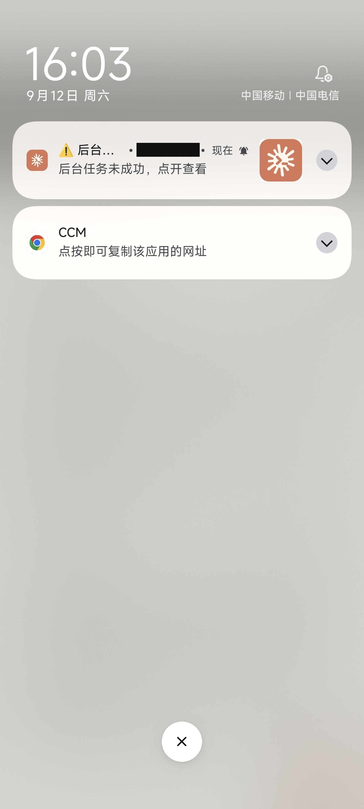

推送这件事看着简单，真正难的是**什么时候该闭嘴**。全推，你一天收几十条，很快就把通知关了；推少了，又回到"白等一晚上"。

我最后是这么分的档——注意判据不是"这条事件重不重要"，而是**"用户此刻会不会看不到"**：

- **审批、提问、后台任务完成：无条件推。** 这三类都意味着有人在等一个动作，而你此刻可能锁着屏，或者在别的 app 里。
- **回合完成、模型静默告警：只有当你确实正开着这个会话看着，才不推。**

第二条里有个坑，我踩过：**判断"你在不在前台"，不能拿 socket 连没连着当判据。** 手机切后台的时候 socket 常常还活着，拿连接状态判断，结果就是你该收到的完成通知收不到。真正的判据得是客户端自己上报的"我这个页面现在可见"。

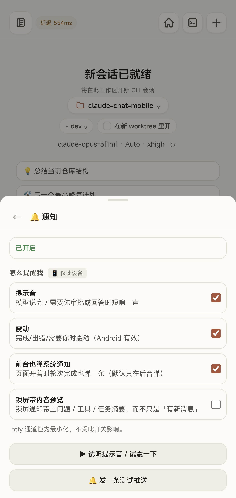

还有个更好玩的。Claude Code CLI 会把跑得久的**前台** Bash 命令也建模成一个 task，完成时走的是同一条通道。不过滤的话，你每跑一条几秒钟的命令，锁屏手机上就弹一条"后台任务完成"。所以代码里有一道专门的过滤，只认真正被放到后台的那种。

这种判据，猜是猜不出来的，只能撞一次。

## 场景二：新手机想连上来，可我不在电脑前

我换了台手机，想连上去。新设备打开页面是这样：

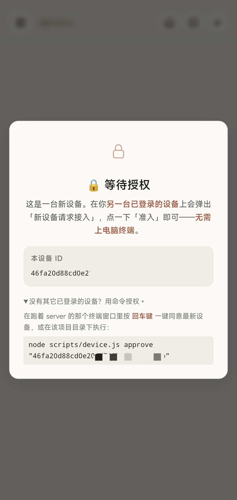

然后我掏出旧手机，顶栏已经在响了：

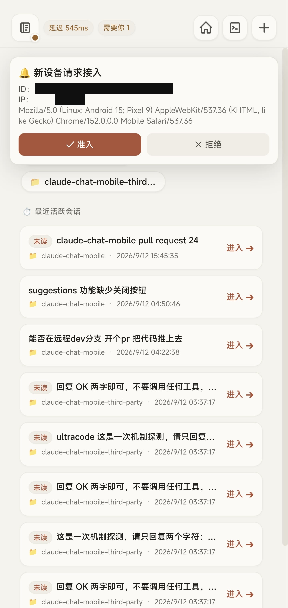

点一下「准入」，新手机那边立刻就进去了。**全程没碰电脑。**

这里的设计是：光有令牌不够。除了本机直连、以及已经过了公网身份层的路径，任何持正确令牌的新设备都还要被批一次。批准的入口有四个（手机上点、macOS 菜单栏点、终端敲回车、`node scripts/device.js approve`），事实源是一个 `trusted-devices.json`，谁批的都立刻生效。

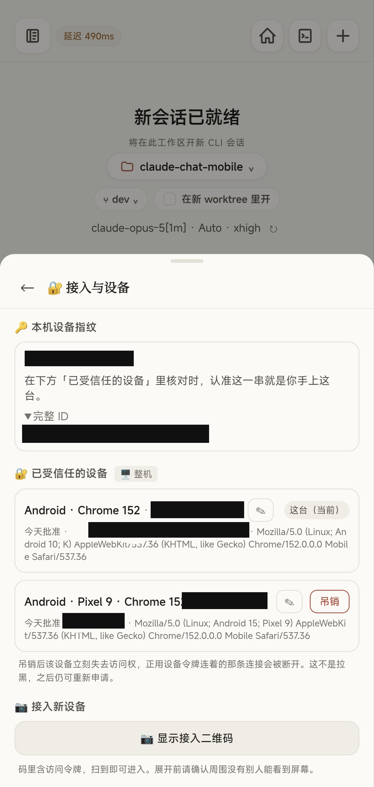

信任列表里可以随时吊销——吊销之后那台设备立刻失去访问权，正连着的连接会被断开。

顺带一个细节：上面那台设备的浏览器标识里写着 `Android 10; K`。不是我截错图，是 Chrome 现在会把机型信息冻结成字面量 `K`。所以**机型这东西在 Android 上多半拿不到，在 iOS 上永远拿不到**，指望靠机型分辨"哪台是我的手机"是行不通的，最后只能靠你自己给设备起的别名。

新设备接入还有个更省事的路子：老设备上调出接入二维码，新手机扫一下就进来了——64 位的令牌，手输一次你就明白为什么要做这个功能。

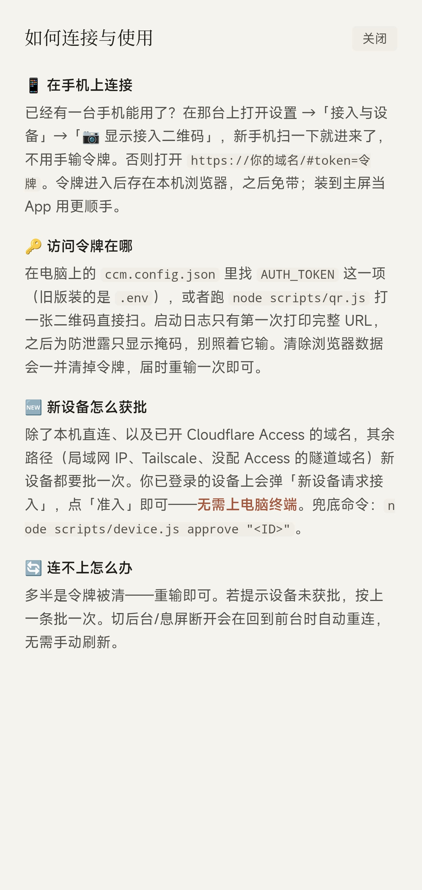

## 场景三：发版卡在 CI 上，我在外面把它跑完了

这是最能说明问题的一次。

那天我在外面，`v1.8.0` 的发版流程跑到一半——脚本的顺序是 bump 版本号 → 推 dev → **等真的 CI 变绿** → 开发版 PR → 等 PR 检查 → 合并 → 在合并后的 HEAD 上打 tag → 建 Release。中间任何一步红了，脚本就停在那儿保留现场。

于是我在手机上接着跑：

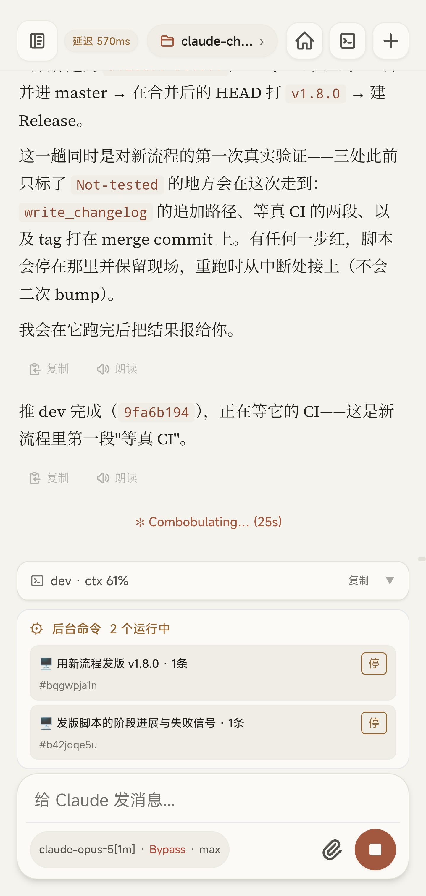

底下那个「后台命令 2 个运行中」是可以单独停掉某一个的。这一轮里我开了三个：

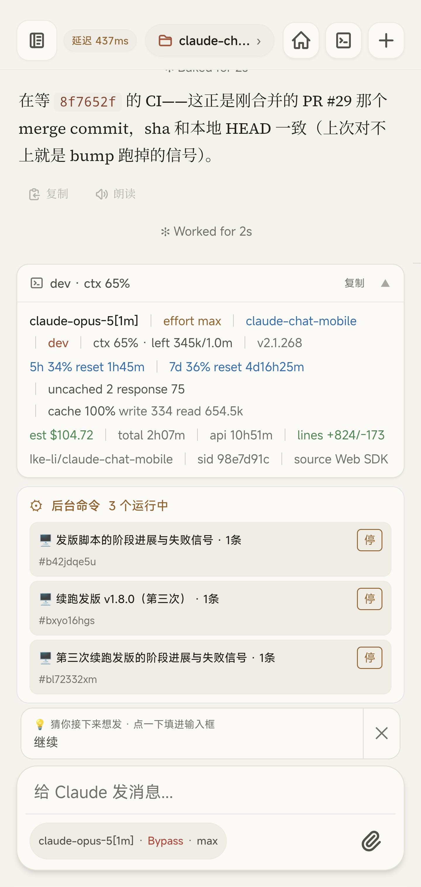

底栏那条状态行展开之后，信息量是这样的：

```
claude-opus-5[1m] | effort max | claude-chat-mobile | dev | ctx 65% · left 345k/1.0m
5h 34% reset 1h45m | 7d 36% reset 4d16h25m
est $104.72 | total 2h07m | api 10h51m | lines +824/-173
```

我把这段原样放出来，是因为它比任何形容词都说明问题：**这一轮对话跑了两个多小时，改了 824 行代码，烧掉一百来美元。** 这不是个演示 demo 里的玩具对话。

也正因为是这个量级，"额度还剩多少、这轮花了多少"必须在手机上看得见——看不见，你就不敢在外面派长任务。

代码审查的结论也能在手机上读，带文件和行号：

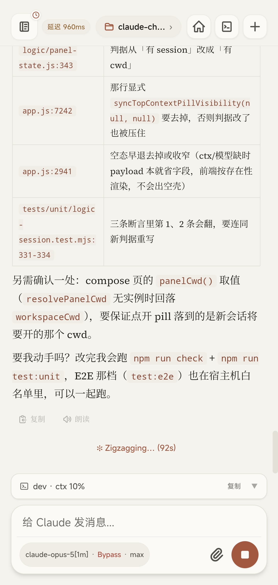

斜杠命令都在，包括你自己装的 skills：

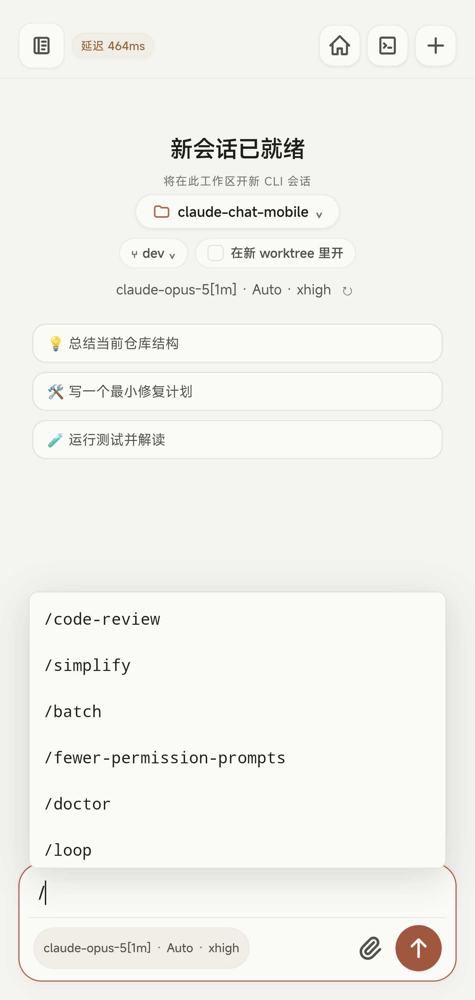

## 三、手机上到底能做多少

上面三个场景是骨架，下面是肉。原则很简单：终端里高频干的事，手机上得有对应的做法。

**模型、思考强度、权限档，随时切，下一条消息起效。**

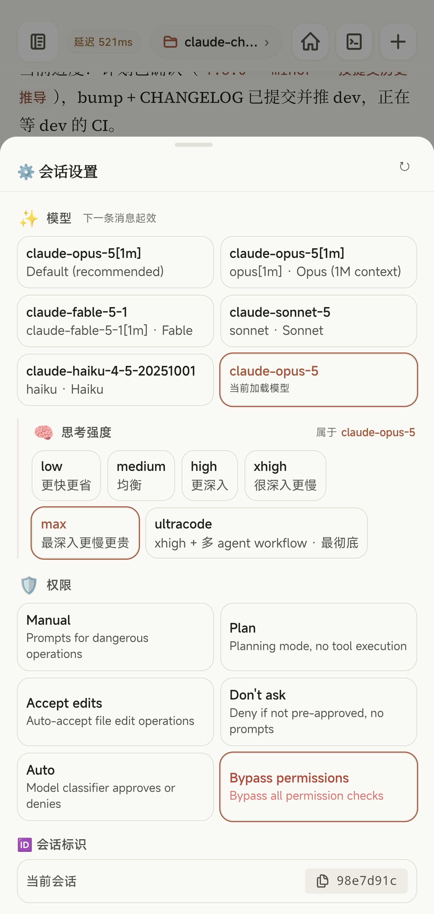

**第三方网关照样用。** 这一条是这个项目存在的主要理由之一。

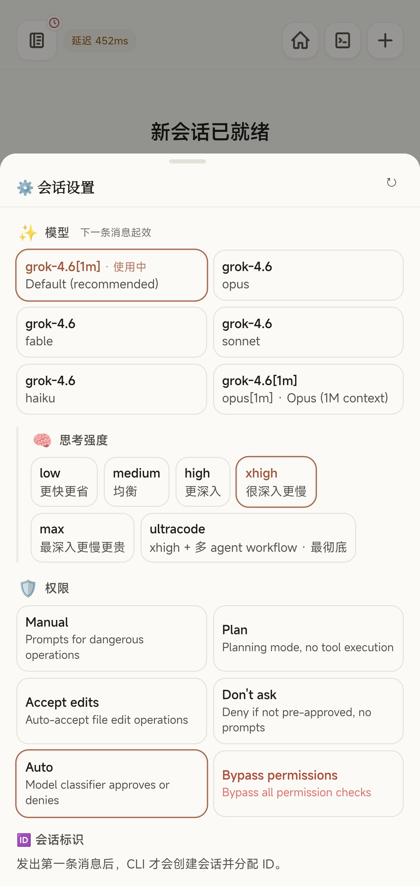 

这两张截图里，模型列表分别映射到了 grok 和 gemini——因为我那台机器上的 `claude` CLI 就是这么配的。项目里有一条写死的硬规则：

> 不关心 claude CLI 接的是哪个上游——官方订阅 / API key / Bedrock / Vertex / 第三方网关，一视同仁。**禁止任何 `ANTHROPIC_BASE_URL` 匹配、厂商白名单或上游探测**；唯一允许据以调整行为的信号是 CLI 自报的能力位，因为那是 CLI 说的、不是我们猜的。

官方 Remote Control 在网关 / API key 配置下整条路是不通的，而这个项目全功能可用。这就是它存在的主要理由之一。

**多个仓库并行，各自的会话分开管，谁有未读一眼看见。**

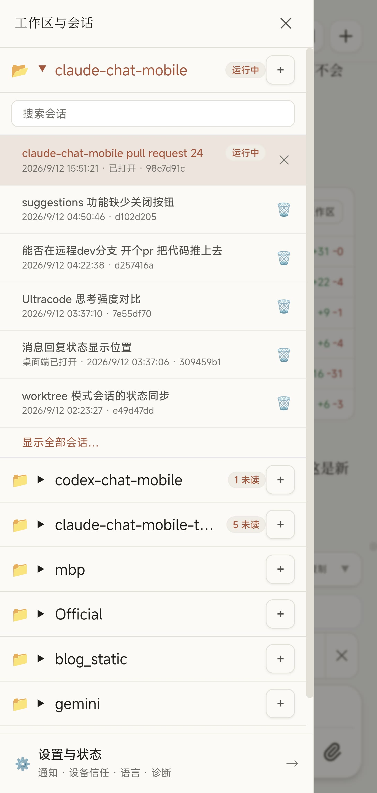

**文件和 git 改动。** 浏览工作区文件、看这一轮到底改了什么：


**终端里跑的会话，手机上也管得着。** 这里要说清楚边界：Web 端读的是已经**落盘的会话记录**，不是终端里正在刷的那块画面——它不是共享 TTY，也不能附着到正在跑的终端进程上。默认是只读追平，需要接管的时候再接管，同一时刻只有一个驾驶端。


顺带，终端里自己敲 `claude` 起的会话，原本是什么通知都收不到的；打开这个开关之后，它们完成或需要你时也会推到手机上。

## 四、为什么敢把它放到公网上

先把最重要的话放前面，README 里也是这么写的：

> **这是一个可以远程触达本机 Claude Code、并间接获得本机代码执行能力的入口。** 请把它当开发机远程控制工具，不是普通网页。

所以这一层做得比较用力。防线从外到内是：令牌 → 可选的公网身份层 → 设备信任 → 工作区范围 → CLI 自己的权限规则 → Agent 审批。

挑三条说：

**没有令牌就不启动。** 不是"没令牌降级为只读"，是 server 直接拒绝启动。任何绑定模式都一样——本机浏览器打开也要令牌，不存在"本地免鉴权"这回事。

**工作区得显式放行。** 文件、会话和相关操作只能进配置好的目录。装机向导在非交互模式下，如果发现要回落到整个家目录，会直接拒绝而不是"帮你选一个"。

**新设备要批一次。** 就是场景二那个。

装了个自检，公网暴露之前先跑一遍：


配置面板上每一项都写清楚了改了会怎样，包括那些"开了等于关掉某道防线"的：


### 一个我自己产品里的反直觉行为

公网这一层我用的是 Cloudflare Access，扫码进去先过一道邮箱验证码：


然后我发现一件事，写进文档时标了实测日期（2026-09-10）：

> ⚠ 「替代」是字面意义上的：经 Access 进来的连接**完全不查** `trusted-devices.json`，于是「已受信任的设备」那张表**管不到它们**——吊销一台经隧道进来的手机既不会断线也不会被拦。

也就是说，Access 开着的时候，它**替代**了设备审批这个第二因子，而不是叠加在上面。你在设备列表里点"吊销"，对走隧道进来的那台手机是不起作用的。

那为什么不把默认值翻过来？因为翻过来会更糟：已经装好的用户升级后一重启，所有在用设备全被打回待审——而这时候信任表里一台能用来批准的设备都没有，人就被自己锁在门外了。所以默认保持现状，想要全路径生效的人显式设 `DEVICE_APPROVAL_SCOPE=all`。

我把这段贴出来，是因为我觉得**一个项目肯把自己的反直觉行为写进文档并标上实测日期，比列十条功能更能说明它的成色**。

出了问题能查：服务状态、告警、安全日志、重启记录都在面板里。

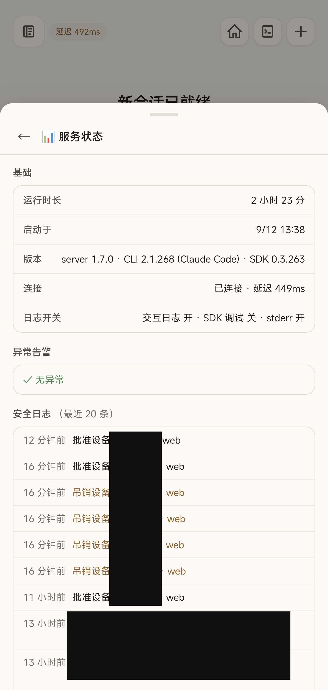

## 五、它是怎么长出来的

第一个 commit 是 2026 年 6 月 27 日，消息写的是「把本机 claude CLI 投送到手机」。到今天 9 月 13 日，**78 天，1076 个 commit**，日均 13.8 个。版本走到了 v1.9.1。

按月份摊开：6 月 21 个，7 月 567 个，8 月 214 个，9 月 274 个。

这些数字本身不重要。重要的是这张图——手机上跑完整的测试套件，551 个用例全绿：

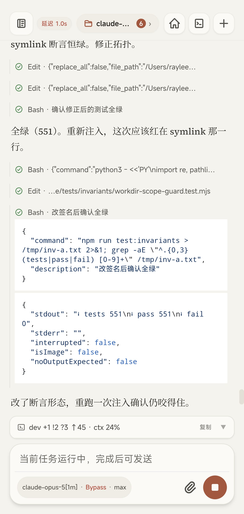

以及那次我在手机上读到的评审结论、拍板的三个决定、批准的那台新设备、跑完的那次发版。

**工具造出来之后被用来造自己**，这是我能给出的最好的验收。一个只在演示视频里好用的东西，我自己是不会天天拿它干活的。

## 六、怎么装

需要 Node ≥ 20 和一个**本机已经能用的** `claude` CLI。项目**不会**替你安装或登录 Claude。

```bash
curl -fsSL https://github.com/Ike-li/claude-chat-mobile/archive/refs/heads/master.tar.gz | tar xz
cd claude-chat-mobile-master
npm ci --omit=dev && npm run setup && npm start
```

手机打开终端里打印的地址就行。首次从新设备进来要批一次，`node scripts/qr.js` 能把地址打成二维码，省得手输 64 位令牌。

有一条我必须写在最前面，因为踩的人最多：

> **起服 ≠ 能聊天。** 令牌和设备审批只决定手机能不能进主壳；**主机终端里的 `claude` 能不能正常跑完一轮会话**，才决定手机上能不能真对话。

这两件事是分开的。手机上收到 CLI 透传的具体报错，反而是好消息——说明链路本身通了。两种情况都收敛到同一个动作：先在主机终端把 `claude` 聊通一轮，再从手机重试。

## 最后：它不是什么

- 不是手机远程桌面
- 不是重新打包的另一个 Claude
- 不是帮你托管的多租户 SaaS——每个实例就是单用户，鉴权通过后的权限，就是你本机跑 `claude` 那个账号的权限

开源，AGPL-3.0：

**https://github.com/Ike-li/claude-chat-mobile**

有问题可以来 QQ 群 881200369。

> ⚠️ 群里千万别贴你的 `AUTH_TOKEN`、公网域名、完整的 `ccm.config.json` 或者原始的 `doctor` 输出——这些东西足以让人接管你的机器，而群聊历史对所有成员可见。

---
---

## 附一：图文对应表（发布前核对用）

| 文中位置 | 文件 | 源图 | 处理 |
| --- | --- | --- | --- |
| 封面 | `00-cover.png` | 1000033524 | 原样 |
| 开场 | `01-lockscreen-done.jpg` | 1000033518 | 遮推送来源域名 |
| 一·它是什么 | `02-home.jpg` | 1000033477 | 裁状态栏 |
| 场景一 | `03-lockscreen-fail.jpg` | 1000033513 | 遮域名 |
| 场景一 | `04-notify-settings.jpg` | 1000033506 | 裁状态栏 |
| 场景二 | `05-device-wait.jpg` | 1000033481 | 裁状态栏 |
| 场景二 | `06-device-request.jpg` | 1000033482 | 遮设备 ID / IP |
| 场景二 | `07-devices-panel.jpg` | 1000033508 | 遮指纹 / 完整 ID / 两台设备网络行 |
| 场景二 | `08-help-connect.jpg` | 1000033519 | 裁状态栏 |
| 场景三 | `09-release-live.jpg` | 1000033487 | 裁状态栏 |
| 场景三 | `10-statusline.jpg` | 1000033522 | 裁状态栏（**花费数据保留**） |
| 场景三 | `11-review-table.jpg` | 1000033529 | 裁状态栏 |
| 场景三 | `12-slash.jpg` | 1000033521 | 裁状态栏 |
| 三·能做多少 | `13-session-settings.jpg` | 1000033489 | 裁状态栏 |
| 三·第三方网关 | `14-gateway-grok.jpg` | 1000033504 | 裁状态栏 |
| 三·第三方网关 | `15-gateway-gemini.jpg` | 1000033503 | 裁状态栏 |
| 三·多工作区 | `16-workspaces.jpg` | 1000033491 | 裁状态栏 |
| 三·文件 | `17-files.jpg` | 1000033492 | 裁状态栏 |
| 三·终端会话 | `18-this-computer.jpg` | 1000033509 | 裁状态栏 |
| 四·安全 | `19-security-check.jpg` | 1000033517 | 遮家目录用户名 |
| 四·安全 | `20-config.jpg` | 1000033515 | 裁状态栏 |
| 四·CF Access | `21-cfaccess.jpg` | 1000033479 | 遮完整域名 |
| 四·可观测 | `22-service-status.jpg` | 1000033510 | 遮设备 ID 列与会话 UUID |
| 五·怎么长出来 | `23-tests-pass.jpg` | 1000033466 | 裁状态栏 |

**未采用**：1000033464 / 465 / 479(480) / 488 / 490 / 493 / 500 / 501 / 502 / 505 / 511 / 512 / 514 / 516 / 520 / 530。其中 `488` 与 `10-statusline` 重复（花费数字取了更完整的 522），`480` 是验证码页（与 `479` 重复且含邮箱），其余为同类面板的另一状态。

## 附二：能力主张核查表（主张 → 证据）

> 锚点：主仓 `dev` @ `9e01187`（v1.9.1，2026-09-13）。
> 上一版核查表（`copy/moments-full.md`，锚 v1.4.0 / 2026-07-31）已整体失效：证据路径全部是重构前的 `src/…`、`public/js/…`（现为 `app/src/…`、`app/public/js/…`），且引用的 README 章节名「适用场景 / 安全模型 / 运行方式 / 前置条件」在当前 README 中均已不存在。故本表另起，不复用旧行。

| 文中主张 | 证据 |
| --- | --- |
| 定位「电脑上的 Claude Code，出门用手机接着干」 | `README.md` 开篇副标题 |
| 链路图与「手机只是远程控制面」 | `README.md`「它是怎么工作的」 |
| 痛点「停在某个需要你的地方，白等一晚上」 | `README.md`「终端里的哪些事，手机上也能做」首句 |
| 官方 Remote Control 四行对比 + 措辞边界 | `README.md`「和官方 Remote Control 差在哪」整节（含块引用） |
| 推送按「会不会看不到」分档；审批/提问/后台任务完成无条件推 | `docs/architecture.md` L208–211；`README.md` 能力表第三行 |
| 前台判据是 `client:presence` 而非 socket 连接状态 | `docs/architecture.md` L211 |
| 前台 Bash 被建模成 task，需靠 `is_backgrounded` 过滤 | `docs/architecture.md` L228 |
| 新设备需批准；四个批准入口；`trusted-devices.json` 为事实源 | `README.md` 安全边界 4；`docs/architecture.md` L166–173 |
| 吊销立即断开正连着的连接 | 截图 `07-devices-panel` 面板内说明文字 |
| Android 机型被冻结成 `K`、iOS 永远拿不到，只能靠别名 | `docs/architecture.md` L195–198 |
| 接入二维码免手输令牌 | `README.md`「三步跑起来」；`scripts/qr.js` |
| 发版流程 bump → 推 dev → 等真 CI → PR → 合并 → 打 tag | `CLAUDE.md`「分支纪律」；`scripts/release.sh` |
| 后台任务可单独停掉 | 截图 `09/10`，任务横幅「停」按钮 |
| statusline 展开含模型 / ctx / 5h 与 7d 额度 / 预估花费 | `README.md` 能力表「瞄一眼 statusline」行 |
| 模型 / 思考强度 / 权限档随时切，下一条起效 | `README.md` 能力表「`/model`、权限档、思考强度」行 |
| 对模型通路零假设，禁止 BASE_URL 匹配与厂商白名单 | `docs/hard-rules.md` §1「对模型通路零假设」 |
| 官方 RC 在网关 / API key 下不可用，本项目全功能可用 | 同上行末句 |
| 多工作区、全部会话可见可续、未读标记 | `README.md` 对比表第三行、能力表新建/侧栏行 |
| Web 读已落盘 transcript，非共享 TTY、不能 attach 活进程 | `docs/architecture.md` L12–16、L71–77 |
| 同一时刻只有一个驾驶端 | `README.md`「它是怎么工作的」末段；`docs/architecture.md` §单驾驶员 |
| 终端会话推送需显式开启，开启前收不到通知 | 截图 `23-this-computer` 面板说明 |
| 六层安全分层 | `docs/hard-rules.md` §6 分层摘要 |
| 没有 Token 不启动，任何绑定模式一律如此 | `README.md` 安全边界 2；`docs/hard-rules.md` §1「鉴权是启动前提」 |
| 非交互装机回落家目录直接拒绝 | `docs/hard-rules.md` §1「可选功能由用户开关，不猜」 |
| CF Access 开着时替代设备审批，吊销对隧道流量无效（2026-09-10 实测） | `docs/architecture.md` L158–160；`README.md` 安全边界 4 |
| 不翻默认的理由：翻了会把在用设备全打回待审 | `docs/architecture.md` L160 |
| 78 天 1076 commit，日均 13.8，v1.9.1 | `git rev-list --count dev`、`git log --reverse`、`git tag` 实跑（2026-09-13） |
| 551 个用例全绿 | 截图 `21-tests-pass`（`npm run test:invariants` 实跑输出） |
| 安装三条命令与前置条件 | `README.md`「三步跑起来」 |
| 「起服 ≠ 能聊天」 | `README.md`「三步跑起来」块引用 |
| 单用户、权限等同本机账号 | `README.md` 安全边界 1 |
| AGPL-3.0 | `LICENSE`；`package.json` |

**有意不写**（禁写清单，发布前逐条复核）：

- 实时镜像正在终端跑的活会话画面（本文写的是「读已落盘记录 / 只读追平 / 不能 attach」）
- 离线可用（Service Worker 只做推送，不做离线缓存）
- 语音输入
- 拍照直传
- 多租户 / SaaS / 账号体系（本文只出现「不是多租户 SaaS」的否定式）
- 防封号 / 藏时区 / 对抗官方 App
- 「CLI 有什么 Web 就有什么」绝对句（本文写的是「终端里高频干的事，手机上得有对应的做法」）
- 「中间层完全不改任何数据」绝对句（本文写的是「同一个进程在干活 / 同一份会话记录」）

## 附三：排版建议（公众号编辑器）

1. **表格**：公众号编辑器对 markdown 表格支持差。官方对比表（4 行）建议转成图片或改排成"官方：… ／ 本项目：…"两段对照；核查表不进正文。
2. **代码块**：statusline 那段和安装命令建议用等宽字体 + 浅灰底，手机上会折行，可考虑截图化。
3. **长图**：所有 `.jpg` 已裁到 1440×3030。公众号会自动缩放，但建议再手工裁掉与该段无关的下半部分，读者不会放大看。
4. **封面**：`00-cover.png` 为 1086×1448 竖版，公众号首图需 2.35:1，建议从中截取上半部标题区域另做一张横版。
