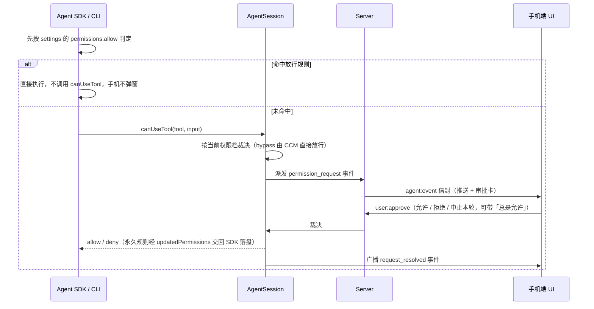

# AgentSession
> 长驻 SDK query、权限闸、环形缓冲、中断与运行时切档。

- **Part**: 第四部分 · 核心实现
- **Reading Time**: ~14 min
- **Estimated Tokens**: ~1711

---

`AgentSession`（位于 `app/src/agent/agent.js`）是驱动 Agent SDK 双向流的核心引擎：负责输入队列调度、权限拦截挂起、SDK 消息向契约信封的映射，以及本地事件环形缓冲。

## 核心职责

- 持有一条到 @anthropic-ai/claude-agent-sdk 的 streaming input 双向长会话（支持基于原有 sessionId 执行 resume）。
- 将 SDK 吐出的原始异步消息流（Chunks / Actions）通过 map() 规范化为标准 agent:event 信封并广播。
- 通过 canUseTool 拦截点实现细粒度的工具放行、挂起与手机卡片审批，维护活跃的审批台账。
- 处理前端的主动中断（interrupt），以及运行时切换模型、权限档与思考强度（ effort ）。

## 忙碌判定与看门狗

 在途轮次计数。仅由发送（+1）与结果返回/主动中断/撤回成功（-1）闭环结算，严禁双扣。  
    bgTasks  活跃后台子代理/任务表。后台任务运行期间，在途轮次的看门狗有豁免，防止被无输出超时误杀；豁免有 45 分钟上限（dev 已合入，尚未发版）。  
    isBusy  `pendingTurns > 0` 或存在未完成的后台任务，或挂起未决的工具审批/用户提问。  
    idle hang watchdog  若 `pendingTurns > 0` 但长达 `IDLE_TIMEOUT_MS` 没有任何新事件产生，触发看门狗强制中断。  
 

## 事件信封与 2000 条环形缓冲

- 标准信封格式： { seq, epoch, sessionId, instanceId, cwd, ts, type, payload } 。
- 分配 seq： 除瞬态进度（ task_progress ）外，每个正式事件分配单调递增的 seq ，写入容量为 2000 条的内存环形缓冲区。
- 离线追平： 客户端断网重连后，仅需上报 sync:since { lastSeq } ，服务端即可从环形缓冲快速补发漏掉的事件。

## SDK 消息映射矩阵 (map)

| SDK 原始消息类型 | CCM 契约事件类型 | 前端渲染与行为 |
| --- | --- | --- |
| content_block_delta (text) | text_delta | 文本流式输出，追加至最新气泡 |
| content_block_delta (thinking) | thinking_delta | 思考流输出，渲染于可折叠思考面板中 |
| tool_use | tool_use | 渲染工具调用卡片（展示入参与执行态） |
| tool_result | tool_result | 回填工具执行结果（支持大输出折叠展示） |
| canUseTool (未放行) | permission_request | 挂起等待，向移动端投递审批交互卡片 |
| AskUserQuestion | question | 在输入区域上方弹出单选/多选题交互面板 |
| result | result | 轮次收尾，回传用量；网关不流式时由它的全文兜底正文 |

## 权限闸 (canUseTool) 执行时序

`dontAsk` 档不走这张图：白名单外的调用在 SDK 那一层直接拒绝，不调用 `canUseTool`。审批台账只记裁决，挂着的审批遇到指纹不符、超过 `APPROVAL_TTL_MS` 或进程重启，一律不可再执行。

## 思考强度 (effort) 运行时热修改

切换具体档（`low` … `max`，以及 `ultracode`）与 `auto` 时，服务端经控制请求 `applyFlagSettings({effortLevel})` 直接下发到活跃进程，不销毁重建实例，回合进行中也能切；`ultracode` 实际下发 `xhigh` 并打开 `Settings.ultracode`。只有切回「没指定」没有对应的控制请求，要 dispose + resume。`auto` 档 dev 已合入，尚未发版。
