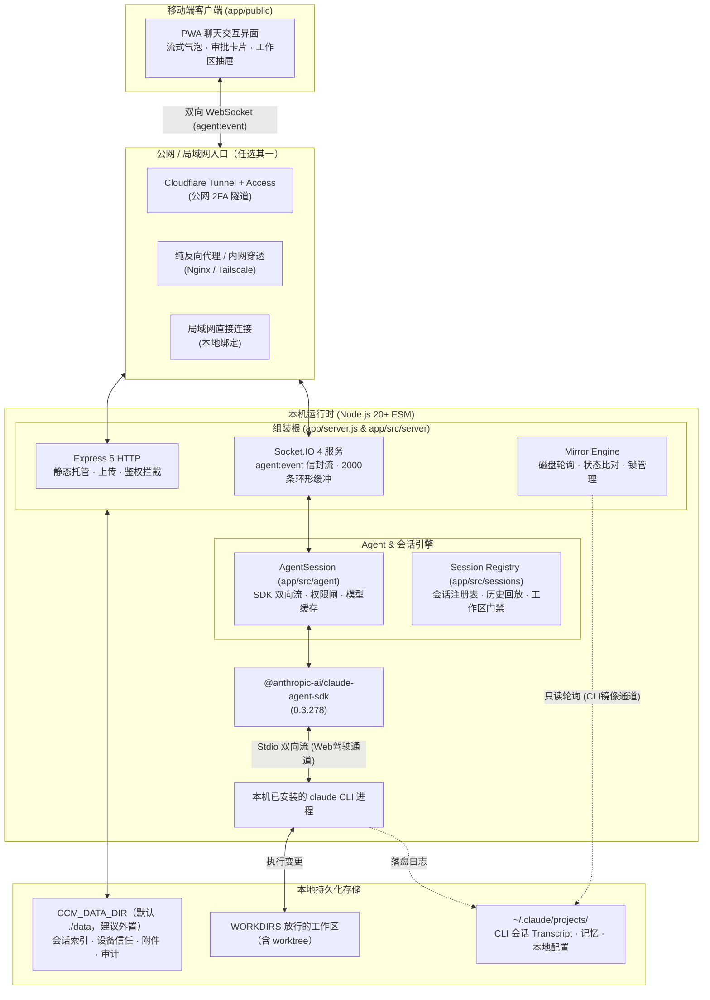

# 系统架构
> 从手机 UI 到本机 CLI 的分层与数据路径。

- **Part**: 第一部分 · 认识项目
- **Reading Time**: ~14 min
- **Estimated Tokens**: ~2117

---

系统是一条默认严格受控的双通道转发体系：手机 UI 通过 WebSocket 与本机 Server 通信，双向流驱动 Agent SDK 交互，同时与终端 CLI 磁盘 Transcript 保持只读镜像同步。

## 双通道分层架构

## 后端领域模块划分

| 领域目录 | 职责定位 | 核心模块与管辖边界 |
| --- | --- | --- |
| app/src/server/ | 组装根 (Sink) | Express HTTP、Socket.IO 信封组装、实例生命周期（Instance Manager）、镜像引擎接线 |
| app/src/agent/ | Agent 交互与驱动 | SDK 会话长驻、审批生命周期与存储、单驾驶员镜像锁状态判定、运行时 flag 设置 |
| app/src/sessions/ | 会话与工作区 | sessions.json 注册表、Transcript 历史反序列化与 catchUp 补发、工作区白名单 |
| app/src/auth/ | 鉴权与安全门 | 单用户 Token 验证、CF Access JWT 校验、设备指纹 TOFU 审批流、IPv6 /64 限速桶 |
| app/src/files/ | 文件服务 | 工作区路径白名单闸、多层路径遍历防护（FILES-1）、附件上传与安全预览 |
| app/src/ops/ | 运维与外部集成 | ccm.config.json 结构化解析、服务自检（doctor）、智能推送抑制、Statusline 桥接 |
| app/src/shared/ | 底层叶子工具 | protocol.js 双向契约真相源、安全路径计算、串行写盘保证， 严禁反向依赖其他后端域 |

模块间的边界由 `tests/gates/check-import-boundaries.js` 实施硬闸保护。任何违反「前后端隔离」、「shared 是叶子」、「server 是唯一组装根」的代码均会被门禁直接拦截。

## 双通道通信与单驾驶员保证

为保证 Web 端与本机终端不同时向同一会话写入导致 Transcript 分叉，系统实施严格的「单驾驶员模型」：

1. Web 驾驶通道（双向流）。 由 Web 发起的交互直接进入 SDK query，流式接收 Agent 事件，通过 agent:event 信封（包含 seq/epoch/cwd 等）进入 2000 条环形缓冲并下发前端。
2. CLI 终端驾驶通道（只读镜像）。 当检测到用户正在终端直接操作该会话时，Web 端退化为只读镜像模式（通过轮询磁盘 Transcript 增量追平状态），前端输入框切换为「终端会话运行中」并上锁。
3. 接管与锁释放。 终端回合结束并经过静默判定后锁释放；发送前若 transcript 有外部增长，先 dispose 旧实例再 resume 吸收。终端仍在跑时也可以显式续接，但要过一道写明分叉风险的确认框，且不会停止终端进程。

## 两处架构脆弱点

> **WARNING:** 脆弱点一：项目根路径解析 — app/src/** 模块计算仓库根路径必须上溯三层（app/src/server/app.js 与 app/src/shared/data-dir.js）。少算一层会导致配置文件和持久化数据目录被意外创建到 app/ 内部，且无系统级报错。

> **WARNING:** 脆弱点二：macOS 服务模板与解析字符串对齐 — desktop/launchd/server.plist.template 中的启动命令 exec   app/server.js 必须与 app/src/ops/service-units.js 解析常驻进程后缀的代码逐字保持严格一致，否则服务面板的 repo / node 恒为 null，且没有任何报错。

## 前端架构分层

- app/public/js/app.js ：顶层编排器，负责全局 Socket 挂载与状态同步。
- app/public/js/app/* ：按业务域拆分的模块工厂（如 event-dispatch.js 、 message-renderer.js 、 drawer.js 、 settings.js ），采用 Context 注入；新状态进这里，不再挂进 app.js 顶层。
- app/public/js/logic/* ：零依赖纯函数集合（数据进、数据出），不触碰任何 DOM、Window 或全局 Socket，直接在 Node.js 单测与浏览器零构建复用。
- app/public/js/canonicalize.js ：前后端共用的指纹规范化唯一共享模块。
