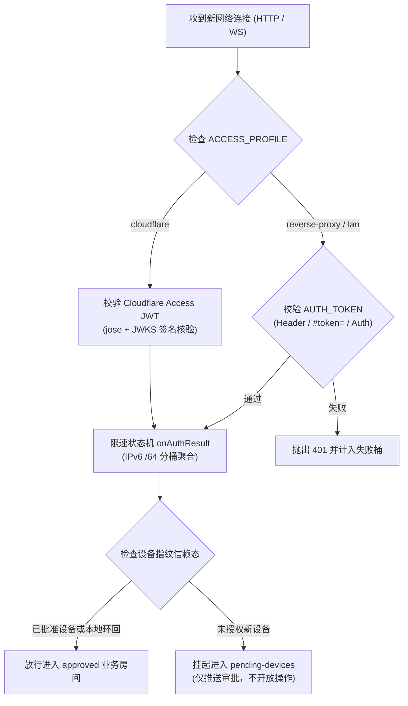

# 鉴权与设备信赖
> AUTH_TOKEN、CF Access、限速、设备指纹 TOFU。

- **Part**: 第四部分 · 核心实现
- **Reading Time**: ~12 min
- **Estimated Tokens**: ~1276

---

系统鉴权采用严格的纵深防御：Token（或 Access 边缘 JWT）证明客户端知晓通信密钥，而设备指纹 TOFU 机制则证明「持有该 Token 的物理设备已经过机主显式授权」。单凭 Token 无法突破未受信任设备的隔离防线。

## 绑定模式与网络暴露控制

| 配置状态 | 监听绑定地址 | 网络可达性与安全保证 |
| --- | --- | --- |
| AUTH_TOKEN 为有效串 | 0.0.0.0 （全接口） | 局域网直连与公网反代/隧道均可正常路由 |
| 未配置或留空 | 127.0.0.1 （仅环回地址） | 手机与外部隧道物理不可达，杜绝无鉴权暴露 |

## 鉴权流程与多层校验机制

## 反向代理陷阱与 ACCESS_PROFILE 判据

> **CRITICAL / DANGER:** 防范反代 IP 坍塌陷阱 — 任何将公网流量通过本地反代（如 Nginx、Caddy、FRP、SSH 端口转发）直连 127.0.0.1:3000 的拓扑，都会导致客户端对端 IP 坍塌为 127.0.0.1，从而导致设备审批门被静默跳过。

为消除该隐患，系统采用三候选配置：

- cloudflare ：适用于 Cloudflare Tunnel 场景，公网有 Access 2FA 严格兜底。
- reverse-proxy ： 一等支持路径 。强制要求显式配置 TRUSTED_PROXY （如配置反代服务器 IP）后才采信 X-Forwarded-For ，防止外部伪造客户端来源；同时要求使用强随机 Token。
- lan ：纯私网直连，只采信直接 Socket 对端 IP。

## 设备信赖（TOFU 机制）与审批流

- $CCM_DATA_DIR/trusted-devices.json ：已受信任设备列表（持久化设备指纹与签名 Token）。
- $CCM_DATA_DIR/pending-devices.json ：等待机主审批的新设备队列。
- 本机免审批： 仅本机真实环回（ 127.0.0.1 / ::1 ）可跳过设备门直接放行。
- 命令行审批入口： 在电脑终端可随时通过 node scripts/device.js list | approve <ID> | deny <ID> 审查并批准手机接入。

## 防暴力尝试与限速保护

系统内置共享限速状态机（位于 `app/src/auth/rate-limiter.js`）：

- 统一管控： HTTP 端点（含 /health 、 /metrics 、 /push/* ）与 WebSocket 握手共用限速池。
- IPv6 聚合防护： 将同一 /64 地址段聚类到单个限速桶，彻底瓦解利用海量动态 IPv6 绕过锁定的手段。
- 渐进式退避与锁定： 连续尝试失败后触发阶梯式指数退避，达到硬阈值后予以锁定。本机来源与外部来源告警严格区分，绝不在控制台制造假警报。
