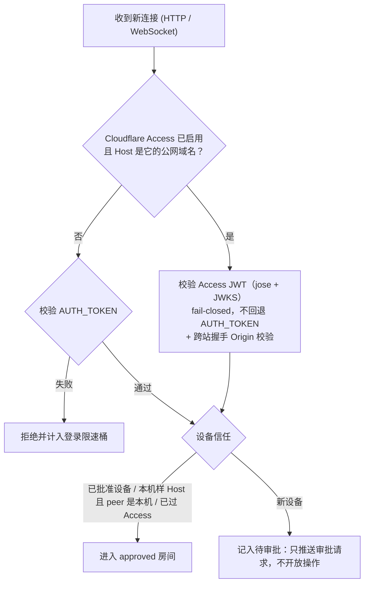

# 鉴权与设备信赖
> AUTH_TOKEN、CF Access、限速、设备指纹 TOFU。

- **Part**: 第四部分 · 核心实现
- **Reading Time**: ~12 min
- **Estimated Tokens**: ~1644

---

鉴权是纵深的两层：令牌（或 Cloudflare Access 的边缘 JWT）证明客户端知道密钥；设备信任证明「持有令牌的这台设备已被主机所有者显式批准过」。只凭令牌进不了未受信任的设备。

## 监听地址与网络暴露

`AUTH_TOKEN` 是启动前提：缺令牌时 `resolveBindPlan` 在 listen 之前就拒绝启动，不存在「未设令牌就降级绑本机」的路径。监听面由 `BIND_MODE` 决定：

| BIND_MODE | 实际监听 | 适用 |
| --- | --- | --- |
| 不设（默认）/ lan | 0.0.0.0 | 绝大多数情况：同 WiFi 的手机可直连，隧道 / 反代也能落到本机端口 |
| loopback | 127.0.0.1 | 自己用 SSH -L 、Tailscale Serve 或反代转发，不想让端口出现在局域网上 |
| custom + BIND_HOST | 指定地址（ :: 为 IPv6 双栈） | 只想在某一块网卡上监听 |

## 鉴权流程

鉴权分支由 `app/src/auth/auth-strategy.js` 按 Host 决定，核心不依赖任何具体 IdP。`ACCESS_PROFILE` 不参与这个判定，它只是给 doctor 与手机端安全体检用的声明。

## 本机免审批的判据与反代陷阱

设备审批不会只凭 socket 对端是 loopback 就跳过：server 还会检查 Host。只有「对端是本机」且「Host 是本机样的」同时成立，才免审批。

- 按 Host 路由的入口 （cloudflared、配了 server_name 的 nginx）：对端虽然是 loopback，但公网请求带的是公网 Host，仍要设备审批。
- 纯 TCP 转发 （ ssh -R 、frp tcp、socat）：不按 Host 路由，而 Host 是客户端自己填的头，远程来客发 Host: localhost 就能凑齐两个条件。TCP 层面区分不了真本机浏览器和转发进来的连接，所以用这类方式暴露时请设 DEVICE_APPROVAL_SCOPE=all 并重启。
- DEVICE_APPROVAL_SCOPE=all 是覆盖全部路径的总开关，经 Cloudflare Access 与本机样 Host 进来的也要批一次。此后本机浏览器首次也要批准。

## 设备信任与审批

- $CCM_DATA_DIR/trusted-devices.json ：已受信任的设备。
- $CCM_DATA_DIR/pending-devices.json ：等待批准的新设备。
- $CCM_DATA_DIR/device-profiles.json ：设备元数据（机型、浏览器、别名），让多台同为「Android」的设备可以分辨。
- 批准渠道： node scripts/device.js list | approve <ID> | deny <ID> ；在跑 npm start 的终端里按回车批准最新的新设备；macOS 菜单栏；或另一台已信任设备上弹出的「新设备请求接入」。前三条不读任何网络判据。
- 吊销： 手机「设置」与菜单栏都能吊销；吊销后，已连着的连接会失权。经 Access 进来的连接不受这张表管辖，除非 DEVICE_APPROVAL_SCOPE=all 。
- 反直觉的失败方向： trusted-devices.json 瞬时读失败时保留内存里上一份可用的信任表，避免本机被一次抖动锁在门外。

## 防暴力尝试与限速

限速状态机在 `app/src/auth/rate-limiter.js`：

- 统一口径： HTTP 端点与 WebSocket 握手的拒绝语义一致，限速时告诉用户还要等多久。
- IPv6 按 /64 归桶 ，堵住轮换源地址绕过。
- 默认不采信转发头： 反代后面所有公网客户端共用一个桶； TRUSTED_PROXY=loopback 才按 loopback 反代追加的 X-Forwarded-For 末跳分桶。
- 只挡鉴权口： 鉴权通过后 handler 抛出的 500 不计入限速；本机来源的锁定不说成「有人在暴力尝试」。
