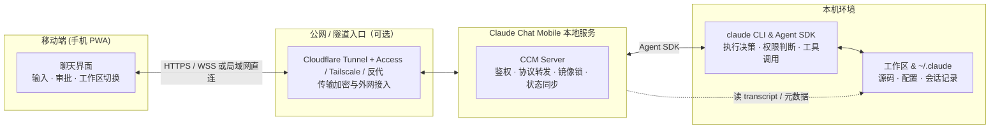

# 职责边界
> 做什么、不做什么；与 CLI / 云 / SaaS 的分界。

- **Part**: 第一部分 · 认识项目
- **Reading Time**: ~8 min
- **Estimated Tokens**: ~2394

---

为项目确定边界，价值往往大于堆叠功能。明确「不做什么」，是防止项目滑向失控复杂度的核心防线。

## 产品边界（改这些等于换产品）

以下各条出自产品仓 `docs/hard-rules.md` 第 1 节，其中多条是 2026-09-01 维护者确认后固化进去的：

| 规则 | 说明 |
| --- | --- |
| 终端等价 | 在手机上打字与在电脑前对 claude 打字效果一样；CLI 有什么 Web 就有什么 |
| 单用户 = 主机所有者 | 没有多用户或租户隔离；鉴权通过就等于本机启动 claude 的那个账号的权限 |
| 不是远程桌面 / 共享 TTY / 多租户托管 | 不附着终端的 stdin / stdout |
| 对模型通路零假设 | 不关心 claude CLI 接的是官方订阅、API key、Bedrock / Vertex 还是第三方网关；不匹配 ANTHROPIC_BASE_URL 、不设厂商白名单、不探测上游，唯一据以调整行为的是 CLI 自报的能力位 |
| 不新增持久化层 | 消息的真相源永远是 CLI 的 transcript，CCM 一条都不存；新增持久化必须同时满足「claude 侧没有这个概念」与「不能从 transcript 重建」，缓存类必须能随时删 |
| 鉴权是启动前提 | 没有 AUTH_TOKEN 就不启动，任何绑定模式都一样，本机浏览器也要令牌 |
| 公网入口：一条基线、一个受管加层 | 基线是令牌 + 逐设备审批，对所有拓扑相同；Cloudflare Access 是可选加层；产品受管的第三方进程只有 cloudflared ，Tailscale、WireGuard、反代一等支持但不受管 |
| 不替用户决定怎么后台运行 | 启动只有两条入口：headless 终端 npm start ，与 macOS 桌面端 CCM.app；macOS 之外不做官方常驻适配 |
| 可选功能由用户开关，不猜 | 桌面控制台、两个 CLI 桥、推送等默认全关，装机向导逐项问；非交互模式下会动全局的项缺省关，会扩大攻击面的回落直接拒绝 |

## 系统核心职责：做什么

- 移动端友好的终端等价界面。 流式输出、Markdown 与代码高亮、工具调用卡片、 AskUserQuestion 交互、审批卡。
- 会话生命周期与双向同步。 复用本机 CLI 的 transcript（ ~/.claude/projects/ ），支持 Web 发起会话、续接历史会话、切换工作区、中断、 /rewind 与分叉；与终端之间守单驾驶员模型。
- 人机权限审批。 Agent 调用白名单外的工具时，推送审批请求，手机上一键允许、拒绝或中止本轮。
- 工作区保护与安全浏览。 在显式配置的 WORKDIRS 内浏览、检索文件与查看 git 改动，杜绝路径穿越。
- 自托管基础设施。 结构化配置、启动自检（doctor）、离线推送、跨设备已读状态同步。

## 立场上不做的方向

- 多租户、RBAC、按用户隔离数据： 违背 n=1 自托管前提。真要做，先改 hard-rules 的立场，而不是局部打补丁。
- SaaS 或托管服务： 项目自己不运营任何中继或云端；公网入口由用户自选，CCM 承诺的是「模型请求之外不再多一条数据出口」。
- 重新实现 Agent 状态机与编排层： 直接依托官方 Agent SDK 与本机 CLI，功能先看 CLI 怎么做。
- 无鉴权的 HTTP 数据端点： /health 、 /metrics 、历史回显都过鉴权。
- 插件机制： 2026-08-14 否决；认证策略虽已抽成接口，但仍在仓内、受全部门禁约束。扩展走 CLI 原生的 MCP 与 Skills。

## 已评估不做的技术债（hard-rules §5）

| ID | 内容 | 决定 |
| --- | --- | --- |
| AD-5 | 按（会话，连接）粒度的镜像锁， readonly_changed 定向下发 | 不做。已知代价：两台设备同时看不同会话时，会话 B 的 mirror_state 可能误解锁正在看 A 的那一端 |
| SP-10 | busy→idle 吸收窗口的完整闭合（前端 uuid 幂等 + live 记 uuid） | 不做。已知代价：本地回合收尾的吸收窗口里撞进来的终端写入可能被吞，需切会话重载 |
| OQ-09 | 审批时延之类的「人机 / 价值」埋点遥测 | 拒绝；管道健康指标走 /metrics |
| UP-1 | 让 Web 端的内置斜杠命令像终端那样 inline 跑 | 做不到：CLI 判据是「宿主有没有 ReportFindings 工具」，SDK 宿主没有，所以恒 fork。等上游开口子 |
| DT-1 | 在仓库里放编译好的 CCM.app 供下载 | 不做：下载来的 app 必带 quarantine，首次打开必撞 Gatekeeper；公证要付费开发者账号，对自托管工具不成比例 |

重开条件：产品明确放弃 n=1，或「一人多机看不同会话」成为常态痛点；或有可测复现，并愿意承担 AD-5 / SP-10 的全链路改动。

## 与相邻系统的分工

 真实的任务执行者，工具执行与权限判定的最终决定权在它。  
    公网入口  `cloudflared` 是产品唯一受管的第三方进程（桌面端可安装、启停）；Tailscale、其他加密隧道与反代只给文档配方和 doctor 检测，产品不装、不起、不保活。  
    Web Push / ntfy  只做异步唤醒，通道不可用不影响主流程。
