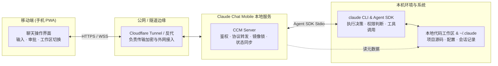

# 职责边界
> 做什么、不做什么；与 CLI / 云 / SaaS 的分界。

- **Part**: 第一部分 · 认识项目
- **Reading Time**: ~8 min
- **Estimated Tokens**: ~1804

---

为项目确定边界，其价值往往大于堆叠功能。明确产品「坚决不做什么」，是防止项目滑向失控复杂度的核心防线。

## 产品定位与产品宪法 C1–C5

Claude Chat Mobile 遵循明确的自托管产品宪法（见 `docs/hard-rules.md`）：

 
    C1 
#### 严格单用户 (n=1)

单实例单用户。通过鉴权的请求等价于物理坐在终端前的机主，不设立租户隔离或多账号概念。
 
    C2 
#### 数据不出本机

模型 API Token、会话记录与开发源码绝不经过任何第三方托管平台或中心云中继。
 
    C3 
#### 继承原生权限体系

完全复用本机 `claude` CLI 的已有配置（`settings.json`）与 MCP 规则，不发明并行的权限孤岛。
 
    C4 
#### 单驾驶员防分叉

任意时刻同一会话只允许终端或 Web 之一持有写入锁，通过只读镜像与锁流转彻底杜绝数据分叉。
 
    C5 
#### 终端行为等价性

CLI 有的功能 Web 端无缝对齐；CLI 放弃的复杂性 Web 坚决不自造轮子。
 
 

## 系统核心职责：做什么

- 提供移动端原生友好的终端等价界面。 实时流式输出渲染、Markdown 与代码语法高亮、工具调用过程卡片、用户确认提问（AskUserQuestion）交互。
- 会话生命周期与双向同步。 复用本机 CLI 的 Transcript 记录（ ~/.claude/projects/ ），支持 Web 端发起会话、继续历史会话（ resume ）、工作区切换与中断。
- 安全闭环的人机权限审批。 当 Agent 尝试执行白名单外的危险工具（如执行命令、写敏感文件）时，推送审批请求并在移动端提供一键同意/拒绝。
- 本地工作区保护与安全浏览。 在显式配置的 WORKDIRS 白名单内安全浏览、检索项目文件与查看 Git 变更，杜绝路径穿越。
- 自托管基础设施服务。 结构化配置管理、启动自检（doctor）、智能离线推送与跨设备已读状态同步。

## 明确不做的技术债清单

| 编号 | 决议不做的方向 | 架构理由与考量 |
| --- | --- | --- |
| AD-1 | 多租户、RBAC 角色权限与按用户数据隔离 | 违背 n=1 自托管核心。引入租户会严重破坏单用户与本机 CLI 的映射边界，带来数倍无收益复杂度。 |
| AD-2 | 云端托管代理或中心化 SaaS 服务 | 代码和会话是用户核心隐私，架构设计上只允许直连或点对点隧道连接。 |
| AD-3 | 重新实现 Agent 状态机与 LLM 编排层 | 直接依托官方 Agent SDK。自造 Agent 调度不仅极易滞后于官方演化，还会破坏工具执行契约。 |
| AD-4 | 开放免鉴权的网络数据端点 | 即使是 /health 、 /metrics 或静态状态检查，也一律过鉴权网关拦截，杜绝信息侧漏。 |
| AD-5 | 全端端到端加密（E2EE）离线推送 | 推送仅作为唤醒信号；真实正文拉取依然走 WebSocket 双向受控通道，避免引入重型加密握手协议。 |
| AD-6 | 自造插件系统与动态运行包管理 | 插件出仓库会导致静态类型与安全门禁体系全面失明，扩展统一使用 CLI 原生的 MCP 与 Skills。 |

## 与相邻系统的分工分界

 真实任务执行者，拥有工具执行与全局权限判定的最终决定权。  
    Cloudflare / 反代  外部网络打通与证书接入层，CCM 自身不负责动态管理 tunnel 守护进程。  
    Web Push / ntfy  仅提供异步通知唤醒功能，通道不可用不影响主流程的正常运转。
