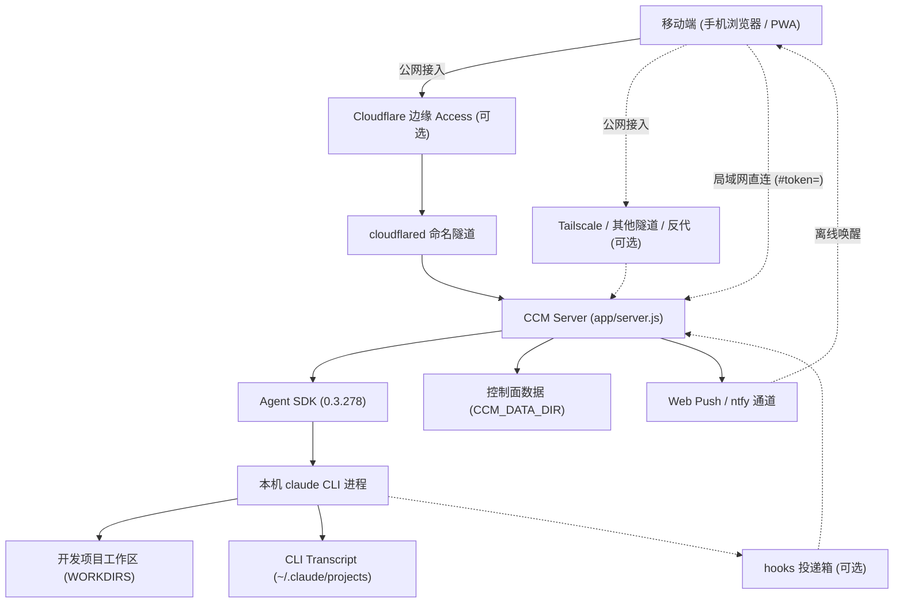

# 外部集成
> Agent SDK、claude CLI、Cloudflare、推送通道。

- **Part**: 第五部分 · 数据与集成
- **Reading Time**: ~10 min
- **Estimated Tokens**: ~1745

---

外部依赖恪守「做桥梁而不做中心」：不承接多租户账户体系，不替代本机 CLI，每一层都有明确的分工边界。

## 外部集成分工矩阵

| 外部集成 | 做什么 | 不做什么 |
| --- | --- | --- |
| Claude Agent SDK + 本机 claude CLI | 双向流 query() 、事件映射、权限回调；SDK 会话按工作区目录加载 CLI 的 user / project / local 三层 settings，沿用 CLAUDE.md 、MCP、Skills 与 Hooks | 不重造 Agent 循环；不自建工具放行清单；不托管登录凭据 |
| 模型通路 （官方订阅 / API key / 第三方网关 / Bedrock / Vertex） | 配置属于 claude CLI，不属于本项目。第三方网关推荐写在 CLI settings 文件的 env 块（工作区 .claude/settings.local.json 或 ~/.claude/settings.json ），按工作区目录生效，macOS 桌面端拉起的常驻服务也认；headless 也可在启动 server 的 shell 里 export | 对模型通路零假设：不匹配 ANTHROPIC_BASE_URL 、不设厂商白名单、不探测上游；唯一据以调整行为的是 CLI 自报的能力位（如 rate_limits_available ）。 ccm.config.json / .env 里的 ANTHROPIC_* 启动期剥除并点名 |
| Cloudflare Tunnel + Access | 固定公网域名与 2FA；边缘签发身份 JWT。开着时它管的公网 Host 改认 Access 身份，替代 AUTH_TOKEN ，缺省也替代设备审批。产品受管的第三方进程只有 cloudflared | 不是硬依赖： CF_ACCESS_* 三项留空即整层关闭，server 零改动 |
| Tailscale / 其他加密隧道 / 自建反代 | 不经 Cloudflare 的公网入口，Tailscale 为推荐路径（自带 HTTPS） | 一等支持但不受管：只给文档配方、向导提示与 doctor 检测，不装、不起、不保活 |
| web-push （VAPID） | 浏览器推送。审批、提问、后台任务完成无条件推；回合完成与网关静默告警在有前台可见连接时才抑制。正文默认最小化，可在设置里开锁屏内容预览 | 未配置时优雅缺席，不阻断对话。Android 的 Chromium 系浏览器经 Google FCM 投递（中国大陆网络下订阅那一刻要代理，宿主机要长期能访问 Google）；iPhone（Safari 16.4+ 且已添加到主屏幕）走 Apple 的推送服务；不想依赖 Google 就用 ntfy |
| ntfy （HTTP 订阅通道） | server 一行 POST 到 ntfy，手机装 ntfy app 订阅 topic 收锁屏通知；适合 iOS 局域网 http 这类 Web Push 用不了的场景 | 正文恒最小化，但标题带工作区目录名与会话标题且明文经第三方：请自托管，或用私密 topic 加 NTFY_TOKEN |
| CLI statusline bridge （可选） | Web 只读查看终端正在运行的会话时，同步 CLI 的模型、思考强度、上下文、成本与额度 | 显式安装才写 ~/.claude ：包装已有的 statusline 命令，未配置 statusline 时拒绝；卸载按 manifest 恢复原命令 |
| CLI hooks bridge （可选） | 终端回合的 Stop / Notification 写入受限文件投递箱 ~/.claude/ccm/hooks-v1/ ，server 即时消费，把「回合结束 / 需要你」从 2.5 秒轮询变成即时信号 | 只追加自己的 hook 条目；server 不在线时只落盘、静默退出，不阻断 CLI；设 CLI_HOOKS_BRIDGE: false 可暂停消费。磁盘 transcript 仍是真相源 |

## 系统生态链路图

## 关键生产依赖

- @anthropic-ai/claude-agent-sdk ：dev 基线 0.3.278 （最新发布版 v1.12.1 为 0.3.263）。
- express (v5) · socket.io (v4) · compression ：HTTP 与 WebSocket 服务基础。
- jose (v6)：JWT 校验，零外部 C 绑定依赖。
- web-push ：RFC 8291 / 8292 标准的推送协议实现。
- 前端第三方库全部本地自托管（ app/public/vendor/ ），运行期零外部 CDN 依赖。
