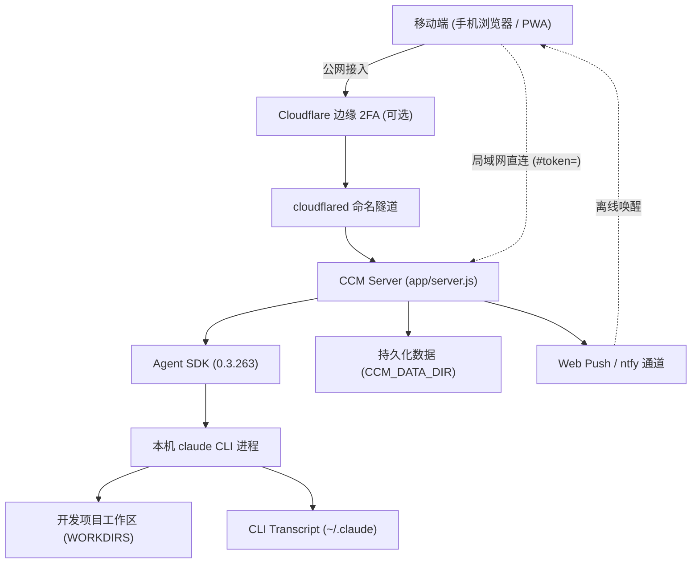

# 外部集成
> Agent SDK、claude CLI、Cloudflare、推送通道。

- **Part**: 第五部分 · 数据与集成
- **Reading Time**: ~10 min
- **Estimated Tokens**: ~958

---

外部依赖恪守「做桥梁而不做中心」的准则：不承接多租户账户体系，不替代本机 CLI，每一层系统都有极其明确的分工边界。

## 外部核心依赖分工矩阵

| 外部集成组件 | 核心职责（做什么） | 严格禁区（不做什么） |
| --- | --- | --- |
| Claude Agent SDK + 本机 claude CLI | 提供双向流 query() 、事件映射、权限拦截回调；自动继承本机 settings.json 、MCP 工具、自定义 Skills 与 Hooks | 不重造 Agent 内部循环；不设立独立的工具放行清单；不自行托管独立登录凭据 |
| Cloudflare Tunnel + Access | 提供固定公网安全域名与 2FA 身份认证；在边缘向 CCM 传递经签名的身份 JWT | 不替代应用级 AUTH_TOKEN ；不侵入业务内部的细粒度操作鉴权 |
| web-push (标准 VAPID 协议) | 原生浏览器推送：审批弹窗、用户提问与长任务完成通知 | 未配置时优雅降级，不阻断核心对话；不传输完整的复杂正文 |
| ntfy (HTTP 订阅通道) | 极简外部推送：直接通过 HTTP POST 派发通知，适合纯局域网或无法使用 Web Push 的场景 | 未配置时完全关闭；不作为核心数据信道 |

## 系统生态链路图

## 关键生产依赖概览

- @anthropic-ai/claude-agent-sdk （当前基线 0.3.263 ）：与 CLI 保持同源驱动与最新特性支持。
- express (v5) · socket.io (v4) · compression ：高吞吐低延迟的 WebSocket 与 HTTP 服务基础。
- jose (v6)：轻量且安全的 JWT 校验引擎，零外部 C 绑定依赖。
- web-push ：基于 RFC 8291 / 8292 标准的离线推送协议实现。
- 前端全部第三方库采用本地完全自托管（位于 app/public/vendor/ ），生产运行期零任何外部 CDN 网络依赖。
