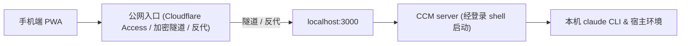

# 生产部署
> 两条启动入口、公网入口选型、ACCESS_PROFILE 与 BIND_MODE。

- **Part**: 第六部分 · 部署与运维
- **Reading Time**: ~14 min
- **Estimated Tokens**: ~2124

---

生产形态是一个常驻的 server 进程加一条公网入口。启动只有两条入口：headless 终端里 `npm start`（全平台基线，保活方式自己定），或 macOS 菜单栏应用 CCM.app。Cloudflare Tunnel / Access 这些是公网怎么进来，不是第三条启动方式。

## 生产架构拓扑



 `AUTH_TOKEN` + 逐设备审批，对所有拓扑相同。Cloudflare Access 是可选加层：开着时它管的公网 Host 改认 Access 身份，替代令牌，缺省也替代设备审批  
    局域网 / 本机  `http:// :3000/#token=…` 走 `AUTH_TOKEN`，新设备首次仍要批准  
    常驻  macOS 用 CCM.app（崩溃拉起、开机自启、日志、重启都在菜单里）；其他平台 headless `npm start`，保活用 tmux、自己的 systemd 或 docker 都行，仓库不提供官方 unit  
    控制面数据  长期实例建议把 `CCM_DATA_DIR` 设成仓库外的绝对路径，免得切分支、清理仓库碰到生产状态；文件保持 `0600`  
 

## macOS：菜单栏应用 CCM.app

1. 安装： ```
# 编译 Swift 菜单栏应用并装进 /Applications/CCM.app
npm run app:install
``` 菜单里安装并启动 server，需要的话勾「开机自启（菜单栏）」。菜单栏还能重启 server、查看日志、批准或吊销设备、弹出连接二维码（扫码带着令牌进 Web UI；PNG 由 qr.js 在自己的进程里渲染，令牌明文不进菜单栏进程）。
2. 它背后的 CLI（一般不用手敲，不是第三条入口）： ```
npm run service:install -- server   # 渲染 plist 并注册 launchd，RunAtLoad + KeepAlive
npm run service:status              # 各 unit 运行态、归属与漂移
npm run service:restart -- server
npm run service:logs -- server
npm run service:adopt -- server     # 接管手工装的 plist：只写 manifest，不碰 plist
``` 装出来的 label 固定是 com.ccm.<unit> ，状态、接管与桌面端都只扫这个前缀。

> **WARNING:** macOS 常驻启动命令约束 — desktop/launchd/server.plist.template 中的启动命令为 exec   app/server.js，必须与 app/src/ops/service-units.js 解析常驻进程后缀的代码逐字严格一致，改动一侧必须同步另一侧，否则服务面板的 repo / node 恒为 null。

## Linux 与其他平台：headless

终端里 `npm start`，窗口别关；要关终端也能活，用你自己的保活方式。项目不替用户决定怎么后台运行，macOS 之外不做官方常驻适配。桌面端和 `npm start` 都要用户登录后的会话，开机未登录就跑不在这两条入口里。server 要经登录 shell 启动，才能让 claude 的 `PATH` 与登录态和你的终端一致。

## 公网入口怎么选

| 方案 | 要点 |
| --- | --- |
| Cloudflare 命名隧道 + Access | 默认路径：固定域名，Access 把守（Email OTP 或 Google / Microsoft 2FA），公网不带 #token= 。产品受管的第三方进程只有 cloudflared |
| Tailscale | 不经 Cloudflare 时的推荐路径，自带 HTTPS。产品一等支持但不受管：文档配方、向导提示、doctor 检测，不装不起不保活 |
| 其他加密隧道 / VPN、自建反代 | CF_ACCESS_* 三项留空即整层关闭，server 零改动。托管隧道（ngrok、Quick Tunnel、Tailscale Funnel）归反代一档 |

选定后用 `ACCESS_PROFILE` 声明方案（`cloudflare` / `vpn` / `reverse-proxy` / `direct` / `lan`）。它是纯声明，不改变任何运行时行为，但 doctor 与手机端安全体检会按它做针对性检查，与 `CF_ACCESS_*`、`PUBLIC_URL`、通知配置互相矛盾时当场指出。

默认监听 `0.0.0.0`。打算「本机只开 loopback，公网入口完全由自己转发」（SSH `-L`、Tailscale Serve、反代）时，设 `BIND_MODE=loopback` 收窄监听面。不存在「未设令牌就降级绑本机」的路径，缺令牌一律拒绝启动。

## 运维铁律与管理边界

- 端口防撞： 桌面端占着 3000 时，不要再手动 npm start 。改了配置或拉了新代码，在菜单里 server 一行点「重启」；headless 在跑 npm start 的那个终端里停掉再起。
- 配置生效时机： 只有 WORKDIRS 工作区列表热加载（被移除目录上已开的会话继续运行，仅拒新开）；其余配置项改完都要重启服务。
- 限速来源： 默认不采信任何转发头，反代后面所有公网客户端共用一个登录限速桶；只有显式设 TRUSTED_PROXY=loopback 才采信 loopback 反代追加的 X-Forwarded-For 末跳。它只决定限速怎么分桶，不参与鉴权。
- 纯 TCP 转发： 本机判据读的是 Host 头，而 Host 由客户端填。用 ssh -R 、frp tcp 这类打洞方式暴露时，设 DEVICE_APPROVAL_SCOPE=all 并重启，让设备审批覆盖全部路径。
- 通知隐私： ntfy 的正文最小化，但标题带工作区目录名与会话标题，且明文经第三方；请自托管 ntfy，或用私密 topic 加 NTFY_TOKEN 。
