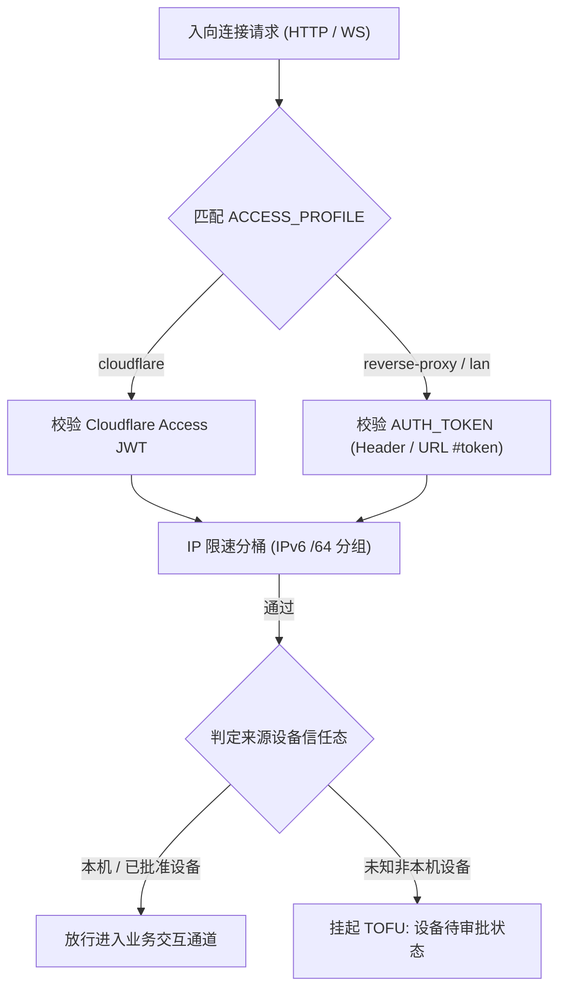

# 安全模型
> 单用户、token 不出本机、权限继承 CLI、设备 TOFU。

- **Part**: 第三部分 · 方法论
- **Reading Time**: ~12 min
- **Estimated Tokens**: ~1416

---

安全模型围绕一条铁律展开：这是**每实例单用户 (n=1)** 的自托管桥，绝非多租户 SaaS。任何通过鉴权的远程请求，都与机主物理坐在本机终端前拥有完全等价的系统操作权限。

> **NOTE:** English —  Security model for non-Chinese readers: English Security Model（与 README.en.md 对齐）。

> **CRITICAL / DANGER:** 高危警示 — 这是直通你本机开发环境与 Shell 执行权限的代码执行通道。向局域网或公网暴露前，必须严格完成 Token 强随机化、设备审批门禁确认、CLI 权限审计与网络拓扑防护。

## 四大安全铁律

1. 每实例严格单用户。 拒绝任何形式的多用户隔离、账户体系或登录注册机制。鉴权通过即代表机主本人。
2. 无 Token 绝不出本机。 未显式配置 AUTH_TOKEN 时，服务恒定只绑定 127.0.0.1 环回地址。不存在留空等于对公网开放的危险回落。
3. 权限同源继承 CLI。 CCM 自身不自建独立放行白名单，全部权限放行严格以本机 ~/.claude/settings.json 及其项目 local 覆盖为准。
4. 设备信赖审批（TOFU 机制）。 任何非本机且未受公网身份代理（如 Cloudflare Access）验证的新设备，即便持有合法 Token，首次接入仍必须在电脑端一次性审批。

## 网络拓扑与 ACCESS_PROFILE 三候选

为防止反代或隧道导致客户端 IP 坍缩为 `127.0.0.1` 从而打穿设备门禁，系统通过 `ACCESS_PROFILE` 显式声明网络拓扑：

| 拓扑枚举 | 适用场景与安全行为 | 反向代理与设备门判据 |
| --- | --- | --- |
| cloudflare | 公网经 Cloudflare Tunnel + Access 接入 | 必须配置 3 项 Access 环境变量；依赖边缘 JWT 提供 2FA 身份保证 |
| reverse-proxy | 纯 Nginx / Caddy 反代或内网穿透（如 Tailscale） | 一等支持路径 ：强制要求强 Token，显式配置 TRUSTED_PROXY 方采信 X-Forwarded-For，防止伪造 |
| lan | 纯局域网或本机直连 | 仅允许私网 IP 访问，真实外部设备严格触发 TOFU 弹窗审批 |

## 鉴权流程与多层防护

## 防暴力尝试与限速分桶

- IPv6 /64 分桶防护。 针对 IPv6 客户端，自动将同一 /64 子网聚类为单桶，杜绝攻击者通过轮换公网 IPv6 地址绕过限速。
- 分档锁定与措辞规范。 本机 127.0.0.1 误试绝不说成「有人在暴力尝试」；仅针对真实外部未信任来源进行阶梯式退避与锁定告警。
- 开箱即用鉴权拦截。 即使是 /health 与 /metrics 端点，未携带合法凭据同样直接打回 401，严防网络探测与指纹泄露。

## 明确不做的安全技术债

- 坚决不做多租户环境下的容器化用户沙箱或细粒度 ACL。
- 坚决不做第三方密钥集中托管服务。
- 坚决不开设任何无鉴权的 HTTP 数据透传端点。
