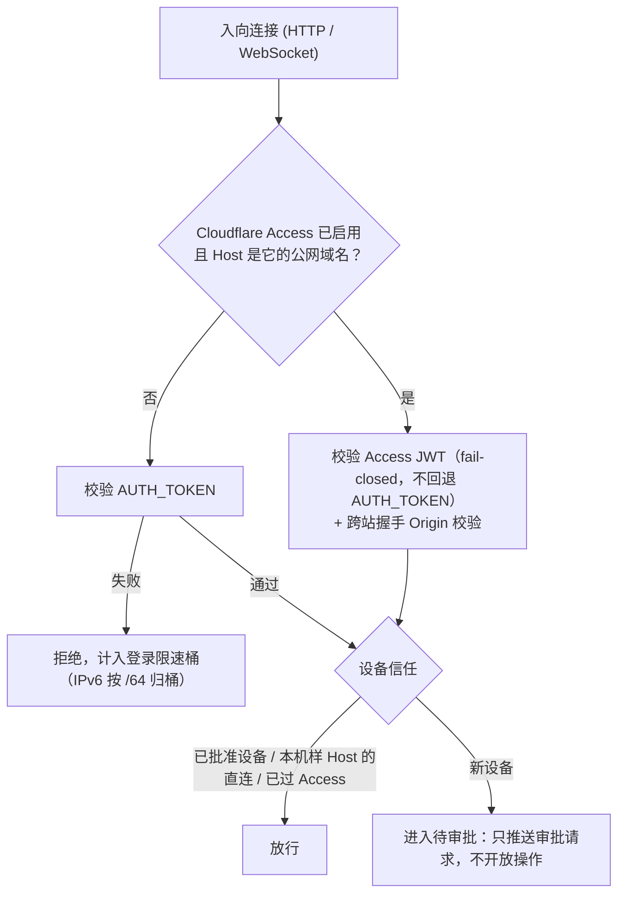

# 安全模型
> 单用户、令牌是启动前提、按 Host 的鉴权分支、设备审批与两个边界。

- **Part**: 第三部分 · 方法论
- **Reading Time**: ~12 min
- **Estimated Tokens**: ~2199

---

安全模型围绕一个前提展开：这是**每实例单用户 (n=1)** 的自托管桥，不是多租户 SaaS。任何通过鉴权的远程请求，权限都等同于运行 `claude` 的那个本机账号。

> **NOTE:** English —  Security model for non-Chinese readers: English Security Model（与 README.en.md 对齐）。

> **CRITICAL / DANGER:** 高危警示 — 这是一个可以远程触达本机 Claude Code、并间接获得本机代码执行能力的入口。请把它当开发机远程控制工具，不是普通网页。长期暴露到公网前，先确认令牌强度、设备审批、CLI 自动放行规则与公网入口的防护。

## 六条安全边界

1. 单用户。 没有多用户或租户隔离，没有账户体系；鉴权通过后的权限就是运行 claude 的本机账号的权限。
2. 没有令牌就不启动。 AUTH_TOKEN 是启动前提，任何绑定模式都一样，本机浏览器打开也要令牌，不存在「本地免鉴权」，也不存在「未设令牌就降级绑本机」。
3. 工作区显式放行。 文件、会话和相关操作只能进入配置的 WORKDIRS 。白名单拒绝家目录本身与 / 、 /Users 、 /home 这类过宽的根，判定前先做路径归一与 symlink 解析。
4. 新设备需要信任。 除本机样 Host 的直连、以及已通过 Cloudflare Access 的连接外，持正确令牌的新设备仍需一次审批。批准可以在电脑终端（ node scripts/device.js approve ，或在跑 npm start 的终端按回车）、macOS 菜单栏，或另一台已信任的设备上完成。
5. 继承 Claude Code 权限。 CCM 不自建放行白名单， permissions.allow 等 CLI 规则照常生效；公网使用前应检查 Bash、Write 的自动放行规则。
6. 文件编辑属于直接写入。 内置编辑器 不经过 Agent 的工具审批链 （有范围校验、大小限制、哈希冲突检测与审计）， FILE_EDIT=off 可关闭，长期公网暴露建议关闭。

## 入口怎么鉴权

鉴权分支看的是请求的 Host，不是 `ACCESS_PROFILE`：Cloudflare Access 启用、且请求落在它的公网域名上时，改认 Access 身份；其余一律认 `AUTH_TOKEN`。`ACCESS_PROFILE` 只是「你打算怎么从手机访问」的声明，不改变任何运行时行为，doctor 与手机端安全体检据此做针对性检查。

`DEVICE_APPROVAL_SCOPE=all` 会让「本机样 Host 的直连」与「已过 Access」这两条也要过设备审批。

## 两个必须知道的边界

- 开着 Access 时，它替代设备审批。 经 Access 进来的连接不受「已受信任的设备」这张表管辖，在表里吊销对它们无效。要让吊销生效，设 DEVICE_APPROVAL_SCOPE=all 。
- 本机判据读的是 Host 头，而 Host 由客户端填。 按 Host 路由的入口（cloudflared、配了 server_name 的 nginx）上，公网请求带的就是公网 Host，仍要设备审批；但纯 TCP 转发（ ssh -R 、frp tcp、socat）不按 Host 路由，远程来客发一个 Host: localhost 就能冒充本机。用这类方式暴露时，设 DEVICE_APPROVAL_SCOPE=all 并重启。

## 限速与措辞

- 限速只挡鉴权口的暴破。 鉴权通过后，用户就是主机所有者，操作面不限速；鉴权通过后 handler 抛出的 500 也不得计入限速。
- IPv6 按 /64 归桶 ，堵住轮换源地址绕过登录限速。
- 默认不采信任何转发头。 反代后面所有公网客户端共用一个限速桶；只有显式 TRUSTED_PROXY=loopback 才采信 loopback 反代追加的 X-Forwarded-For 末跳。失败方向是合桶，不是拆桶。
- 措辞按来源分档。 本机来源的限速锁定绝不说成「有人在暴力尝试」。
- 不开无鉴权的 HTTP 数据端点。 /health 、 /metrics 、历史回显都要过鉴权。

## 2026-09 的几处加固

- 子进程不继承控制面密钥 （AUTH-06）：claude 子进程，以及 server 在工作区里跑的 git 与 claude --version ，都剥掉 AUTH_TOKEN 与 VAPID_* / NTFY_* / CF_ACCESS_* ； ANTHROPIC_* 、 CLAUDE_CODE_* 与代理变量原样透传，第三方网关不受影响。
- 令牌不出现在服务端自己的输出里： 启动横幅只显示掩码， logs:server 整段脱敏后再切行；免手输令牌改用需要人主动敲的 node scripts/qr.js 。
- 跨站握手门： 公网 IdP 路径上校验完整的 Origin，不只比主机名；这类拒绝不计入限速桶。
- CSP 的 connect-src 收紧到同源。
- 推送端点的令牌走 x-auth-token 请求头 ，不拼进 URL；只有请求头走不通时才回落到 query。

## 明确不做的安全技术债

- 不做多租户下的容器化用户沙箱或细粒度 ACL。
- 不做第三方密钥集中托管。
- 不开任何无鉴权的 HTTP 数据端点。
