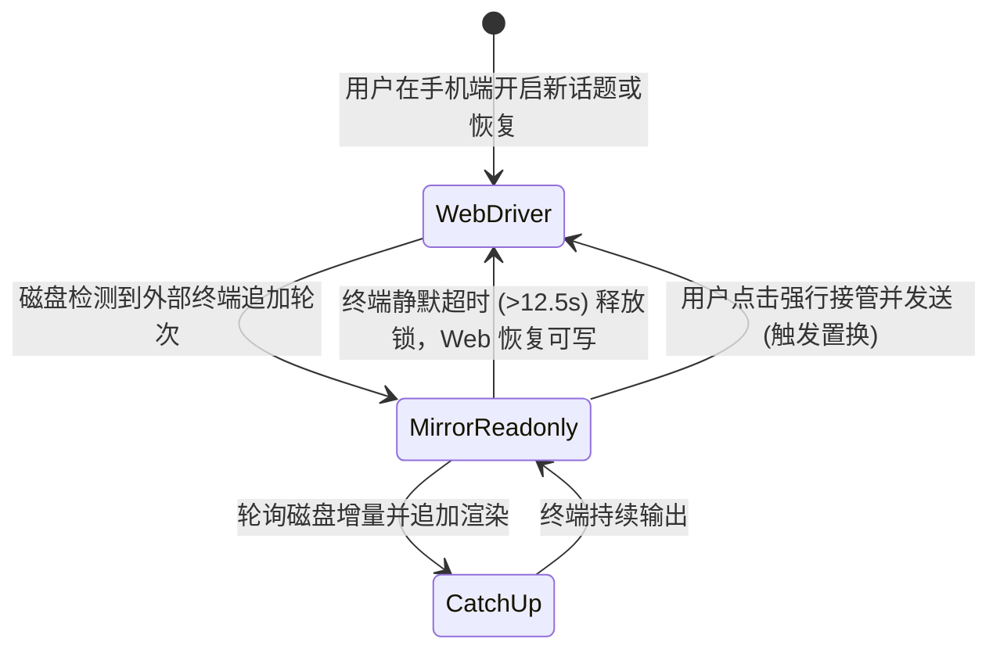

# 单驾驶员模型
> Web 与 CLI 不可同时写同一会话；镜像只读追平。

- **Part**: 第三部分 · 方法论
- **Reading Time**: ~10 min
- **Estimated Tokens**: ~1636

---

同一 `sessionId` 在任意时刻只允许存在单一写入者（Driver）。Web 端与终端 CLI 严禁并发向同一会话追加输入；后介入的一方退化为只读镜像或主动接管，彻底杜绝 Transcript 分叉。

## 单驾驶员模型解决的核心痛点

会话历史（Transcript）的唯一真相源存储在磁盘的 `~/.claude/projects/ / .jsonl` 中。如果 Web 进程与终端 CLI 同时向同一个文件追加消息轮次，不仅会造成消息父子关联（parent link）混乱、上下文断裂，还会导致两端出现无法调和的视图漂移。单驾驶员模型将可能引发并发冲突的数据写入，在入口处收敛为严格互斥的锁状态机。

 
    终端驾驶 
#### Web 保持只读镜像

输入框自动挂起只读锁，后台引擎毫秒级追平磁盘追加的内容。
 
    Web 驾驶 
#### 长驻 SDK Query 流

持有写入权限，输入、审批和中断等控制指令正常下发。
 
    外部变脏 
#### 标记 externalDirty

感知到终端追加了新轮次，Web 下次发送前强制置换实例冷读。
 
 

## 三种驾驶状态与流转模型

| 运行状态 | 当前持有者 | Web 端交互行为 | 底层机制 |
| --- | --- | --- | --- |
| Web 驾驶态 | CCM AgentSession 实例 | 完全可写；实时推流文本与工具卡片 | SDK 双向流占用；输入即时响应 |
| CLI 驾驶态（只读镜像） | 终端正在执行的 CLI | 输入框显示「终端会话运行中」并锁定，只读观看 | 通过 Mirror Engine 轮询增量并以 history_append 广播 |
| 接管状态 (Takeover) | Web 端主动发起接管 | 终端静默超时后，用户可点击发送强行接管写入 | 触发 externalDirty 置换逻辑，先冷读磁盘再建新 query |

## 活体识别与 Tail Attribution 判据

在识别「终端是否仍在活跃执行」时，存在复杂的边缘时序。系统历经多次迭代确立了精确的判定准则：

1. 终端等待态感知 (terminalWaiting)。 当终端执行长耗时工具（如跑大单测、长构建）而未向 Transcript 写盘时，单纯看「文件是否增长」会误判为终端已退出。系统结合终端状态判定与探针，准确维持锁定状态，防止意外接管。
2. 桌面端与 Web 归因隔离 (Tail Attribution)。 桌面端和 Web 端可能轮流向会话写盘。系统对尾部未完成的 pending 消息进行归因检测，区分「是自己 Web 发出的在途请求」还是「终端/桌面端遗留的活体动作」，彻底消灭闲置桌面端被误标繁忙的假警报。
3. 相反判据的架构合理性。 镜像锁判定（宁可误锁，因为并发写会导致不可逆的分叉）与会话列表状态展示（宁可少报忙碌，因为谎报运行中比稍后刷新代价更大）方向相反，两者各有其专门守护边界。

## 镜像机制关键内部组件

 增量轮询器：只读态约 1s 一拍，常态约 2.5s，抓取 jsonl 追加字节。  
    mirrorReleaseStep  自动解锁看门狗：终端持续静默约 12.5s 且无未完成 pending 时自动释放只读锁。  
    forInstanceId 守卫  多标签页防串锁：异步 tick 提交前校验当前视图未切换，防止切回其他项目时污染锁状态。  
    clearMirrorOnViewChange  切换会话强制清理全局镜像，防止跨工作区幽灵锁。  
 

## 状态转移架构图

