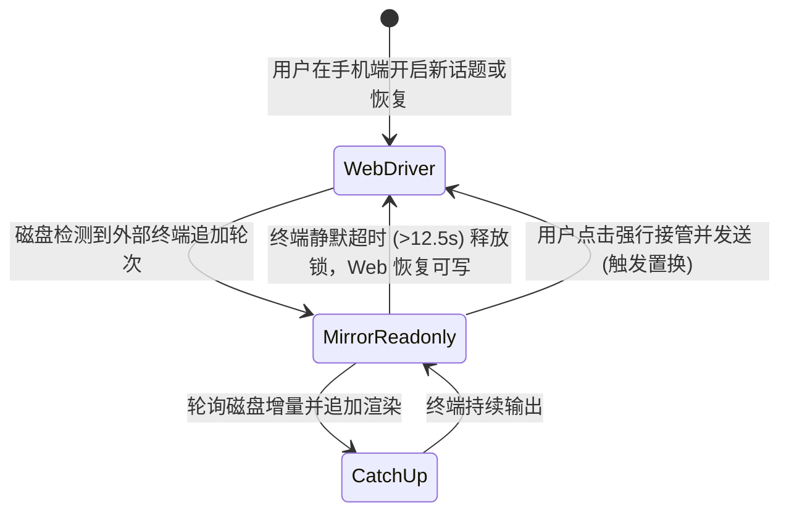

# 单驾驶员模型
> Web 与 CLI 不可同时写同一会话；镜像只读追平。

- **Part**: 第三部分 · 方法论
- **Reading Time**: ~10 min
- **Estimated Tokens**: ~1894

---

同一 `sessionId` 在任意时刻只允许存在单一写入者（Driver）。Web 端与终端 CLI 严禁并发向同一会话追加输入；后介入的一方退化为只读镜像或主动接管，彻底杜绝 Transcript 分叉。

## 单驾驶员模型解决的核心痛点

会话历史（Transcript）的唯一真相源存储在磁盘的 `~/.claude/projects/ / .jsonl` 中。如果 Web 进程与终端 CLI 同时向同一个文件追加消息轮次，不仅会造成消息父子关联（parent link）混乱、上下文断裂，还会导致两端出现无法调和的视图漂移。单驾驶员模型将可能引发并发冲突的数据写入，在入口处收敛为严格互斥的锁状态机。

 
    终端驾驶 
#### Web 保持只读镜像

输入框自动挂起只读锁，后台引擎毫秒级追平磁盘追加的内容。
 
    Web 驾驶 
#### 长驻 SDK Query 流

持有写入权限，输入、审批和中断等控制指令正常下发。
 
    外部变脏 
#### 标记 externalDirty

感知到终端追加了新轮次，Web 下次发送前强制置换实例冷读。
 
 

## 三种驾驶状态与流转模型

| 运行状态 | 当前持有者 | Web 端交互行为 | 底层机制 |
| --- | --- | --- | --- |
| Web 驾驶态 | CCM AgentSession 实例 | 完全可写；实时推流文本与工具卡片 | SDK 双向流占用；输入即时响应 |
| CLI 驾驶态（只读镜像） | 终端正在执行的 CLI | 输入框显示「终端会话运行中」并锁定，只读观看 | 通过 Mirror Engine 轮询增量并以 history_append 广播 |
| 接管状态 (Takeover) | Web 端主动发起接管 | 终端回合结束并经过静默判定后，锁自动释放、Web 恢复可写；终端仍在跑时，也可以点「强制立即续接」或「仍要续接」显式解锁，两条路都要过一道写明分叉风险的确认框 | 发送前若 transcript 相对现有实例有外部增长，先 dispose 旧实例再 resume 吸收（ externalDirty 置换）。解锁只撤掉 Web 侧的锁， 不会停止终端进程 ；终端之后若继续写同一会话，仍会形成两条分支 |

## 活体识别与 Tail Attribution 判据

在识别「终端是否仍在活跃执行」时，存在复杂的边缘时序。系统历经多次迭代确立了精确的判定准则：

1. 终端运行态以 CLI 自报为准。 终端跑长工具（大单测、长构建）时可能很久不写 transcript，只看文件增长会误判终端已退出。CLI 在会话注册表里自报 status（ busy / shell / idle / waiting ），这才是权威信号；其中 waiting 就是 terminalWaiting ，表示终端停在审批或提问上。桌面端 Code 模式从不写 status，只能回落看 transcript 尾部形态。
2. 尾部归因 (Tail Attribution)。 桌面端、终端和 Web 可能轮流向会话写盘。transcript 逐条自报写入方（CLI 写 cli ，本项目 SDK 写 sdk-ts ），静默判定只认 终端写的 未完结尾部。己方留下的未完结尾部如果也能撑住锁，Web 等一条审批时就会自锁：尾部恒未完结 → 锁恒维持 → 手机只读 → 点不到「批准」。
3. 相反判据的架构合理性。 镜像锁判定（宁可误锁，因为并发写会导致不可逆的分叉）与会话列表状态展示（宁可少报忙碌，因为谎报运行中比稍后刷新代价更大）方向相反，两者各有其专门守护边界。

## 镜像机制关键内部组件

 增量轮询器：只读态约 1s 一拍，常态约 2.5s，抓取 jsonl 追加字节。  
    mirrorReleaseStep  自动解锁：终端持续静默约 12.5s（按墙钟折算），且没有终端写的未完结尾部时释放只读锁。终端轮次已收尾、只是开着对话框时，也照常解锁。  
    forInstanceId 守卫  多标签页防串锁：异步 tick 提交前校验当前视图未切换，防止切回其他项目时污染锁状态。  
    clearMirrorOnViewChange  切换会话强制清理全局镜像，防止跨工作区幽灵锁。  
 

## 状态转移架构图

