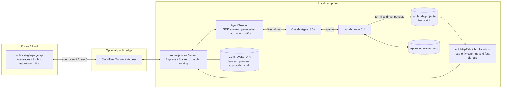

# Architecture

> This document explains how Claude Chat Mobile lets Web and terminal CLI use the same configuration and persisted sessions without pretending they share a live TTY.

[中文](architecture.md) · [Back to README](../README.en.md)

## Design goals

Claude Chat Mobile is a local forwarding and synchronization service:

- For Web-originated work, it drives the local `claude` CLI through the Claude Agent SDK.
- For terminal-originated work, it does not take over the terminal process; it reads the CLI transcript after content reaches disk.
- Both sides share project configuration, tools, permission sources, and session history, but only one side may drive writes at a time.
- When the phone disconnects or moves to the background, reconnect can deduplicate and replay events still retained by the server.

It is not remote desktop software, a TTY multiplexer, or a multi-tenant hosted service, and it never exposes the terminal process's stdin/stdout to the browser.

## Components



Cloudflare is optional. The phone can connect directly on the same Wi-Fi; only a fixed public deployment needs Tunnel/Access or an equivalent secure edge.

## Two data paths

### Web driver

1. The browser opens a Socket.io connection, authenticates with `AUTH_TOKEN` or Cloudflare Access, and passes the device gate.
2. `user:*` events enter the server and route by `instanceId` / current view to the matching `AgentSession`.
3. `AgentSession` writes into Agent SDK streaming input. The SDK starts or resumes the local CLI inside an approved `cwd`.
4. The mapping layer turns SDK output into product events for text, tools, approvals, questions, status, and background tasks.
5. Every outbound event uses the `agent:event` envelope; the front end routes it by session and instance before rendering.

A Web session is not a remote Anthropic chat page. The SDK child inherits the local CLI login, project `CLAUDE.md`, Claude settings, MCP servers, skills, hooks, and a controlled provider environment.

### CLI driver

1. The user runs `claude` directly in a computer terminal. This process does not pass through Claude Chat Mobile's SDK child.
2. The CLI writes completed messages to a transcript under `~/.claude/projects/`.
3. The server's `catchUpTick` checks the current session for disk growth every 2.5 seconds in steady state (tightening to 1 second once the read-only mirror engages; the quiet period before unlocking works out to roughly 12.5 seconds of wall clock) and sends newly persisted messages to Web.
4. The optional hooks bridge writes Stop / Notification to a file inbox. `fs.watch` only accelerates a check; the disk transcript remains the source of truth.
5. The optional statusline bridge writes snapshots of CLI model, effort, context, cost, and quota.

The read-only mirror therefore has strict limits:

- It sees content after it reaches disk, not live stdout.
- It cannot write to or attach to the terminal process's stdin.
- Thinking, subagent intermediate work, or tool output may remain invisible until persisted.
- The cross-session “needs you” view only covers instances the Web backend is driving; sessions waiting inside a plain terminal do not enter it and surface only through the optional hooks bridge.
- Hooks shorten discovery of “turn ended / needs you,” but they do not turn the mirror into a shared TTY.

## Single-driver model

Sharing a transcript does not make concurrent writes safe. Two independent Claude turns can fork context, race on files, and produce incorrect completion state.

The project reduces that risk with these rules:

1. **While Web drives**, its `AgentSession` is the writer. The front end enforces one message per turn and changes Send to Stop while work is active.
2. **When external CLI growth is detected**, the server marks disk as newer than SDK memory and puts Web into read-only mirror mode.
3. **While the CLI is still active**, Web does not send another message to that session and shows terminal-driver state.
4. **After the terminal turn ends and passes the quiet-period check**, the mirror lock is released and Web may resume.
5. **Before a Web takeover send**, if the transcript has grown beyond the current SDK instance, the server disposes that stale instance and resumes from disk before sending.

**These five rules are the default path, not a hard constraint.** The project controls its own SDK instance; it cannot control the independent process running in your terminal. The mirror lock only gates input on the Web side, and the user can still unlock it explicitly from the read-only state via "force resume now" / "resume anyway" (`requestMirrorResume` / `appendForceResumeAction` in `public/js/app.js`, both behind a confirmation that spells out the fork risk). Unlocking merely drops the Web-side lock and **does not stop the terminal process** — if the terminal keeps writing to the same session afterwards, the transcript can still fork into two branches. The escape hatch is deliberate: users often know the terminal is already closed well before the detection chain can prove it.

Polling leaves an observation window of up to one check interval. Session switches, manual mirror refresh, and hook signals can schedule an earlier check, but none of them proves control over another live process.

## Event envelope and reconnect replay

Outbound Socket.io traffic uses one `agent:event` envelope:

```json
{
  "seq": 42,
  "epoch": "server-instance-id",
  "sessionId": "cli-session-id",
  "instanceId": "web-instance-id",
  "cwd": "/approved/workspace",
  "ts": 1780000000000,
  "type": "text_delta",
  "payload": {}
}
```

- `type` comes from a closed event set. `scripts/contract-check.js` checks consistency across **backend senders** (recursive scan of `src/`) and the **mock server**; for inbound socket events it additionally verifies that front-end emits stay within the contract.
  A separate **front-end dispatch coverage** check closes the receiving side: the union of the `handle` and `outOfBand` table keys in `public/js/app.js` must equal `AGENT_EVENT_TYPES` exactly (a missing key means events are silently dropped on arrival; an extra one is a dead key), and a type appearing in both tables is rejected as well (`outOfBand` wins at dispatch time, so the `handle` entry would become dead code). `DEFAULT_REPLAY_OOB_TYPES` in `event-dispatch.js` is a parallel copy of the `outOfBand` table and is pinned to match it verbatim — letting it drift makes a new OOB type get queued in the replay buffer and lost permanently when `resolve('reload')` discards the queue.
- `seq` increases within one `AgentSession` and lets the front end deduplicate.
- `epoch` identifies a server/instance generation; a change resets the client's old deduplication baseline.
- `sessionId` and `instanceId` remain separate so persisted CLI-session identity is not confused with a current Web process.
- Each AgentSession keeps a bounded ring buffer. A client requests a retained gap with `sync:since`.

The ring buffer is not permanent history. If a gap has fallen out of the buffer or the service restarted, the client falls back to authenticated `session:history` and rebuilds stable messages from the CLI transcript. High-frequency transient state is not all persisted.

## Authentication and scope boundaries

```text
AUTH_TOKEN (required; no token, no server)
            ↓
public IdP strategy (optional; Cloudflare Access is the only implementation today)
            ↓
device trust (a true local connection is exempt from this layer, not from the token)
            ↓
WORK_DIR / WORKDIRS scope gate
            ↓
CLI permissions.allow + current Web permission mode
            ↓
Agent tool approval or direct user file edit
```

The first layer is a prerequisite, not an option ([hard-rules §1, "auth is a startup
prerequisite"](hard-rules.md)): without `AUTH_TOKEN` the server refuses to start — including for a
browser on this machine — so every layer below it always assumes the caller already holds the token.
The second layer is named for the role rather than the product because core code only knows the
interface shape in `src/auth/auth-strategy.js`; Cloudflare Access is today's only implementation, and
swapping the IdP should not touch the core.

These boundaries do not replace each other:

- `AUTH_TOKEN` proves possession of the instance secret; it does not prove that a device was approved.
- Cloudflare Access adds public-edge identity; it does not expand workspace scope. It replaces device approval (the second factor), never the token.
- `WORK_DIR` / `WORKDIRS` constrain paths; they do not decide which Claude tools run automatically (a legacy external `workdirs.json` still works and ranks below `WORKDIRS`).
- Agent `canUseTool` approvals govern autonomous Agent actions. Clicking Save in the file editor is a direct user write with separate scope, size, content-hash, and audit controls.

See the [README security model](../README.en.md#security-model) for the concise boundary list and [deployment and operations](deployment.md) for network topology.

## State and persistence

| Data | Source of truth | Purpose |
|---|---|---|
| Claude conversations | `~/.claude/projects/` transcript | CLI/Web resume and stable history |
| Web instance runtime | In-memory `AgentSession` | Streaming turns, approvals, event buffer |
| CCM control plane | `CCM_DATA_DIR` | Session pointers, devices, approvals, audit, push, and caches |
| Workspace allowlist | `WORK_DIR` / `WORKDIRS` | Limits visible and operable directories |
| Web-driver status line | SDK events | Current model, context, cost, and effort |
| CLI-driver status line | Optional statusline snapshots | Read-only terminal-session status |
| Immediate CLI signals | Optional hooks inbox | Faster Stop / Notification handling |

`CCM_DATA_DIR` does not store the original Claude transcript. Clearing it affects CCM control-plane state but is not the same operation as deleting every Claude session; SDK-level session deletion is a separate explicit action.

## Code entrypoints

- `server.js`: compatibility launcher; assembly lives in `src/server/app.js`.
- `src/agent/agent.js`: `AgentSession`, SDK mapping, permission gate, and ring buffer.
- `src/server/mirror-engine.js`: catch-up scheduling and the mirror state machine (owns its state).
- `src/sessions/history.js`: transcript reading, history rebuild, and pure mirror-decision functions.
- `src/ops/cli-hooks-bridge.js` / `src/ops/cli-statusline-bridge.js`: CLI signal and snapshot consumers.
- `public/js/app.js` and `public/js/app/`: client state, event dispatch, and interaction modules.
- `scripts/contract-check.js`: bidirectional Socket.io event-contract gate.

See the [repository map](repository-map.md) for complete directory ownership and file inventory, the [display contracts](display-contracts.md) (Chinese) for cross-layer model, effort, and statusline transformations, and [hard rules](hard-rules.md) (Chinese) for n=1 tradeoffs and deferred tech debt.
