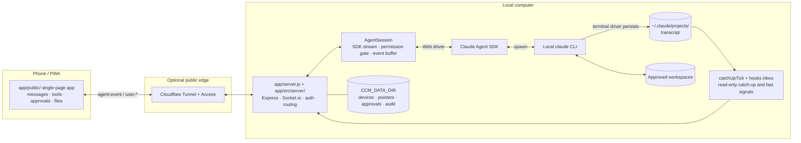

# Architecture

> This document explains how Claude Chat Mobile lets Web and terminal CLI use the same configuration and persisted sessions without pretending they share a live TTY.

[中文](architecture.md) · [Back to README](../README.en.md)

> **Scope**: this English document covers the core architecture only. Several operational
> sections exist in Chinese only — the four device-approval entrypoints, offline wake-up and
> push suppression, and runtime observability (the two authenticated endpoints, the service
> status panel, and why service alerts and the "needs you" counter are deliberately separate
> axes). See [架构说明](architecture.md), which is the authoritative and complete version.
>
> The rule for what may be left out: **anything that can make a configuration fail silently, or
> mislead a security decision, must be translated; the rest may point at the Chinese version.**

## Design goals

Claude Chat Mobile is a local forwarding and synchronization service:

- For Web-originated work, it drives the local `claude` CLI through the Claude Agent SDK.
- For terminal-originated work, it does not take over the terminal process; it reads the CLI transcript after content reaches disk.
- Both sides share project configuration, tools, permission sources, and session history, but only one side may drive writes at a time.
- When the phone disconnects or moves to the background, reconnect can deduplicate and replay events still retained by the server.

It is not remote desktop software, a TTY multiplexer, or a multi-tenant hosted service, and it never exposes the terminal process's stdin/stdout to the browser.

## Components



Cloudflare is optional. The phone can connect directly on the same Wi-Fi; only a fixed public deployment needs Tunnel/Access or an equivalent secure edge.

## Two data paths

### Web driver

1. The browser opens a Socket.io connection, authenticates with `AUTH_TOKEN` or Cloudflare Access, and passes the device gate.
2. `user:*` events enter the server and route by `instanceId` / current view to the matching `AgentSession`.
3. `AgentSession` writes into Agent SDK streaming input. The SDK starts or resumes the local CLI inside an approved `cwd`.
4. The mapping layer turns SDK output into product events for text, tools, approvals, questions, status, and background tasks.
5. Every outbound event uses the `agent:event` envelope; the front end routes it by session and instance before rendering.

A Web session is not a remote Anthropic chat page. The SDK child inherits the local CLI login, project `CLAUDE.md`, Claude settings, MCP servers, skills, hooks, and a controlled provider environment.

### CLI driver

1. The user runs `claude` directly in a computer terminal. This process does not pass through Claude Chat Mobile's SDK child.
2. The CLI writes completed messages to a transcript under `~/.claude/projects/`.
3. The server's `catchUpTick` checks the current session for disk growth every 2.5 seconds in steady state (tightening to 1 second once the read-only mirror engages; the quiet period before unlocking works out to roughly 12.5 seconds of wall clock) and sends newly persisted messages to Web.
4. The optional hooks bridge writes Stop / Notification to a file inbox. `fs.watch` only accelerates a check; the disk transcript remains the source of truth.
5. The optional statusline bridge writes snapshots of CLI model, effort, context, cost, and quota.

The read-only mirror therefore has strict limits:

- It sees content after it reaches disk, not live stdout.
- It cannot write to or attach to the terminal process's stdin.
- Thinking, subagent intermediate work, or tool output may remain invisible until persisted.
- The cross-session “needs you” view only covers instances the Web backend is driving; sessions waiting inside a plain terminal do not enter it and surface only through the optional hooks bridge.
- Hooks shorten discovery of “turn ended / needs you,” but they do not turn the mirror into a shared TTY.

## Single-driver model

Sharing a transcript does not make concurrent writes safe. Two independent Claude turns can fork context, race on files, and produce incorrect completion state.

The project reduces that risk with these rules:

1. **While Web drives**, its `AgentSession` is the writer. The front end enforces one message per turn and changes Send to Stop while work is active.
2. **When external CLI growth is detected**, the server marks disk as newer than SDK memory and puts Web into read-only mirror mode.
3. **While the CLI is still active**, Web does not send another message to that session and shows terminal-driver state.
4. **After the terminal turn ends and passes the quiet-period check**, the mirror lock is released and Web may resume.
5. **Before a Web takeover send**, if the transcript has grown beyond the current SDK instance, the server disposes that stale instance and resumes from disk before sending.

**These five rules are the default path, not a hard constraint.** The project controls its own SDK instance; it cannot control the independent process running in your terminal. The mirror lock only gates input on the Web side, and the user can still unlock it explicitly from the read-only state via "force resume now" / "resume anyway" (`requestMirrorResume` / `appendForceResumeAction` in `app/public/js/app.js`, both behind a confirmation that spells out the fork risk). Unlocking merely drops the Web-side lock and **does not stop the terminal process** — if the terminal keeps writing to the same session afterwards, the transcript can still fork into two branches. The escape hatch is deliberate: users often know the terminal is already closed well before the detection chain can prove it.

Polling leaves an observation window of up to one check interval. Session switches, manual mirror refresh, and hook signals can schedule an earlier check, but none of them proves control over another live process.

## Continuing automatically after a usage limit resets

When Claude Code in a terminal hits a usage limit, it waits for the reset and then sends a short "continue" on its own (the `autoContinueAtUsageLimit` setting, on by default). That only works in **interactive mode**: the CLI gates it on `launchOptions.isInteractive()`, which is false whenever `-p` / `--sdk-url` is passed or stdout is not a TTY — exactly how the SDK launches the CLI, both here and in the desktop app's Code tab. The desktop app fills the gap in its own front end, and this project fills it on the server: `app/src/server/auto-continue.js` owns state and scheduling, `app/src/agent/quota-auto-continue.js` holds the pure decisions.

1. **Arming**: when the main loop hits a `rate_limit` wall, `AgentSession` reports the facts through `onQuotaWall` (the `quotaLimits`, any rejected `rate_limit_event` from the same turn, who started the turn, and whether the model produced anything before the wall). The rules mirror the CLI: only a wall with `status='rejected'`, a finite `resetsAt`, and no overage in use is armed; it fires at the reset time plus 30–90 seconds of jitter; a reset more than 24 hours out (usually the weekly limit) is not waited on automatically — the banner offers "Continue at reset anyway". A subagent's wall does not arm anything: the main loop may still be running.
2. **State is keyed by sessionId on the server, not on the instance.** The wait is often five hours, while an idle instance is reclaimed after thirty minutes; by the time the reset comes the instance is usually gone and one is resumed to send. Idle reclamation leaves the wait armed; explicitly closing the session's tab, deleting the session, or sending a message yourself cancels it (the CLI's equivalent is exiting the process). Banner data rides on the `instances` broadcast as `autoContinue` (the real server always sends an array; the front end treats a missing field as "keep the last one" only to stay compatible with the E2E mock's older inline payloads).
3. **Four checks right before sending**; failing any of them means nothing is sent: an auto-armed entry still has the switch on; the wall is still the last conversational entry on the main chain of the transcript tail (the isMeta "Continue from where you left off." and the `<synthetic>` "No response requested." that the CLI adds when resuming an interrupted turn do not count); no terminal or desktop-app process has the session open in the registry (single driver, `SESSION-01`); the instance is not mid-turn and not `externalDirty`. When the check cannot read what it needs, or someone else may be driving, the entry turns **stale** and waits for the user to tap "Continue".
4. **What gets sent is the CLI's own prompt** with the `claude.ai` wording removed, attributed to the SDK as `{kind:'auto-continuation'}` (the same kind the CLI uses for its own continuation) rather than posing as typed human input. The front end marks that bubble "Continued automatically after the usage limit reset" from `user_message.origin` and from the `origin` carried on history entries.
5. **Sleep and restart**: a tick runs every 30 seconds; if two ticks are more than 30 minutes apart and the fire time has passed, the machine slept through the reset and the entry turns stale instead of firing (as in the CLI). **A server restart cancels any wait — nothing is persisted.** The CLI does the same when it exits, and it matches `APPROVAL-02`: pending actions left over from before a restart do not run. The armed facts could be rebuilt from the transcript (the wall entry carries `quotaLimits`); what cannot be rebuilt is a user's "Cancel", and adding a persistence layer for it would buy the harder-to-predict behavior of "started running for you after a restart" (hard rules §1, "no new persistence layer").
6. **Hitting the wall again after continuing**: only a continuation turn that hits the wall before producing any model output counts as a futile retry; retries wait at least 60 s and then 300 s, and more than two stop the chain. This deliberately differs from the CLI, which counts every wall inside a continuation turn and therefore stops a long task in its third five-hour window — the main use case here.

**Official subscription vs. third-party gateway**: purely data-driven; the upstream is never guessed (hard rules §1, "no assumptions about the model path"). Subscription walls always carry a reset time. A gateway that passes the unified rate-limit headers through produces the same structured wall and behaves identically. A gateway that answers with a bare 429 gives the CLI no reset time, so nothing is armed — no "retry in N minutes" guessing — and the session shows a one-line note that it cannot continue automatically. Retries are capped, so a gateway with an inaccurate reset time costs at most two extra rejected attempts.

**Switches**: turning off either `CCM_AUTO_CONTINUE_AT_LIMIT` (settings panel, on by default) or the CLI's `autoContinueAtUsageLimit` (terminal `/config`) falls back to "offer only": on a wall the banner shows "Continue automatically at reset", and nothing is armed until the user taps it. Entries the user armed by hand ignore the switches — they only govern what happens automatically.

## Event envelope and reconnect replay

Outbound Socket.io traffic uses one `agent:event` envelope:

```json
{
  "seq": 42,
  "epoch": "server-instance-id",
  "sessionId": "cli-session-id",
  "instanceId": "web-instance-id",
  "cwd": "/approved/workspace",
  "ts": 1780000000000,
  "type": "text_delta",
  "payload": {}
}
```

- `type` comes from a closed event set. `tests/gates/contract-check.js` checks consistency across **backend senders** (recursive scan of `app/src/`) and the **mock server**; for inbound socket events it additionally verifies that front-end emits stay within the contract.
  A separate **front-end dispatch coverage** check closes the receiving side: the union of the `handle` and `outOfBand` table keys in `app/public/js/app.js` must equal `AGENT_EVENT_TYPES` exactly (a missing key means events are silently dropped on arrival; an extra one is a dead key), and a type appearing in both tables is rejected as well (`outOfBand` wins at dispatch time, so the `handle` entry would become dead code). `DEFAULT_REPLAY_OOB_TYPES` in `event-dispatch.js` is a parallel copy of the `outOfBand` table and is pinned to match it verbatim — letting it drift makes a new OOB type get queued in the replay buffer and lost permanently when `resolve('reload')` discards the queue.
- `seq` increases within one `AgentSession` and lets the front end deduplicate.
- `epoch` identifies a server/instance generation; a change resets the client's old deduplication baseline.
- `sessionId` and `instanceId` remain separate so persisted CLI-session identity is not confused with a current Web process.
- Each AgentSession keeps a bounded ring buffer. A client requests a retained gap with `sync:since`.

The ring buffer is not permanent history. If a gap has fallen out of the buffer or the service restarted, the client falls back to authenticated `session:history` and rebuilds stable messages from the CLI transcript. High-frequency transient state is not all persisted.

## Authentication and scope boundaries

```text
AUTH_TOKEN (required; no token, no server) ‖ public IdP strategy (optional; Cloudflare Access today)
  one or the other, by Host: public Hosts the IdP owns accept only IdP credentials; every other entry accepts only the token
            ↓
device trust (a true local connection is exempt; IdP-verified connections are exempt by default, not with DEVICE_APPROVAL_SCOPE=all)
            ↓
connected-folder scope gate (WORKDIRS)
            ↓
CLI permissions.allow + current Web permission mode
            ↓
Agent tool approval or direct user file edit
```

The first layer is a prerequisite, not an option ([hard-rules §1, "auth is a startup
prerequisite"](hard-rules.md)): without `AUTH_TOKEN` the server refuses to start — including for a
browser on this machine. That does not mean every connection holds the token: with the IdP enabled, the
public Hosts it owns accept only IdP credentials (a JWT), and `AUTH_TOKEN` is neither required nor
accepted on that path. So what a lower layer may assume depends on the entry — "the caller passed the IdP"
on the IdP's public Hosts, "the caller holds the token" everywhere else — and any logic that hands the
token out (such as `connect:qr`) must check which path the connection took first ([hard-rules §6](hard-rules.md)).
The second layer is named for the role rather than the product because core code only knows the
interface shape in `app/src/auth/auth-strategy.js`; Cloudflare Access is today's only implementation, and
swapping the IdP should not touch the core.

These boundaries do not replace each other:

- `AUTH_TOKEN` proves possession of the instance secret; it does not prove that a device was approved.
- Cloudflare Access is an **optional** public-edge identity layer; it does not expand workspace scope. When enabled it **replaces the token** on the public Hosts it owns (that path accepts only the JWT) and, **by default**, also replaces device approval (the second factor); LAN and local entries are unaffected and still accept only the token. When disabled, device approval takes over — `AUTH_TOKEN` plus device approval is the public baseline shared by every topology.
  - ⚠ "Replaces" is literal: a connection arriving through Access is **never checked against** `trusted-devices.json`, so the trusted-device list **does not govern it** — revoking a phone that came in through the tunnel neither disconnects it nor blocks it (confirmed by testing on 2026-09-10). The decision is the first line of `shouldBypassDeviceApproval`.
  - To make that list apply to every path, set `DEVICE_APPROVAL_SCOPE` to `all` and restart. It is a **master switch covering every path**: a new device arriving through Access needs one approval, and the loopback-looking-Host path is closed too. That second half is required — the check reads Host, and **Host is a header the client writes**. Pure TCP forwarding (`ssh -R`, frp tcp) does not route on Host, so a remote client sending `Host: localhost` satisfies both conditions (peer is already loopback, since the forwarder lands locally). TCP cannot tell a real local browser apart from a tunnelled connection, and extra checks do not help (forwarded headers are absent on pure TCP forwarding; `localAddress` is identical), so the call is left to whoever knows their own topology (2026-09-17 security review, H1). With it on, the recovery paths are `node scripts/device.js approve`, the menu bar, or pressing Enter in the terminal running `npm start` — none of which read any network signal. The default keeps "Access replaces approval" and lets loopback-looking Hosts through, because flipping it would drop every in-use device back into the pending queue the first time an existing install restarts after an upgrade — at which point no device in the trust list can approve anything.
- `WORKDIRS` constrains paths; it does not decide which Claude tools run automatically (**the first entry is the primary work directory** your phone opens by default; a legacy external `workdirs.json` still works via `WORK_DIRS_FILE`; shell env outranks config-file inline `WORKDIRS`).
  - Scope follows the official desktop app's "connected folders" semantics, and there is exactly one check: `resolveAuthorizedCwd` in `app/src/sessions/folder-access.js`, which always compares after realpath. Subfolders of a connected folder are reachable (nested roots resolve to the deepest one); git linked worktrees of a connected repository — including sibling directories outside it — follow the repository, with ownership verified in both directions from the repository's side and **git never executed** (`.git/config` is model-writable, SCOPE-04); "No folder" sessions run under a scratch root in the app-data directory, and only the app's own `scratch-YYYY-MM-DD-xxxxxx` subdirectories are accepted (SCRATCH-01). `~/.claude` and the CCM data directory are off-limits as whole subtrees.
  - **An explicitly passed out-of-scope cwd is rejected** (`routeCwd` returns null and records a `scope_violation` audit) instead of falling back to the currently viewed directory — the drawer requests lists per project and the offline queue resends with the cwd it was queued under, so a fallback would draw A's sessions under B or deliver a message into another workspace (SCOPE-05). Only read-type requests additionally accept a running instance's own cwd, so sessions keep working after their folder is hot-removed.
  - Adding a folder from the phone (`folders:add`) browses folder names inside the home directory only (symlinks not followed, dot-directories hidden); the home directory itself, the disk root, the off-limits trees and linked worktrees can't be added (FOLDER-01). It only writes the config file's inline `WORKDIRS` and hot-reloads synchronously; it is refused when the list comes from environment variables or the legacy external file, or when there is no config file.
- Agent `canUseTool` approvals govern autonomous Agent actions. Clicking Save in the file editor is a direct user write with separate scope, size, content-hash, and audit controls.

See the [README security model](../README.en.md#security-model) for the concise boundary list and [deployment and operations](deployment.md) for network topology.

## State and persistence

| Data | Source of truth | Purpose |
|---|---|---|
| Claude conversations | `~/.claude/projects/` transcript | CLI/Web resume and stable history |
| Web instance runtime | In-memory `AgentSession` | Streaming turns, approvals, event buffer |
| CCM control plane | `CCM_DATA_DIR` | Session pointers, devices, approvals, audit, push, read markers, and caches |
| Connected folders | `WORKDIRS` | Limits visible and operable directories (including subfolders and owned worktrees; first entry = primary) |
| No-folder session directories | `scratch-workspaces/` under the app-data directory | Throwaway cwds; deleted with their session, only reported (not deleted) by uninstall `--purge` |
| Web-driver status line | SDK events | Current model, context, cost, and effort |
| CLI-driver status line | Optional statusline snapshots | Read-only terminal-session status |
| Immediate CLI signals | Optional hooks inbox | Faster Stop / Notification handling |
| Armed usage-limit auto-continue | Server process memory (`auto-continue.js`) | Continue at reset and the banner; **cancelled on restart, never persisted** |

`CCM_DATA_DIR` does not store the original Claude transcript. Clearing it affects CCM control-plane state but is not the same operation as deleting every Claude session; SDK-level session deletion is a separate explicit action.

## Code entrypoints

- `app/server.js`: compatibility launcher; assembly lives in `app/src/server/app.js`.
- `app/src/agent/agent.js`: `AgentSession`, SDK mapping, permission gate, and ring buffer.
- `app/src/server/mirror-engine.js`: catch-up scheduling and the mirror state machine (owns its state).
- `app/src/server/auto-continue.js` / `app/src/agent/quota-auto-continue.js`: usage-limit auto-continue scheduling (owns its state) and its pure decisions.
- `app/src/sessions/history.js`: transcript reading, history rebuild, and pure mirror-decision functions.
- `app/src/ops/cli-hooks-bridge.js` / `app/src/ops/cli-statusline-bridge.js`: CLI signal and snapshot consumers.
- `app/public/js/app.js` and `app/public/js/app/`: client state, event dispatch, and interaction modules.
- `tests/gates/contract-check.js`: bidirectional Socket.io event-contract gate.

See [hard rules](hard-rules.md) (Chinese) §3.3 for directory ownership and module boundaries — that index also covers n=1 tradeoffs and deferred tech debt — and the [display contracts](display-contracts.md) (Chinese) for cross-layer model, effort, and statusline transformations.
