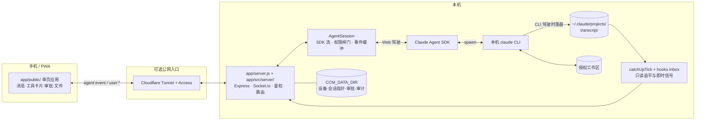

# 架构说明

> 本文解释 Claude Chat Mobile 如何在“不共享实时 TTY”的前提下，让 Web 与终端 CLI 续用同一套配置和落盘会话。

[English](architecture.en.md) · [返回 README](../README.md)

## 设计目标

Claude Chat Mobile 是一层本机转发与同步服务：

- Web 发起任务时，通过 Claude Agent SDK 驱动本机 `claude` CLI。
- 终端直接运行任务时，不接管终端进程，只读取 CLI 已落盘的 transcript。
- 两端共享项目配置、工具、权限来源和会话记录，但同一时刻只允许一个驾驶员写入。
- 手机断线或切后台后，重新连接时可以去重并补发服务端仍保留的事件。

它不是远程桌面、TTY multiplexor、多租户托管服务，也不会把终端进程的 stdin/stdout 暴露给浏览器。

## 总体组件



Cloudflare 不是必需组件。同一 WiFi 可直接访问本机 server；固定公网部署才需要 Tunnel/Access 或等价的安全入口。

## 两条数据路径

### Web 驾驶

1. 浏览器建立 Socket.io 连接，通过 `AUTH_TOKEN` 或 Cloudflare Access 完成鉴权，再通过设备门。
2. 用户事件以 `user:*` 进入 server，并按 `instanceId` / 当前视图路由到对应 `AgentSession`。
3. `AgentSession` 把消息送入 Agent SDK streaming input；SDK 启动或续接本机 CLI，让它在授权 `cwd` 中工作。
4. SDK 输出经映射层转成文本、工具、审批、提问、状态、后台任务等产品事件。
5. 所有出向事件统一封装为 `agent:event`，前端按会话与实例分流并渲染。

Web 会话并不是远端 Anthropic 聊天页。SDK 子进程继承本机 CLI 的登录态、项目 `CLAUDE.md`、Claude settings、MCP、skills、hooks 和受控 provider 环境。

### CLI 驾驶

1. 用户在电脑终端直接运行 `claude`。这个进程不经过 Claude Chat Mobile 的 Agent SDK 子进程。
2. CLI 把已经完成的消息写入 `~/.claude/projects/` 下的 transcript。
3. server 的 `catchUpTick` 常态每 2.5 秒检查当前会话的磁盘变化（进入只读镜像后收紧到 1 秒，解锁前的静默判定按约 12.5 秒墙钟折算），并把新增的落盘消息推给 Web。**文件变长不等于历史变长**：`/rewind` 之后终端发出的下一条消息会挂到回退锚点上，废弃的那一段就此脱链，于是行数在涨而有效历史在缩（实测 2251→2268 行，回显 607→579 项）。所以追平不能只认增长，收缩与「前缀被重写」都要走全量重推 + 标脏。
4. 回显跟随 CLI 的**当前链**而不是文件的物理行序：哪些 uuid 还在链上由 SDK 的 `getSessionMessages` 给（并行工具调用的合法分叉自己回溯 `parentUuid` 会漏掉那一支）。取不到时 fail-open 回落全量——少显示历史是静默的，多显示几条废弃分支是看得见的。
   **但那个集合只用来剪「当前链开始之后」的分支**：它表达的是「还在模型上下文里的消息」，而 `/compact` 把边界之前的整段移出上下文时**一行都没删**，那段记录仍属于这个会话。2026-09-22 之前按它整体过滤，真机 349 个会话里 16 个压缩过、13 个丢了开头，最狠的主链 1284 条只回显 3 条——而抽屉里那条会话的标题恰恰取自开头那句话。这里原本写着「代价是 compact 过的会话在 Web 上同样只剩压缩点之后的内容，与终端一致」，**该取舍已撤销**：同句前半段「它同时算对了 `/compact` 脱链」实测是错的（同一个会话换官方算法只从 3 条变成 4 条），「与终端一致」那半句也从未被验证过。现在的代价换成两条：边界之前若也 rewind 过，那段废弃分支会重新露面；`compactMetadata` 点名保留的 uuid 物理上位于边界之前，会让「链已开始」提前成立，于是它到边界之间那一小段仍按当前链剪（实测 16 个压缩会话共 3 条，全部是触发压缩的 `/compact` 命令行本身）。
5. 可选 hooks bridge（`npm run hooks:install`）把 Stop / Notification 写入 `~/.claude/ccm/hooks-v1/` 文件投递箱，server 用 `fs.watch` 消费，把「回合结束/需要你」从轮询变成即时信号；未安装则回落轮询。`fs.watch` 只是加速触发器，磁盘 transcript 仍是真相源。
6. 可选 statusline bridge 给 CLI 会话写入模型、effort、上下文、成本和额度快照。

因此只读镜像有明确限制：

- 只能看到已经落盘的内容，不是实时 stdout。
- 不能向终端进程输入，也不能附着到它的 stdin。
- 尚未落盘的 thinking、子 agent 中间过程或工具输出可能暂时不可见。
- 跨会话“需要你”聚合只覆盖 Web 后端正在驱动的实例；纯终端里等待的会话不进这个聚合，只能靠可选 hooks bridge 单独通知。
- hooks 可以缩短“回合结束/需要你”的发现时间，但不会把镜像变成共享 TTY。
- 终端里的 `/rewind` 在**发出下一条消息之前完全不落盘**（它只切 REPL 内存里的消息数组，`~/.claude/sessions/` 的注册表也只有进程元数据、不含链状态），镜像侧因此无从感知——刷新页面或重启服务都读的是同一份没变的文件。这不是轮询延迟，是没有可观测的状态。**该窗口内不要从 Web 端发消息**：Web 的 SDK 子进程从磁盘重建上下文，会挂在 rewind 前的叶子上，那次回退当场作废，随后两端各写一条链。窗口通常只有几秒——在终端把下一条消息发掉，两边就一致了。

> Web 端自己也有回退（同样输入 `/rewind`，两步面板与终端的三个模式一一对应），但动到对话的两种模式走的是 `forkSession` 到**新会话**、原会话一个字节不动，与终端的原地回退是两套语义；「只恢复代码」不分叉。判据与取舍见 `app/src/sessions/rewind-plan.js` 头注。

## 单驾驶员模型

共享 transcript 不等于允许两端同时写。并发启动两个独立 Claude turn 可能造成上下文分叉、文件竞争和错误的结束状态。

项目用以下规则降低风险：

1. **Web 驾驶时**，该 `AgentSession` 是写入方，前端执行“一轮一条”并在任务中把发送键改为停止键。
2. **检测到 CLI 外部写入时**，server 标记磁盘状态比 SDK 内存更新，Web 进入只读镜像。
3. **CLI 仍在运行时**，Web 不向同一会话发送新消息；界面展示终端驾驶状态。
4. **终端回合结束并经过静默判定后**，镜像锁释放，Web 才能续接。静默判定只认**终端写的**未完结尾部
   （transcript 逐条自报写入方：CLI 写 `cli`，本项目 SDK 写 `sdk-ts`）——己方 SDK 留下的未完结尾部撑不住锁，
   否则 Web 等一条审批时就会自锁：尾部恒未完结 ⇒ 锁恒维持 ⇒ 手机只读 ⇒ 点不到「批准」⇒ 审批永远等下去。
5. **Web 接管发送前**，若 transcript 相对现有 SDK 实例有外部增长，server 先 dispose 旧实例并 resume 吸收，再发送新消息。

**这五条是默认路径，不是硬约束。** 项目管得住自己的 SDK 实例，管不住终端里那个独立进程：镜像锁只作用于 Web 端的输入，
用户仍可在只读态下点「强制立即续接」/「仍要续接」显式解锁（`app/public/js/app.js` 的 `requestMirrorResume` /
`appendForceResumeAction`，两条路径都要过一次写明分叉风险的确认框）。解锁只是撤掉 Web 侧的锁，**不会停止终端进程**——
若终端此后继续写同一会话，仍会形成两条 transcript 分支。这个逃生口是有意保留的：用户常常比判定链更早知道终端已经关掉。

轮询意味着存在最多一个检查周期的观察窗口。切换会话、手动刷新镜像与 hooks 信号会主动插队触发检查，但它们仍不能证明对另一个活进程拥有控制权。

## 额度墙到点自动继续

终端里的 Claude Code 撞上用量额度墙后，会等到重置时刻自动发一句「继续」（设置项 `autoContinueAtUsageLimit`，默认开）。但这个能力只在**交互模式**里生效：CLI 的总闸是 `launchOptions.isInteractive()`，`-p` / `--sdk-url` / stdout 不是 TTY 任一成立就进不去，而 SDK 拉起的 CLI 恰好是管道（本项目与桌面端 Code 标签都是）。桌面端的「到点续跑」是它前端自己补的。所以本项目也在 server 里补：`app/src/server/auto-continue.js` 管状态与调度，`app/src/agent/quota-auto-continue.js` 放判定纯函数。

1. **布防**：主循环撞上 `rate_limit` 墙时，`AgentSession` 通过 `onQuotaWall` 上报墙的事实（`quotaLimits`、同一轮收到的 rejected `rate_limit_event`、这一轮由谁发起、撞墙前有没有真模型输出）。判定照抄 CLI：`status='rejected'`、带有限的 `resetsAt`、没在用超额额度，才能布防；到点 = 重置时刻 + 30–90 秒抖动；重置点远于 24 小时（多半是周额度）不自动等，只在横幅上给「仍要到点继续」。子 agent 撞墙不布防：那时主循环可能还在跑。
2. **状态按 sessionId 挂在 server，不挂在实例上**。等待常达 5 小时，而空闲 30 分钟的实例就会被回收；到点时实例多半已不在，要 resume 一个出来再发。空闲回收不影响布防，但用户显式关掉这个会话的标签、删除会话、或自己接着发了消息，布防即作废（CLI 的对应物是退出进程）。横幅数据随 `instances` 广播的 `autoContinue` 字段下发（真 server 恒带数组；前端把缺字段当成「保留上一份」，只为兼容 E2E mock 的旧式载荷）。
3. **到点前四道复核**，任一不过都不代发：自动布防的条目开关此刻仍开着；transcript 尾窗里墙仍是主链最后一条对话（CLI resume 被打断回合时补的 isMeta「Continue from where you left off.」与 `<synthetic>` 的「No response requested.」不算）；注册表里没有终端或桌面端开着这个会话（单驾驶员，`SESSION-01`）；实例没有在跑一轮、没有 `externalDirty`。复核读不到或可能有别的驾驶员时转 **stale**，由用户在横幅上点「继续」。
4. **发出去的是 CLI 同款提示词**，但去掉了 `claude.ai` 字样，SDK 归属标成 `{kind:'auto-continuation'}`（CLI 自己续跑用的也是它），不冒充人类键盘输入。前端据 `user_message.origin` 与历史条目的 `origin` 给这条气泡加「额度重置后自动继续」标注。
5. **睡眠与重启**：tick 每 30 秒一拍，两拍间隔超过 30 分钟且已过点，就当作机器睡过了重置点，转 stale、不自动发（同 CLI）。**重启即作废，不落盘**，理由有两条：CLI 退出时同样作废；另外这与 `APPROVAL-02` 是同一个立场，重启时残留的待执行动作不再执行。布防事实本来可以从 transcript 重建（墙条目自带 `quotaLimits`），重建不了的只有用户点过的「取消」，而为它新增持久化层换来的是「重启后自动替你开跑」，这种行为更难预期（hard-rules §1「不新增持久化层」）。
6. **续跑后又撞墙**：续跑那一轮一个字没产出就撞墙，才算空转，计一次，重试最少间隔 60 秒、300 秒，超过 2 次熔断。与 CLI 有一处有意差异：CLI 把「续跑那一轮里撞墙」一律计数，跨多个 5 小时窗口的长任务因此会在第三个窗口被截停，而这恰恰是本功能的主用例。

**官方订阅与第三方网关**：一律数据驱动，不判断上游是谁（hard-rules §1「对模型通路零假设」）。官方订阅的墙恒带重置时刻；第三方网关如果透传了 unified 限额头，CLI 会报出同样的结构化墙，行为完全一致；网关只回一个裸 429 时，CLI 报不出重置时刻，这里不布防，也不拿「多久以后再试」去猜，会话里提示一句「上游没有给出额度重置时间，无法到点自动继续」。重试有熔断，网关重置时刻不准时最多多撞两次墙。

**开关**：`CCM_AUTO_CONTINUE_AT_LIMIT`（面板可关，默认开）与 CLI 的 `autoContinueAtUsageLimit`（在终端 `/config` 里关掉，web 这边也跟着关）任一关掉，都退回「只给选项」：撞墙时横幅提供「到点自动继续」按钮，用户点了才布防。手动布防的条目不受开关约束，因为开关管的只是「自动」。

## 事件信封与断线回放

出向 Socket.io 只使用一个 `agent:event` 信封：

```json
{
  "seq": 42,
  "epoch": "server-instance-id",
  "sessionId": "cli-session-id",
  "instanceId": "web-instance-id",
  "cwd": "/approved/workspace",
  "ts": 1780000000000,
  "type": "text_delta",
  "payload": {}
}
```

- `type` 是闭合事件集合，由 `tests/gates/contract-check.js` 对**后端发送方**（递归扫 `app/src/`）与 **mock server** 做一致性校验；入向 socket 事件另查前端 emit 是否都在契约内。
  出向另有一道**前端接收面覆盖**检查：`app/public/js/app.js` 的 `handle` 表 + `outOfBand` 表键并集必须精确等于 `AGENT_EVENT_TYPES`（少一个＝事件到达浏览器后静默丢弃，多一个＝死键），同一 type 落进两表也拦（`outOfBand` 在派发时优先，`handle` 那条会变成死代码）。`event-dispatch.js` 的 `DEFAULT_REPLAY_OOB_TYPES` 是 `outOfBand` 的平行副本，同样被钉成逐字一致——漏改它会让新的 OOB 类型被 replay buffer 误入队，在 `resolve('reload')` 时永久丢失。
- `replay: true` 标记这批是 `sync:since` 补发而非实时到达。**它只补渲染内容，对运行态完全中性**——既不点亮也不清除。运行态的真相源是 `instances` 广播，而那里**两个字段各管一件事，不可混用**：
  - `state`（`idle`/`busy`/`permission`/…）驱动**运行条**与抽屉角标。它是粗粒度的——服务端 `stateOf()` 把 `hasBgTasks()` 也折进 `busy`，**所以不能只看它**。带上 `bgActive` 与 `turnRunning` 才是完整判据，三者的组合只有两条规则：
    - `turnRunning === true` → **一定显示运行条**，哪怕同时挂着后台任务（`bgActive` 与 `turnRunning` 可以并存）。
    - 否则退回 `shouldBindBusyFromBroadcast`，它对 `bgActive === true` 恒返回 false——**纯后台任务期不由运行条表达**，那一段归 `task_progress` 横幅（该期没有 `result` 可释放，点亮了就没人清）。
    - 这两条缺任一条都错过：少了第一条，「后台任务 + 前台轮并存」时前台轮被误判成不存在；少了第二条，纯后台任务活着的整段时间里运行条和红色停止钮都撤不掉。
  - `turnRunning`（只认在途轮）驱动**停止钮与发送闸**。纯后台任务期 `state` 是 `busy` 而 `turnRunning` 为 false，此时**不得**锁发送、也不得把主按钮变成停止钮——移动端回车不发送、只能点那个钮，锁了就是彻底发不出消息（判据见 `logic/composer.js` 的 `resolveComposerPrimaryMode`）。
  - 回放里的 delta 与轮次终止事件（`result` / `error` / `system:interrupted`）**必须成对地都不写运行态**。只挡一半会翻车：批次里若既有已结束的旧轮、又有当前正在跑的新轮，旧轮那条 `result` 会清掉 `bindView` 刚按权威 `state` 播下的 busy，而属于新轮的 delta 已不会再点亮它——运行条与停止钮双双消失，用户看到「空闲」，发出去的消息却被服务端以在途轮为由拒掉。
  - **`liveLine.retry` 是这条中性规则的唯一例外，回放照样清它。** `api_retry` 走 `emitTransient`（不进环形缓冲），所以本地那份 retry 只可能是本次连接期间收到的；而典型时序正是「收到 `api_retry` → 断线 → 重连 → 回放那条成功的 `text_delta`」，回放的输出本身就是重试已通的证据。不清的话 `renderLiveLineText` 优先渲染 retry，spinner 会一直显示旧的 API 错误、倒计时卡在 0，且没有自愈路径。
- 清 busy 的两条通道都是**被动**的：轮次终止事件可能在用户切走时被实例过滤按视图丢弃，而 `shouldForceClearBusyFromBroadcast` 那条看门狗只在**收到广播时**才跑，系统空闲时广播根本不来。故 `app.js` 的 `startLiveTicker` 每秒按权威 `state` 自检一次兜底，不依赖广播到达（2026-09-12 真机：会话早已结束，切回去仍挂着运行条和红色停止钮，此后 100 秒内无任何 instances 广播）。
- `seq` 在一个 `AgentSession` 内递增，前端据此去重。
- `epoch` 标识服务端/实例世代；变化时客户端重置旧的去重基线。
- `sessionId` 与 `instanceId` 分开，避免同一 CLI 会话的逻辑身份和当前 Web 进程实例混淆。
- 每个 AgentSession 保留有界环形缓冲；客户端以 `sync:since` 请求仍在缓冲中的缺口。

环形缓冲不是永久历史。缺口超出缓冲或服务重启时，客户端回退到鉴权的 `session:history`，从 CLI transcript 重建稳定消息。高频瞬态状态不会全部进入永久历史。

## 鉴权与范围边界

```text
AUTH_TOKEN（必备，无它不启动） ‖ 公网 IdP 策略（可选，当前唯一实现 Cloudflare Access）
  按 Host 二选一：IdP 管的公网 Host 只认 IdP 凭据，其余入口只认 token
        ↓
设备信任（真·本机直连豁免；经 IdP 进来的连接默认也豁免，DEVICE_APPROVAL_SCOPE=all 时不豁免）
        ↓
WORKDIRS 范围门
        ↓
CLI permissions.allow + Web 当前权限档
        ↓
Agent 工具审批或用户直接文件编辑
```

第一层是**前提而非选项**（[hard-rules §1「鉴权是启动前提」](hard-rules.md)）：没有 `AUTH_TOKEN`
连 server 都起不来，本机浏览器打开也一样。但这不等于每个连接都持有令牌：IdP 开着时，它管的公网 Host
只认 IdP 凭据（JWT），`AUTH_TOKEN` 在那条路上既不要求也不放行。所以下游各层的前提按入口分两种——
IdP 管的公网 Host 上是「对方已过 IdP」，其余入口上是「对方已持令牌」；要把 token 交出去的逻辑
（如 `connect:qr`）必须先看连接走的是哪条（[hard-rules §6](hard-rules.md)）。
第二层写成「公网 IdP 策略」而不是具体产品名，是因为核心代码只认 `app/src/auth/auth-strategy.js`
的接口形状；Cloudflare Access 是当前唯一实现，换 IdP 不该动核心。

这些边界互不替代：

- `AUTH_TOKEN` 证明请求持有实例密钥，不代表设备已经获准。
- Cloudflare Access 是**可选的**公网身份层，不扩大工作区。开着时在它管的公网 Host 上**替代 token**（那条路只认 JWT），默认还**替代**设备审批（第二因子）；LAN / 本机入口不受影响，仍只认 token。关着时设备审批自动顶上——`AUTH_TOKEN` + 设备审批就是所有拓扑共同的公网基线。
  - ⚠ 「替代」是字面意义上的：经 Access 进来的连接**完全不查** `trusted-devices.json`，于是「已受信任的设备」那张表**管不到它们**——吊销一台经隧道进来的手机既不会断线也不会被拦（2026-09-10 实测确认）。判据在 `shouldBypassDeviceApproval` 的第一行。
  - 想让那张表对所有路径生效，把 `DEVICE_APPROVAL_SCOPE` 设为 `all` 并重启。它是**覆盖全部路径的总开关**：经 Access 进来的新设备要批准一次，本机样 Host 那条也一并关掉。后半条是必须的——那条判据读 Host，而 **Host 是客户端填的头**，纯 TCP 转发（`ssh -R`、frp tcp）不按 Host 路由，远程来客自填 `Host: localhost` 就满足「peer 本机 + Host 本机」（peer 本来就是 loopback）。TCP 层面区分不了真本机与隧道转发，加判据也挡不住（转发头纯转发不加，`localAddress` 两者相同），所以交给知道自己拓扑的人决定（2026-09-17 安全审查 H1）。开了之后自救通道是 `node scripts/device.js approve`、菜单栏、跑 `npm start` 那个终端里按回车——都不读网络判据。缺省保持「Access 替代审批」且本机样放行，因为翻默认会让既有安装升级后一重启就把所有在用设备打回待审，而那时信任表里没有任何一台能用来批准。
- `WORKDIRS` 限定路径，不决定 Claude 工具是否自动获批（**首项即主工作目录**，手机端默认打开它；旧版外置 `workdirs.json` 仍受支持，经 `WORK_DIRS_FILE`；shell env 压过配置文件内联 `WORKDIRS`）。
- Agent 的 `canUseTool` 审批只管理 Agent 自主行为；用户在文件编辑器中点击保存属于直接写入，走独立的范围、大小、哈希与审计防线。

安全摘要见 [README 安全边界](../README.md#安全边界)，部署拓扑见[部署与运维](deployment.md)。

### 设备审批的四个入口

设备信任层的事实源是 `trusted-devices.json`，server 用文件监听把变更广播给在线客户端，因此任一入口批准后其余入口即时生效：

- 桌面端菜单栏（macOS CCM.app）—— 待审设备平铺在根菜单，已受信任的设备收在 `已受信任的设备 (N) ›` 子菜单里，点一项即吊销（强确认）
- Web 端由**已受信任的设备**远程准入，并在「设置 › 🔐 接入与设备 › 已受信任的设备」里吊销（`generalPage-devices`，不是「🖥 宿主机」那一页）
- headless 终端里直接回车 / deny —— **要求 TTY**，launchd 起的 server 没有 TTY，这条入口在受管服务下不可用
- `node scripts/device.js approve|deny <ID>`

新设备入列时会推一条通知，**正文不含设备 ID 与 IP**（推送通道未必端到端加密），并按 5 分钟节流避免同一设备反复重试刷屏。

#### 展示元数据是旁挂的，不参与判决

审批那一刻的 `userAgent` / `ip` / 时间记在**另一个文件** `device-profiles.json`（`{ token: { ua, ip, approvedAt } }`），供各端把一串 32 位 hex 显示成「iPhone · a3f21b09…a4b5 · 5 天前批准」。三条硬约束：

- **准入判决的事实源仍然只有 `trusted-devices.json` 一个**。profiles 丢了、坏了、读不出来，都只是面板退化成裸 ID，不影响任何一台设备能不能连上。写入方向也按这个立场选：profiles 写失败**不得**把 `approveDevice` 判为失败；信任表写失败时**不得**剔除 profile（否则留下一台查不出来路的匿名设备）。
- **`trusted-devices.json` 的格式一字不能动**（仍是一维字符串数组）。`loadTrustedDevices` 对「不是数组」的反应是落空集且**不走 catch 的 last-good 分支**——常驻 server 还跑着旧代码、磁盘上的 CLI 已经是新代码时（改完未重启是常态），旧进程会把信任设备数读成 0，watcher 那一轮把所有 `trustBasis === 'device-token'` 的连接断光。桌面端那侧同样致命：`CCMCore.swift` 声明的是 `let trusted: [String]?`，遇对象数组是 typeMismatch，JSONDecoder **整份 abort**，设备段整块消失。
- **只对新审批生效。** 元数据只在批准那一刻记得下来，事后无从补。本功能上线之前批准的设备如实显示「无批准记录」；要补上，**吊销后让该设备重新申请一次**——已受信任的设备重连不会重新进待审列表（`isDeviceTrusted` 命中就直接放行），所以断线重连、重启浏览器都不会刷新它。

#### 列表里怎么分辨设备

一台设备＝**一个浏览器实例**（`deviceToken` 生成后存在该浏览器的 `localStorage`）。所以同一部手机用系统浏览器和用微信内置浏览器打开，是**两条独立记录**；清缓存、无痕窗口同理。二维码只是投递地址+令牌，不改变这一点。

自动信息能拿到多少，取决于浏览器给不给：

| 想显示的 | 来源与限制 |
|---|---|
| 平台（iPhone / Android / Mac…） | UA，恒可得。`deviceKindLabel`，与 `CCMCore.swift` 的同名函数互为镜像 |
| 浏览器 + 主版本 | UA，恒可得。判定顺序必须**派生在前、基底在后**——几乎每个 Chromium 派生浏览器的 UA 都带 `Chrome/`，而每个 Chromium UA 又都带 `Safari/537.36` |
| Android 机型代号 | **多数拿不到，且这是正常的**。Chrome 做过 UA reduction，机型位被冻结成字面量 `K`、系统版本钉死在 `10`；只有微信/QQ 等不冻结 UA 的 webview 才露出真实机型。拿不到就不显示，**绝不把 `K` 当机型** |
| iOS 机型 | **永远拿不到**。Apple 既不在 UA 里给，也不支持 UA Client Hints |

`Sec-CH-UA-Model`（UA Client Hints）是 Chromium 系拿真实机型的唯一途径，但它要求**安全上下文**——局域网 `http://` 入口下不可用，恰好是最需要分辨的那一档。故本产品不走这条路。

**别名是唯一对所有平台都成立的分辨手段**：用户在列表里点 ✎ 就地起名，存进 `device-profiles.json` 的 `alias`，设了就压过所有自动信息。归一在 `normalizeDeviceAlias`（剥控制字符 → 折叠空白 → 按**码点**限长 24；空白等于清除）。改名走 `user:renameTrustedDevice`，寻址同吊销用 `shortId`，但**没有自改守卫**——给自己这台起名不像吊销那样会把自己踢下线。

Web 侧那份列表经 `agent:event` 的 `trusted_devices` 下发，**载荷里没有任何全量 token**，只有 `shortId`（前 8…后 4）+ `kind`/`browser`/`model`/`alias`/`ua`/`ip`/`approvedAt`/`isCurrent`，顶层另带 `accessBypassActive`（告诉界面这张表此刻对隧道流量是否失效）；吊销走 `user:revokeTrustedDevice` 并按 `shortId` 反查，0 命中或多命中一律拒绝、绝不任选一条。这条红线守的不是「防局域网窃听」（该广播只发给已批准连接），而是**让吊销真的能吊销**：一台拿到过全量信任表的设备，日后被吊销时手里仍握着其余设备的 token。同理，当前这台设备在 Web 上不给吊销按钮（服务端也拦），否则一键就能把自己踢下线，若那是唯一在线的可信端就只能回到电脑前才能重批。

### 离线唤醒与推送抑制

离线唤醒走 web-push / ntfy。**先分清两条路径**：服务端推送（锁屏、切到别的 app、PWA 被 OS 冻结都收得到）与前端 `Notification` API（只在页面还活着时有效）。本节说的是前者，两者的触发面不同，别拿一边的规则解释另一边。

抑制策略按「用户是否可能看不到」分档，而不是按事件重要性：

- **审批、提问、后台任务完成：无条件推。** 这三类都意味着有人在等一个动作，而用户此刻可能锁屏或在别的 app 里。
- **回合完成的 `result`、模型静默告警 `gateway_stall`：仅当 approved 房间存在前台可见连接、且那个连接正看着这条会话时才抑制。** 前台判据是客户端主动上报的 `client:presence`，**不是 socket 是否连着**——手机切后台时 socket 常常还活着，拿连接状态当判据会让用户收不到本该收到的完成通知。

能产出推送的只有下面这些，其余一概不推：

| 来源 | 标题 | 档 |
|---|---|---|
| `permission_request` | ⚠️ Claude 请求许可 | 无条件 |
| `question` | ❓ Claude 有问题 | 无条件 |
| `task_notification` | ✅ / ⚠️ 后台任务完成 / 失败 | 无条件 |
| `result` | ✅ / ⚠️ / ⏹ 任务完成 / 出错 / 已中止 | 前台可见则抑制 |
| `system` 且 `notice=gateway_stall` | ⏳ 模型长时间无响应 | 前台可见则抑制 |
| 新设备握手 | 🔐 新设备请求接入 | 不走 `agent:event` |
| CLI hooks 的 `Stop` / `Notification` | ✅ 终端会话完成一轮 / ⚠️ 终端会话需要你 | 不走 `agent:event` |
| presence 跳变为「无前台」且此刻有实例在跑 | ⏳ 任务仍在后台运行 | 不走 `agent:event` |

`agent:event` 的 31 种 type（`AGENT_EVENT_TYPES`）里只有前五种命中，其余全部落 `default → null`——工具调用、流式文本、模型切换、压缩边界、`api_retry`、普通 system notice 一条都不推。后三条不属于任何 envelope type，**刻意拆成独立函数而非塞进那个 switch**：`NOTIFY_CATEGORY` 的节流键也按 type 建，混进去会让「type 对应真实 envelope 类型」这条隐含契约失效。

`task_notification` 只认**真后台任务**。CLI 把跑得久的前台 Bash 也建模成 task（`task_type: local_bash`、`is_backgrounded: false`），完成时走同一条通道且全程不发 `background_tasks_changed`——所以「不在 `bgTasks` 里」不能当判据，唯一可靠的是 `task_started` 上的 `is_backgrounded`（`task_notification` 自己不带这个字段）。不过滤的话，每条跑过几秒的前台命令都会被播报成「后台任务完成」并打到锁屏手机上。

节流分两层：①审批/提问置 `pending`，必须等 `request_resolved`（真的批了/答了）才解除，堆着没处理的不重复推；②同类最小间隔，默认 60s，`gateway_stall` 用 10min（告警源在坏天气下每 90–120s 一条，套 60s 等于每条都推），设备审批用 5min。`result` 与 `task_notification` 属一次性终态、没有「被处理」这个动作，只受②约束。

推送 body 默认最小化、不含消息正文；用户可按设备开启「推送内容预览」，之后改发 `previewBody`。**设备审批那条连开关都不给**——`deviceId` / `ip` / `userAgent` 恰恰是审批时要核对的三项，而 ntfy 是明文经第三方，那个函数只解构 `count`，多余字段结构上就取不到。实现见 `app/src/ops/notifications.js` 与 `app/src/ops/notify-channels.js`。

## 状态与持久化

| 数据 | 事实源 | 用途 |
|---|---|---|
| Claude 对话 | `~/.claude/projects/` transcript | CLI/Web 续接与稳定历史 |
| Web 实例运行态 | 内存中的 `AgentSession` | 流式 turn、审批、事件缓冲 |
| CCM 控制面 | `CCM_DATA_DIR` | 会话指针、设备、审批、审计、推送、已读位点与缓存 |
| 工作区白名单 | `WORKDIRS` | 限定可见与可操作目录（首项 = 主工作目录） |
| Web 驾驶状态栏 | SDK 事件 | 当前模型、上下文、成本、effort |
| CLI 驾驶状态栏 | 可选 statusline 快照 | 终端会话的只读状态展示 |
| CLI 即时信号 | 可选 hooks 投递箱 | Stop / Notification 加速与通知 |
| 额度墙自动继续的布防 | server 进程内存（`auto-continue.js`） | 到点续跑与横幅；**重启即作废、不落盘** |

`CCM_DATA_DIR` 不保存 Claude 原始 transcript。清理它会影响 CCM 的控制面状态，但不会等同删除全部 Claude 会话；SDK 真删会话是另一条显式操作。

## 运行时可观测与服务可见性

### 两个鉴权端点

- `GET /health` → `{status, sessionId, busy, versions, buildNonce, timestamp}`
- `GET /metrics` → `{metrics{activeSessions, events, catchUpHits, catchUpReloads, rateLimitLockouts, pushSuccess, pushFailure, ntfyFailure, clientErrors, hookEventsConsumed, hookEventsIgnored, hookPushes, sideQuestionSuggestions, sideQuestionRecaps}, state, states, timestamp}`

设了 `AUTH_TOKEN` 时两者都需带 `?token=` 或 `x-auth-token` 头，否则 401。`state` / `states` 是 StateProbe 的状态分类：后端产出其中四类，`host_offline` 由客户端心跳判定，后端无从知道自己已经联系不上。

`/metrics` 是**鉴权 JSON 快照，不是 Prometheus 文本**——n=1 自托管默认没有 scraper，多实例 scrape 属于要先改立场的事（见 [hard-rules](hard-rules.md)）。历史回显同样走鉴权的 `session:history` socket 事件；**项目不开无鉴权的 HTTP 数据端点**。

### 服务状态面板：判定化，不是计数器

面板渲染四段：基础信息 + 判定化告警 + 安全日志 + 重启记录。**不展示裸计数器**——一个孤零零的 `pushFailure: 3` 对人没有参照系、无法解读，原始计数留给 `/metrics` 巡检。

告警随 `instances` 广播的 `service{startedAt, deliveryFailure, rateLimitLockout, clientError}` 字段下发，均带 24h 时效窗自动退场。每条告警都要说得出「是谁、为什么」：

- **限速锁定**带 `source`（限速桶 key），前端 `describeRateLimitSource` 分本机 / 局域网 / 公网三档改措辞与判色。**本机来源绝不说成「有人在暴力尝试」**——自己输错一次密码不是攻击。
- **投递失败**带 `reason`，由后端 `describeDeliveryError` 清洗，保证不含 endpoint URL。

两者都走 `metrics.label()` 这张非数值上下文表，不进 `/metrics` 的数值面。

安全日志段读 `audit:get`，这是 `data/audit-records.json` 的唯一读取面：只读、过 deviceApproved 闸、不开 HTTP 端点。

### 服务告警与「需要你」是不同轴，绝不混判

- 顶栏 chip / 角标只表达「点一下就能处理」的待办（审批、提问）。
- 服务告警只活在抽屉「服务」小节与服务状态面板里。

把推送投递失败混进「需要你(N)」会让那个数字失去含义：用户点进去发现无事可做，下次就不再信它。

## 代码入口

- `app/server.js`：兼容启动入口；实际装配在 `app/src/server/app.js`。
- `app/src/agent/agent.js`：`AgentSession`、SDK 映射、权限闸门与环形缓冲。
- `app/src/server/mirror-engine.js`：catchUp 追平调度与镜像状态机（状态自持）。
- `app/src/server/auto-continue.js` / `app/src/agent/quota-auto-continue.js`：额度墙到点自动继续的调度（状态自持）与判定纯函数。
- `app/src/sessions/history.js`：transcript 读取、历史重建与镜像判定纯函数。
- `app/src/ops/cli-hooks-bridge.js` / `app/src/ops/cli-statusline-bridge.js`：CLI 侧信号与快照消费。
- `app/public/js/app.js` 与 `app/public/js/app/`：客户端状态、事件派发与交互模块。
- `tests/gates/contract-check.js`：双向 Socket.io 事件契约门禁。

目录职责与模块边界见[硬性规则索引](hard-rules.md) §3.3（那份索引同时收录 n=1 取舍与已决技术债）；模型、effort 与 statusline 的跨层变换见[展示契约](display-contracts.md)。
