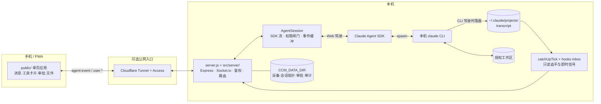

# 架构说明

> 本文解释 Claude Chat Mobile 如何在“不共享实时 TTY”的前提下，让 Web 与终端 CLI 续用同一套配置和落盘会话。

[English](architecture.en.md) · [返回 README](../README.md)

## 设计目标

Claude Chat Mobile 是一层本机转发与同步服务：

- Web 发起任务时，通过 Claude Agent SDK 驱动本机 `claude` CLI。
- 终端直接运行任务时，不接管终端进程，只读取 CLI 已落盘的 transcript。
- 两端共享项目配置、工具、权限来源和会话记录，但同一时刻只允许一个驾驶员写入。
- 手机断线或切后台后，重新连接时可以去重并补发服务端仍保留的事件。

它不是远程桌面、TTY multiplexor、多租户托管服务，也不会把终端进程的 stdin/stdout 暴露给浏览器。

## 总体组件



Cloudflare 不是必需组件。同一 WiFi 可直接访问本机 server；固定公网部署才需要 Tunnel/Access 或等价的安全入口。

## 两条数据路径

### Web 驾驶

1. 浏览器建立 Socket.io 连接，通过 `AUTH_TOKEN` 或 Cloudflare Access 完成鉴权，再通过设备门。
2. 用户事件以 `user:*` 进入 server，并按 `instanceId` / 当前视图路由到对应 `AgentSession`。
3. `AgentSession` 把消息送入 Agent SDK streaming input；SDK 启动或续接本机 CLI，让它在授权 `cwd` 中工作。
4. SDK 输出经映射层转成文本、工具、审批、提问、状态、后台任务等产品事件。
5. 所有出向事件统一封装为 `agent:event`，前端按会话与实例分流并渲染。

Web 会话并不是远端 Anthropic 聊天页。SDK 子进程继承本机 CLI 的登录态、项目 `CLAUDE.md`、Claude settings、MCP、skills、hooks 和受控 provider 环境。

### CLI 驾驶

1. 用户在电脑终端直接运行 `claude`。这个进程不经过 Claude Chat Mobile 的 Agent SDK 子进程。
2. CLI 把已经完成的消息写入 `~/.claude/projects/` 下的 transcript。
3. server 的 `catchUpTick` 常态每 2.5 秒检查当前会话的磁盘变化（进入只读镜像后收紧到 1 秒，解锁前的静默判定按约 12.5 秒墙钟折算），并把新增的落盘消息推给 Web。
4. 可选 hooks bridge 把 Stop / Notification 写入文件投递箱；`fs.watch` 只是加速触发器，磁盘 transcript 仍是真相源。
5. 可选 statusline bridge 给 CLI 会话写入模型、effort、上下文、成本和额度快照。

因此只读镜像有明确限制：

- 只能看到已经落盘的内容，不是实时 stdout。
- 不能向终端进程输入，也不能附着到它的 stdin。
- 尚未落盘的 thinking、子 agent 中间过程或工具输出可能暂时不可见。
- 跨会话“需要你”聚合只覆盖 Web 后端正在驱动的实例；纯终端里等待的会话不进这个聚合，只能靠可选 hooks bridge 单独通知。
- hooks 可以缩短“回合结束/需要你”的发现时间，但不会把镜像变成共享 TTY。

## 单驾驶员模型

共享 transcript 不等于允许两端同时写。并发启动两个独立 Claude turn 可能造成上下文分叉、文件竞争和错误的结束状态。

项目用以下规则降低风险：

1. **Web 驾驶时**，该 `AgentSession` 是写入方，前端执行“一轮一条”并在任务中把发送键改为停止键。
2. **检测到 CLI 外部写入时**，server 标记磁盘状态比 SDK 内存更新，Web 进入只读镜像。
3. **CLI 仍在运行时**，Web 不向同一会话发送新消息；界面展示终端驾驶状态。
4. **终端回合结束并经过静默判定后**，镜像锁释放，Web 才能续接。
5. **Web 接管发送前**，若 transcript 相对现有 SDK 实例有外部增长，server 先 dispose 旧实例并 resume 吸收，再发送新消息。

**这五条是默认路径，不是硬约束。** 项目管得住自己的 SDK 实例，管不住终端里那个独立进程：镜像锁只作用于 Web 端的输入，
用户仍可在只读态下点「强制立即续接」/「仍要续接」显式解锁（`public/js/app.js` 的 `requestMirrorResume` /
`appendForceResumeAction`，两条路径都要过一次写明分叉风险的确认框）。解锁只是撤掉 Web 侧的锁，**不会停止终端进程**——
若终端此后继续写同一会话，仍会形成两条 transcript 分支。这个逃生口是有意保留的：用户常常比判定链更早知道终端已经关掉。

轮询意味着存在最多一个检查周期的观察窗口。切换会话、手动刷新镜像与 hooks 信号会主动插队触发检查，但它们仍不能证明对另一个活进程拥有控制权。

## 事件信封与断线回放

出向 Socket.io 只使用一个 `agent:event` 信封：

```json
{
  "seq": 42,
  "epoch": "server-instance-id",
  "sessionId": "cli-session-id",
  "instanceId": "web-instance-id",
  "cwd": "/approved/workspace",
  "ts": 1780000000000,
  "type": "text_delta",
  "payload": {}
}
```

- `type` 是闭合事件集合，由 `scripts/contract-check.js` 对**后端发送方**（递归扫 `src/`）与 **mock server** 做一致性校验；入向 socket 事件另查前端 emit 是否都在契约内。
  注意门禁**不检查前端有没有对应的接收 handler**——扫描面不含 `public/js` 的 `handle` 表，而前端对未登记 type 是静默丢弃。当前 26 型恰好全覆盖（前端 `handle` 表 + `outOfBand` 表合计），但那是靠人维护、不是靠闸门保证。
- `seq` 在一个 `AgentSession` 内递增，前端据此去重。
- `epoch` 标识服务端/实例世代；变化时客户端重置旧的去重基线。
- `sessionId` 与 `instanceId` 分开，避免同一 CLI 会话的逻辑身份和当前 Web 进程实例混淆。
- 每个 AgentSession 保留有界环形缓冲；客户端以 `sync:since` 请求仍在缓冲中的缺口。

环形缓冲不是永久历史。缺口超出缓冲或服务重启时，客户端回退到鉴权的 `session:history`，从 CLI transcript 重建稳定消息。高频瞬态状态不会全部进入永久历史。

## 鉴权与范围边界

```text
HTTP / Socket 鉴权
        ↓
设备信任或 Cloudflare Access
        ↓
WORK_DIR / workdirs.json 范围门
        ↓
CLI permissions.allow + Web 当前权限档
        ↓
Agent 工具审批或用户直接文件编辑
```

这些边界互不替代：

- `AUTH_TOKEN` 证明请求持有实例密钥，不代表设备已经获准。
- Cloudflare Access 是公网身份层，不扩大工作区。
- `WORK_DIR` / `workdirs.json` 限定路径，不决定 Claude 工具是否自动获批。
- Agent 的 `canUseTool` 审批只管理 Agent 自主行为；用户在文件编辑器中点击保存属于直接写入，走独立的范围、大小、哈希与审计防线。

安全摘要见 [README 安全模型](../README.md#安全模型)，部署拓扑见[部署与运维](deployment.md)。

## 状态与持久化

| 数据 | 事实源 | 用途 |
|---|---|---|
| Claude 对话 | `~/.claude/projects/` transcript | CLI/Web 续接与稳定历史 |
| Web 实例运行态 | 内存中的 `AgentSession` | 流式 turn、审批、事件缓冲 |
| CCM 控制面 | `CCM_DATA_DIR` | 会话指针、设备、审批、审计、推送与缓存 |
| 工作区白名单 | `WORK_DIR` / `WORK_DIRS_FILE` | 限定可见与可操作目录 |
| Web 驾驶状态栏 | SDK 事件 | 当前模型、上下文、成本、effort |
| CLI 驾驶状态栏 | 可选 statusline 快照 | 终端会话的只读状态展示 |
| CLI 即时信号 | 可选 hooks 投递箱 | Stop / Notification 加速与通知 |

`CCM_DATA_DIR` 不保存 Claude 原始 transcript。清理它会影响 CCM 的控制面状态，但不会等同删除全部 Claude 会话；SDK 真删会话是另一条显式操作。

## 代码入口

- `server.js`：兼容启动入口；实际装配在 `src/server/app.js`。
- `src/agent/agent.js`：`AgentSession`、SDK 映射、权限闸门与环形缓冲。
- `src/server/mirror-engine.js`：catchUp 追平调度与镜像状态机（状态自持）。
- `src/sessions/history.js`：transcript 读取、历史重建与镜像判定纯函数。
- `src/ops/cli-hooks-bridge.js` / `src/ops/cli-statusline-bridge.js`：CLI 侧信号与快照消费。
- `public/js/app.js` 与 `public/js/app/`：客户端状态、事件派发与交互模块。
- `scripts/contract-check.js`：双向 Socket.io 事件契约门禁。

完整目录职责与文件清单见[仓库地图](repository-map.md)；模型、effort 与 statusline 的跨层变换见[展示契约](display-contracts.md)；n=1 取舍与已决技术债见[硬性规则索引](hard-rules.md)。
