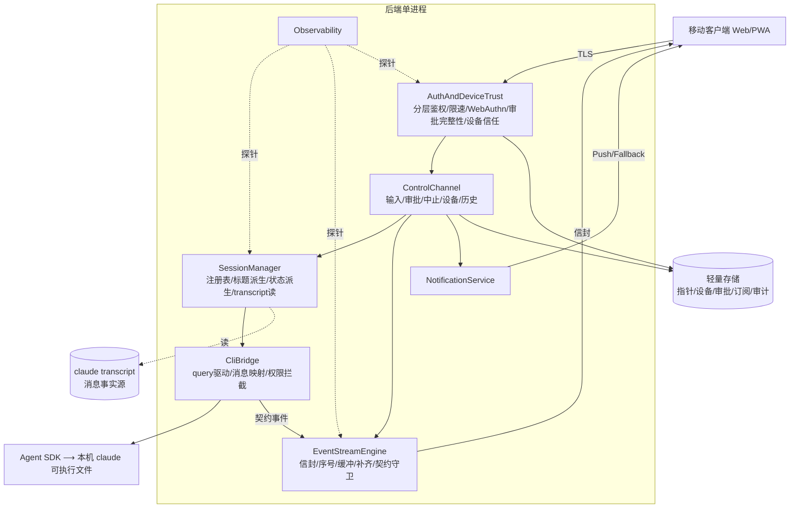
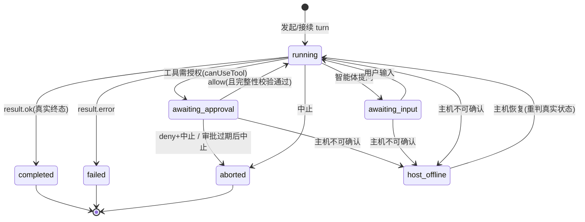
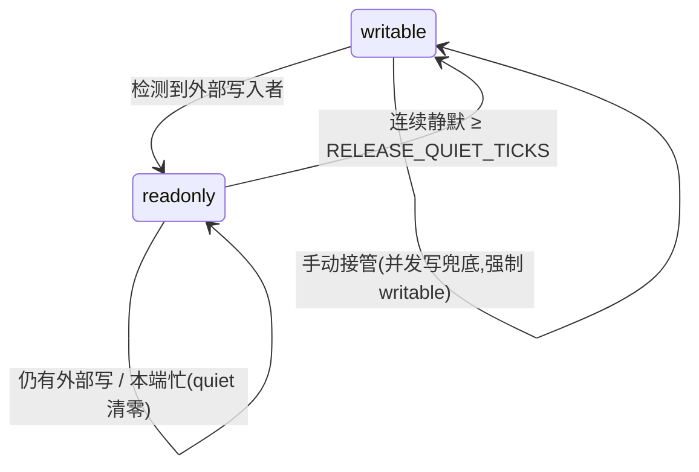
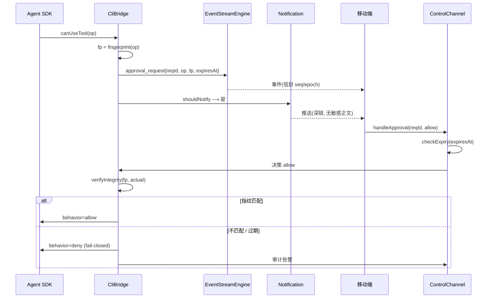
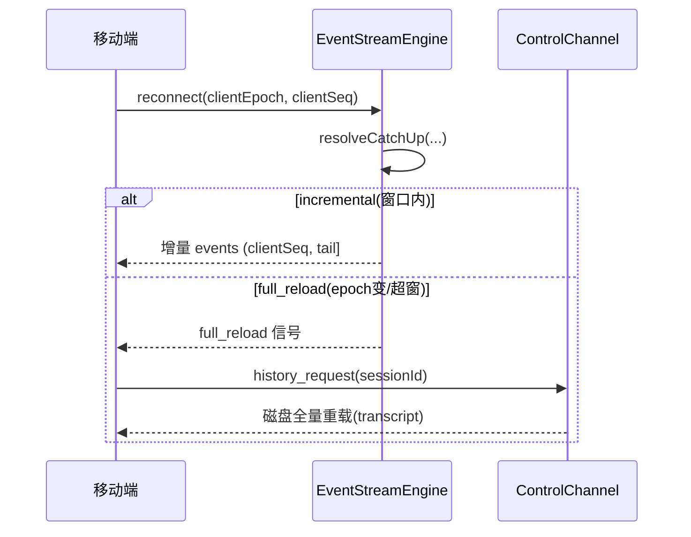
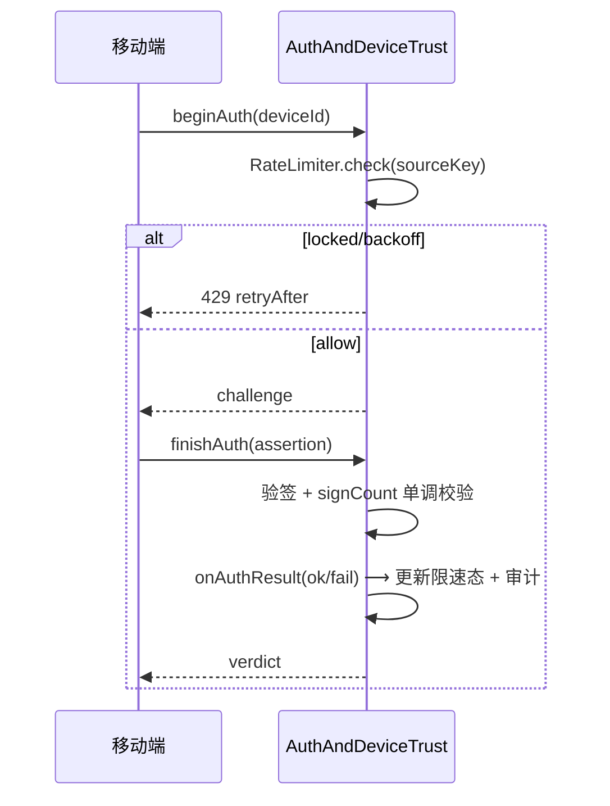

# Claude Code 移动接入 · 详细设计文档(LLD)

## 文档控制

| 字段 | 内容 | 字段 | 内容 |
| --- | --- | --- | --- |
| 文档编号 | `LLD-CCM-001` | 版本 | v1.5(纯独立蓝图稿) |
| 文档类型 | 详细设计(LLD) | 密级 | 内部 |
| 承接架构 | `HLD-CCM-001` v2.4 | 参考基线 | 现有实现 `claude-chat-mobile` v1.2.1(**不作设计依据**) |
| 编制日期 | 2026-07-10 | 状态 | 提交详细设计评审 |

**立场。** 本稿为**纯独立蓝图**:承接 HLD v2.3 的十个架构决策(AD),从第一性原理往下推导每个组件的详细设计,**不参照现有代码实现**。与现有实现的任何重合,是"独立推导与良构实现自然收敛"的结果(见 PRD『高吻合度自我审视』),**不构成设计依据**。设计表达采用类 TypeScript 签名 / 伪代码 / 状态机记号,仅为蓝图清晰,**非实现语言约束**(项目运行时为 ESM/JS)。

**版本历史**

| 版本 | 日期 | 说明 |
| --- | --- | --- |
| v1.0 | 2026-07-10 | 初版。承接 HLD v2.3,纯独立蓝图,全量覆盖 7 组件 / 10 AD:模块分解、接口签名、数据结构、关键算法、状态机、详细时序、接口契约、错误边界、追溯。 |
| v1.1 | 2026-07-10 | 独立可行性校准(**官方 SDK 文档,非现有代码**):①§3.2.4 `TranscriptReader`→`SessionMessageReader`,消息读取走官方 session-messages API、不解析 JSONL 格式(格式无稳定承诺);②§3.1.3/§5.5 审批完整性锚点精修到 `canUseTool` 返回值,利用官方"返回值==执行值"契约兜底。 |
| v1.2 | 2026-07-10 | 两个 P0 缺口深化到**实现级**:§5.5 审批完整性(canonicalize NFC/浮点/符号链接规范 + 端到端 7 步协议 + 基础/加固版权衡 + 纯函数测试 + 残余风险);§3.5.2 限速(隧道后 `sourceKey` 信任边界 + 建议参数 + 两层 + 三抉择点[fail-closed/锁定期/存储] + 测试)。 |
| v1.3 | 2026-07-10 | 剩余 4 缺口深化到实现级:§5.4 per-会话/per-连接只读定向下发(消除跨设备误解);§3.2.4 补历史读取 API 待验边界(SP-07,须早验);§3.5.3 WebAuthn 完整流程(rpId/HTTPS 约束 + attestation:none + synced-passkey signCount 陷阱 SP-08 + 降级);§4 两级删除(活跃会话保护 + 原子性 + 审计)。并修 §Observability 漏引现有(维持纯独立)。 |
| v1.4 | 2026-07-10 | **SP-07 实证闭合**(直读本机 SDK 0.3.201 `sdk.d.ts` 类型,非现有代码):官方 `getSessionMessages(sessionId,{dir,limit,offset})` 确认支持读任意历史会话全量+分页 ⟹ §3.2.4 消息读取 API 精确化、超窗重载机制落实,SP-07 风险排除。 |
| v1.5 | 2026-07-10 | **SP-01 硬验(直读 SDK 0.3.201 类型)**:坐实 `updatedInput` 字段 + `canUseTool` 执行前调用 + fail-closed(null→阻塞)+ **官方带外 signed control_response + `requestId` 机制**(§5.5 审批完整性加固版无需自建、走官方机制);仅"updatedInput==执行值"运行时语义待一次实跑。SP-01 → ◑ 大部分闭合。 |

---

## 一、引言

### 1.1 目的与范围

本文档为 `HLD-CCM-001` v2.3 评审通过后的详细设计,面向实现工程师。覆盖后端七组件的:**模块/类分解、接口签名、数据结构(字段级)、关键算法(伪代码)、状态机、错误处理、详细时序、对外接口契约**。不含:具体源码、前端 UI 视觉与交互细节、部署脚本、第三方边缘层(反代/隧道)内部实现。

### 1.2 设计原则(承接 + LLD 层新增)

承接 HLD:终端(TUI)等价、透明性、单操作者/机主即 root、fail-closed、瘦中转(CC CLI 为唯一数据源)、上游耦合收敛于单一适配面。

LLD 层新增两条**工程原则**(为可测试性与可维护性):

- **EP-1 单一事实源、零复制。** 运行时事实存在两处且仅两处:①**内存运行时状态**(会话运行时、事件缓冲、限速计数——易失、可重建);②**claude transcript**(消息事实源——持久、属上游)。轻量存储只持久化"CLI 没有且重启须恢复"的最小状态。任何派生量(标题、状态、权限档)**即时派生、不缓存落盘**。
- **EP-2 纯函数优先。** 状态转移、状态派生、断线补齐、限速退避、审批完整性校验、只读锁转移——**一律设计为无副作用的纯函数** `f(当前状态, 输入) → 新状态/决策`。副作用(I/O、广播、SDK 调用)集中在组件外壳,包裹纯核。理由:纯核可零依赖单测(呼应 PRD 验收策略),副作用面收敛。

### 1.3 记号约定

- **接口**:类 TypeScript 签名(`method(arg: Type): Ret`),`?` 表可选,`⟶` 表异步流/事件流。
- **数据结构**:字段级表格或类型字面量。
- **算法**:带行号的伪代码。
- **状态机 / 时序**:mermaid。
- **纯函数**标注 `[pure]`;**副作用外壳**标注 `[shell]`。

### 1.4 组件 ← AD 追溯(总览)

| 组件 | 承接 AD | 内部模块 |
| --- | --- | --- |
| CliBridge | AD-6 | QueryDriver, MessageMapper, PermissionInterceptor |
| SessionManager | AD-1/2/10 | SessionRegistry, TitleDeriver, StatusDeriver, SessionMessageReader |
| EventStreamEngine | AD-4 | Sequencer, RingBuffer, CatchUpResolver, HeartbeatChannel, ContractGuard |
| ControlChannel | (承接 AD-5/8/10 的操作面) | Input/Approval/Abort/Device/History Handler |
| AuthAndDeviceTrust | AD-7/8 | LayeredAuth, RateLimiter, WebAuthnAuthenticator, ApprovalIntegrityVerifier, DeviceTrustStore |
| NotificationService | AD-9 | TriggerPolicy, PushDispatcher, FallbackChannel, DeepLinkBuilder |
| Observability | (承接部署/NFR-15) | HealthEndpoint, MetricsCollector, StateProbe |

---

## 二、模块分解总览



**依赖方向铁律**:上层依赖下层,**下层不反向依赖上层**。CliBridge 是唯一触碰 SDK 的模块(上游耦合单一适配面);EventStreamEngine 不知道任何业务语义(只搬运信封);纯函数模块(Sequencer/StatusDeriver/RateLimiter…)不依赖任何 I/O。

---

## 三、组件详细设计

### 3.1 CliBridge (承接 AD-6)

**职责。** 后端唯一的上游适配面:用 Agent SDK 的 `query()` 驱动本机 `claude`,把 SDK 消息流映射为契约事件。**不自建子进程、不解析 stream-json**(SDK 代劳)。

**3.1.1 QueryDriver `[shell]`**

```typescript
interface DriveOptions {
  cwd: string;
  resumeSessionId?: string;        // 有则驱动 resume,无则新建
  effortDefault: EffortLevel;      // 接受 CLI 默认档,不自存(瘦中转)
  canUseTool: PermissionCallback;  // 权限拦截注入点
}
interface QueryDriver {
  // 流式输入:持续 yield 用户消息,支持中断与 canUseTool
  drive(opts: DriveOptions, input: AsyncIterable<UserTurn>): AsyncIterable<SdkMessage>;
  interrupt(): void;               // 触发 SDK query 的中断
}
type UserTurn = { text: string; attachments?: AttachmentRef[] };
```

- **输入侧**:`input` 是一个 async generator,后端向其推 `UserTurn`;`drive` 内部构造 SDK 的 streaming-input(yield `SDKUserMessage`),配 `includePartialMessages: true`、`pathToClaudeCodeExecutable: <本机>`。
- **中断**:`interrupt()` 调 SDK query 的中断能力,不 kill 进程(交回 SDK)。
- **错误**:SDK 抛错 ⟶ 归一化为 `BridgeError{kind: 'upstream', raw}`,原文经映射为 `error` 契约事件(**透明性:不改写错误原文**)。

**3.1.2 MessageMapper `[pure]`** — 唯一的上游耦合点

```typescript
// 纯函数:SDK 消息 → 0..n 契约事件。无 I/O、无状态(状态由 EventStreamEngine 管)
function mapSdkMessage(msg: SdkMessage, ctx: MapContext): ContractEvent[];

interface MapContext { sessionId: string; isSubtask: boolean; }
```

映射表(SDK 消息类型 ⟶ 契约事件),处理 SDK 真实行为:

| SDK 消息 | 映射为 | 特殊处理 |
| --- | --- | --- |
| `assistant`(含 text/thinking/tool_use 块) | `message_delta` / `thinking_delta` / `tool_call` | 按内容块拆分;partial 累积 |
| `user`(tool_result) | `tool_result` | 子任务流(`isSubtask`)按策略过滤,不外泄内部编排 |
| `stream_event`(partial) | `message_delta`(增量) | 批量合并小增量,降低事件风暴 |
| `result` | `turn_end{status}` | 派生轮次终态锚点 |
| `system`(mode/init) | `mode_changed` / (吞) | 模式切换兜底;init 元信息不外泄 |
| 权限请求(经 canUseTool) | `approval_request` | 见 3.1.3 |

- **提问特判**:assistant 以"等待用户输入"结束(非 tool 请求)⟶ 派生 `input_needed`,供状态派生(AD-10)判"等待我输入"。
- **契约守卫**:所有产出事件类型 ∈ 契约事件集(§7.1),`ContractGuard` 保证 real ⊇ mock。

**3.1.3 PermissionInterceptor `[shell]`** — 审批完整性的源头

`canUseTool(toolName, input, {signal})` 回调被 SDK 在执行高风险工具**前**调用:

```
1. op := { tool: toolName, args: input, cwd: ctx.cwd }
2. fingerprint := sha256(canonicalize(op))          // 审批完整性锚点,见 §5.5
3. reqId := newReqId()
4. 发射 approval_request 事件 { reqId, op, fingerprint, expiresAt }
5. 挂起,等待 ControlChannel.handleApproval(reqId, decision)
6. 决策回来(approvedOp = 用户批准的确切操作):
     - allow 且 verifyIntegrity(fp, approvedOp) 通过
         ⟶ return { behavior:'allow', updatedInput: approvedOp.args }   // 显式回填批准值
         // 官方契约: canUseTool 返回值 == 工具实际执行值(无中间变换) ⟹ "所批即所行"由 SDK 兜底
     - allow 但指纹不符 ⟶ return { behavior:'deny' } (fail-closed) + 审计告警
     - deny / 过期      ⟶ return { behavior:'deny' }
```

**关键(官方契约校准)**:`canUseTool` 收到的 `op` 作展示基线;后端**把用户批准的确切操作作为 `updatedInput` 返回**,而**官方 SDK 契约保证"`canUseTool` 返回值 == 工具实际执行值、中间无第二层变换"**——故"所批即所行"最后一环由 SDK 兜底,而非靠"假设收到的 op 到执行之间未被动过"(§5.5)。(承接 AD-7 审批完整性 / PRD NFR-17)

---

### 3.2 SessionManager (承接 AD-1/2/10)

**职责。** 管理会话运行时生命周期(独立于客户端连接);从 transcript 派生标题;派生用户视角状态;不存消息。

**3.2.1 SessionRegistry `[shell]`**

```typescript
interface SessionRuntime {
  sessionId: string;
  cwd: string;
  epoch: string;                   // 本实例本次运行的唯一标识,重启即变(去重基线)
  driver?: QueryDriver;            // 活跃 turn 期间存在
  pendingApprovals: Map<ReqId, ApprovalRequest>;
  pendingInput: boolean;
  lastResult?: TurnResult;
  externalWriteWatch: MirrorState; // 只读镜像/自动释放,见 §5.4
}
interface SessionRegistry {
  create(cwd: string): SessionRuntime;               // 新会话
  resume(sessionId: string, cwd: string): SessionRuntime; // 接续:驱动 resume 读既有 transcript
  observe(sessionId: string): SessionView;           // 只读观察(不驱动)
  close(sessionId: string): void;                    // 生命周期独立于连接,close 显式
  get(sessionId: string): SessionRuntime | null;
}
```

- **归属**(AD-2):会话归属以"其 transcript 存在于对应 cwd"为准 ⟶ 终端建的与 web 建的天然互见。`resume` 通过驱动一个 resume 会话读既有记录接续。
- **生命周期**:运行时独立于连接(NFR-08),客户端断开不 close;`close` 由显式操作或治理触发。

**3.2.2 TitleDeriver `[pure]`**(瘦中转:标题不自存)

```typescript
function deriveTitle(firstUserText: string): string;  // 截断/清洗首条用户消息,即时派生
```

**3.2.3 StatusDeriver `[pure]`** — 承接 AD-10 + PRD 第八章状态模型

纯函数,由运行时信号派生用户视角状态(状态定义见 §5.3 状态机):

```typescript
function deriveStatus(rt: SessionRuntime, host: HostLiveness): TaskStatus;

type TaskStatus = 'running' | 'awaiting_approval' | 'awaiting_input'
                | 'completed' | 'failed' | 'aborted' | 'host_offline';
```

派生规则(优先级从上到下,首个命中即返回):

| 条件 | 状态 |
| --- | --- |
| `host.confirmed == false` | `host_offline`(**fail-closed:不可确认 ≠ 完成**) |
| `pendingApprovals.size > 0` | `awaiting_approval` |
| `pendingInput == true` | `awaiting_input` |
| `driver` 活跃 & 有在途轮次 | `running` |
| `lastResult.kind == 'aborted'` | `aborted` |
| `lastResult.kind == 'error'` | `failed` |
| `lastResult.kind == 'ok'` | `completed`(**必为真实终态**) |

> 铁律(承接 PRD 8):`completed` 只由主机确认的真实 `result` 派生,**绝不由"移动端失联"推出**;不可确认一律 `host_offline`。

**3.2.4 SessionMessageReader `[shell]`**(可行性校准更名,原 `TranscriptReader`)

```typescript
interface SessionMessageReader {
  // 消息读取 = 官方 getSessionMessages(sessionId,{dir})(已核 SDK 0.3.201 类型,见 SP-07);
  // 不自行解析 JSONL 格式 —— transcript 的 JSONL 内部格式未文档化、无稳定承诺
  read(sessionId: string, cwd: string): Message[];   // = getSessionMessages(sessionId,{dir:cwd,limit?,offset?}),历史全量、chronological、可分页
  size(sessionId: string, cwd: string): number;      // 条数,供补齐基线判断
  path(sessionId: string, cwd: string): string;      // 仅定位用;路径是官方稳定契约(hook 输入 transcript_path),内容不靠解析文件
}
```

- **可行性校准(官方文档,非现有代码)**:transcript **路径**=官方稳定契约,**JSONL 格式**=未文档化、无承诺 ⟶ 读消息走官方 API、不解析格式,规避版本漂移风险。
- **✅ 已验证(SP-07,直读 SDK 0.3.201 类型定义)**:官方 `getSessionMessages(sessionId, {dir, limit?, offset?, includeSystemMessages?})` 支持读**任意历史会话**全量消息(chronological、空会话返回空数组)、带**分页**;另有 `getSubagentMessages(sessionId, agentId)` 读子 agent 消息。⟹ `full_reload`(§5.1 超窗重载)有官方机制,SP-07 风险**排除**。
- 冷读、只读、不缓存(EP-1)。实时进展(进行中态)在原生架构下不可见 ⟶ 依赖上游 attach(承接 AD-3,本期只呈现已落定)。

---

### 3.3 EventStreamEngine (承接 AD-4)

**职责。** 承载 server⟶client 全部事件;单调序号;有限缓冲供断线增量补齐;超窗回退完整重载;心跳旁路;契约守卫。**不含任何业务语义**(只搬运信封)。

**3.3.1 事件信封与 Sequencer `[pure]`**

```typescript
interface EventEnvelope {
  epoch: string;      // 本实例本次运行标识(SessionRuntime.epoch)
  seq: number;        // 每会话单调递增,从 1 起
  type: EventType;    // ∈ 契约事件集 §7.1
  payload: unknown;
  ts: number;
}
// 纯函数:给下一个信封分配 seq(状态外置,便于测试)
function nextSeq(current: number): number;  // = current + 1
```

**3.3.2 RingBuffer `[pure 数据结构]`**

```typescript
interface RingBuffer<T> {
  capacity: number;                 // 保留窗口大小
  push(item: T): void;              // 满则覆盖最旧
  since(seq: number): T[] | OUT_OF_WINDOW;  // 取 (seq, tail],窗口外返回哨兵
  oldestSeq(): number;
}
```

**3.3.3 CatchUpResolver `[pure]`** — 断线补齐核心(算法详见 §5.1)

```typescript
type CatchUpDecision =
  | { kind: 'incremental'; events: EventEnvelope[] }  // 窗口内增量
  | { kind: 'full_reload'; reason: 'epoch_changed' | 'out_of_window' };

function resolveCatchUp(
  clientEpoch: string, clientSeq: number,
  serverEpoch: string, buffer: RingBuffer<EventEnvelope>
): CatchUpDecision;
```

- **epoch 变**(服务重启)⟶ 客户端去重基线失效 ⟶ `full_reload`。
- **epoch 同 & (clientSeq, tail] 在窗口内** ⟶ `incremental`。
- **epoch 同 & 超窗口** ⟶ `full_reload{out_of_window}`(承接 PRD FR-03"超出补齐能力时可完整重载")。

**3.3.4 HeartbeatChannel `[shell]`**

- 高频心跳**不进 RingBuffer、不占 seq**(旁路),避免挤占补齐窗口(承接 AD-4)。心跳仅承载存活/主机 liveness 探针结果。

**3.3.5 ContractGuard `[pure]`**

```typescript
function assertContract(realTypes: Set<EventType>, mockTypes: Set<EventType>): void;
// 断言 real ⊇ mock;违反即 CI 失败(承接 NFR-14 防漂移)。契约 SoT 见 §7.1
```

- **去重(客户端侧约定)**:客户端按 `(epoch, seq)` 幂等去重;`epoch` 变则重置基线。

---

### 3.4 ControlChannel

**职责。** 接收客户端控制消息,统一走"**校验 → 执行 → 广播事件 + 审计**"管线。每个 Handler 是薄外壳,业务判定下沉到纯函数。

```typescript
interface ControlChannel {
  handleInput(sessionId: string, turn: UserTurn, actor: Actor): void;
  handleApproval(reqId: ReqId, decision: 'allow' | 'deny', actor: Actor): void;
  handleAbort(sessionId: string, actor: Actor): void;
  handleDevice(action: DeviceAction, actor: Actor): void;
  handleHistory(sessionId: string, sinceSeq?: number, actor: Actor): void; // 触发补齐/重载
}
type Actor = { deviceId: string; via: 'web' | 'terminal' | 'trusted-device' };
```

- **统一前置**:①鉴权已过(Auth 层保证);②`assertWriter(sessionId, actor)`——单一有效写入者判定(§5.4),非写入者的写操作被拒并提示只读。
- **handleApproval**:先 `checkExpiry(req.expiresAt)`(过期默认拒绝,承接 AD-6 审批流),再交 `ApprovalIntegrityVerifier`(§3.5.4)。
- **handleInput**:非活跃会话先 `resume`;把 turn 推入 CliBridge 的 input generator。
- **每操作**尾部统一 `broadcast(event)` + `audit(securityRelevant ? record : skip)`。

---

### 3.5 AuthAndDeviceTrust (承接 AD-7/8) — 含三个新增项,重点

**3.5.1 LayeredAuth `[shell]`**(承接 AD-7 分层)

```typescript
interface LayeredAuth {
  edgeCheck(req: Request): EdgeVerdict;   // 边缘层:反代/隧道/身份代理注入的断言(如 CF-Access-Jwt)
  appCheck(req: Request): AppVerdict;     // 应用层:设备绑定令牌 / WebAuthn 断言
}
```

- **两层独立、按 Host 二选一而非叠加**:公网 Host ⟶ 必过 edge;回环/局域 Host ⟶ 仅 app 层。任一层 fail ⟶ fail-closed。
- 凭证只从启动 shell 注入,**不下发移动端**;配置文件最小权限原子写。

**3.5.2 RateLimiter `[pure]`**(**新增**,承接 AD-7 / NFR-03 防暴破)

**边界:只在鉴权门口,不限已鉴权操作**(单操作者/机主即 root,已鉴权=全权,对操作面限速违背产品目的)。按来源计数 + 指数退避 + 阈值锁定,**纯函数状态机**:

```typescript
interface RateLimitState { failCount: number; lockUntil: number; lastFailTs: number; }
interface RateLimitConfig { threshold: number; baseBackoffMs: number; maxBackoffMs: number; lockMs: number; decayMs: number; }

function onAuthResult(
  s: RateLimitState, ok: boolean, now: number, cfg: RateLimitConfig
): { next: RateLimitState; verdict: 'allow' | 'backoff' | 'locked'; retryAfterMs?: number };
```

算法:

```
1. if now < s.lockUntil:              return { verdict:'locked', retryAfterMs: s.lockUntil-now }
2. if ok:                             return { next: reset(), verdict:'allow' }        // 成功清零
3. // 失败:
4. failCount' := (now - s.lastFailTs > cfg.decayMs) ? 1 : s.failCount + 1              // 静默衰减,不永久惩罚
5. if failCount' >= cfg.threshold:
6.     return { next:{failCount', lockUntil: now+cfg.lockMs, lastFailTs:now}, verdict:'locked', retryAfterMs: cfg.lockMs }
7. backoff := min(cfg.baseBackoffMs * 2^(failCount'-1), cfg.maxBackoffMs)
8. return { next:{failCount', lockUntil:0, lastFailTs:now}, verdict:'backoff', retryAfterMs: backoff }
```

**建议参数(OQ-03 定,可配置默认)**:threshold=8、baseBackoff=500ms、maxBackoff=30s、lockMs=15min、decayMs=15min(手滑容忍 + 暴破不经济 + 久未失败自动原谅)。

**来源识别 `sourceKey`(难点:隧道后拿不到真来源)**:取键优先级 ①已知设备指纹 → ②**边缘层可信注入**的真实来源(如 CF-Connecting-IP)→ ③连接 IP。**信任边界:只信自己边缘层注入的头,绝不信客户端自称的 `X-Forwarded-For`**(可伪造 → 绕过 per-source)。未知来源归入全局桶。

**两层(单层挡不住分布式)**:①per-source 挡单源枚举;②**global 未认证桶**挡多源分布式暴破,超限进"仅已信任设备可认证"收紧模式。

**三个抉择点(实现级显式决定)**:
- **锁定期内尝试**:不计数(到期即恢复)——避免攻击者持续戳把机主自己锁死(自我 DoS);持续尝试仍**记审计**(攻击信号)。
- **限速故障时**:倾向 **fail-closed**(鉴权门口宁拒错放),但**留机主本地绕过**(否则限速 bug 把机主关门外)。
- **存储**:n=1 默认**内存** `Map<sourceKey, RateLimitState>`(瘦、快);代价=重启清零暴破计数(fail-open 方向残余风险,§8.3);敏感部署可选持久。

**与设备信任分级(AD-8)**:已信任设备失败宽松、未知设备严格;`pending` 队列上限本身即"设备注册限速",互补。

**测试(纯函数)**:连续失败到阈值→锁定 / 锁定期→locked+retryAfter 递减 / 成功→清零 / 静默超 decayMs→计数重置 / 退避指数增长封顶 / 全局桶 N 异源→熔断 / 伪造 XFF→不影响可信 sourceKey。

**残余风险**:①内存态重启清零(§8.3);②大规模分布式暴破根治靠边缘层 WAF/DDoS,后端限速是纵深一层;③sourceKey 伪造靠"只信可信注入头"缓解。锁定/退避均**计入审计 + 告警**(承接 AD-7)。

**3.5.3 WebAuthnAuthenticator `[shell]`**(**新增**,承接 AD-7 / NFR-04 强认证)

设备绑定强认证,静态令牌降为降级/首配路径:

```typescript
interface WebAuthnAuthenticator {
  beginRegister(deviceId: string): PublicKeyCredentialCreationOptions;  // 发 challenge
  finishRegister(deviceId: string, att: AttestationResponse): CredentialRecord;
  beginAuth(deviceId: string): PublicKeyCredentialRequestOptions;
  finishAuth(deviceId: string, asr: AssertionResponse): AppVerdict;     // 验签 + 计数器防重放
}
interface CredentialRecord { credId: string; publicKey: Bytes; signCount: number; deviceId: string; }
```

- **流程**:注册(TOFU 授权后绑定 passkey)→ 认证(challenge-response)。凭证私钥不出设备,后端只存公钥。
- **rpId / HTTPS 硬约束(标准内在)**:`rpId=部署域名`,须 secure context。**环境检测**:`if (!secureContext || !validRpId || !browserSupport) → 降级静态令牌 + TOFU`——自托管用纯 IP/自签/隧道多域名时用不了,**降级是必需路径(非可选)**(SP-04)。
- **challenge**:服务端随机、一次性、有时效;认证校验回传匹配(防重放)。
- **attestation 抉择**:自托管场景验证价值低 ⟶ 建议 `attestation:'none'`(不徒增复杂度,呼应瘦中转)。
- **多设备**:每设备独立 credential,撤销单个不影响其他。
- **⚠️ 真陷阱(SP-08,诚实登记)**:**同步 passkey**(iCloud/Google)跨设备时 **`signCount` 常年为 0、不递增** → 单调校验会误拒。**对策**:`signCount==0` 时不强制单调(接受同步 passkey);这是 WebAuthn 生态已知问题,非本设计缺陷。
- **测试**:注册/认证流程、signCount 防重放、降级路径触发、challenge 过期拒绝、synced-passkey(signCount=0)不误拒。

**3.5.4 ApprovalIntegrityVerifier `[pure]`**(**新增**,承接 AD-7 / NFR-17 审批完整性)

"所批即所行"的执行前校验:

```typescript
function verifyIntegrity(approved: OpFingerprint, actual: Op): 'match' | 'mismatch';
// = (approved === sha256(canonicalize(actual))) ? 'match' : 'mismatch'
```

- 审批请求发出时锚定 `fingerprint = sha256(canonicalize(op))`(§3.1.3);`canonicalize` 稳定序列化(键排序、路径归一)。执行前用 `canUseTool` 实收的 `actual` 重算比对。
- `mismatch` ⟶ **fail-closed 拒绝 + 高优审计告警**(中间层在展示与执行间被篡改的信号)。

**3.5.5 DeviceTrustStore `[shell]`**(承接 AD-8)

```typescript
interface DeviceTrustStore {
  status(deviceId: string): 'trusted' | 'pending' | 'denied' | 'unknown';
  requestTrust(fp: DeviceFingerprint): 'queued' | 'rejected_full';  // pending 队列有上限
  approve(deviceId: string, by: Actor): void;   // 多路:终端/命令行/已信任设备
  revoke(deviceId: string): void;               // 即时生效:断连 + 后续拒绝
}
```

- **TOFU**:首次接入 ⟶ `pending`,须显式授权。**pending 队列上限**防 flood(超限 `rejected_full`)。
- **审批权恒属已信任设备/终端**;撤销即时(广播断连 + 拉黑)。信任变更 ⟶ 触发相关会话只读锁重算(§5.4)。

---

### 3.6 NotificationService (承接 AD-9)

**3.6.1 TriggerPolicy `[pure]`** — 只在该打扰时打扰

```typescript
function shouldNotify(ev: ContractEvent): NotifyIntent | null;
// 命中:approval_request(需决策)、turn_end 终态(completed/failed/aborted)、input_needed
// 不命中:message_delta / thinking / tool_call 等中间过程 ⟶ null(不扰)
```

**3.6.2 PushDispatcher / FallbackChannel `[shell]`**

```typescript
interface PushDispatcher { send(sub: PushSubscription, payload: NotifPayload): Promise<Result>; } // Web Push + VAPID 自签
interface FallbackChannel { send(target: string, payload: NotifPayload): Promise<Result>; }        // 绕特定平台后台限制(如 ntfy)
```

- 不支持后台推送的平台 ⟶ 重连后状态兜底(不丢决策点)。
- **payload 脱敏**:遵 PRD OQ-08(待定)——默认不含敏感正文,只含"需你处理 + 深链",正文回 app 内取。

**3.6.3 DeepLinkBuilder `[pure]`**

```typescript
function buildDeepLink(sessionId: string, anchorSeq?: number): string; // 定位到会话 + 具体事件锚点
```

---

### 3.7 Observability (承接部署 / NFR-15)

```typescript
interface HealthEndpoint { get(): { status; sessionId; busy; versions; timestamp }; }   // 鉴权保护
interface MetricsCollector { inc(metric: string, labels?: Labels): void; gauge(...): void; }
interface StateProbe {
  // 区分五类,供运维与前端"主机离线"判定(承接 PRD NFR-15)
  classify(): 'host_offline' | 'mobile_offline' | 'failed' | 'awaiting' | 'notify_failed';
}
```

- health 端点须鉴权:未配置鉴权则仅监听本机;配置后未授权访问返回 401,**不开无鉴权数据端点**(第一性:诊断端点也是暴露面)。
- 指标最小集:活跃会话数、事件 seq 速率、补齐命中/重载率、限速触发数、推送成功率、审批时延。

---

## 四、数据结构与存储 schema

**分层(EP-1)。** ①**内存运行时**(易失、可重建):`SessionRuntime`(§3.2.1)、`RingBuffer` per session(§3.3.2)、`RateLimitState` Map(§3.5.2)、`MirrorState` per session(§5.4)。②**轻量存储**(持久,只存"CLI 没有且重启须恢复"者)。③**transcript**(消息事实源,属上游,只读)。**消息永不落后端库;派生量(标题/状态/权限档)不落库。**

**轻量存储表(字段级):**

| 表 | 字段 | 说明 |
| --- | --- | --- |
| `session_pointer` | `sessionId`(PK)、`cwd`、`createdAt`、`lastActiveAt` | **只存指针**;`epoch`/`lastSeq` 是运行时易失量,不持久化 |
| `device_trust` | `deviceId`(PK)、`status`(trusted/pending/denied)、`fingerprint`、`trustedAt`、`trustedBy`、`revokedAt` | AD-8 |
| `webauthn_credential` | `credId`(PK)、`deviceId`(FK)、`publicKey`、`signCount`、`createdAt` | 只存公钥;私钥不出设备 |
| `approval_request` | `reqId`(PK)、`sessionId`、`op{tool,args,cwd}`、`fingerprint`、`risk`、`expiresAt`、`status`、`decidedBy`、`decidedAt` | **含指纹与有效期**(NFR-17/审批流) |
| `push_subscription` | `endpoint`(PK)、`deviceId`、`keys{p256dh,auth}`、`createdAt` | AD-9 |
| `audit_record` | `id`(PK)、`ts`、`actor{deviceId,via}`、`action`、`target`、`outcome`、`meta` | **meta 无敏感正文**(NFR-06) |

- **写入约束**:全部最小权限、原子写(临时文件 + rename)。
- **恢复语义**:重启后从 `session_pointer` 重建可观察会话列表;`epoch` 换新(去重基线自然失效 ⟶ 客户端 full_reload);运行时其余按需重建。
- **两级删除(承接 AD-1 / FR-20,Could/纯主权)**:**L1 默认**删本产品可见的会话引用(`session_pointer` + 关联审批/审计元数据)→ web 不再显示、transcript 保留;**L2 显式二次确认**删底层 transcript 文件 → 真正抹除。**活跃会话保护**:L2 删前须检查会话**非活跃**(无活跃 `driver`),删活跃会话事实源 → **拒绝**(防与 claude 侧并发写分叉)。**原子性**:先删指针、后删文件,避免孤儿。删除记审计(谁/何时/哪级,**不含被删内容**);删后客户端补齐基线 `seenDiskLen` 须重置。

---

## 五、关键算法与状态机

### 5.1 断线补齐(`resolveCatchUp`)

```
输入: clientEpoch, clientSeq, serverEpoch, buffer
1. if clientEpoch != serverEpoch:                      // 服务重启过
2.     return full_reload(reason='epoch_changed')       // 去重基线失效
3. win := buffer.since(clientSeq)
4. if win == OUT_OF_WINDOW:                             // 断太久,增量已被覆盖
5.     return full_reload(reason='out_of_window')
6. return incremental(events = win)                     // (clientSeq, tail] 增量补发
```

- **正确性**:①epoch 门保证不把上次运行的 seq 误当本次;②窗口门保证不漏发(漏则 full_reload 兜底)。**不丢**(窗口内全补 / 超窗全量)、**不重**(客户端按 (epoch,seq) 幂等去重)、**不误判完成**(completed 只来自真实 result,§3.2.3)。
- **心跳旁路**:heartbeat 不在 buffer,不影响 seq 连续性(承接 AD-4)。

### 5.2 序号与去重

- 服务端:`seq = nextSeq(last)` 每会话单调;`epoch` 每实例启动生成一次(如启动时间戳+随机,注:实现时由外壳注入,纯函数不产生随机)。
- 客户端约定:维护 `seen = (epoch, maxSeq)`;`epoch` 变 ⟶ 清空重置;`seq <= maxSeq` ⟶ 丢弃(幂等)。

### 5.3 任务状态机(承接 AD-10 / PRD 第八章)



- **fail-closed 铁律**:任何"不可确认"⟶ `host_offline`(非 `completed`);`host_offline` 恢复后按 `deriveStatus` 重判真实状态,不假定。

### 5.4 只读镜像锁与自动释放(承接 AD-5 多入口并发保护)

**问题。** 多入口(终端 + 一或多移动端)可同时观察同一会话,但**任一时刻只允许一个有效写入者**,否则两进程写同一 transcript 致分叉。检测到某入口不能安全写入 ⟶ 置只读并告知。**但只读必须能自动释放**,否则"终端写一次就把移动端永久锁死"。

```typescript
interface MirrorState { mode: 'writable' | 'readonly'; quietTicks: number; localBusy: boolean; }
```

**转移纯函数**(每 tick 调用):

```
mirrorStep(s, sawExternalWrite, localBusy, RELEASE_QUIET_TICKS):
1. if sawExternalWrite:                    return { mode:'readonly', quietTicks:0, localBusy }   // 外部在写 ⟶ 锁
2. if localBusy:                           return { ...s, quietTicks:0 }                          // 本端忙不攒静默(防误判)
3. q := s.quietTicks + 1
4. if s.mode=='readonly' && q >= RELEASE_QUIET_TICKS:
5.     return { mode:'writable', quietTicks:0, localBusy }                                        // 静默足够久 ⟶ 自动解锁
6. return { ...s, quietTicks:q }
```



- `sawExternalWrite`:transcript 出现"非本端"的新追加(本端自己 resume 刷 mtime 不算——**只认真新消息,不认 mtime**,避免纯 web 打开被自身刷新误锁)。
- **手动接管**:用户显式"接管" ⟶ 强制 `writable`,作为并发写的最终兜底(承接 PRD 张力2:清晰接管路径)。
- **已知边界**:`localBusy` 期间到达的外部写入,须待本端 turn 结束、经磁盘重载追平(触发面窄,登记为已知边界,不在本期消除)。
- **per-会话 / per-连接定向(承接 AD-5 改进,消除跨设备误解)**:状态粒度 `Map<(sessionId, connId), MirrorState>`——只读是"(会话,连接)对"的属性、非全局。`readonly_changed{sessionId,readonly,reason}` **只定向下发给受影响连接**,客户端按 `sessionId` 局部更新、不触发全局锁;`assertWriter(sessionId, connId)` 每会话独立选单写入者(会话 X 接管不动会话 Y)。**测试**:两连接看不同会话,一方变化 → 另一方零影响。

### 5.5 审批完整性绑定(承接 AD-7 / NFR-17,"所批即所行")

**威胁模型(先界定边界,避免安全剧场)。** 链路 `SDK→后端→手机展示→批准→后端→SDK执行` 分两段,各有信任基础:
- **后端↔SDK/工具**:官方 `canUseTool` 契约保证"返回值==执行值、中间无变换"⟹ 后端把批准值作 `updatedInput` 回填即闭合最后一环。
- **手机↔后端**:TLS + 设备认证(基础版)。
- **明确不防**:①后端被完全攻破(n=1 下后端=机主机器=信任根,不在威胁模型内);②前端展示欺骗(由手机端"渲染前重算 fp 校验"兜底,见协议步 4)。

**`canonicalize` 精确规范(机制强度 == 此函数强度)。** 工具 input 是任意 JSON(`Record<string,unknown>`),规则须覆盖任意结构:

```
canonicalize(op = {tool, args, cwd}):
  · 对象键:递归按 Unicode 码点字典序排序
  · 字符串:Unicode NFC 归一化(防同字不同编码 → 指纹漂移)
  · 数值:规范化(1.0 == 1;拒 NaN/Infinity)
  · 数组:保序(顺序即语义,不排序)
  · cwd:词法归一(绝对化 + 解析 ./ 与 ../ + 去尾斜杠);【抉择】不 resolve 符号链接
         —— 保证"用户看到的路径 == 指纹的路径";符号链接攻击交权限层(cwd 白名单)而非完整性层
  · 剔除易变字段:reqId / 时间戳 / nonce(非操作语义)
fingerprint(op) := sha256(canonicalize(op))   // 抗碰撞:无法构造"异操作、同指纹"
```

> **三陷阱(最易漏)**:不做 NFC → 重音/中文命令误拒;浮点表示不一致(`1.0` vs `1`)→ 误判;若 resolve 符号链接 → 展示路径与指纹背离。

**端到端协议(7 步)。**

```
1 [后端] canUseTool(tool, input) → op = {tool, args:input, cwd}
2 [后端] fp = fingerprint(op);存 approval_request{reqId, op, fp, expiresAt};挂起
3 [后端→手机 TLS] 下发 {reqId, op, fp, expiresAt}
4 [手机] 本地重算 fingerprint(op) == fp 才渲染给用户(防展示层与指纹不一致)
5 [手机] 用户批准 → {reqId, allow}   (加固版:+ 设备私钥对 fp 签名)
6 [后端] 校验 reqId 未用 / 未过期 / (加固版)验签 通过 →
         return { behavior:'allow', updatedInput: approvedOp.args }   ★ 此值即执行值
7 [后端] 任一失败 → return { behavior:'deny' } + 高优审计告警
```

★ 闭环点:不赌"SDK 收到的 input 到执行未被动过",而是主动把用户批准的确切 op 作 `updatedInput` 回填,由官方"返回值==执行值"契约兜底。

**基础版 vs 加固版(n=1 定位下的权衡)。** 基础版(TLS + 设备认证)防传输窃听/篡改/未授权设备冒充,**n=1 下已够**——后端=机主信任根,真正要防的是传输层;加固版(手机对 fp 设备签名)只多防"TLS 剥离 + 设备冒充"叠加场景,收益递减 ⟹ 留作高敏感部署的显式选项,**不进主路径**(呼应瘦中转:不为边际威胁加复杂度)。**官方基础设施(直读 SDK 0.3.201 类型坐实,加固版无需自建)**:`canUseTool` 返回 `null` + 后端经**带外 signed HTTP POST 回传 control_response(echo `requestId`)**,SDK 即跳过自己的 WS write——这正是"签名审批通道"的官方机制,加固版走它而非硬凑;且 fail-closed 是官方内建(null 且无带外响应 → 工具无限期阻塞)。

**失败与重放。** `reqId` 一次性(用过即从 pending 移除,重复到达 → deny);`now > expiresAt` → deny(承接 OQ-05);全部 **fail-closed**(默认拒绝 + 审计)。

**测试(纯函数,可穷举,呼应 EP-2)。** 相同 op → 同指纹 / args 键序打乱 → 同指纹 / 改一字符 → 异指纹 / cwd `./` 与尾斜杠归一 → 同指纹 / NFC 两形 → 同指纹 / `1.0` vs `1` → 同指纹 / 数组换序 → 异指纹 / 剔除 reqId·时间戳 → 同指纹 / 篡改 op 保留旧 fp → `mismatch`。

**残余风险(诚实登记)。** ①**SP-01 大部分闭合(直读 SDK 0.3.201 类型)**:`updatedInput` 字段、`canUseTool` 执行前调用、fail-closed(null→无限期阻塞)、带外 signed control_response + `requestId` 机制均坐实;仅"`updatedInput` 精确==工具实际执行值"的运行时语义类型未显式声明,须一次实跑确认;②后端信任根被破则全失效(n=1 接受的边界,非本机制能解);③`canonicalize` 完备性随工具 input 结构演进维护 + 属性测试(fuzz)兜底。

---

## 六、详细时序

### 6.1 审批流(完整性绑定 + 有效期 + 推送)



### 6.2 断线补齐



### 6.3 WebAuthn 认证(叠加限速)



---

## 七、接口契约汇总

### 7.1 契约事件集(server ⟶ client)— 契约 SoT

> `ContractGuard` 保证 real ⊇ mock(承接 NFR-14)。所有事件包 `EventEnvelope`(§3.3.1)。

| 事件类型 | payload 关键字段 | 触发 |
| --- | --- | --- |
| `message_delta` | `{text, partial}` | assistant 文本增量 |
| `thinking_delta` | `{text, partial}` | 进行中思考(落定部分) |
| `tool_call` | `{tool, args, cwd}` | 工具调用 |
| `tool_result` | `{tool, result, isError}` | 工具结果(错误原文透传) |
| `approval_request` | `{reqId, op, fingerprint, risk, expiresAt}` | 需授权 |
| `input_needed` | `{prompt?}` | 等待用户输入 |
| `turn_end` | `{status: ok/error/aborted}` | 轮次真实终态锚点 |
| `mode_changed` | `{mode}` | 模式切换 |
| `readonly_changed` | `{readonly, reason}` | 只读镜像状态(per-会话定向下发) |
| `device_changed` | `{deviceId, status}` | 设备信任变更 |
| `history_append` | `{fromSeq, events[]}` | 补齐/追平 |
| `error` | `{kind, raw}` | 错误(原文不改写) |
| `heartbeat` | `{hostAlive, ts}` | 旁路,不占 seq/不入缓冲 |

### 7.2 控制通道(client ⟶ server)

| 消息 | 字段 | Handler | 前置 |
| --- | --- | --- | --- |
| `input` | `{sessionId, turn}` | handleInput | 写入者校验 |
| `approval` | `{reqId, decision}` | handleApproval | 有效期 + 完整性 |
| `abort` | `{sessionId}` | handleAbort | 写入者校验 |
| `device_action` | `{action, deviceId}` | handleDevice | 审批权属已信任 |
| `history_request` | `{sessionId, sinceSeq?}` | handleHistory | 鉴权 |
| `sync:since` | `{sessionId, clientEpoch, clientSeq, diskLen?}` | → resolveCatchUp | 鉴权 |

---

## 八、错误处理与边界

**8.1 错误分类与归一。** 全部错误归一为 `{kind, raw, retryable}`:`upstream`(SDK/claude,原文透传)、`auth`、`rate_limited`(带 retryAfter)、`integrity`(指纹不符)、`not_writer`(只读)、`expired`(审批过期)、`host_unreachable`。**透明性:`upstream` 原文不改写**(PRD 4.2)。

**8.2 fail-closed 汇总**(默认拒绝的判定点):

| 判定点 | 触发 | 结果 |
| --- | --- | --- |
| 身份不可确认 | 任一鉴权层 fail | 拒绝,仅查看诊断 |
| 主机不可确认 | StateProbe = host_offline | 状态显 `host_offline`,不假定完成 |
| 审批过期 | now > expiresAt | 默认拒绝 |
| 指纹不符 | verifyIntegrity mismatch | 拒绝 + 告警 |
| 非写入者写入 | assertWriter 失败 | 置只读 + 提示 |
| 限速锁定 | RateLimiter = locked | 429 retryAfter |

**8.3 已知边界(诚实登记,本期不消除)。**

- **实时进行中态不可见**:web 冷读磁盘,进行中 thinking/子任务须落定后可见;等价实时依赖上游 attach(承接 AD-3 / SP-06),本期不承诺。
- **只读锁 localBusy 吸收**:本端 turn 窗口内到达的外部写,须切走经磁盘重载追平(§5.4,触发面窄)。
- **限速内存态重启清零**:重启后暴破计数归零;由足够的锁定时长 + 边缘层兜底,敏感部署可选持久化。
- **实时镜像 vs 原生**:承接 PRD 张力1,非本设计缺陷,属架构—上游张力。

---

## 九、需求追溯(LLD ← HLD ← PRD)

| LLD 模块/算法 | 承接 HLD | 溯至 PRD |
| --- | --- | --- |
| CliBridge(QueryDriver/MessageMapper) | AD-6 | NFR-14 上游耦合收敛 |
| PermissionInterceptor + ApprovalIntegrityVerifier + §5.5 | AD-7 审批完整性 | **NFR-17 / 11.8** |
| SessionManager + SessionMessageReader | AD-1/2 | FR-11 双向共享 |
| StatusDeriver + §5.3 状态机 | AD-10 | 第八章状态模型 / FR-01 |
| EventStreamEngine + §5.1 补齐 | AD-4 | FR-03 断线补齐 / NFR-10 |
| MirrorState + §5.4 只读自动释放 | AD-5 | FR-12 并发保护 |
| RateLimiter + §3.5.2 | AD-7 限速(新增) | **NFR-03** |
| WebAuthnAuthenticator | AD-7 强认证(新增) | **NFR-04** |
| DeviceTrustStore | AD-8 | FR-18 设备信任 |
| approval_request(有效期) | AD-6/审批流 | OQ-05 审批有效期 |
| DeleteBoundary(存储层,见 §4 approval/pointer) | AD-1 删除边界 | FR-20 删除(Could/主权) |
| NotificationService + TriggerPolicy | AD-9 | FR-14/15 |
| Observability + StateProbe | 部署/可观测 | NFR-15 |

---

*本文档为承接 HLD v2.3 的详细设计,纯独立蓝图。所有设计从第一性原理与 HLD 决策推导,不参照现有代码;与现有实现的重合是良构收敛的结果。标注为纯函数的核心可零依赖单测(呼应 PRD 验收策略)。实现语言与具体代码组织,由实现阶段裁量。*
