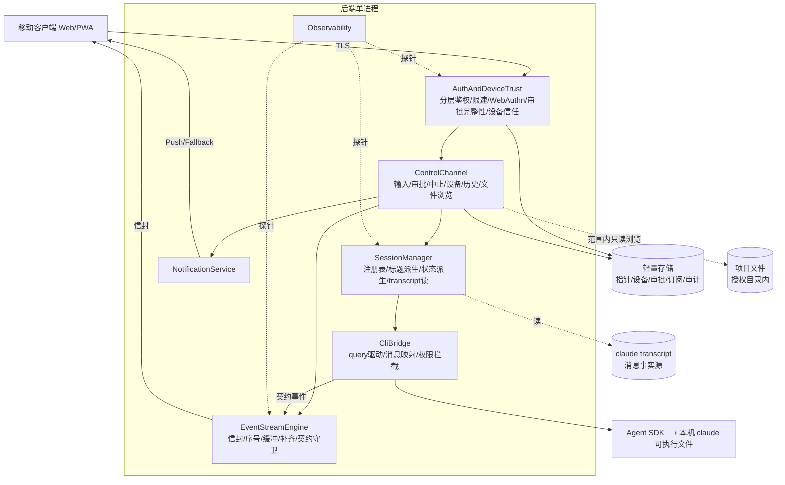
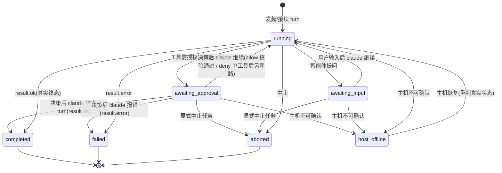
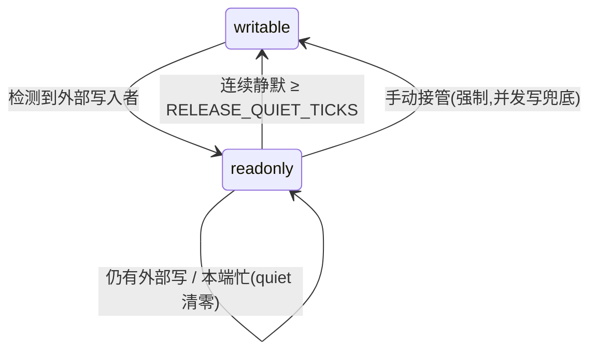
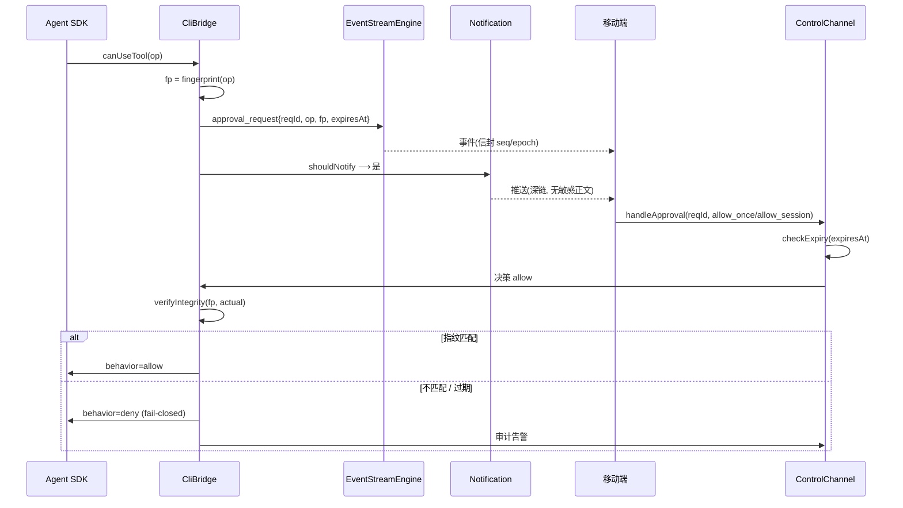
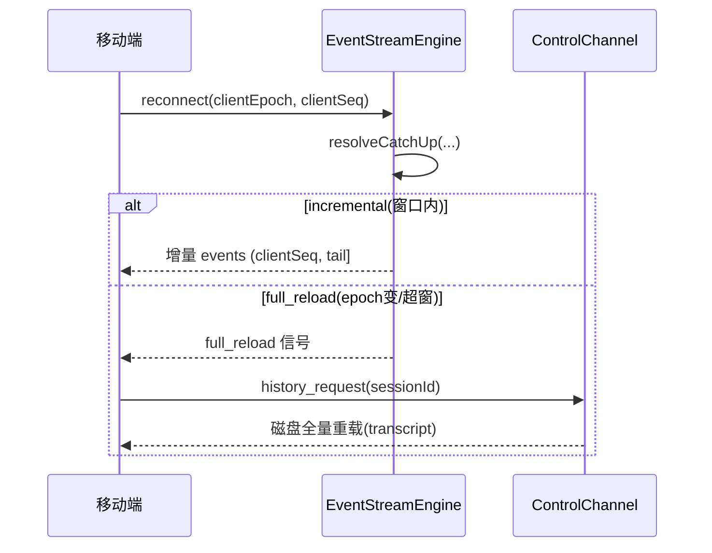
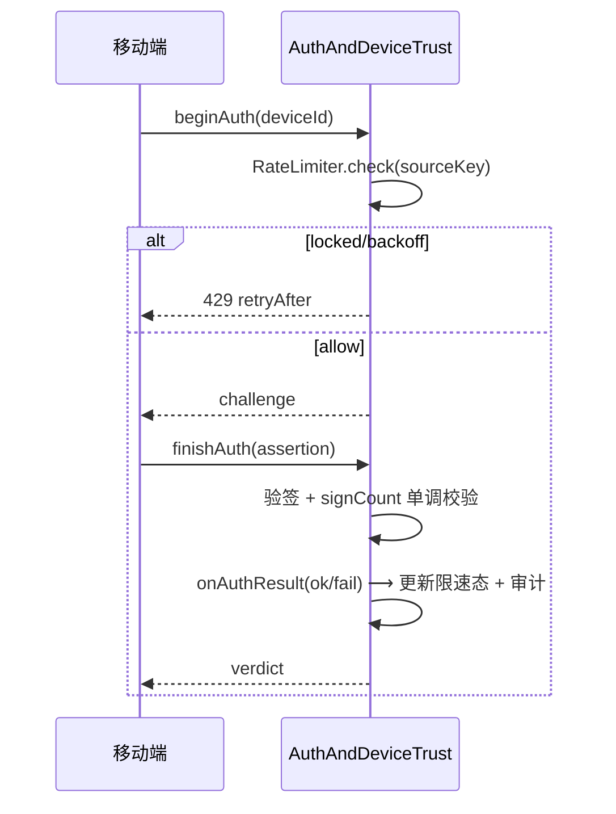

# Claude Code 移动接入 · 详细设计文档(LLD)

## 文档控制

| 字段 | 内容 | 字段 | 内容 |
| --- | --- | --- | --- |
| 文档编号 | `LLD-CCM-001` | 版本 | v1.17(纯独立蓝图稿) |
| 文档类型 | 详细设计(LLD) | 密级 | 内部 |
| 承接架构 | `HLD-CCM-001` v2.14 | 参考基线 | 现有实现 `claude-chat-mobile` v1.2.1(**不作设计依据**) |
| 编制日期 | 2026-07-11 | 状态 | 提交详细设计评审 |

**立场。** 本稿为**纯独立蓝图**:承接 HLD v2.14 的十二个架构决策(AD),从第一性原理往下推导每个组件的详细设计,**不参照现有代码实现**。与现有实现的任何重合,是"独立推导与良构实现自然收敛"的结果(见 PRD『高吻合度自我审视』),**不构成设计依据**。设计表达采用类 TypeScript 签名 / 伪代码 / 状态机记号,仅为蓝图清晰,**非实现语言约束**(项目运行时为 ESM/JS)。

**版本历史**

| 版本 | 日期 | 说明 |
| --- | --- | --- |
| v1.0 | 2026-07-10 | 初版。承接 HLD v2.3,纯独立蓝图,全量覆盖 7 组件 / 10 AD:模块分解、接口签名、数据结构、关键算法、状态机、详细时序、接口契约、错误边界、追溯。 |
| v1.1 | 2026-07-10 | 独立可行性校准(**官方 SDK 文档,非现有代码**):①§3.2.4 `TranscriptReader`→`SessionMessageReader`,消息读取走官方 session-messages API、不解析 JSONL 格式(格式无稳定承诺);②§3.1.3/§5.5 审批完整性锚点精修到 `canUseTool` 返回值,利用官方"返回值==执行值"契约兜底。 |
| v1.2 | 2026-07-10 | 两个 P0 缺口深化到**实现级**:§5.5 审批完整性(canonicalize NFC/浮点/符号链接规范 + 端到端 7 步协议 + 基础/加固版权衡 + 纯函数测试 + 残余风险);§3.5.2 限速(隧道后 `sourceKey` 信任边界 + 建议参数 + 两层 + 三抉择点[fail-closed/锁定期/存储] + 测试)。 |
| v1.3 | 2026-07-10 | 剩余 4 缺口深化到实现级:§5.4 per-会话/per-连接只读定向下发(消除跨设备误解);§3.2.4 补历史读取 API 待验边界(SP-07,须早验);§3.5.3 WebAuthn 完整流程(rpId/HTTPS 约束 + attestation:none + synced-passkey signCount 陷阱 SP-08 + 降级);§4 两级删除(活跃会话保护 + 原子性 + 审计)。并修 §Observability 漏引现有(维持纯独立)。 |
| v1.4 | 2026-07-10 | **SP-07 实证闭合**(直读本机 SDK 0.3.201 `sdk.d.ts` 类型,非现有代码):官方 `getSessionMessages(sessionId,{dir,limit,offset})` 确认支持读任意历史会话全量+分页 ⟹ §3.2.4 消息读取 API 精确化、超窗重载机制落实,SP-07 风险排除。 |
| v1.5 | 2026-07-10 | **SP-01 硬验(直读 SDK 0.3.201 类型)**:坐实 `updatedInput` 字段 + `canUseTool` 执行前调用 + fail-closed(null→阻塞)+ **官方带外 signed control_response + `requestId` 机制**(§5.5 审批完整性加固版无需自建、走官方机制);仅"updatedInput==执行值"运行时语义待一次实跑。SP-01 → ◑ 大部分闭合。 |
| v1.6 | 2026-07-10 | 承接 PRD v3.3 追溯同步:approval_request 有效期溯源 OQ-05→**FR-22 审批时效**(与 NFR-17 并列标注);追溯表登记 **FR-21 会话发现聚合**为 gap(列表基础在 SessionManager、"等我"聚合 IA 待设计,不虚构)。 |
| v1.7 | 2026-07-10 | 补 **§3.2.5 AttentionDeriver `[pure]`**(承接 AD-11/FR-21):`deriveAttention(sessions, pendingApprovals)→AttentionView` 把已有派生状态 + 持久化 pending 审批投影成"等我"聚合,即时派生不落盘(EP-1)、排序权重承接 OQ-01、边界继承 AD-3;组件表 + 追溯表 FR-21 gap→AD-11。 |
| v1.8 | 2026-07-10 | **对齐 HLD v2.7(承接号 v2.4→v2.7)**:①闭合 `waitingSince` 数据源缺口——`approval_request` 补 `createdAt`(悬置起点)、`SessionRuntime` 补 `awaitingSince`,AttentionDeriver 数据来源指明二者(不可用 `expiresAt` 反推);②`EventEnvelope` 补 `origin` 承接 FR-02 进展来源识别;③追溯表补 FR-02/FR-09/FR-22 落点;文档版本 v1.5→v1.8(修 header 遗漏)。 |
| v1.9 | 2026-07-11 | 承接 HLD v2.8 评审完善,补五处缺口到实现级:①**§5.1.2 transcript 增量追平**(`resolveDiskCatchUp` + `readSince`,补 server 事件流覆盖不到的终端外部写入、闭合 FR-13a/FR-11 结构性丢失);②**§4 重启后 pending 审批 fail-closed 失效**(canUseTool 回调随进程终止不可兑现);③**§5.4 `sawExternalWrite` 判定算法**(SDK 流已见差集、非 mtime)+ localBusy 语义澄清;④**§5.5 双端 canonicalize 一致性**残余风险 + 步 4 表述订正(防传输篡改、非端上欺骗);⑤§3.1.1 provider/model 透传(NFR-13)+ AttachmentRef(FR-09 授权/追踪);另修 §5.3 状态图(deny 单工具≠中止任务、对齐 deriveStatus)、awaitingSince 注释精确化、§9 追溯补 FR-13a/13b/07/08/09/NFR-13;承接号 v2.7→v2.8。 |
| v1.10 | 2026-07-11 | 承接号同步:PRD v3.4→v3.5、HLD v2.8→v2.9(上游评审修订,本层内容无实质变更;新增 FR-23/AD-12 的详设承接留待下轮)。 |
| v1.11 | 2026-07-11 | 承接 HLD v2.9 详设落地(v1.10 仅同步承接号,本轮补实质承接):①**新增 §3.4.1 WorkdirScopeGuard `[pure]` + §3.4.2 FileBrowseHandler `[shell]`**(AD-12/FR-23/FR-07:范围判定=resolve symlink+边界前缀、只读浏览=弱网上限+二进制检测+请求-响应不进事件流、TOCTOU 登记 §8.3、越界记审计而浏览本身不进最小审计;create/resume/AttachmentRef/浏览四处统一收口);②**AD-10 职责拆分落地**:`deriveStatus` 收敛后端六态、`host_offline` 改客户端连接层叠加(StateProbe 收四类、状态机图注、fail-closed 表同步);③**§5.1.2 补两路一致性**(`turn_end` 附 `diskLen` 锚点校准 `seenDiskLen` + localBusy 期暂停探测 + 幂等兜底,承接 AD-3 约束①)与 diskLen 计数口径=API 消息条数(约束②);④§3.6.2 通知 payload 最小化详设(两通道共用、按最弱通道设计,承接 AD-9/OQ-08);⑤AD-11 数据源②收敛为驱动中会话;⑥审批过期标暂定(OQ-05)+ 修 handleApproval"承接 AD-6"错引;⑦分页铁律(full_reload/历史回放不整包,承接 AD-1);⑧组件表/模块图/契约表(browse、turn_end.diskLen)/追溯表(FR-23/07/14/状态模型)同步。 |
| v1.12 | 2026-07-11 | 评审修订(对 v1.11 全文含新增部分的对抗评审):①**FR-05 三档审批补全**(ApprovalDecision=allow_once/allow_session/deny,allow_session 优先走 SDK updatedPermissions、并入 SP-01 核对,契约/时序/追溯同步);②**§5.1.2 锚点改条件覆写**(turn_end 附 mixedWrites,混写轮禁覆写改增量追平+幂等,修"锚点吞混写"缺陷;竞态方向安全注明);③**RateLimiter 退避落地**(backoff 写入 lockUntil 短锁,统一门拦截,修"退避纯装饰");④**L2 删除补 mtime 静默护栏**(终端活跃不可确证,启发式+fail-closed,登记 §8.3);⑤**补会话枚举详设**(listSessions/SessionSummary,官方列会话 API 待核 SP-11、目录枚举降级案,list_sessions 契约,AD-11 基础列表数据源闭合);⑥杂项:镜像图接管边 readonly→writable、Actor 补 connId、NotifPayload kind 'terminal'→'finished' 消歧、BrowseReq/Res/Entry 类型补定义、listDir 分页上限、留存治理落点(NFR-16)、heartbeat 信封例外注明、删 §8.1 host_unreachable、步 4 补 risk、EP-1 措辞消字面矛盾、推送订阅 410 自愈。 |
| v1.13 | 2026-07-11 | 收敛自查修订:①**TriggerPolicy 补 per-会话节流**(闭合 FR-14"节制不重复轰炸同一会话"的另一半——此前只做了"中间过程不扰";签名扩 throttle 态,纯函数/状态外置);②§5.5 协议步 5 同步三档 decision(消 v1.12 遗留的二档措辞);③§7.2 browse 字段补 maxEntries;④SessionView=SessionSummary+状态派生 的类型关系澄清;⑤§3.1.2 result 行注补 mixedWrites;⑥承接号 v2.9→v2.10(HLD 补登 SP-11,消"LLD 引用 SP-11 而 HLD SP 表无此编号"的跨层悬空)。 |
| v1.14 | 2026-07-11 | SP 实证闭合同步(直读 SDK 0.3.201 类型,零 token):①**枚举方案①坐实**——§3.2.1 改官方 `listSessions`(SessionSummary 字段直取 SDKSessionInfo:lastModified/summary,TitleDeriver 降兜底;`includeProgrammatic` 口径注意;目录枚举降级案废弃),§8.3 SP-11 待核条移除;②**allow_session 官方通路坐实**——§3.1.3 注更新(updatedPermissions destination 'session' 已核),FR-05 降级案不再需要;③追溯表两行同步;承接号 v2.10→v2.11。 |
| v1.15 | 2026-07-11 | **SP-01 实证完全闭合**(真实 turn 实跑,非类型静态核验):spike 脚本直驱 SDK `query()`,`canUseTool` 回调对模型原始提议的 Bash 写文件命令故意回填不同的 `updatedInput`,以磁盘落地文件(独立于 SDK 自报的 `tool_result`)作 ground truth——3 次独立复现,结果一致为回填值,"`updatedInput`==工具实际执行值"运行时语义坐实;§5.5 残余风险①(原 SP-01 待验部分)摘除、原②③④顺延为①②③。承接号 v2.11→v2.12。 |
| v1.16 | 2026-07-11 | **SP-05/09/10 收尾 + OQ-01/OQ-05 决策落地**(承接 HLD v2.13,独立推导、不参照现有实现——决策依据仅取本稿及 PRD/HLD 自身已写明的原则,不读取/比对现有代码):①**§5.1.2 两路一致性重设计(SP-10)**——去掉 `mixedWrites` 分类器与"锚点覆写 vs 增量追平"二分支(连带竞态论证一并消除),统一为"任何时候推进 `seenDiskLen` 一律走增量 `readSince`+幂等去重,不做信任式覆写",触发点新增"本地 turn 结束(busy→idle)立即触发一次";`turn_end` 载荷退回 `{status}`(§3.3/§7.1 契约表同步),§5.4"已知边界"(localBusy 期外部写入)随之解除;②**§3.2.5 AttentionDeriver 排序规则落地(OQ-01/SP-09)**——纯按 `waitingSince` 升序(等得越久排越前),`risk` 字段降为展示分组标签、不参与排序公式;③**审批 TTL 机制落地(OQ-05)**——§3.1.3 PermissionInterceptor 补 `expiresAt := createdAt + 部署可配置 TTL` 机制说明(不预置具体数值);§3.4/§5.5/§8/§9 多处"终定随 OQ-05"/"TTL 未定"措辞同步为已决;④SP-05/09/10 均以纯函数 spike 验证设计本身的算法正确性,生产实现留待路线图,如实标注**不计入"已闭"**(详见 HLD §9)。承接号 v2.12→v2.13。 |
| v1.17 | 2026-07-11 | **SP-02/03/04/06/08 全面核查收尾**(机主要求全部未验证项过一遍,避免不必要返工;权威文档调研+纯函数 spike,不涉及读取现有代码):①**§3.5.3 WebAuthnAuthenticator 补超时兜底(SP-04)**——iOS WKWebView 场景下 WebAuthn 能力检测/注册调用会永久 pending、Promise 不 resolve(经查证的真实平台行为,非本设计缺陷但原设计未覆盖),环境检测须包超时(建议 3s)、到点等同判定不支持,走既有降级路径;②**§3.5.3 signCount 措辞精修(SP-08)**——"`signCount==0` 免单调校验"改为准确表述"W3C 规范 §7.2 验证算法本身第 17 步的规定",去"变通对策"框架;补 iCloud/Google 证据强度不对等的诚实登记(不改变处理);③**§3.6.1 TriggerPolicy 补 NFR-12 已知张力显性登记(SP-02)**——节流规则与 P95≤5s 目标的方向性冲突系有意设计取舍,非缺陷;④SP-02/03 的量化数值/平台真实行为超出设计审查与纯函数验证能力边界,如实标注需真机测试终定,未强行判定。承接号 v2.13→v2.14。 |

---

## 一、引言

### 1.1 目的与范围

本文档为 `HLD-CCM-001` v2.14 评审通过后的详细设计,面向实现工程师。覆盖后端七组件的:**模块/类分解、接口签名、数据结构(字段级)、关键算法(伪代码)、状态机、错误处理、详细时序、对外接口契约**。不含:具体源码、前端 UI 视觉与交互细节、部署脚本、第三方边缘层(反代/隧道)内部实现。

### 1.2 设计原则(承接 + LLD 层新增)

承接 HLD:终端(TUI)等价、透明性、单操作者/机主即 root、fail-closed、瘦中转(CC CLI 为唯一数据源)、上游耦合收敛于单一适配面。

LLD 层新增两条**工程原则**(为可测试性与可维护性):

- **EP-1 单一事实源、零复制。** 运行时事实存在两处且仅两处:①**内存运行时状态**(会话运行时、事件缓冲、限速计数——易失、可重建);②**claude transcript**(消息事实源——持久、属上游)。轻量存储不是第三事实源——只持久化"CLI 没有且重启须恢复"的最小记录(设备信任/审批/订阅/审计/指针),其内容或可由前两者重建、或为纯追加记录。任何派生量(标题、状态、权限档)**即时派生、不缓存落盘**。
- **EP-2 纯函数优先。** 状态转移、状态派生、断线补齐、限速退避、审批完整性校验、只读锁转移——**一律设计为无副作用的纯函数** `f(当前状态, 输入) → 新状态/决策`。副作用(I/O、广播、SDK 调用)集中在组件外壳,包裹纯核。理由:纯核可零依赖单测(呼应 PRD 验收策略),副作用面收敛。

### 1.3 记号约定

- **接口**:类 TypeScript 签名(`method(arg: Type): Ret`),`?` 表可选,`⟶` 表异步流/事件流。
- **数据结构**:字段级表格或类型字面量。
- **算法**:带行号的伪代码。
- **状态机 / 时序**:mermaid。
- **纯函数**标注 `[pure]`;**副作用外壳**标注 `[shell]`。

### 1.4 组件 ← AD 追溯(总览)

| 组件 | 承接 AD | 内部模块 |
| --- | --- | --- |
| CliBridge | AD-6 | QueryDriver, MessageMapper, PermissionInterceptor |
| SessionManager | AD-1/2/10/11 | SessionRegistry, TitleDeriver, StatusDeriver, AttentionDeriver, SessionMessageReader |
| EventStreamEngine | AD-4 | Sequencer, RingBuffer, CatchUpResolver, HeartbeatChannel, ContractGuard |
| ControlChannel | (承接 AD-5/8/10/12 的操作面) | Input/Approval/Abort/Device/History Handler, WorkdirScopeGuard, FileBrowseHandler |
| AuthAndDeviceTrust | AD-7/8 | LayeredAuth, RateLimiter, WebAuthnAuthenticator, ApprovalIntegrityVerifier, DeviceTrustStore |
| NotificationService | AD-9 | TriggerPolicy, PushDispatcher, FallbackChannel, DeepLinkBuilder |
| Observability | (承接部署/NFR-15) | HealthEndpoint, MetricsCollector, StateProbe |

---

## 二、模块分解总览



**依赖方向铁律**:上层依赖下层,**下层不反向依赖上层**。CliBridge 是唯一触碰 SDK 的模块(上游耦合单一适配面);EventStreamEngine 不知道任何业务语义(只搬运信封);纯函数模块(Sequencer/StatusDeriver/RateLimiter…)不依赖任何 I/O。

---

## 三、组件详细设计

### 3.1 CliBridge (承接 AD-6)

**职责。** 后端唯一的上游适配面:用 Agent SDK 的 `query()` 驱动本机 `claude`,把 SDK 消息流映射为契约事件。**不自建子进程、不解析 stream-json**(SDK 代劳)。

**3.1.1 QueryDriver `[shell]`**

```typescript
interface DriveOptions {
  cwd: string;
  resumeSessionId?: string;        // 有则驱动 resume,无则新建
  effortDefault: EffortLevel;      // 接受 CLI 默认档,不自存(瘦中转)
  canUseTool: PermissionCallback;  // 权限拦截注入点
}
interface QueryDriver {
  // 流式输入:持续 yield 用户消息,支持中断与 canUseTool
  drive(opts: DriveOptions, input: AsyncIterable<UserTurn>): AsyncIterable<SdkMessage>;
  interrupt(): void;               // 触发 SDK query 的中断
}
type UserTurn = { text: string; attachments?: AttachmentRef[] };
// 附件引用(承接 FR-09:授权范围内可访问、可追踪)
interface AttachmentRef {
  id: string;                      // 附件唯一 id,进审计(可追踪)
  name: string; mime: string; size: number;
  path: string;                    // 落地路径;须在授权目录范围内(FR-23,经 §3.4.1 范围门),越界拒收
}
```

- **输入侧**:`input` 是一个 async generator,后端向其推 `UserTurn`;`drive` 内部构造 SDK 的 streaming-input(yield `SDKUserMessage`),配 `includePartialMessages: true`、`pathToClaudeCodeExecutable: <本机>`。
- **中断**:`interrupt()` 调 SDK query 的中断能力,不 kill 进程(交回 SDK)。
- **错误**:SDK 抛错 ⟶ 归一化为 `BridgeError{kind: 'upstream', raw}`,原文经映射为 `error` 契约事件(**透明性:不改写错误原文**)。
- **provider/model 透传(承接 NFR-13)**:后端**不硬编码官方端点、不注入 provider/model**——由 SDK 从本机 claude 的环境/配置继承(`ANTHROPIC_*` / CLI 配置),`DriveOptions` 不设 endpoint 字段(瘦中转:上游能配的不在中转层复制)。
- **附件输入(承接 FR-09,Should)**:`UserTurn.attachments` 携 `AttachmentRef`;控制通道收附件时经 WorkdirScopeGuard(§3.4.1)校验 `path` 在授权目录范围内(FR-23,越界 fail-closed 拒收),并把 `{id,name,size,actor}` 写入 `audit_record`(可追踪)。附件内容不入后端消息库(EP-1),仅作本次 turn 输入交 SDK。

**3.1.2 MessageMapper `[pure]`** — 唯一的上游耦合点

```typescript
// 纯函数:SDK 消息 → 0..n 契约事件。无 I/O、无状态(状态由 EventStreamEngine 管)
function mapSdkMessage(msg: SdkMessage, ctx: MapContext): ContractEvent[];

interface MapContext { sessionId: string; isSubtask: boolean; }
```

映射表(SDK 消息类型 ⟶ 契约事件),处理 SDK 真实行为:

| SDK 消息 | 映射为 | 特殊处理 |
| --- | --- | --- |
| `assistant`(含 text/thinking/tool_use 块) | `message_delta` / `thinking_delta` / `tool_call` | 按内容块拆分;partial 累积 |
| `user`(tool_result) | `tool_result` | 子任务流(`isSubtask`)按策略过滤,不外泄内部编排 |
| `stream_event`(partial) | `message_delta`(增量) | 批量合并小增量,降低事件风暴 |
| `result` | `turn_end{status}` | 派生轮次终态锚点;busy→idle 转换信号,驱动 §5.1.2 增量追平立即触发 |
| `system`(mode/init) | `mode_changed` / (吞) | 模式切换兜底;init 元信息不外泄 |
| 权限请求(经 canUseTool) | `approval_request` | 见 3.1.3 |

- **提问特判**:assistant 以"等待用户输入"结束(非 tool 请求)⟶ 派生 `input_needed`,供状态派生(AD-10)判"等待我输入"。
- **契约守卫**:所有产出事件类型 ∈ 契约事件集(§7.1),`ContractGuard` 保证 real ⊇ mock。

**3.1.3 PermissionInterceptor `[shell]`** — 审批完整性的源头

`canUseTool(toolName, input, {signal})` 回调被 SDK 在执行高风险工具**前**调用:

```
1. op := { tool: toolName, args: input, cwd: ctx.cwd }
2. fingerprint := sha256(canonicalize(op))          // 审批完整性锚点,见 §5.5
3. reqId := newReqId()
4. 发射 approval_request 事件 { reqId, op, fingerprint, risk, expiresAt }
5. 挂起,等待 ControlChannel.handleApproval(reqId, decision)
6. 决策回来(approvedOp = 用户批准的确切操作):
     - allow 且 verifyIntegrity(fp, approvedOp) 通过
         ⟶ return { behavior:'allow', updatedInput: approvedOp.args }   // 显式回填批准值
         // 官方契约: canUseTool 返回值 == 工具实际执行值(无中间变换) ⟹ "所批即所行"由 SDK 兜底
         // allow_session 额外回填 updatedPermissions:[{type:'addRules', rules, behavior:'allow', destination:'session'}] 落为本会话内该工具免再批
         // ✅ 已核(直读 SDK 0.3.201):PermissionResult allow 分支有 updatedPermissions?: PermissionUpdate[],destination 枚举含 'session'——走官方机制、不后端自建白名单(瘦中转),降级案不再需要
     - allow 但指纹不符 ⟶ return { behavior:'deny' } (fail-closed) + 审计告警
     - deny / 过期      ⟶ return { behavior:'deny' }
```

**关键(官方契约校准)**:`canUseTool` 收到的 `op` 作展示基线;后端**把用户批准的确切操作作为 `updatedInput` 返回**,而**官方 SDK 契约保证"`canUseTool` 返回值 == 工具实际执行值、中间无第二层变换"**——故"所批即所行"最后一环由 SDK 兜底,而非靠"假设收到的 op 到执行之间未被动过"(§5.5)。(承接 AD-7 审批完整性 / PRD NFR-17)

**审批时效(承接 PRD FR-22 / OQ-05 已决)**:`expiresAt := createdAt + approvalTtlMs`;`approvalTtlMs` 为**部署可配置项**,本稿不预置具体默认数值——`canUseTool` 挂起期间该工具调用未执行、整轮暂停,不产生会话内状态漂移,TTL 存在的目的是防操作者久离后回来"不过脑子"误批已失去语境的操作(呼应 PRD"注意力不对称"),而非防状态漂移,故不必为一个武断的分钟数背书。过期语义维持既有 fail-closed(超时即拒绝,`checkExpiry` 见步 6"deny / 过期")——过期请求**失效**,不支持对同一 `reqId` "重新确认";若操作者仍要该操作执行,须等模型重新发起。

---

### 3.2 SessionManager (承接 AD-1/2/10)

**职责。** 管理会话运行时生命周期(独立于客户端连接);从 transcript 派生标题;派生用户视角状态;不存消息。

**3.2.1 SessionRegistry `[shell]`**

```typescript
interface SessionRuntime {
  sessionId: string;
  cwd: string;
  epoch: string;                   // 本实例本次运行的唯一标识,重启即变(去重基线)
  driver?: QueryDriver;            // 活跃 turn 期间存在
  pendingApprovals: Map<ReqId, ApprovalRequest>;
  pendingInput: boolean;
  awaitingSince?: number;          // 进入 awaiting_input 的时刻;供 FR-22 悬置时长(输入维度)+ AD-11 排序;状态转移置位、离开等待即清。注:审批维度悬置起点用 approval_request.createdAt(§3.2.5/§4)、不复用本字段(承接 HLD v2.7 AD-11 修正)
  lastResult?: TurnResult;
  externalWriteWatch: MirrorState; // 只读镜像/自动释放,见 §5.4
}
interface SessionRegistry {
  create(cwd: string): SessionRuntime;               // 新会话
  resume(sessionId: string, cwd: string): SessionRuntime; // 接续:驱动 resume 读既有 transcript
  observe(sessionId: string): SessionView;           // 只读观察(不驱动)
  close(sessionId: string): void;                    // 生命周期独立于连接,close 显式
  get(sessionId: string): SessionRuntime | null;
  listSessions(cwd: string): SessionSummary[];  // 基础会话列表:含纯终端建的会话(见下"枚举"),AD-11 基础列表/AttentionDeriver 的 sessions 输入源
}
interface SessionSummary { sessionId: string; cwd: string; lastActiveAt: number; title?: string; }
// 字段直取官方 SDKSessionInfo(SP-11 已闭):lastActiveAt=lastModified、title=summary(官方三级 fallback:
// customTitle/自动摘要/首条 prompt——比自派生更全;瘦中转:官方有则不自建);TitleDeriver 降为 web 新建会话首条即时显示的兜底
// SessionView = SessionSummary + deriveStatus 结果(枚举静态信息 + 运行时状态的合成视图;observe/AttentionDeriver 的输入形态,§3.2.5)
```

- **归属**(AD-2):会话归属以"其 transcript 存在于对应 cwd"为准 ⟶ 终端建的与 web 建的天然互见。`resume` 通过驱动一个 resume 会话读既有记录接续。
- **范围门(承接 AD-12 / FR-23)**:`create`/`resume` 的 cwd 须先经 WorkdirScopeGuard(§3.4.1)判定在授权目录集合内,范围外 fail-closed 拒绝(不建运行时、不驱动)。
- **枚举(基础会话列表的数据源,承接 AD-11 基础列表 / FR-11 终端会话可见)**:`session_pointer` 只记 web 经手会话,纯终端建的会话经**官方 `listSessions({dir,limit,offset})→SDKSessionInfo[]` 枚举**(✅ SP-11 已验证,直读 SDK 0.3.201:含 sessionId/summary/lastModified/cwd/createdAt;另有 `getSessionInfo` 读单会话)。`includeProgrammatic` 口径注意:web 自驱动会话属 programmatic(sdk-ts 入口),**须保持默认 true** 才列得出自己经手的会话——终端 `/resume` 选择器口径是 false,web 列表比它多出 web 系会话属正确差异、非上界膨胀。曾评估的目录枚举降级案随 SP-11 闭合**废弃**。仅枚举**已授权目录**(FR-23),不全盘扫描。
- **生命周期**:运行时独立于连接(NFR-08),客户端断开不 close;`close` 由显式操作或治理触发。

**3.2.2 TitleDeriver `[pure]`**(瘦中转:标题不自存)

```typescript
function deriveTitle(firstUserText: string): string;  // 截断/清洗首条用户消息,即时派生
```

**3.2.3 StatusDeriver `[pure]`** — 承接 AD-10(v2.9 职责拆分)+ PRD 第八章状态模型

纯函数,由运行时信号派生**后端六态**(状态定义见 §5.3 状态机);第七态 `host_offline` **不由后端派生**——后端存活即主机在线,逻辑上派生不出自身离线(承接 HLD v2.9 AD-10):

```typescript
function deriveStatus(rt: SessionRuntime): BackendTaskStatus;

type BackendTaskStatus = 'running' | 'awaiting_approval' | 'awaiting_input'
                       | 'completed' | 'failed' | 'aborted';
// 用户视角完整状态集 = BackendTaskStatus ∪ {'host_offline'}
// 'host_offline' 由客户端连接层叠加:心跳(§3.3.4)缺席/断连 ⟶ 本地呈现 host_offline;
// 恢复后以重新收到的后端派生状态为准重判,不假定
```

派生规则(优先级从上到下,首个命中即返回):

| 条件 | 状态 |
| --- | --- |
| `pendingApprovals.size > 0` | `awaiting_approval` |
| `pendingInput == true` | `awaiting_input` |
| `driver` 活跃 & 有在途轮次 | `running` |
| `lastResult.kind == 'aborted'` | `aborted` |
| `lastResult.kind == 'error'` | `failed` |
| `lastResult.kind == 'ok'` | `completed`(**必为真实终态**) |

> 铁律(承接 PRD 8):`completed` 只由主机确认的真实 `result` 派生,**绝不由"移动端失联"推出**;客户端与后端失联、状态不可确认时,一律本地呈现 `host_offline`(**fail-closed:不可确认 ≠ 完成**)。

**3.2.4 SessionMessageReader `[shell]`**(可行性校准更名,原 `TranscriptReader`)

```typescript
interface SessionMessageReader {
  // 消息读取 = 官方 getSessionMessages(sessionId,{dir})(已核 SDK 0.3.201 类型,见 SP-07);
  // 不自行解析 JSONL 格式 —— transcript 的 JSONL 内部格式未文档化、无稳定承诺
  read(sessionId: string, cwd: string): Message[];   // = getSessionMessages(sessionId,{dir:cwd,limit?,offset?}),历史全量、chronological、可分页
  size(sessionId: string, cwd: string): number;      // = diskLen:当前消息条数——以本 API 计数口径为准,非 JSONL 文件行/字节(守 AD-1 格式无承诺;HLD v2.9 AD-3 约束②);供增量追平基线(§5.1.2)
  readSince(sessionId: string, cwd: string, fromLen: number): Message[]; // 增量:offset=fromLen 起的新落定条目(getSessionMessages 分页);供外部写入追平(§5.1.2)
  path(sessionId: string, cwd: string): string;      // 仅定位用;路径是官方稳定契约(hook 输入 transcript_path),内容不靠解析文件
}
```

- **可行性校准(官方文档,非现有代码)**:transcript **路径**=官方稳定契约,**JSONL 格式**=未文档化、无承诺 ⟶ 读消息走官方 API、不解析格式,规避版本漂移风险。
- **✅ 已验证(SP-07,直读 SDK 0.3.201 类型定义)**:官方 `getSessionMessages(sessionId, {dir, limit?, offset?, includeSystemMessages?})` 支持读**任意历史会话**全量消息(chronological、空会话返回空数组)、带**分页**;另有 `getSubagentMessages(sessionId, agentId)` 读子 agent 消息。⟹ `full_reload`(§5.1 超窗重载)有官方机制,SP-07 风险**排除**。
- **分页铁律(承接 HLD v2.9 AD-1)**:历史回放与 `full_reload` 一律经 `limit/offset` 分页拉取,不整包(PRD"小屏弱网");`read()` 的全量语义 = 分页遍历至尾,非单次整包。
- 冷读、只读、不缓存(EP-1)。实时进展(进行中态)在原生架构下不可见 ⟶ 依赖上游 attach(承接 AD-3,本期只呈现已落定)。

**3.2.5 AttentionDeriver `[pure]`**(**新增**,承接 AD-11 / FR-21)

纯函数,把多会话的派生状态 + 后端持久化 pending 审批投影成"等我"聚合视图(即时派生、**不落盘**,EP-1):

```typescript
function deriveAttention(
  sessions: SessionView[],              // 各会话:sessionId/cwd/title/lastActiveAt + deriveStatus 结果
  pendingApprovals: ApprovalRequest[]   // status=pending 且 now<=expiresAt,取自 approval_request 表
): AttentionView;

interface AttentionView {
  needsYou: AttentionItem[];   // awaiting_approval / awaiting_input,按紧迫度降序
  others: SessionView[];       // 其余会话,按 cwd 分组、lastActiveAt 降序
}
interface AttentionItem {
  sessionId: string; cwd: string; title: string;
  reason: 'awaiting_approval' | 'awaiting_input';
  waitingSince: number;        // 悬置起点:排序键(唯一)+ FR-22 悬置时长呈现
  risk?: RiskLevel;            // 审批项风险,仅展示标签,不参与排序(OQ-01 已决)
}
```

- **数据来源**:审批维度取自持久化 `approval_request`(跨会话/跨重启可靠),`waitingSince` = `approval_request.createdAt`;输入维度取自 web 后端在驱动会话的 `deriveStatus`,`waitingSince` = `SessionRuntime.awaitingSince`(仅观察、未驱动的会话无此数据源,其经后端拦截过的审批仍由审批维度覆盖——承接 HLD v2.9 AD-11 收敛)。**这两个字段才是悬置起点的真实来源**(承接 HLD v2.7 AD-11 修正:不可用 `expiresAt` 反推,TTL 为 OQ-05 已决的部署可配置项、数值可变更不可反推);**不新增对 transcript 的轮询**(AD-11 方案 B / EP-1)。
- **排序规则(OQ-01 已决)**:`needsYou` 纯按 `waitingSince` 升序(等得最久的排最前);`risk`/`cwd`(项目)只作展示分组标签,不进入排序公式——先简后繁,留待真实多会话场景验证后再回头引入权重,纯函数形态不妨碍未来调整。
- **边界(承接 AD-3/AD-11)**:纯终端活跃、web 未驱动的会话,其 `awaiting_input` 实时态不可见、`awaiting_approval` 仅在审批经后端时进入聚合——如实呈现,不假装全知。

---

### 3.3 EventStreamEngine (承接 AD-4)

**职责。** 承载 server⟶client 全部事件;单调序号;有限缓冲供断线增量补齐;超窗回退完整重载;心跳旁路;契约守卫。**不含任何业务语义**(只搬运信封)。

**3.3.1 事件信封与 Sequencer `[pure]`**

```typescript
interface EventEnvelope {
  epoch: string;      // 本实例本次运行标识(SessionRuntime.epoch)
  seq: number;        // 每会话单调递增,从 1 起
  type: EventType;    // ∈ 契约事件集 §7.1
  origin: 'terminal' | 'mobile';  // 进展来源(承接 HLD AD-4 / FR-02):操作者须能区分终端产生 vs 移动端发起
  payload: unknown;
  ts: number;
}
// 纯函数:给下一个信封分配 seq(状态外置,便于测试)
function nextSeq(current: number): number;  // = current + 1
```

**3.3.2 RingBuffer `[pure 数据结构]`**

```typescript
interface RingBuffer<T> {
  capacity: number;                 // 保留窗口大小
  push(item: T): void;              // 满则覆盖最旧
  since(seq: number): T[] | OUT_OF_WINDOW;  // 取 (seq, tail],窗口外返回哨兵
  oldestSeq(): number;
}
```

**3.3.3 CatchUpResolver `[pure]`** — 断线补齐核心(算法详见 §5.1)

```typescript
type CatchUpDecision =
  | { kind: 'incremental'; events: EventEnvelope[] }  // 窗口内增量
  | { kind: 'full_reload'; reason: 'epoch_changed' | 'out_of_window' };

function resolveCatchUp(
  clientEpoch: string, clientSeq: number,
  serverEpoch: string, buffer: RingBuffer<EventEnvelope>
): CatchUpDecision;
```

- **epoch 变**(服务重启)⟶ 客户端去重基线失效 ⟶ `full_reload`。
- **epoch 同 & (clientSeq, tail] 在窗口内** ⟶ `incremental`。
- **epoch 同 & 超窗口** ⟶ `full_reload{out_of_window}`(承接 PRD FR-03"超出补齐能力时可完整重载")。
- **边界(承接 HLD v2.8 AD-3)**:本函数只补齐 **server 事件流**(经后端产生、带 `seq`);**终端对 transcript 的外部写入不产生 `seq`、不在此覆盖**,由 §5.1.2 transcript 增量追平(`diskLen` 比对)独立处理——二者互补才满足 FR-13a/FR-11。

**3.3.4 HeartbeatChannel `[shell]`**

- 高频心跳**不进 RingBuffer、不占 seq**(旁路),避免挤占补齐窗口(承接 AD-4)。心跳仅承载存活/主机 liveness 探针结果。

**3.3.5 ContractGuard `[pure]`**

```typescript
function assertContract(realTypes: Set<EventType>, mockTypes: Set<EventType>): void;
// 断言 real ⊇ mock;违反即 CI 失败(承接 NFR-14 防漂移)。契约 SoT 见 §7.1
```

- **去重(客户端侧约定)**:客户端按 `(epoch, seq)` 幂等去重;`epoch` 变则重置基线。

---

### 3.4 ControlChannel

**职责。** 接收客户端控制消息,统一走"**校验 → 执行 → 广播事件 + 审计**"管线。每个 Handler 是薄外壳,业务判定下沉到纯函数。

```typescript
interface ControlChannel {
  handleInput(sessionId: string, turn: UserTurn, actor: Actor): void;
  handleApproval(reqId: ReqId, decision: ApprovalDecision, actor: Actor): void;
  handleAbort(sessionId: string, actor: Actor): void;
  handleDevice(action: DeviceAction, actor: Actor): void;
  handleHistory(sessionId: string, sinceSeq?: number, actor: Actor): void; // 触发补齐/重载
  handleBrowse(cwd: string, req: BrowseReq, actor: Actor): BrowseRes;      // 只读文件浏览(AD-12),见 §3.4.2
}
type Actor = { deviceId: string; connId: string; via: 'web' | 'terminal' | 'trusted-device' };  // connId:本次连接标识,供 per-连接只读粒度(§5.4 assertWriter(sessionId, connId))
type ApprovalDecision = 'allow_once' | 'allow_session' | 'deny';  // 承接 PRD FR-05 三档:仅本次/本会话始终/拒绝,语义与终端逐项一致
```

- **统一前置**:①鉴权已过(Auth 层保证);②`assertWriter(sessionId, actor)`——单一有效写入者判定(§5.4),非写入者的写操作被拒并提示只读。
- **handleApproval**:先 `checkExpiry(req.expiresAt)`(过期 fail-closed 默认拒绝,承接 HLD §6 审批流;`expiresAt` 机制见 §3.1.3,PRD OQ-05 已决),再交 `ApprovalIntegrityVerifier`(§3.5.4)。
- **handleInput**:非活跃会话先 `resume`;把 turn 推入 CliBridge 的 input generator。
- **每操作**尾部统一 `broadcast(event)` + `audit(securityRelevant ? record : skip)`(只读浏览例外:请求-响应、不广播,见 §3.4.2)。

**3.4.1 WorkdirScopeGuard `[pure]`**(**新增**,承接 AD-12 / FR-23)

范围判定纯函数——web 侧目录可达性(会话发起 / 文件浏览 / 附件输入)的**唯一裁决点**:

```typescript
function isInScope(candidate: string, scopeDirs: string[]): boolean;
```

```
1. real := resolveSymlinks(lexicalNormalize(candidate))   // 绝对化 + 解析 ./ ../ + 去尾斜杠 + resolve 符号链接
2. return scopeDirs.some(d => real == d || real.startsWith(d + sep))   // 边界前缀:防 /a/bc 误匹配 /a/b
```

- **与 §5.5 的 symlink 抉择相反且各自正确**:此处**必须 resolve 符号链接**——范围是权限边界,不 resolve 则 cwd 内一个指向范围外的 symlink 即逃逸;§5.5 canonicalize **不 resolve**——那是完整性层"用户看到的路径==指纹的路径"的展示一致性抉择。权限层管真实落点,完整性层管所见即所批,分工明确。
- **范围来源**:授权目录集合属部署配置(非存储表),变更即时生效(热加载);收窄时范围外目录**仅拒新开、不中断已开会话**(承接 AD-12)。
- **校验点(统一收口)**:①`create`/`resume` 的 cwd(§3.2.1);②文件浏览的每次 list/read(§3.4.2);③`AttachmentRef.path`(§3.1.1)。范围外一律 fail-closed 拒绝,并记审计(`action:'scope_violation'`——越界尝试是攻击信号,进 FR-19 最小审计)。
- **测试(纯函数)**:范围内/外、边界前缀(`/a/b` vs `/a/bc`)、`../` 逃逸、symlink 指向范围外→拒、嵌套授权目录、空集合→全拒。

**3.4.2 FileBrowseHandler `[shell]`**(**新增**,承接 AD-12 / FR-07"浏览项目文件")

授权目录内的只读文件树与文件内容读取。**请求-响应型,不进事件信封/RingBuffer**——非会话进展,无广播与补齐语义(断线重来即可,无"错过"概念):

```typescript
interface FileBrowseHandler {
  listDir(cwd: string, relPath: string, opts?: {offset?: number; maxEntries?: number}): Entry[];   // 单层不递归
  readFile(cwd: string, relPath: string, opts?: {offset?: number; maxBytes?: number}): FileSlice;
}
interface FileSlice { content: string; truncated: boolean; totalSize: number; binary: boolean; }
type BrowseReq = { relPath: string; op: 'list' | 'read'; offset?: number; maxBytes?: number; maxEntries?: number };
type BrowseRes = { entries?: Entry[]; slice?: FileSlice; truncated?: boolean };  // list→entries / read→slice
interface Entry { name: string; kind: 'file' | 'dir' | 'symlink'; size: number; mtime: number; }
```

- **只读铁律**:无写/删/改接口;web 侧改文件的唯一路径是"会话内让 claude 改"(经审批链,守 AD-7)。
- **弱网上限(承接 PRD"小屏弱网")**:`readFile` 默认 `maxBytes` 上限(建议 256KB/片,`offset` 续读、`truncated` 标记);二进制文件返回元信息(`binary:true`)不返回内容;`listDir` 默认 `maxEntries` 上限(建议 500 条/页,`offset` 续取、超限标 `truncated`)——大目录(如依赖目录)不整包。
- **透明性权衡(显式抉择)**:范围内内容**不做敏感过滤**(`.env` 等照读)——机主即 root(PRD 4.3)+ 透明性(4.2),终端 TUI 语义等同(用户本可让 claude 读任意 cwd 文件);防线在范围门(FR-23)与设备鉴权,不在内容审查。
- **审计边界**:浏览本身**不进最小审计**(FR-19 收敛为鉴权/设备/审批三类,per-次浏览记录会击穿留存治理 NFR-16);仅 `scope_violation` 记审计(见 §3.4.1)。
- **TOCTOU**:范围校验与读取之间路径可被替换为越界 symlink,实现层以 fd 级校验(O_NOFOLLOW / 读后复核 realpath)缓解;残余窗口登记 §8.3。
- **测试**:范围外拒+审计、大文件截断续读、二进制检测、symlink 条目如实标注(`kind:'symlink'`)、空目录、大目录分页截断。

---

### 3.5 AuthAndDeviceTrust (承接 AD-7/8) — 含三个新增项,重点

**3.5.1 LayeredAuth `[shell]`**(承接 AD-7 分层)

```typescript
interface LayeredAuth {
  edgeCheck(req: Request): EdgeVerdict;   // 边缘层:反代/隧道/身份代理注入的断言(如 CF-Access-Jwt)
  appCheck(req: Request): AppVerdict;     // 应用层:设备绑定令牌 / WebAuthn 断言
}
```

- **两层独立、按 Host 二选一而非叠加**:公网 Host ⟶ 必过 edge;回环/局域 Host ⟶ 仅 app 层。任一层 fail ⟶ fail-closed。
- 凭证只从启动 shell 注入,**不下发移动端**;配置文件最小权限原子写。

**3.5.2 RateLimiter `[pure]`**(**新增**,承接 AD-7 / NFR-03 防暴破)

**边界:只在鉴权门口,不限已鉴权操作**(单操作者/机主即 root,已鉴权=全权,对操作面限速违背产品目的)。按来源计数 + 指数退避 + 阈值锁定,**纯函数状态机**:

```typescript
interface RateLimitState { failCount: number; lockUntil: number; lastFailTs: number; }
interface RateLimitConfig { threshold: number; baseBackoffMs: number; maxBackoffMs: number; lockMs: number; decayMs: number; }

function onAuthResult(
  s: RateLimitState, ok: boolean, now: number, cfg: RateLimitConfig
): { next: RateLimitState; verdict: 'allow' | 'backoff' | 'locked'; retryAfterMs?: number };
```

算法:

```
1. if now < s.lockUntil:              return { verdict:'locked', retryAfterMs: s.lockUntil-now }  // 统一门:短锁(退避)与长锁(锁定)都在此拦截
2. if ok:                             return { next: reset(), verdict:'allow' }        // 成功清零
3. // 失败:
4. failCount' := (now - s.lastFailTs > cfg.decayMs) ? 1 : s.failCount + 1              // 静默衰减,不永久惩罚
5. if failCount' >= cfg.threshold:
6.     return { next:{failCount', lockUntil: now+cfg.lockMs, lastFailTs:now}, verdict:'locked', retryAfterMs: cfg.lockMs }
7. backoff := min(cfg.baseBackoffMs * 2^(failCount'-1), cfg.maxBackoffMs)
8. return { next:{failCount', lockUntil: now+backoff, lastFailTs:now}, verdict:'backoff', retryAfterMs: backoff }   // 短锁:退避经 lockUntil 强制生效,非仅建议头
```

**建议参数(OQ-03 定,可配置默认)**:threshold=8、baseBackoff=500ms、maxBackoff=30s、lockMs=15min、decayMs=15min(手滑容忍 + 暴破不经济 + 久未失败自动原谅)。

**来源识别 `sourceKey`(难点:隧道后拿不到真来源)**:取键优先级 ①已知设备指纹 → ②**边缘层可信注入**的真实来源(如 CF-Connecting-IP)→ ③连接 IP。**信任边界:只信自己边缘层注入的头,绝不信客户端自称的 `X-Forwarded-For`**(可伪造 → 绕过 per-source)。未知来源归入全局桶。

**两层(单层挡不住分布式)**:①per-source 挡单源枚举;②**global 未认证桶**挡多源分布式暴破,超限进"仅已信任设备可认证"收紧模式。

**三个抉择点(实现级显式决定)**:
- **锁定期内尝试**:不计数(到期即恢复)——避免攻击者持续戳把机主自己锁死(自我 DoS);持续尝试仍**记审计**(攻击信号)(退避短锁期同理)。
- **限速故障时**:倾向 **fail-closed**(鉴权门口宁拒错放),但**留机主本地绕过**(否则限速 bug 把机主关门外)。
- **存储**:n=1 默认**内存** `Map<sourceKey, RateLimitState>`(瘦、快);代价=重启清零暴破计数(fail-open 方向残余风险,§8.3);敏感部署可选持久。

**与设备信任分级(AD-8)**:已信任设备失败宽松、未知设备严格;`pending` 队列上限本身即"设备注册限速",互补。

**测试(纯函数)**:连续失败到阈值→锁定 / 锁定期→locked+retryAfter 递减 / 成功→清零 / 静默超 decayMs→计数重置 / 退避指数增长封顶 / 全局桶 N 异源→熔断 / 伪造 XFF→不影响可信 sourceKey / 退避期内再尝试→locked+剩余 retryAfter。

**残余风险**:①内存态重启清零(§8.3);②大规模分布式暴破根治靠边缘层 WAF/DDoS,后端限速是纵深一层;③sourceKey 伪造靠"只信可信注入头"缓解。锁定/退避均**计入审计 + 告警**(承接 AD-7)。

**3.5.3 WebAuthnAuthenticator `[shell]`**(**新增**,承接 AD-7 / NFR-04 强认证)

设备绑定强认证,静态令牌降为降级/首配路径:

```typescript
interface WebAuthnAuthenticator {
  beginRegister(deviceId: string): PublicKeyCredentialCreationOptions;  // 发 challenge
  finishRegister(deviceId: string, att: AttestationResponse): CredentialRecord;
  beginAuth(deviceId: string): PublicKeyCredentialRequestOptions;
  finishAuth(deviceId: string, asr: AssertionResponse): AppVerdict;     // 验签 + 计数器防重放
}
interface CredentialRecord { credId: string; publicKey: Bytes; signCount: number; deviceId: string; }
```

- **流程**:注册(TOFU 授权后绑定 passkey)→ 认证(challenge-response)。凭证私钥不出设备,后端只存公钥。
- **rpId / HTTPS 硬约束(标准内在,SP-04 已核)**:`rpId=部署域名`,须 secure context——纯 IP 访问不满足(`rpId` 规范上不得为 IP,web.dev 官方确认)、不受信自签证书也不满足(TLS 握手失败连带 secure context 判定失败);自托管**降级是必需路径,非可选**。**环境检测**:`if (!secureContext || !validRpId || !browserSupport) → 降级静态令牌 + TOFU`——**检测调用须包超时**(建议如 3s):iOS 应用内嵌浏览器(WKWebView,缺 `com.apple.developer.web-browser.public-key-credential` entitlement 时)已知会让 WebAuthn 相关调用(含能力检测本身)**永久 pending、Promise 不 resolve**(Apple 开发者论坛实测报告,SP-04 查证)——裸 `await` 会使检测卡死、降级分支永不触发,形成用户卡在冻结 UI 上而非平滑降级的假象;超时到点即视为 `browserSupport=false`,与检测返回 false 走同一降级路径。
- **challenge**:服务端随机、一次性、有时效;认证校验回传匹配(防重放)。
- **attestation 抉择**:自托管场景验证价值低 ⟶ 建议 `attestation:'none'`(不徒增复杂度,呼应瘦中转)。
- **多设备**:每设备独立 credential,撤销单个不影响其他。
- **⚠️ 已知特性(SP-08 已核)**:**同步 passkey**跨设备时 **`signCount` 常年为 0、不递增**——若强制单调校验会误拒合法凭证(iCloud 侧有半官方来源确证此行为;Google 侧未查到一手权威文档,现有二手资料转引同一 Apple 来源,证据强度弱于 iCloud 但方向判断维持不变)。**`signCount==0` 时不做单调比较,这不是本设计发明的变通规避,而是 W3C WebAuthn 规范 §7.2 验证算法本身第 17 步的规定**(仅当双方计数器之一非零才触发递增校验);SimpleWebAuthn/py_webauthn/webauthn4j 三个主流独立服务端库均为同构实现,非孤例做法。此时防重放退回**签名验证 + 一次性 challenge + origin/rpId 绑定**三件套(signCount 从来不是唯一防线,弃用后无安全裸奔)。
- **测试**:注册/认证流程、signCount 防重放、降级路径触发(含超时兜底触发,非仅返回 false 触发)、challenge 过期拒绝、synced-passkey(signCount=0)不误拒。

**3.5.4 ApprovalIntegrityVerifier `[pure]`**(**新增**,承接 AD-7 / NFR-17 审批完整性)

"所批即所行"的执行前校验:

```typescript
function verifyIntegrity(approved: OpFingerprint, actual: Op): 'match' | 'mismatch';
// = (approved === sha256(canonicalize(actual))) ? 'match' : 'mismatch'
```

- 审批请求发出时锚定 `fingerprint = sha256(canonicalize(op))`(§3.1.3);`canonicalize` 稳定序列化(键排序、路径归一)。执行前用 `canUseTool` 实收的 `actual` 重算比对。
- `mismatch` ⟶ **fail-closed 拒绝 + 高优审计告警**(中间层在展示与执行间被篡改的信号)。

**3.5.5 DeviceTrustStore `[shell]`**(承接 AD-8)

```typescript
interface DeviceTrustStore {
  status(deviceId: string): 'trusted' | 'pending' | 'denied' | 'unknown';
  requestTrust(fp: DeviceFingerprint): 'queued' | 'rejected_full';  // pending 队列有上限
  approve(deviceId: string, by: Actor): void;   // 多路:终端/命令行/已信任设备
  revoke(deviceId: string): void;               // 即时生效:断连 + 后续拒绝
}
```

- **TOFU**:首次接入 ⟶ `pending`,须显式授权。**pending 队列上限**防 flood(超限 `rejected_full`)。
- **审批权恒属已信任设备/终端**;撤销即时(广播断连 + 拉黑)。信任变更 ⟶ 触发相关会话只读锁重算(§5.4)。

---

### 3.6 NotificationService (承接 AD-9)

**3.6.1 TriggerPolicy `[pure]`** — 只在该打扰时打扰

```typescript
function shouldNotify(ev: ContractEvent, throttle: SessionNotifyState): { intent: NotifyIntent | null; next: SessionNotifyState };
// 命中:approval_request(需决策)、turn_end 终态(completed/failed/aborted)、input_needed
// 不命中:message_delta / thinking / tool_call 等中间过程 ⟶ null(不扰)
// 节制(承接 FR-14"不重复轰炸同一会话"的另一半):per-会话节流态——同一会话已有未决通知
// (如 approval 未处理)不重复推;同类事件最小间隔(建议 60s,可配)内抑制;纯函数、状态外置(EP-2)
```

- **与 NFR-12 的已知张力(SP-02 结构性核查,诚实登记)**:同一会话短时间内连续出现第二个同类事件(如两次审批请求间隔小于节流窗口)时,第二次推送会被本节流规则压后——这与 NFR-12 的 P95≤5s 投递目标存在方向性冲突,但**是有意为之的设计取舍**(呼应 PRD"注意力不对称":不节制推送会淹没操作者),不是缺陷。单次孤立事件(绝大多数场景)不受此节流影响,投递路径本身(canUseTool 触发→事件推送)无额外批处理延迟。真实 P95 数值仍取决于移动网络/推送服务链路,须 SP-02 真机实测终定,设计审查层面未发现自建的结构性瓶颈。

**3.6.2 PushDispatcher / FallbackChannel `[shell]`**

```typescript
interface PushDispatcher { send(sub: PushSubscription, payload: NotifPayload): Promise<Result>; } // Web Push + VAPID 自签
interface FallbackChannel { send(target: string, payload: NotifPayload): Promise<Result>; }        // 绕特定平台后台限制(如 ntfy)
```

- 不支持后台推送的平台 ⟶ 重连后状态兜底(不丢决策点)。
- **订阅生命周期**:投递返回 404/410(订阅失效)→ 删除对应 `push_subscription` 记录(自愈,不重试);其他失败有限指数退避重试后放弃,计入 `notify_failed` 可观测(NFR-15)。
- **payload 最小化(承接 HLD v2.9 AD-9 / PRD OQ-08)**:`NotifPayload = {kind:'approval'|'input'|'finished', cwdBase, deepLink, ts}`——**不含命令/参数/完整路径/消息正文**(`cwdBase` 仅目录尾段)。**按最弱通道设计**:标准 Web Push 有端到端加密(RFC 8291,push service 不见明文),FallbackChannel 第三方无此保证、按明文对待——故两通道共用同一份最小 payload,正文回 app 内经鉴权取;锁屏预览泄露面同由最小化缓解。剩余裁量(如 `cwdBase` 是否可配置隐去)随 OQ-08 终定。

**3.6.3 DeepLinkBuilder `[pure]`**

```typescript
function buildDeepLink(sessionId: string, anchorSeq?: number): string; // 定位到会话 + 具体事件锚点
```

---

### 3.7 Observability (承接部署 / NFR-15)

```typescript
interface HealthEndpoint { get(): { status; sessionId; busy; versions; timestamp }; }   // 鉴权保护
interface MetricsCollector { inc(metric: string, labels?: Labels): void; gauge(...): void; }
interface StateProbe {
  // NFR-15 五类中后端可产出四类;'host_offline' 不由后端探针产生(后端存活即主机在线,
  // 承接 HLD v2.9 AD-10)——由客户端心跳缺席本地判定/外部监控观测,后端仅经心跳持续供给存活信号
  classify(): 'mobile_offline' | 'failed' | 'awaiting' | 'notify_failed';
}
```

- health 端点须鉴权:未配置鉴权则仅监听本机;配置后未授权访问返回 401,**不开无鉴权数据端点**(第一性:诊断端点也是暴露面)。
- 指标最小集:活跃会话数、事件 seq 速率、补齐命中/重载率、限速触发数、推送成功率、审批时延。

---

## 四、数据结构与存储 schema

**分层(EP-1)。** ①**内存运行时**(易失、可重建):`SessionRuntime`(§3.2.1)、`RingBuffer` per session(§3.3.2)、`RateLimitState` Map(§3.5.2)、`MirrorState` per session(§5.4)。②**轻量存储**(持久,只存"CLI 没有且重启须恢复"者)。③**transcript**(消息事实源,属上游,只读)。**消息永不落后端库;派生量(标题/状态/权限档)不落库。**

**轻量存储表(字段级):**

| 表 | 字段 | 说明 |
| --- | --- | --- |
| `session_pointer` | `sessionId`(PK)、`cwd`、`createdAt`、`lastActiveAt` | **只存指针**;`epoch`/`lastSeq` 是运行时易失量,不持久化 |
| `device_trust` | `deviceId`(PK)、`status`(trusted/pending/denied)、`fingerprint`、`trustedAt`、`trustedBy`、`revokedAt` | AD-8 |
| `webauthn_credential` | `credId`(PK)、`deviceId`(FK)、`publicKey`、`signCount`、`createdAt` | 只存公钥;私钥不出设备 |
| `approval_request` | `reqId`(PK)、`sessionId`、`op{tool,args,cwd}`、`fingerprint`、`risk`、`createdAt`(悬置起点)、`expiresAt`、`status`、`decidedBy`、`decidedAt` | **含指纹、创建时刻、有效期**(NFR-17 / FR-22:`createdAt`=悬置起点、`expiresAt`=过期,二者不可互推) |
| `push_subscription` | `endpoint`(PK)、`deviceId`、`keys{p256dh,auth}`、`createdAt` | AD-9 |
| `audit_record` | `id`(PK)、`ts`、`actor{deviceId,via}`、`action`、`target`、`outcome`、`meta` | **meta 无敏感正文**(NFR-06) |

- **写入约束**:全部最小权限、原子写(临时文件 + rename)。
- **工作目录授权集合**:属部署配置、非存储表(AD-12);热加载即时生效,收窄仅拒新开、不中断已开会话(§3.4.1)。
- **留存治理(承接 HLD 数据模型 / NFR-16)**:`audit_record` 设环形上限(建议 5000 条,可配)超限轮转最旧;`approval_request` 终态(非 pending)记录保留期后可清(建议 90 天,可配);`push_subscription` 随投递 404/410 自愈清理(§3.6.2);`session_pointer` 随 L1 删除清理。清理动作记一条汇总审计(条数,不含内容),不无声无限增长。
- **恢复语义**:重启后从 `session_pointer` 重建可观察会话列表;`epoch` 换新(去重基线自然失效 ⟶ 客户端 full_reload);运行时其余按需重建。
- **重启后 pending 审批的处置(fail-closed,承接 HLD v2.8 AD-7 / NFR-09/11)**:挂起的审批依赖活的 `canUseTool` 回调(在驱动进程内存),重启后该回调随进程终止、**无法再兑现**。故重启时把持久化表中 `status=pending` 的 `approval_request` 一律置 `expired`(记 `decidedBy:'system:restart'`),前端显示"因主机重启失效,请重新触发",**绝不显示为"仍可批准"**——批一个已无执行上下文的操作是危险假象。
- **两级删除(承接 AD-1 / FR-20,Could/纯主权)**:**L1 默认**删本产品可见的会话引用(`session_pointer` + 关联审批/审计元数据)→ web 不再显示、transcript 保留;**L2 显式二次确认**删底层 transcript 文件 → 真正抹除。**活跃会话保护(两道)**:L2 删前 ①无活跃 web `driver`;②transcript 文件 mtime 距今 ≥ 静默阈值(建议 5min,可配)——**纯终端进程正驱动的会话后端无法确证**(同 AD-3 盲区),mtime 新鲜即拒绝并提示"会话可能正被终端使用"(mtime 属文件系统元数据、不解析内容,是对 AD-1"路径为契约"的元数据级延伸,诚实登记此依赖);任一道不过 → **拒绝**(fail-closed,防与 claude 侧并发写分叉)。启发式非完备,登记 §8.3。**原子性**:先删指针、后删文件,避免孤儿。删除记审计(谁/何时/哪级,**不含被删内容**);删后客户端补齐基线 `seenDiskLen` 须重置。

---

## 五、关键算法与状态机

### 5.1 断线补齐(`resolveCatchUp`)

```
输入: clientEpoch, clientSeq, serverEpoch, buffer
1. if clientEpoch != serverEpoch:                      // 服务重启过
2.     return full_reload(reason='epoch_changed')       // 去重基线失效
3. win := buffer.since(clientSeq)
4. if win == OUT_OF_WINDOW:                             // 断太久,增量已被覆盖
5.     return full_reload(reason='out_of_window')
6. return incremental(events = win)                     // (clientSeq, tail] 增量补发
```

- **正确性**:①epoch 门保证不把上次运行的 seq 误当本次;②窗口门保证不漏发(漏则 full_reload 兜底)。**不丢**(窗口内全补 / 超窗全量)、**不重**(客户端按 (epoch,seq) 幂等去重)、**不误判完成**(completed 只来自真实 result,§3.2.3)。
- **心跳旁路**:heartbeat 不在 buffer,不影响 seq 连续性(承接 AD-4)。

**5.1.2 transcript 增量追平(外部写入,承接 HLD v2.8 AD-3 / FR-13a / FR-11)。** `resolveCatchUp`(§5.1)只补齐经后端的 server 事件流;**终端在旁写 transcript 不经后端、不产生 `seq`**,须独立通路追平,否则终端的外部写入对 web 永久不可见(结构性丢失)。纯函数:

```
resolveDiskCatchUp(clientDiskLen, serverDiskLen):
1. if serverDiskLen <= clientDiskLen:   return { kind:'none' }           // 无新外部写入
2. return { kind:'disk_append', from: clientDiskLen, to: serverDiskLen } // 增量区间 [from,to)
```

- **触发**:①`sync:since` 重连时携 `clientDiskLen`(= 客户端已渲染 `seenDiskLen`);②观察活跃会话期间,对**当前单个会话**低频探测 `size()`(承接 EP-1:只探当前会话、不轮询所有会话);③**本地 turn 结束(busy→idle 转换)时立即触发一次**,不等下一次低频探测——闭合"外部写入恰好撞入忙碌窗口"的时延缺口(§5.4)。
- **下发**:`serverDiskLen := SessionMessageReader.size()`;区间 `[from,to)` 经 `readSince(from)` 读出,以 `history_append{events, origin:'terminal'}` 下发(复用 history_append,标 origin 供来源区分);客户端渲染后置 `seenDiskLen := to`。
- **与 server 事件流正交**:`seq` 补齐管 web 侧经后端的事件、`diskLen` 追平管终端侧的外部落盘;**FR-13a"已落定 + 增量"须二者并用**。删除后 `seenDiskLen` 重置(§4)。
- **两路一致性(承接 HLD v2.9 AD-3 约束①)**:web 本地驱动的消息**同样落盘推高 diskLen**——若 `seenDiskLen` 不随本地渲染推进,下次探测会把本端已渲染内容误判为外部新增、重复下发。**统一规则**:任何时候推进 `seenDiskLen`,一律走上方 `resolveDiskCatchUp` 增量读 + 幂等去重,**不做信任式覆写**——不区分"本轮是否混入外部写入",不需要为此单独判定/传递一个 `mixedWrites` 标志;`readSince(from)` 读出的区间天然同时含本端已渲染与真正外部新增的内容,幂等去重(消息带上游唯一标识,客户端按其去重)自然只留下真正新增的部分,已渲染部分被跳过。**时间互斥**:本端 turn 进行期间(localBusy,与 §5.4 同源信号)暂停 disk 探测,seq 流与 `disk_append` 不交错下发;结束(busy→idle)即按上方触发③立即核对一次**当下真实** `serverDiskLen`,而非信任任何提前算好的锚点值——每次核对都读当下状态,不存在"锚点读取时机是否早于磁盘落盘完成"的竞态可言。（此前考虑过"`turn_end` 携带锚点值 + 条件覆写"的方案:需要额外的 `mixedWrites` 分类器,且仍要专门论证竞态方向安全;本方案靠"从不抄近道、每次都读真实值"从根上不产生这类问题,更简也更不易出错,故未采用前者。）
- **不覆盖**:进行中态(未落盘)仍不可见,依赖上游 attach(§8.3,承接 AD-3)。

### 5.2 序号与去重

- 服务端:`seq = nextSeq(last)` 每会话单调;`epoch` 每实例启动生成一次(如启动时间戳+随机,注:实现时由外壳注入,纯函数不产生随机)。
- 客户端约定:维护 `seen = (epoch, maxSeq)`;`epoch` 变 ⟶ 清空重置;`seq <= maxSeq` ⟶ 丢弃(幂等)。

### 5.3 任务状态机(承接 AD-10 / PRD 第八章)



- **fail-closed 铁律**:任何"不可确认"⟶ `host_offline`(非 `completed`);`host_offline` 恢复后按 `deriveStatus` 重判真实状态,不假定。
- **host_offline 的层归属(承接 HLD v2.9 AD-10)**:本图是**用户视角**状态机,横跨两层——六态由后端 `deriveStatus` 派生;`host_offline` 相关转移(三入一出)发生在**客户端连接层**(心跳缺席判定、恢复后以后端状态重判),后端逻辑上派生不出它(存活即在线)。
- **图 vs 派生表**:本图示意合法转移,**权威判定以 §3.2.3 `deriveStatus` 优先级表为准**(纯函数按运行时信号即时派生、不靠显式转移触发)。特别地:**拒绝单个高风险工具 ≠ 中止任务**(PRD FR-05"拒绝"只针对该操作)——deny 后 claude 可另寻路继续、结束或报错,故 `awaiting_approval` 可转 `running/completed/failed`,非必然 `aborted`。

### 5.4 只读镜像锁与自动释放(承接 AD-5 多入口并发保护)

**问题。** 多入口(终端 + 一或多移动端)可同时观察同一会话,但**任一时刻只允许一个有效写入者**,否则两进程写同一 transcript 致分叉。检测到某入口不能安全写入 ⟶ 置只读并告知。**但只读必须能自动释放**,否则"终端写一次就把移动端永久锁死"。

```typescript
interface MirrorState { mode: 'writable' | 'readonly'; quietTicks: number; localBusy: boolean; }  // localBusy:本端有活跃 driver 正跑 turn(仅 writable 端可能为真;readonly 端不驱动、恒 false)
```

**转移纯函数**(每 tick 调用):

```
mirrorStep(s, sawExternalWrite, localBusy, RELEASE_QUIET_TICKS):
1. if sawExternalWrite:                    return { mode:'readonly', quietTicks:0, localBusy }   // 外部在写 ⟶ 锁
2. if localBusy:                           return { ...s, quietTicks:0 }                          // 本端忙不攒静默(防误判)
3. q := s.quietTicks + 1
4. if s.mode=='readonly' && q >= RELEASE_QUIET_TICKS:
5.     return { mode:'writable', quietTicks:0, localBusy }                                        // 静默足够久 ⟶ 自动解锁
6. return { ...s, quietTicks:q }
```



- **`sawExternalWrite` 的判定(工程正确性,非 mtime)**:本端(web-driven)驱动 claude 时,从 SDK 流已知自己产生了哪些消息;"外部写入" := transcript 新增条目中**存在本端 SDK 流未见过的消息**(差集非空)。**只认真新消息、不认 mtime**——本端自己 resume/驱动刷新 transcript(mtime 变但消息皆本端已见)不触发锁,避免纯 web 打开被自身刷新误锁;纯观察端(无 driver)看到任何新增即为外部写入。
- **手动接管**:用户显式"接管" ⟶ 强制 `writable`,作为并发写的最终兜底(承接 PRD 张力2:清晰接管路径)。
- **有界延迟(非丢失)**:`localBusy` 期间到达的外部写入不即时可见,但本端 turn 结束(busy→idle)时 §5.1.2 触发③立即核对真实磁盘状态并增量追平——延迟上限=本轮 turn 剩余时长,不是永久遗漏(§5.1.2 两路一致性统一规则已消除此前"覆写快路径"下的吞没风险)。
- **per-会话 / per-连接定向(承接 AD-5 改进,消除跨设备误解)**:状态粒度 `Map<(sessionId, connId), MirrorState>`——只读是"(会话,连接)对"的属性、非全局。`readonly_changed{sessionId,readonly,reason}` **只定向下发给受影响连接**,客户端按 `sessionId` 局部更新、不触发全局锁;`assertWriter(sessionId, connId)` 每会话独立选单写入者(会话 X 接管不动会话 Y)。**测试**:两连接看不同会话,一方变化 → 另一方零影响。

### 5.5 审批完整性绑定(承接 AD-7 / NFR-17,"所批即所行")

**威胁模型(先界定边界,避免安全剧场)。** 链路 `SDK→后端→手机展示→批准→后端→SDK执行` 分两段,各有信任基础:
- **后端↔SDK/工具**:官方 `canUseTool` 契约保证"返回值==执行值、中间无变换"⟹ 后端把批准值作 `updatedInput` 回填即闭合最后一环。
- **手机↔后端**:TLS + 设备认证(基础版)。
- **明确不防**:①后端被完全攻破(n=1 下后端=机主机器=信任根,不在威胁模型内);②前端展示欺骗(由手机端"渲染前重算 fp 校验"兜底,见协议步 4)。

**`canonicalize` 精确规范(机制强度 == 此函数强度)。** 工具 input 是任意 JSON(`Record<string,unknown>`),规则须覆盖任意结构:

```
canonicalize(op = {tool, args, cwd}):
  · 对象键:递归按 Unicode 码点字典序排序
  · 字符串:Unicode NFC 归一化(防同字不同编码 → 指纹漂移)
  · 数值:规范化(1.0 == 1;拒 NaN/Infinity)
  · 数组:保序(顺序即语义,不排序)
  · cwd:词法归一(绝对化 + 解析 ./ 与 ../ + 去尾斜杠);【抉择】不 resolve 符号链接
         —— 保证"用户看到的路径 == 指纹的路径";符号链接攻击交权限层(工作目录授权范围,§3.4.1 该层必 resolve)而非完整性层
  · 剔除易变字段:reqId / 时间戳 / nonce(非操作语义)
fingerprint(op) := sha256(canonicalize(op))   // 抗碰撞:无法构造"异操作、同指纹"
```

> **三陷阱(最易漏)**:不做 NFC → 重音/中文命令误拒;浮点表示不一致(`1.0` vs `1`)→ 误判;若 resolve 符号链接 → 展示路径与指纹背离。

**端到端协议(7 步)。**

```
1 [后端] canUseTool(tool, input) → op = {tool, args:input, cwd}
2 [后端] fp = fingerprint(op);存 approval_request{reqId, op, fp, expiresAt};挂起
3 [后端→手机 TLS] 下发 {reqId, op, fp, expiresAt}
4 [手机] 本地重算 fingerprint(op) == fp 才渲染(防传输层篡改:op 被改而 fp 未同步改;注:此步不防端上被攻破的展示欺骗——那靠 TLS + 设备认证 + n=1 信任根兜底,见威胁模型)
5 [手机] 用户批准 → {reqId, decision: allow_once/allow_session}   (加固版:+ 设备私钥对 fp 签名)
6 [后端] 校验 reqId 未用 / 未过期 / (加固版)验签 通过 →
         return { behavior:'allow', updatedInput: approvedOp.args }   ★ 此值即执行值
7 [后端] 任一失败 → return { behavior:'deny' } + 高优审计告警
```

★ 闭环点:不赌"SDK 收到的 input 到执行未被动过",而是主动把用户批准的确切 op 作 `updatedInput` 回填,由官方"返回值==执行值"契约兜底。

**基础版 vs 加固版(n=1 定位下的权衡)。** 基础版(TLS + 设备认证)防传输窃听/篡改/未授权设备冒充,**n=1 下已够**——后端=机主信任根,真正要防的是传输层;加固版(手机对 fp 设备签名)只多防"TLS 剥离 + 设备冒充"叠加场景,收益递减 ⟹ 留作高敏感部署的显式选项,**不进主路径**(呼应瘦中转:不为边际威胁加复杂度)。**官方基础设施(直读 SDK 0.3.201 类型坐实,加固版无需自建)**:`canUseTool` 返回 `null` + 后端经**带外 signed HTTP POST 回传 control_response(echo `requestId`)**,SDK 即跳过自己的 WS write——这正是"签名审批通道"的官方机制,加固版走它而非硬凑;且 fail-closed 是官方内建(null 且无带外响应 → 工具无限期阻塞)。

**失败与重放。** `reqId` 一次性(用过即从 pending 移除,重复到达 → deny);`now > expiresAt` → deny(fail-closed,`expiresAt` 机制见 §3.1.3);全部 **fail-closed**(默认拒绝 + 审计)。

**测试(纯函数,可穷举,呼应 EP-2)。** 相同 op → 同指纹 / args 键序打乱 → 同指纹 / 改一字符 → 异指纹 / cwd `./` 与尾斜杠归一 → 同指纹 / NFC 两形 → 同指纹 / `1.0` vs `1` → 同指纹 / 数组换序 → 异指纹 / 剔除 reqId·时间戳 → 同指纹 / 篡改 op 保留旧 fp → `mismatch`。

**残余风险(诚实登记)。** SP-01 已完全闭合(实跑坐实,非仅类型核验):`updatedInput` 字段、`canUseTool` 执行前调用、fail-closed(null→无限期阻塞)、带外 signed control_response + `requestId` 机制,以及"`updatedInput` 精确==工具实际执行值"的运行时语义均已验证——`canUseTool` 回调对模型原始提议的 Bash 写文件命令故意回填不同值,3 次独立 turn 复现,磁盘 ground truth 均为回填值,不再列入残余风险(见 v1.15 版本历史)。①后端信任根被破则全失效(n=1 接受的边界,非本机制能解);②`canonicalize` 完备性随工具 input 结构演进维护 + 属性测试(fuzz)兜底;③**双端 `canonicalize` 一致性(步 4 前提)**:前端(浏览器)与后端(Node)须用**同一份 `canonicalize` 实现或共享 golden 测试向量集**,CI 双端跑同一向量断言逐字节一致——任一端 NFC 库 / 浮点格式化 / 键排序差异都会使合法审批在步 4 被误拒(可用性),或诱使前端放松校验(架空该步);机制强度 == 双端一致性强度。

---

## 六、详细时序

### 6.1 审批流(完整性绑定 + 有效期 + 推送)



### 6.2 断线补齐



### 6.3 WebAuthn 认证(叠加限速)



---

## 七、接口契约汇总

### 7.1 契约事件集(server ⟶ client)— 契约 SoT

> `ContractGuard` 保证 real ⊇ mock(承接 NFR-14)。除 `heartbeat` 外所有事件包 `EventEnvelope`(§3.3.1);`heartbeat` 走旁路轻通道、无信封无 seq(§3.3.4),列于表内仅为契约完整性。

| 事件类型 | payload 关键字段 | 触发 |
| --- | --- | --- |
| `message_delta` | `{text, partial}` | assistant 文本增量 |
| `thinking_delta` | `{text, partial}` | 进行中思考(落定部分) |
| `tool_call` | `{tool, args, cwd}` | 工具调用 |
| `tool_result` | `{tool, result, isError}` | 工具结果(错误原文透传) |
| `approval_request` | `{reqId, op, fingerprint, risk, expiresAt}` | 需授权 |
| `input_needed` | `{prompt?}` | 等待用户输入 |
| `turn_end` | `{status: ok/error/aborted}` | 轮次真实终态信号;兼作 busy→idle 转换信号,驱动 §5.1.2 增量追平立即触发一次(§5.1.2 两路一致性统一规则,不再携带 `diskLen`/`mixedWrites`——不做信任式覆写,无需锚点值) |
| `mode_changed` | `{mode}` | 模式切换 |
| `readonly_changed` | `{readonly, reason}` | 只读镜像状态(per-会话定向下发) |
| `device_changed` | `{deviceId, status}` | 设备信任变更 |
| `history_append` | `{fromSeq?, events[], origin?}` | 补齐(seq 增量)/追平(transcript diskLen 增量,§5.1.2,payload 标 origin) |
| `error` | `{kind, raw}` | 错误(原文不改写) |
| `heartbeat` | `{hostAlive, ts}` | 旁路,不占 seq/不入缓冲 |

### 7.2 控制通道(client ⟶ server)

| 消息 | 字段 | Handler | 前置 |
| --- | --- | --- | --- |
| `input` | `{sessionId, turn}` | handleInput | 写入者校验 |
| `approval` | `{reqId, decision: allow_once/allow_session/deny}` | handleApproval | 有效期 + 完整性 |
| `abort` | `{sessionId}` | handleAbort | 写入者校验 |
| `device_action` | `{action, deviceId}` | handleDevice | 审批权属已信任 |
| `history_request` | `{sessionId, sinceSeq?}` | handleHistory | 鉴权 |
| `sync:since` | `{sessionId, clientEpoch, clientSeq, diskLen?}` | → resolveCatchUp | 鉴权 |
| `browse` | `{cwd, relPath, op:'list'/'read', offset?, maxBytes?, maxEntries?}` | FileBrowseHandler(请求-响应,不进事件流) | 鉴权 + 范围门(§3.4.1) |
| `list_sessions` | `{cwd?}` | SessionRegistry.listSessions + AttentionDeriver(请求-响应,返回 AttentionView) | 鉴权 + 范围门(cwd 给定时) |

> "等我"聚合无独立广播事件:前端以既有 `approval_request`/`turn_end`/`input_needed` 事件为重拉信号(AD-11 触发点),经 `list_sessions` 请求-响应取最新投影——不新增事件类型(瘦中转)。

---

## 八、错误处理与边界

**8.1 错误分类与归一。** 全部错误归一为 `{kind, raw, retryable}`:`upstream`(SDK/claude,原文透传)、`auth`、`rate_limited`(带 retryAfter)、`integrity`(指纹不符)、`not_writer`(只读)、`expired`(审批过期)。**透明性:`upstream` 原文不改写**(PRD 4.2)。

**8.2 fail-closed 汇总**(默认拒绝的判定点):

| 判定点 | 触发 | 结果 |
| --- | --- | --- |
| 身份不可确认 | 任一鉴权层 fail | 拒绝,仅查看诊断 |
| 主机不可确认 | 客户端心跳缺席(连接层判定,AD-10) | 客户端本地显 `host_offline`,不假定完成 |
| 审批过期 | now > expiresAt | 默认拒绝(fail-closed,失效不可重新确认,OQ-05 已决) |
| 目录越界 | WorkdirScopeGuard 范围外(§3.4.1) | 拒绝(不建会话/不读/不收附件)+ 审计 `scope_violation` |
| 重启后 pending 审批 | 后端重启(canUseTool 回调已失效) | 置 expired,提示重发(§4) |
| 指纹不符 | verifyIntegrity mismatch | 拒绝 + 告警 |
| 非写入者写入 | assertWriter 失败 | 置只读 + 提示 |
| 限速锁定 | RateLimiter = locked | 429 retryAfter |

**8.3 已知边界(诚实登记,本期不消除)。**

- **实时进行中态不可见**:web 冷读磁盘,进行中 thinking/子任务须落定后可见;等价实时依赖上游 attach(承接 AD-3 / SP-06),本期不承诺。(**注**:已落定内容的增量——含终端外部写入——已由 §5.1.2 transcript 追平覆盖,不在此边界内;此处仅指**未落盘**的进行中态。)
- **只读锁 localBusy 吸收**:本端 turn 窗口内到达的外部写,须切走经磁盘重载追平(§5.4,触发面窄)。
- **限速内存态重启清零**:重启后暴破计数归零;由足够的锁定时长 + 边缘层兜底,敏感部署可选持久化。
- **浏览 TOCTOU 窗口**:范围校验与文件读取之间,路径可被本机进程替换为越界 symlink(§3.4.2);实现层以 fd 级校验(O_NOFOLLOW / 读后复核 realpath)缓解,残余窗口需机主本机进程配合才可利用——在 n=1 信任根之内,登记不消除。
- **L2 删除的终端活跃探测非完备**:纯终端驱动中的会话对后端不可确证(进行中态不落盘,同 AD-3),mtime 静默阈值是启发式护栏——极端时序(终端恰在阈值后、删除中开始写)仍可撞;fail-closed 方向(疑似活跃即拒)+ 显式二次确认共同缓解,不在本期消除。
- **实时镜像 vs 原生**:承接 PRD 张力1,非本设计缺陷,属架构—上游张力。

---

## 九、需求追溯(LLD ← HLD ← PRD)

| LLD 模块/算法 | 承接 HLD | 溯至 PRD |
| --- | --- | --- |
| CliBridge(QueryDriver/MessageMapper) | AD-6 | NFR-14 上游耦合收敛 |
| PermissionInterceptor + ApprovalIntegrityVerifier + §5.5 | AD-7 审批完整性 | **NFR-17 / 11.8** |
| ApprovalDecision 三档 + updatedPermissions(§3.4/§3.1.3) | AD-7 + 控制通道 | **FR-05 审批三档语义与终端逐项一致**(allow_session 走 SDK 官方机制,✅ 签名已核:destination 'session') |
| SessionManager + SessionMessageReader | AD-1/2 | FR-11 双向共享 |
| SessionRegistry.listSessions(§3.2.1) | AD-11 基础列表 / AD-2 归属 | **FR-21 基础会话列表 / FR-11 终端建会话 web 可见**(✅ SP-11 已闭:官方 listSessions) |
| AttentionDeriver(§3.2.5) | AD-11 | **FR-21 会话发现**(读模型投影,继承 AD-3 边界) |
| EventEnvelope.origin(§3.3.1) | AD-4 | **FR-02 进展来源识别**(terminal/mobile) |
| ControlChannel 文件/图片输入 | AD-6/控制面 + AD-12 范围门 | **FR-09**(Should,授权范围(FR-23)内可访问可追踪;上传细节待实现) |
| WorkdirScopeGuard + FileBrowseHandler(§3.4.1/3.4.2) | **AD-12**(新增) | **FR-23 工作目录授权范围(Must)/ FR-07"浏览项目文件"承载** |
| approval_request.createdAt + SessionRuntime.awaitingSince | AD-11/AD-7 | **FR-22 悬置时长**数据源(过期靠 expiresAt) |
| StatusDeriver + §5.3 状态机 | AD-10(v2.9 职责拆分) | 第八章状态模型 / FR-01(后端六态;`host_offline` 客户端连接层叠加) |
| EventStreamEngine + §5.1 补齐 | AD-4 | FR-03 断线补齐 / NFR-10 |
| MirrorState + §5.4 只读自动释放 | AD-5 | FR-12 并发保护 |
| RateLimiter + §3.5.2 | AD-7 限速(新增) | **NFR-03** |
| WebAuthnAuthenticator | AD-7 强认证(新增) | **NFR-04** |
| DeviceTrustStore | AD-8 | FR-18 设备信任 |
| approval_request(有效期,`expiresAt`) | AD-6/审批流 | **FR-22 审批时效**(机制见 OQ-05) |
| DeleteBoundary(存储层,见 §4 approval/pointer) | AD-1 删除边界 | FR-20 删除(Could/主权) |
| 留存治理(§4:上限/轮转/保留期) | AD-1 数据模型 | **NFR-16 留存有界可治理** |
| NotificationService + TriggerPolicy | AD-9 | FR-14/15(**Must 交付=web 经手会话**,纯终端会话不产生推送,PRD §14.6;payload 最小化承接 OQ-08;含 per-会话节流="节制"另一半) |
| Observability + StateProbe | 部署/可观测 | NFR-15 |
| SessionMessageReader.readSince + §5.1.2 | AD-3 增量追平通路 | **FR-13a 已落定增量 / FR-11**(终端外部写入追平) |
| §4 重启后 pending 审批失效 | AD-7 / 恢复语义 | **NFR-09/11**(重启审批不可兑现即 fail-closed 失效) |
| QueryDriver provider/model 透传(§3.1.1) | AD-6 SDK 透传 | **NFR-13**(不硬编码官方端点) |
| AttachmentRef + 范围门(§3.4.1)+ 审计(§3.1.1) | AD-6 控制面 + AD-12 | **FR-09**(授权范围(FR-23)内可访问可追踪) |
| MessageMapper tool_call/tool_result(§3.1.2) | AD-6 映射 | FR-07(diff 审阅数据)/FR-08 后端数据支撑(小屏呈现属前端;"浏览项目文件"承载在 AD-12,§3.4.2) |
| (登记)进行中态实时 | AD-3 方案 B 依赖上游 attach | **FR-13b 理想目标**:本期不交付(SP-06) |

---

*本文档为承接 HLD v2.14 的详细设计,纯独立蓝图。所有设计从第一性原理与 HLD 决策推导,不参照现有代码;与现有实现的重合是良构收敛的结果。标注为纯函数的核心可零依赖单测(呼应 PRD 验收策略)。实现语言与具体代码组织,由实现阶段裁量。*
